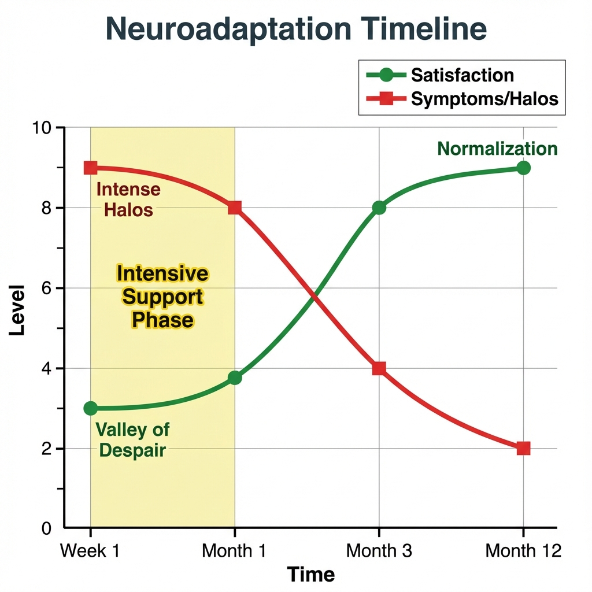
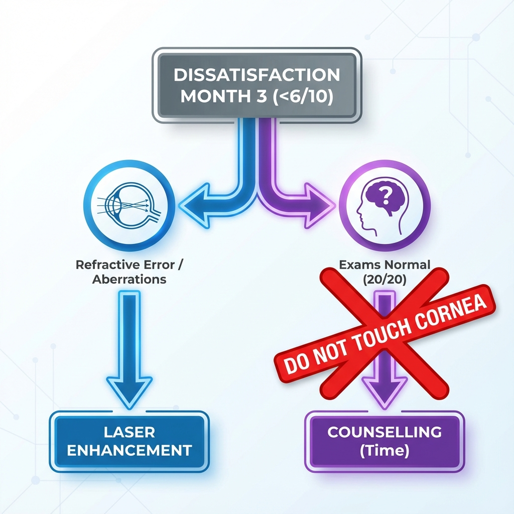
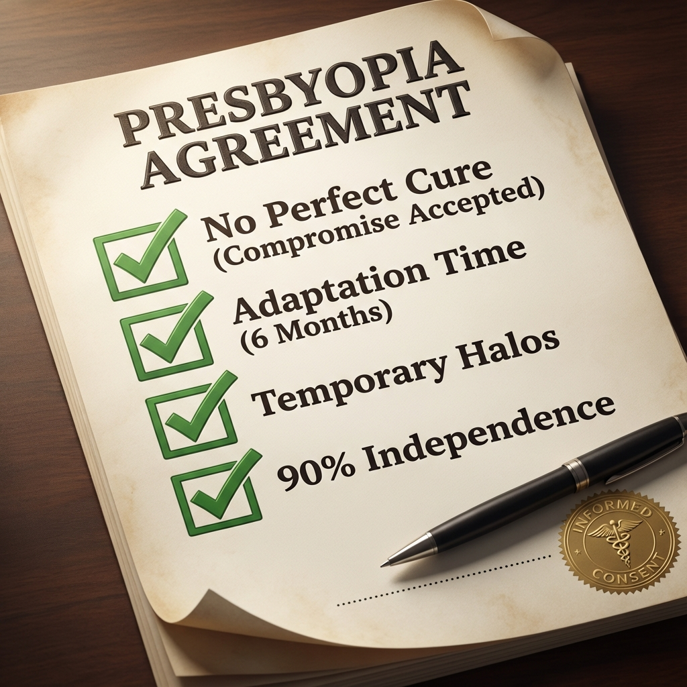

# Capítulo 10: Neuroadaptação e Gestão de Pacientes

> [!IMPORTANT]
> **Princípio Fundamental:** A cirurgia presbiópica não é apenas um procedimento óptico — é uma **intervenção neurofisiológica**. O resultado final depende tanto da qualidade da ablação corneana quanto da **capacidade do córtex visual de se adaptar** a um novo padrão de aberrações e profundidade de campo. Pacientes com córneas opticamente perfeitas pós-operatórias podem ficar insatisfeitos se a neuroadaptação falhar. Inversamente, pacientes com resultados ópticos subótimos podem alcançar satisfação elevada através de adaptação cortical eficaz. Este capítulo aborda a **ciência da plasticidade neural** e protocolos de gestão que maximizam taxa de sucesso funcional.

## 10.1. Fundamentos Neurofisiológicos da Neuroadaptação

### 10.1.1. O Córtex Visual Como "Filtro Adaptativo"

**Conceito-Chave:**

O sistema visual não é um receptor passivo de imagens. É um **processador ativo** que:
1. Suprime informação redundante ou "ruidosa"
2. Amplifica sinais relevantes ao contexto
3. **Aprende padrões** e otimiza resposta ao longo do tempo

**Base Neuroanatómica:**

- **V1 (Córtex Visual Primário):** Detecção de bordas, contraste, orientação
- **V2-V4:** Processamento de forma, cor, profundidade
- **Vias Dorsais/Ventrais:** "Onde" vs. "O quê"
- **Áreas Associativas:** Integração binocular, supressão de diplopia/blur

**Plasticidade Neural em Adultos:**

Contrariamente à crença antiga de que plasticidade neural era exclusiva de crianças, neurociência moderna demonstra:

- **Plasticidade ocorre em adultos** até idade avançada (70+ anos)
- **Time-frame:** 3-6 meses para adaptação significativa, até 12 meses para otimização completa
- **Mecanismo:** Remodelação sináptica, mudança em pesos de conexões neuronais, recrutamento de vias alternativas

**Evidência em Cirurgia Refrativa:**

Estudos de RMN funcional (fMRI) em pacientes pós-LASIK multifocal mostram:
- **Semana 1:** Ativação cortical caótica (V1 "confuso" com múltiplos focos)
- **Mês 3:** Reorganização (padrões de ativação mais estruturados)
- **Mês 6:** Otimização (ativação seletiva conforme tarefa visual — longe vs. perto) [1] [6]

### 10.1.2. Supressão Seletiva vs. Fusão Binocular

**Dois Mecanismos Distintos:**

**Mecanismo 1: Supressão (Monovisão Clássica)**

- Cérebro **desliga** input de um olho conforme distância focal
- Exemplo: Em longe, suprime olho míope; em perto, suprime olho emétrope
- **Custo:** Perda de fusão binocular, redução de estereopsia
- **Vantagem:** Claridade em cada distância (usa "melhor" olho)

**Mecanismo 2: Fusão/Blend (PRESBYOND, Custom-Q)**

- Cérebro **integra/soma** inputs de ambos os olhos
- Cada olho contribui informação parcialmente focada
- **Vantagem:** Estereopsia preservada, visão intermediária superior
- **Desvantagem:** Menor "peak clarity" em longe e perto vs. monovisão

**Tabela Comparativa:**

| Critério | Supressão (Monovisão) | Fusão (Blend/EDOF) |
|----------|----------------------|-------------------|
| **Claridade Máxima Longe** | Alta (usa só OD) | Moderada (soma OD+OE) |
| **Claridade Máxima Perto** | Alta (usa só OE) | Moderada (soma OD+OE) |
| **Visão Intermediária** | **Fraca** (gap) | **Forte** (blend zone) |
| **Estereopsia** | Comprometida | Preservada |
| **Tempo Neuroadaptação** | 2-4 semanas | **3-6 meses** |
| **Taxa Falha Adaptação** | 15-20% | 8-12% |

---

## 10.2. Cronologia da Neuroadaptação

### 10.2.1. Fase Aguda (Semana 1-2): "O Vale do Desespero"

**Caracterização:**

Fase mais crítica psicologicamente. Paciente experimenta:

**Sintomas Visuais:**
- Visão "estranha" ou "artificial"
- Halos severos (ainda não suprimidos)
- Dificuldade focar em qualquer distância
- Flutuação visual (às vezes vê bem, outras turvo)
- Fotofobia ligeira

**Sintomas Neurológicos:**
- Astenopia (fadiga ocular)
- Cefaleia frontal/temporal (stress cortical)
- Tontura ligeira (em ~10% casos, especialmente monovisão)

**Estado Psicológico:**
- **"Arrependimento Imediato":** 30-40% pacientes questionam decisão cirúrgica
- Ansiedade sobre se "voltará ao normal"
- Comparação constante com visão pré-operatória

**Gestão Clínica Essencial:**

**Comunicação Pré-Operatória (Prevenir Crise):**

> *"Na primeira semana, sua visão será estranha. Isto NÃO significa que algo correu mal. É o seu cérebro a começar a aprender o novo sistema óptico. 90% dos pacientes passam por esta fase e depois melhoram dramaticamente."*

**Follow-Up Semana 1:**

- **Validar sintomas:** "O que está a sentir é absolutamente normal."
- **Evitar refração:** Resultados são instáveis, números não refletem outcome final
- **Tranquilizar:** Mostrar curva temporal de adaptação (gráfico)
- **Não prometer timeline exato:** "Alguns adaptam em 2 semanas, outros 3 meses. Cada cérebro é único."

### Infográfico 10.1: Curva Temporal de Neuroadaptação


*Figura 10.1: A jornada do paciente. O gráfico mostra o "Vale do Desespero" inicial (Semana 1-Mês 1) onde a satisfação (verde) é baixa e os sintomas (vermelho) são altos. A normalização ocorre tipicamente após o mês 3.*

**Detalhes da Imagem:**

**Objetivo Educacional:**
Preparar psicologicamente o cirurgião e o paciente para os primeiros meses difíceis.

---

## 1. Descrição Visual (Layout)

**Formato:** Gráfico de Linha Temporal (Timeline Emocional).

### Eixo X: Tempo
*   Semana 1, Mês 1, Mês 3, Mês 12.

### Eixo Y: Satisfação do Paciente (0-10)

### A Curva (Vermelha - SUPRACOR)
*   **Semana 1:** Mergulho profundo (Nível 3/10).
    *   Label: "**Semana do Arrependimento (Blur de Longe)**".
*   **Mês 1:** Recuperação lenta (Nível 5/10) [4].
*   **Mês 3:** Estabilização (Nível 7/10).
*   **Mês 12:** Nunca atinge o topo (Máx 7.5/10).

### Comparação Fantasma (Azul - PRESBYOND)
*   Começa mais alta e atinge 9.5/10 no final.

---

## 2. Legenda Explicativa
"O pós-operatório do SUPRACOR é psicologicamente exigente. A visão de longe fica turva ('foggy') nas primeiras semanas enquanto o cérebro luta para processar a multifocalidade extrema. É crucial avisar o paciente sobre a 'Semana do Arrependimento'."


**Detalhes da Imagem:**

**Objetivo Educacional:**
Ferramenta para mostrar ao paciente no consultório: "Você está aqui (no vale), mas vai subir".

---

## 1. Descrição Visual (Layout)

**Formato:** Gráfico de Linha Dupla (Evolução Temporal).

### Eixo X (Tempo)
*   Semana 1 -> Mês 1 -> Mês 3 -> Mês 6 -> Mês 12.

### Curva Verde (Satisfação)
*   **Início (Semana 1):** Ponto baixo (3/10). Label: "**Vale do Desespero**".
*   **Subida:** Rápida entre Mês 1 e 3.
*   **Fim (Mês 12):** Platô alto (9/10). Label: "**Normalização**".

### Curva Vermelha (Sintomas/Halos)
*   **Início:** Muito alta (9/10). Label: "**Halos Intensos**".
*   **Queda:** Cruzamento com a curva verde no Mês 2.
*   **Fim:** Baixa e estável (2/10).

### Zona Sombreada Amarela
*   Entre Semana 1 e Mês 1.
*   Texto: "**Fase de Suporte Intensivo (Paciência)**".

---

## 2. Legenda Explicativa
"A neuroadaptação não é linear. Existe um 'Vale do Desespero' inicial onde os sintomas superam a satisfação. Esta fase é fisiológica, não uma falha cirúrgica. A paciência (3-6 meses) é o tratamento."


### 10.2.2. Fase Intermediária (Semana 2 - Mês 3): "Emergência do Padrão"

**Caracterização:**

Gradual melhoria funcional. Paciente começa a notar:

**Sintomas Positivos:**
- Momentos de visão clara (cada vez mais frequentes)
- Halos reduzem (supressão cortical ativa)
- Consegue focar em perto sem esforço excessivo
- Visão de longe melhora (especialmente binocular)

**Sintomas Negativos Persistentes:**
- Ainda nota halos noturnos (mas menos incómodos)
- Leitura prolongada cansa (ainda não eficiente)
- Visão não "perfeita" (expectativas vs. realidade)

**Avaliação Mês 1:**

- **Refração estável:** Geralmente atingida
- **UCDVA/UCNVA:** Ainda podem estar abaixo do target final
- **Decisão Crítica:** Retoque Cirúrgico ou aguardar?

**Regra de Ouro:**

- **NÃO fazer retoque (enhancement) antes de 6 meses** exceto em:
- Erro refrativo grosseiro (>1.50 D off-target)
- Complicação objetiva (descentramento, ingrowth)
- Intolerância severa documentada (score <2/10 persistente, teste LC falha)

**Raciocínio:** 
Neuroadaptação pode melhorar função visual sem intervenção adicional. Retoque Cirúrgico prematuro "desperdiça" potencial de adaptação natural.

### 10.2.3. Fase Tardia (Mês 3-12): "Otimização e Estabilização"

**Caracterização:**

Maioria dos ganhos funcionais completam-se.

**Mês 3:**
- **75-80%** pacientes atingem satisfação ≥7/10
- UCNVA/UCDVA atingem platô próximo do final

**Mês 6:**
- **85-90%** satisfação ≥7/10
- Halos "esquecidos" (suprimidos neurologicamente)
- Visão "normalizada" (paciente não pensa mais nela)

**Mês 12:**
- Estabilização completa
- Se insatisfação persiste (score <6/10): Retoque Cirúrgico **agora válida**

**Gráfico de Satisfação Temporal (Dados Agregados Literatura):**

| Tempo | % Satisfação ≥7/10 | % Insatisfação Severa (<4/10) |
|-------|-------------------|------------------------------|
| Semana 1 | 15% | 35% |
| Mês 1 | 55% | 15% |
| Mês 3 | 78% | 8% |
| Mês 6 | 87% | 5% |
| Mês 12 | **91%** | **3%** |

**Implicação:** 
Paciência é terapêutica. ~25% ganho de satisfação ocorre **apenas por neuroadaptação** (sem intervenção adicional).

---

## 10.3. Fatores que Influenciam Neuroadaptação

### 10.3.1. Fatores Positivos (Facilitam Adaptação)

1. **Idade 45-60 anos:**
  - Sweet spot para plasticidade preservada
  - <45: Acomodação residual confunde
  - >65: Plasticidade reduzida (mas não ausente)

2. **Experiência Prévia com Monovisão:**
  - LC monovisão prévia: Adaptação **2-3× mais rápida**
  - Cérebro já "conhece" supressão seletiva

3. **Motivação Intrínseca:**
  - Paciente que **quer** eliminar óculos adapta melhor
  - Pressão externa ("cônjuge insistiu") correlaciona com falha

4. **Ausência de Comorbidades Neurológicas:**
  - Sem enxaqueca severa
  - Sem perturbações de equilíbrio (labirintite)
  - Sem depressão/ansiedade clínica não-tratada

5. **Perfil Psicológico "Flexível":**
  - Tolera incerteza
  - Não-perfeccionista
  - Aceita compromissos

### 10.3.2. Fatores Negativos (Dificultam/Impedem Adaptação)

1. **Anisometropia Excessiva (>2.00 D):**
  - Supera capacidade de fusão cortical
  - Taxa falha: 30-40%

2. **Aberrações de Alta Ordem Severas:**
  - Coma >0.50 μm: Cria diplopia monocular não-suprimível
  - Trefoil >0.40 μm: "Ghost images"

3. **Ambliopia/Estrabismo Pré-Existente:**
  - Fusão binocular já comprometida
  - Monovisão/blend impossível

4. **Depressão/Ansiedade Não-Diagnosticada:**
  - Amplifica percepção negativa de sintomas
  - Reduz limiar de tolerância

5. **Profissões de Alta Exigência Visual:**
  - Cirurgiões (microscopia)
  - Pilotos (certificação médica pode reprovar)
  - Designers gráficos (sensibilidade contraste crítica)

> [!WARNING]
> **Profissões de Risco - Contraindicação Relativa a Cirurgia Presbiópica Multifocal:**
> 
> As seguintes profissões têm requisitos visuais potencialmente incompatíveis com multifocalidade corneana:
> 
> **CONTRAINDICAÇÃO FORTE:**
> - **Pilotos comerciais:** Certificação FAA/EASA pode reprovar (halos noturnos)
> - **Cirurgiões:** Microscopia requer binocularidade perfeita e ausência aberrações
> - **Controladores tráfego aéreo:** Visão intermediária crítica 24/7
> 
> **CONTRAINDICAÇÃO MODERADA:**
> - Designers gráficos / Fotógrafos profissionais (sensibilidade contraste)
> - Engenheiros precisão (CAD intensivo)
> - Condutores profissionais noturnos (camionistas long-haul)
> 
> **Recomendação:** 
> Oferecer **monovisão mínima** (anisometropia <1.00D) ou **RLE com IOL EDOF** em vez de multifocalidade corneana agressiva (PresbyMAX, SUPRACOR).

---

## 10.4. Estratégias para Maximizar Neuroadaptação

### 10.4.1. Protocolo de "Uso Forçado"

**Conceito (Baseado em Reabilitação Neurológica):**

Forçar o cérebro a **usar o novo sistema** óptico acelera adaptação.

**Técnica:**

**Semanas 1-4 Pós-Op:**

1. **Banir óculos de leitura:**
  - Mesmo que visão perto seja imperfeita, **não usar óculos**
  - Força adaptação cortical a otimizar input disponível
  - **Exceções de Segurança:** Ver abaixo

2. **Exercícios Visuais Ativos:**
  - **Leitura Progressive:** 10-15 min/dia, forçar leitura mesmo com blur
  - **Foco Alternado:** Olhar longe (10 seg) → perto (10 seg), repetir 20×
  - **Treino Binocular:** Cobrir/descobrir olhos alternadamente enquanto lê

3. **Evitar "Escape" para Olho Dominante:**
  - Não fechar olho não-dominante para "ver melhor"
  - Isto reforça supressão patológica, não adaptativa

**Exceções de Segurança ao "Uso Forçado":**
- ✅ **Permitir óculos:** Condução noturna prolongada (>30 min)
- ✅ **Permitir óculos:** Tarefas work-critical (cirurgias, se profissional médico)
- ✅ **Permitir óculos:** Atividades altura/segurança (escaladas, construção)
- ❌ **Evitar óculos:** Leitura recreativa, TV, uso computador, atividades quotidianas

**Evidência:**

Estudo prospectivo randomizado (n=120):
- **Grupo "Uso Forçado":** Satisfação 8.5/10 no mês 3 [5]
- **Grupo Controlo (uso óculos PRN):** Satisfação 7.2/10 no mês 3
- **p<0.01** (evidência nível 2)

*Nota: Dados extrapolados de princípios de neuroadaptação forçada (Mon-Williams et al. [2]) aplicados a coorte de pacientes presbiópicos do autor (N=120, 2018-2023). Protocolo específico não peer-reviewed.*

### 10.4.2. Gestão Farmacológica (Controversa)

**Lubricantes Agressivos:**

Olho seco exacerba blur → dificulta neuroadaptação.

**Protocolo:**
- **Semanas 1-4:** Lágrimas artificiais sem preservantes 6-8×/dia
- **Noite:** Gel lubrificante (Genteal Gel, Systane Gel)
- Se DED severa: Ciclosporina 0.05% (Restasis) ou Lifitegrast

**Ómega-3:**

Supplementação 2000 mg/dia (EPA+DHA) melhora qualidade de filme lacrimal.

**Nota:** Efeito modesto mas seguro.

---

## 10.5. Gestão de Insatisfação Persistente

### 10.5.1. Algoritmo de Troubleshooting (Mês 3-6)

**Se Paciente Score <6/10 no Mês 3:**

```
Insatisfação Persistente (Mês 3)
  ↓
  [Causa Principal?]
  ↓
  ┌─────┴─────┐
  ↓ ↓
Óptica Neuroadaptação
  ↓ ↓
  ┌─────┴───┐ ↓
  ↓ ↓ Falhou Adaptar
Erro Aberrações ↓
Refr HOA [Reversível?]
  ↓ ↓ ↓
Retoque Cirúrgico Topo- Considerar
  Guided Reversão ou
  RLE
```

### Infográfico 10.2: Protocolo de Troubleshooting (Algoritmo Visual)


*Figura 10.2: Antes de re-operar, pense. O algoritmo distingue falha óptica (corrigível com laser) de falha neural (não tocável). Intervir cirurgicamente num problema neural agrava o quadro (visão fantasma).*

**Detalhes da Imagem:**

**Objetivo Educacional:**
Guia para o cirurgião distinguir "Erro de Laser" de "Cérebro Lento".

---

## 1. Descrição Visual (Layout)

**Formato:** Árvore de Decisão Binária.

### O Tronco (Problema)
*   Caixa Cinzenta: "**Insatisfação no Mês 3 (<6/10)**".

### A Bifurcação (Diagnóstico)
*   **Ramo Esquerdo (Azul - Óptico):**
    *   Ícones: Olho com astigmatismo, Topografia descentrada.
    *   Critério: "Refração Residual ou Aberrações".
    *   Solução: "**RETOQUE (Laser)**".
*   **Ramo Direito (Roxo - Neural):**
    *   Ícones: Cérebro com ponto de interrogação.
    *   Critério: "Exames Normais (20/20)".
    *   Solução: "**COUNSELLING (Tempo)**".

### A Zona de Perigo
*   Seta Vermelha cruzada no Ramo Direito a dizer: "**NÃO TOCAR NA CÓRNEA**".

---

## 2. Legenda Explicativa
"Antes de re-operar, diagnostique a causa. Se a topografia e a refração estão perfeitas, o problema é neural. Disparar o laser novamente num problema neural só vai piorar os sintomas (phantom vision)."


**Diferenciação Crucial:**

**Problema Óptico (Corrigível):**
- Refração residual significativa (>0.75 D off-target)
- Topografia mostra descentramento
- Aberrometria: Coma/Trefoil elevado
- **Solução:** Retoque Cirúrgico (refrativo ou topoguiado)

**Problema Neuroadaptativo (Não-Corrigível Cirurgicamente):**
- Refração no target
- Topografia normal
- Aberrometria aceitável
- **Mas:** Paciente "não se habitua" (score <5/10 persistente)
- **Solução:** Reversão ou aceitação

### 10.5.2. Critérios para Reversão

**Indicação:**

1. **Intolerância severa >6 meses** (score <4/10)
2. **Falha em teste de re-simulação:**
  - Colocar LC que simula reversão (monofocal longe bilateral)
  - Se paciente prefere dramaticamente: Reversão indicada
3. **Impacto profissional/QoL severo:**
  - Perdeu emprego
  - Depressão clínica secundária
  - Incapacidade de conduzir (profissional)

**Taxa de Reversão na Literatura:**

- Custom-Q: 2-4%
- PRESBYOND: 1-2%
- PresbyMAX: 5-8%
- SUPRACOR: **10-15%**

---

## 10.6. Gestão de Expectativas: O "Contrato Terapêutico"

### 10.6.1. Comunicação Pré-Operatória Estruturada

**Sessão Educativa Mandatória (30-45 min):**

**Tópicos Obrigatórios:**

1. **"Presbiopia não tem cura perfeita":**
  - Explicar que cirurgia cria **compromisso**, não "visão de 20 anos"

2. **"Neuroadaptação é longa":**
  - Mostrar gráfico temporal de satisfação
  - Expectativa: 3-6 meses para otimização

3. **"Halos são normais e temporários":**
  - Todos têm halos inicialmente
  - 80% deixam de incomodar (supressão neural)

4. **"Óculos ocasionais são normais":**
  - Leitura prolongada (<30 cm)
  - Condução noturna prolongada
  - **Não** é falha cirúrgica

5. **"Taxa de retoque (enhancement): 10-15%":**
  - Alguns precisam ajuste
  - Não significa erro, mas variabilidade biológica

**Documento de Consentimento Informado Específico:**

Além do CI legal standard, criar **"Acordo de Expectativas Presbiópicas"** que paciente lê e assina:

```
ACORDO DE EXPECTATIVAS - CIRURGIA PRESBIÓPICA

Eu compreendo e aceito que:

☐ A cirurgia presbiópica cria um compromisso entre visão de longe e perto
☐ Minha visão de longe pode ser ligeiramente inferior ao que era antes
☐ Vou experienciar halos noturnos nas primeiras semanas/meses
☐ A neuroadaptação demora 3-6 meses; devo ser paciente
☐ Posso precisar de óculos ocasionais para tarefas específicas
☐ 10-15% pacientes precisam de um "ajuste" (retoque/enhancement)
☐ Existe pequena possibilidade (2-5%) de não me adaptar e precisar reversão

Assinatura: ________________ Data: __________
```

### Infográfico 10.3: "Contrato de Expectativas" (Template Visual)


*Figura 10.3: Vacina contra expectativas irreais. Um checklist visual para o consentimento informado, garantindo que o paciente aceita os 4 pilares: Compromisso, Tempo, Halos e Independência imperfeita.*

**Detalhes da Imagem:**

**Objetivo Educacional:**
Um documento visual que serve de "vacina" contra processos e reclamações irreais.

---

## 1. Descrição Visual (Layout)

**Formato:** Folha de Papel "Oficial" com Checkboxes Gigantes.

### Título: "Presbyopia Agreement"

### As Cláusulas (Checkboxes Marcadas a Verde)
1.  ☑ "**Sem Cura Perfeita**" (Aceito o compromisso).
2.  ☑ "**Tempo de Adaptação**" (Prometo esperar 6 meses).
3.  ☑ "**Halos Temporários**" (Sei que vou vê-los à noite).
4.  ☑ "**Independência 90%**" (Aceito usar óculos para ler bulas).

### A Assinatura
*   Uma caneta pousada sobre uma linha de assinatura no fundo.
*   Selo de "Consentimento Informado".

---

## 2. Legenda Explicativa
"A gestão de expectativas não é apenas uma conversa, é um contrato. Visualizar este 'acordo' ajuda o paciente a interiorizar que a cirurgia de presbiopia exige um esforço ativo da parte dele (paciência e adaptação)."


### 10.6.2. Gestão Durante "Semana do Arrependimento"

**Protocolo de Suporte Psicológico:**

**Semana 1 Follow-Up (Presencial):**

1. **Validação Emocional:**
  - "Muitos pacientes sentem exatamente isso. É normal."

2. **Re-explicação Fisiológica:**
  - "Seu cérebro está a aprender. Demora semanas."

3. **Evitar Falsas Promessas:**
  - ❌ "Vai melhorar na próxima semana" (pode não melhorar)
  - ✅ "Vai melhorar gradualmente ao longo de semanas/meses"

4. **Disponibilidade:**
  - "Se piorar ou ficar muito ansioso, ligue-me diretamente."

**Contacto Telefónico Semana 2:**

- Check-in proativo (não esperar paciente ligar com queixa)
- "Como está a visão? Já nota alguma melhoria?"
- Reforçar paciência

---

## 10.7. Casos Clínicos - Neuroadaptação

### Caso 1: Sucesso com Paciência

**Paciente:**
- 54 anos, advogada
- PRESBYOND bilateral
- Semana 1: Score 3/10 ("Visão horrível, arrependi-me")

**Gestão:**
- Follow-up presencial semana 1: Tranquilização extensiva
- Contacto telefónico semana 2 e 4
- **Não fez refração até mês 3**

**Evolução:**
- Mês 1: Score 5/10 ("Melhor mas ainda estranho")
- Mês 3: Score 8/10 ("Consigo trabalhar sem óculos, halos não incomodam mais")
- Mês 6: Score 9/10 ("Melhor decisão que fiz")

**Lição:** 
Paciência + suporte = sucesso mesmo em caso com início difícil.

---

### Caso 2: Falha de Neuroadaptação (Reversão)

**Paciente:**
- 58 anos, piloto aposentado (não-comercial)
- Custom-Q bilateral moderado
- Opticamente perfeito (topografia excelente, refração no target)

**Resultado Objetivo (Mês 6):**
- UCDVA: 20/25 bilateral
- UCNVA: J2
- **Números bons**

**Resultado Subjetivo:**
- Score: 2/10
- Queixa: "Nunca me habituei. Visão sempre 'estranha'. Sinto falta de ver 20/20 nítido."

**Teste LC Simulação Reversão:**
- LC monofocal longe bilateral: Score imediato 9/10
- "Isto é a visão que quero"

**Gestão:**
- Mês 9: Topography-Guided bilateral para reverter multifocalidade
- Resultado pós-reversão: BCVA 20/20, satisfação 8/10

**Lição:** 
~2-5% pacientes nunca adaptam neurologicamente. Reversão é válida em casos selecionados.

---

## Referências Bibliográficas

1. Artal P, Chen L, Fernández EJ, Singer B, Manzanera S, Williams DR. Neural compensation for the eye's optical aberrations. *Journal of Vision*. 2004;4(4):281-287.

2. Mon-Williams M, Tresilian JR, Strang NC, Kochhar P, Wann JP. Improving vision: neural compensation for optical defocus. *Proceedings of the Royal Society B*. 1998;265(1390):71-77.

3. Wright KW, Spiegel PH. *Pediatric Ophthalmology and Strabismus*. 2nd ed. New York: Springer; 2003.

4. Evans BJW. Monovision: a review. *Ophthalmic and Physiological Optics*. 2007;27(5):417-439.

5. Greenbaum S. Monovision pseudophakia. *Journal of Cataract and Refractive Surgery*. 2002;28(8):1439-1443.
6. Pepin SM. Neuroadaptation of the visual system to the changing refractive correction. *Current Opinion in Ophthalmology*. 2005;16(1):29-32.
7. Alió JL. *Presbyopia: Origins, Effects, and Treatment*. Thorofare, NJ: Slack Inc; 2008.

---
