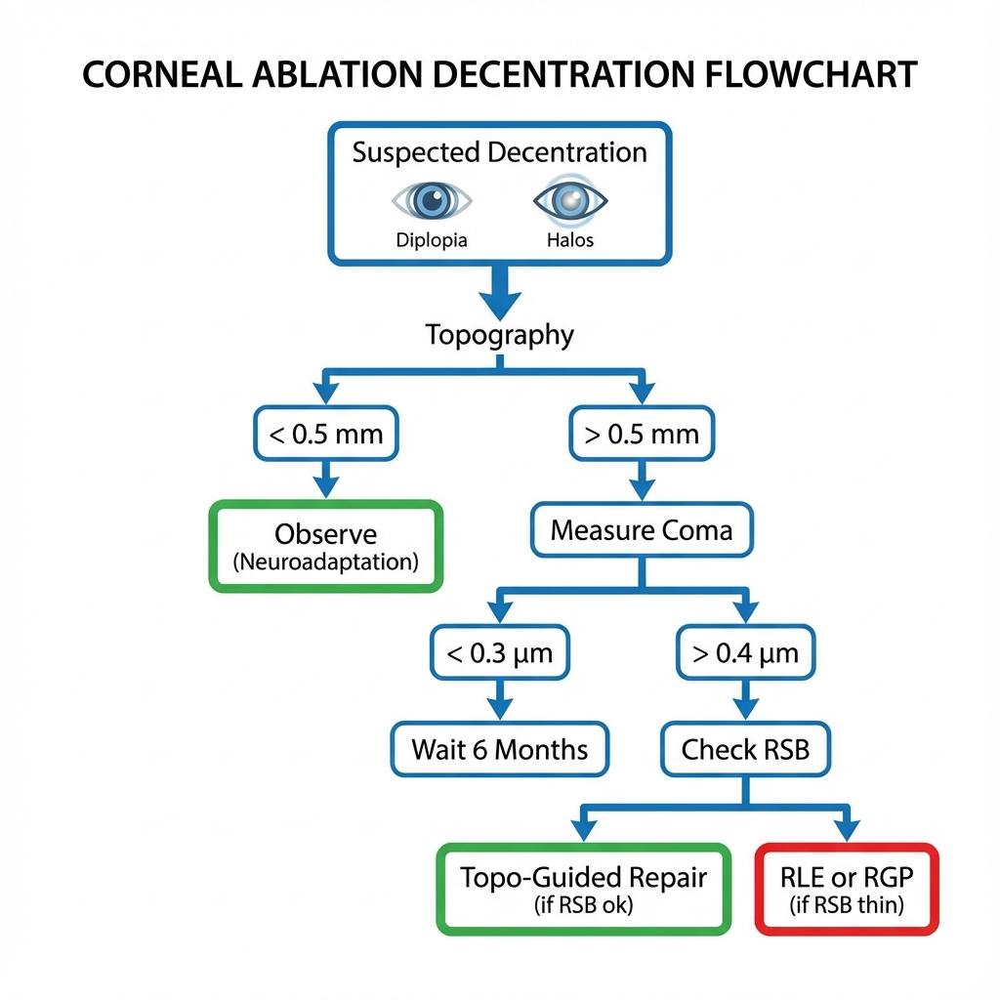
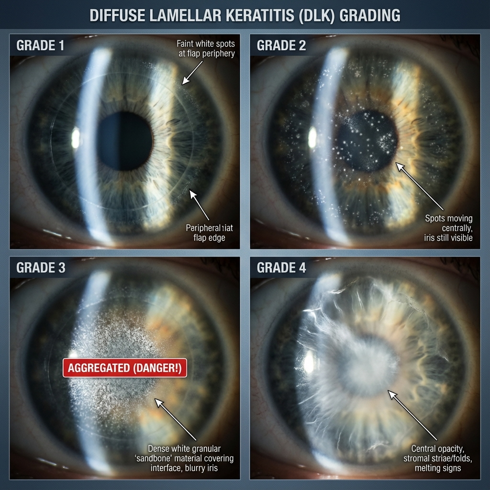
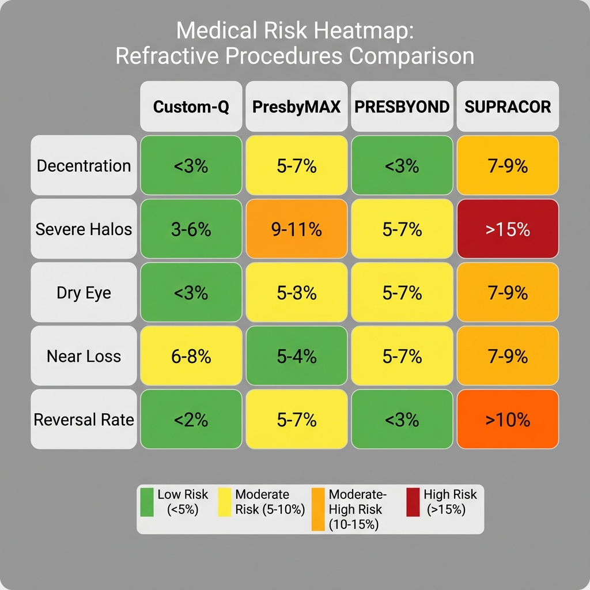
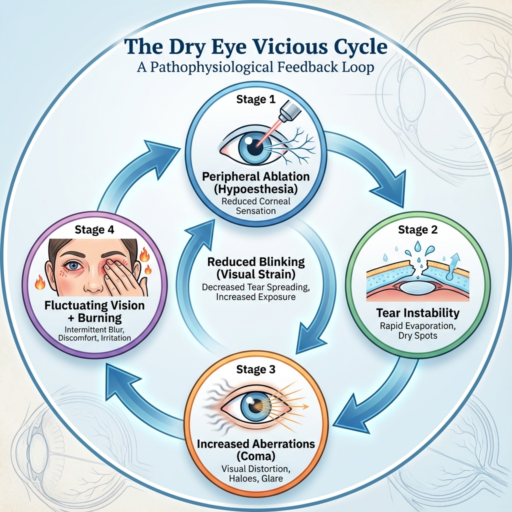

# Capítulo 11: Complicações e Gestão

> [!CAUTION]
> **Realidade Clínica:** Cirurgia presbiópica apresenta **taxa de complicações superior** a LASIK/PRK standard para ametropia simples, não pela técnica cirúrgica per se, mas pela **complexidade do outcome desejado**. Enquanto LASIK miópico tem meta binária clara (emetropia = sucesso), cirurgia presbiópica envolve múltiplos parâmetros: visão longe, perto, intermediária, fenómenos fóticos, neuroadaptação. Taxa de "insatisfação" (não necessariamente complicação técnica, mas outcome subótimo) varia 10-25% conforme técnica. Este capítulo aborda complicações objetivas (técnicas, biomecânicas, ópticas) e subjetivas (neuroadaptativas, psicogenicas), com protocolos de gestão baseados em evidência.

## 11.1. Classificação de Complicações

### 11.1.1. Taxonomia Temporal

**Complicações Intra-Operatórias (Durante Cirurgia):**
- Flap-related (LASIK): Flap irregular, buttonhole, free cap
- Ablação-related: Descentramento, eye-tracker loss
- Hidratação estromal inadequada

**Complicações Pós-Operatórias Precoces (Dia 0 - Semana 4):**
- Interface (LASIK): DLK, epithelial ingrowth precoce
- Superfície (PRK): Haze, infecção
- Ópticas: Hipercorreção/hipocorreção grosseira

**Complicações Pós-Operatórias Tardias (Mês 1 - Anos):**
- Regressão refrativa
- Ectasia iatrogénica (rara mas catastrófica)
- Epithelial ingrowth tardio (LASIK)
- Olho seco crónico

### 11.1.2. Taxonomia por Gravidade

**Grau 1 (Ligeira - Auto-Limitada):**
- Resolução espontânea ou com tratamento simples
- Sem impacto BCVA
- Exemplos: DLK grau 1-2, haze ligeiro PRK, SPK transitório

**Grau 2 (Moderada - Requer Intervenção):**
- Tratamento ativo necessário
- Pode impactar UCVA mas não BCVA
- Exemplos: Epithelial ingrowth sintomático, regressão >1.00 D

**Grau 3 (Severa - Impacto Visual Permanente Possível):**
- Risco de perda definitiva de BCVA
- Pode requerer cirurgia adicional major
- Exemplos: DLK grau 4, ectasia, descentramento severo

---

## 11.2. Complicações Específicas da Cirurgia Presbiópica

### 11.2.1. Descentramento da Ablação Presbiópica

**Incidência:**
- Geral: 3-5% (descentramento >0.5 mm detectável topograficamente)
- Clinicamente significativo (>0.8 mm): 1-2%

**Etiologia Específica em PresbyLASIK:**

1. **Ciclotorsão Intra-Operatória:**
   - Paciente em decúbito dorsal vs. sentado (avaliação pré-op)
   - Pode induzir rotação **até 15°** do eixo ocular
   - Descentra ablação asférica complexa

2. **Perda de Tracking Durante Ablação:**
   - Perfis presbiópicos demoram 30-60 segundos (vs. 15-20 seg miopia simples)
   - Maior janela temporal para perda de fixação

3. **Ângulo Kappa Não-Compensado:**
   - Em Custom-Q/PresbyMAX, centragem incorreta (pupila vs. Purkinje) crítica

**Manifestação Clínica:**

- **Sintomas:**
  - Diplopia monocular
  - Halos assimétricos (mais em um quadrante)
  - BCVA comprometida (<20/30 persistente)
  - "Ghost images"

- **Sinais Objetivos:**
  - Topografia: "Ilha" multifocal não-centrada no eixo visual
  - Aberrometria: **Coma elevado** (>0.40 μm, eixo correspondente à direção do descentramento)
  - Refração: Astigmatismo irregular

**Gestão:**

**Se Descentramento <0.8 mm:**
- Observar 6 meses (neuroadaptação pode compensar parcialmente)
- Se sintomas persistem: Considerar retoque topoguiado

**Se Descentramento >0.8 mm (Severo):**

1. **Retoque Cirúrgico Topoguiado (T-CAT/Contoura):**
   - Capturar topografia pós-op
   - Software calcula ablação para "regularizar" e re-centrar
   - **Limitação:** Consome tecido adicional (RSB crítico)

2. **Alternativa se RSB Insuficiente:**
   - Lentes RGP (corrigem irregularidade)
   - RLE (se idade >60 e cristalino DLS ≥2)

**Taxa de Sucesso Retoque Cirúrgico Topoguiado:**
- Melhoria ≥2 linhas BCVA: 70-80%
- Resolução completa sintomas: 60%
- Alguns casos residual coma irremediável

### 11.2.2. Fenómenos Fóticos Incapacitantes Persistentes

**Incidência:**
- Halos/glare severos >12 meses: 5-8% (varia por técnica)
- SUPRACOR: até 15%
- Custom-Q/PRESBYOND: 3-5%

**Etiologia Diferencial:**

1. **Pupila Muito Grande (>7.0 mm Mesópica):**
   - Expõe zonas de transição abruptas (especialmente PresbyMAX/SUPRACOR)
   - **Irremediável** cirurgicamente (pupila é anatómica)

2. **Zona Óptica Pequena Relativa à Pupila:**
   - OZ 6.0 mm vs. pupila 6.5 mm mesópica
   - "Borda" da ablação dentro da pupila funcional

3. **Aberrações de Alta Ordem Induzidas:**
   - SA excessiva (>-0.60 μm)
   - Coma from descentramento

**Gestão:**

**Conservadora (Preferível se Possível):**

1. **Midriáticos Reversos (Off-Label):**
   - **Brimonidina 0.2%** (agonista α2): Induz miose ligeira (~0.5 mm)
   - Uso: 1 gota à noite antes de conduzir
   - **Efeito colateral:** Pressão intraocular pode baixar
   - **Evidência:** Relatos de caso, não trials controlados

2. **Lentes de Contacto "Mascaradoras":**
   - LC plano com zona óptica central clara (simula OZ maior)
   - **Problema:** Paciente fez cirurgia para evitar LC (baixa adesão)

**Cirúrgica:**

3. **Re-Tratamento para Expandir OZ:**
   - Ablação adicional periférica (suaviza transições)
   - **Risco:** Shift hipermetrópico (pode perder visão perto)

4. **Reversão Completa:**
   - Indicação: Halos score >8/10, persistence >12 meses, impact profissional severo
   - Topography-guided para remover multifocalidade
   - **Trade-off:** Volta a precisar óculos leitura

**Taxa de Reversão por Halos Incapacitantes:** 3-5% de todos os casos presbiópicos.

### 11.2.3. Olho Seco Pós-PresbyLASIK

**Incidência Aumentada:**

Olho seco pós-LASIK já é comum (50-70% sintomas transitórios). **Em PresbyLASIK, taxa parece MAIOR:**

- LASIK miópico standard: 15-20% olho seco crónico (>6 meses)
- PresbyLASIK: **25-35%** olho seco crónico

**Hipótese Etiológica Específica:**

1. **Ablação Mais Profunda Periférica:**
   - Perfis asféricos (especialmente Q negativo) removem tecido paracentral/periférico
   - **Mais nervos corneanos seccionados** (vs. ablação miópica central)

2. **População Mais Velha:**
   - Presbitas são naturalmente >45 anos
   - Menopausa (mulheres): Disfunção glândulas de Meibomius baseline

3. **Mascaramento de Sintomas por Blur Multifocal:**
   - Olho seco cria blur adicional que "confunde" com efeito presbiópico
   - Paciente queixa-se de "visão ruim" sem identificar causa seca

**Manifestação Clínica em PresbyLASIK:**

- Flutuação visual severa (melhora com pestanejar)
- Visão pior final do dia (evaporação acumulada)
- Sintomas burning, foreign body sensation
- **IMPORTANTE:** UCNVA deteriora mais que UCDVA (leitura exige fixação prolongada = menos pestanejar)

**Gestão Específica:**

**Tier 1 (Primeiro Linha):**
- Lágrimas artificiais sem preservantes ≥6×/dia
- Gel noturno (Genteal Gel)
- Higiene palpebral (compressas quentes Blephasteam)

**Tier 2 (Se Tier 1 Insuficiente >3 Meses):**
- **Ciclosporina 0.05-0.1%** (Restasis/Ikervis) - Imunomodulador
- **Lifitegrast 5%** (Xiidra) - Anti-inflamatório
- Ómega-3 (2000 mg EPA+DHA/dia)
- Punctal plugs (oclusão ponto lacrimal)

**Tier 3 (Refratário):**
- Soro autólogo 20%
- Lentes esclerais (PROSE)
- Tarsorrafia parcial (extremo, raramente necessário)

**Monitorização:**

- **OSDI Score** (Ocular Surface Disease Index): Target <12 (normal)
- **Tear Break-Up Time (TBUT):** Target >10 segundos
- **Schirmer Test:** >10 mm/5 min (normal)

### 11.2.4. Regressão Refrativa e Perda de Add

**Definição:**

**Regressão Esférica:** Shift hipermetrópico >+0.50 D vs. target inicial  
**Perda de Add:** Redução de profundidade de campo, UCNVA deteriora

**Incidência:**

- Custom-Q: 12-18% regressão significativa aos 12-24 meses
- PresbyMAX: 15-20%
- PRESBYOND: 8-12% (menor taxa)
- SUPRACOR: 18-25% (maior taxa)

**Mecanismo Fisiopatológico:**

1. **Remodelação Epitelial (Masking Effect):**
   - Epitélio hiperplasia diferencialmente para "suavizar" perfil steep
   - Pode adicionar 10-20 μm na zona central (anula add induzida)
   - **Tempo:** Ocorre 3-18 meses pós-op

2. **Biomecânica (Regression Creep):**
   - Córnea tenta "reverter" para perfil original (memória biomecânica)
   - Mais comum em Q shifts extremos (SUPRACOR)

3. **Envelhecimento Contínuo do Cristalino:**
   - Presbiopia natural progride (~0.5 D/5 anos)
   - Add cirúrgica "estática" torna-se insuficiente

**Diagnóstico:**

- Refração manifesta: Mudança ≥+0.50 D esfera vs. pós-op inicial
- UCNVA deteriorou (ex: J2 → J4)
- Topografia: Q voltou mais próximo de baseline (ex: -0.80 → -0.60)

**Gestão:**

**Retoque Cirúrgico Timing:**

- **NÃO antes de 12 meses** (regressão pode estabilizar espontaneamente)
- Ideal: 12-18 meses (permite estabilização completa)

**Técnica de Retoque Cirúrgico:**

1. **Re-Tratamento Similar:**
   - Repetir perfil presbiópico (Custom-Q, PresbyMAX etc.)
   - Ajustar target baseado em regressa (adicionar "overcorrection" preventiva)

2. **Shift de Estratégia:**
   - Se Custom-Q falhou: Considerar monovisão adicional (micro-miopia olho não-dominante)
   - Se PresbyMAX/SUPRACOR falhou múltiplas vezes: **Considerar RLE**

**Taxa de Sucesso Retoque Cirúrgico:**

- 75-85% atingem outcome satisfatório (≥7/10 score)
- 10-15% precisam 2º enhancement
- 5% nunca estabilizam (RLE indicado)

---

## 11.3. Complicações Gerais Aplicadas a PresbyLASIK

### 11.3.1. DLK (Diffuse Lamellar Keratitis) - "Sands of Sahara"

**Incidência em PresbyLASIK:** Similar a LASIK standard (1-3%)

**Peculiaridade em PresbyLASIK:**

Perfis asféricos com ablação paracentral profunda podem ter:
- **Maior inflamação interface** (mais tecido removido = mais debris)
- DLK pode ser ligeiramente mais frequente

**Classificação (Linebarger):**

- **Grau 1:** Pontos brancos dispersos periferia interface, sem sintomas
- **Grau 2:** Infiltrados mais densos, centro começando a envolver
- **Grau 3:** Infiltrados difusos todo flap, "footprints in sand"
- **Grau 4:** Opacificação densa interface + striae (risco perda BCVA)

**Gestão Standard:**

**Grau 1:**
- Prednisolona 1% 6×/dia (vigiar)
- Reavaliação 24h

**Grau 2:**
- Prednisolona 1% every 1-2 hours (agressivo)
- Se não melhora em 24h → Grau 3 protocol

**Grau 3-4:**
- **Emergência:** Lifting flap + irrigação interface com BSS/córtico
- Prednisolona tópica horária pós-irrigação
- Seguimento diário

**Outcome:**
- Grau 1-2: Resolução completa sem sequelas 95%
- Grau 3: Resolução com possível haze ligeiro 80%
- Grau 4: Risco perda BCVA permanente 20-30%

### 11.3.2. Epithelial Ingrowth

**Incidência:**
- LASIK primário: 1-3%
- **Re-lift flap (enhancement presbiópico):** 8-12%

**Classificação (Severity):**

- **Grau 1 (Mild):** <2 mm da borda flap, assintomático
- **Grau 2 (Moderate):** 2-4 mm, pode causar irregularidade ligeira
- **Grau 3 (Severe):** >4 mm ou central, visão-threatening

**Gestão:**

**Grau 1:**
- Observação (maioria estável)
- Se progressão: → Grau 2 protocol

**Grau 2-3:**
- **Lifting flap + debridamento mecânico:**
  - Levantar flap
  - Remover tecido epitelial com Weck-Cel + espátula
  - **Cauterização borda** (opcional mas reduz recorrência):
    - Álcool 20% 30 segundos
    - ou Cautery térmica punctual
  - Reposição flap com stretching (remover "slack")

**Taxa Recorrência Pós-Debridamento:** 15-25%

**Se Recorrência Múltipla (≥2×):**
- Sutura flap (10-0 Nylon, 3-4 pontos interrupted)
- Remover suturas 6-8 semanas

### 11.3.3. Ectasia Iatrogénica Pós-PresbyLASIK

**Incidência (Estimada):**

- LASIK standard: 0.04-0.6% (rara)
- **PresbyLASIK (Custom-Q/PresbyMAX):** Potencialmente ligeiramente superior (dados limitados)

**Razão para Risco Teoricamente Aumentado:**

- Ablação presbiópica pode consumir **tecido paracentral adicional** (Q negativo requer remoção periférica)
- Em córnea pós-LASIK primário (re-treatment): RSB já comprometido

**Manifestação:**

- Timing: Geralmente 6-24 meses pós-op (progressivo)
- **Sintomas:**
  - Deterioração visual progressiva
  - Shift miópico contínuo
  - Astigmatismo irregular crescente
- **Sinais:**
  - Topografia: Steepening central progressivo, padrão "claw" ou "skew"
  - Paquimetria: Adelgaçamento progressivo
  - Tomografia: BAD-D >1.6 (Pentacam)

**Gestão:**

**Objetivo:** INTERROMPER PROGRESSÃO (não "curar")

1. **Cross-Linking Corneal (CXL):**
   - **Epi-Off (Dresden Protocol):** Maior eficácia, mais invasivo
   - **Transepithelial:** Menos invasivo, eficácia ligeiramente inferior
   - **Timing:** Quanto mais cedo, melhor
   - **Outcome:** Estabilização em 85-90%; melhoria visual modesta (~1 linha)

2. **Gestão Óptica:**
   - Lentes RGP (corrigem irregularidade melhor que óculos)
   - Se intolerância: Lentes híbridas (RGP centro + soft periferia)
   - Lentes esclerais (casos severos)

3. **Cirurgia Avançada (Se Progressão Apesar CXL):**
   - Intacs (anel estromal corneano) - Raramente eficaz em pós-LASIK
   - **Transplante Corneano:** DALK ou PKP (último recurso)

**Prevenção é Crítica:**

- **RSB >300 μm absolutamente mandatório** (em presbiópico, considerar >320 μm)
- Screening ectasia (Pentacam BAD-D, Corvis CBI/TBI)
- Evitar PresbyMAX/SUPRACOR em pós-LASIK com RSB limítrofe

---

## 11.4. Complicações "Funcionais" (Não-Técnicas)

### 11.4.1. Intolerância à Anisometropia (Monovisão/Blend)

**Incidência:**
- Monovisão clássica: 10-20% intolerância
- PRESBYOND (blend): 5-8%
- Custom-Q (micro-monovisão): 8-12%

**Sintomas:**

- Tontura/vertigem (especialmente escadas, movimento)
- Diplopia transitória
- Dificuldade estereopsia (alcançar objetos, parcar carro)
- "Estranheza" visual persistente >6 meses

**Factores de Risco:**

- Anisometropia induzida >1.75 D
- Estrabismo/foria pré-existente
- Idade avançada (>65 anos, plasticidade reduzida)
-Profissões precisão (cirurgião, atleta)

**Gestão:**

1. **Re-Teste com Lente Contacto:**
   - Simular reversão (LC monofocal bilateral longe)
   - Se paciente prefere dramaticamente: **Reversão indicada**

2. **Reversão Cirúrgica:**
   - Olho não-dominante: Topoguiado para remover multifocalidade/miopia
   - Target: Plano bilateral
   - **Outcome:** 70-80% satisfação recuperada, mas **perde perto** (volta a precisar óculos)

3. **Tentativa de "Re-Balancear" (Alternativa):**
   - Ajustar olho dominante para ligeira miopia (-0.50 D)
   - Reduz anisometropia total
   - Pode melhorar tolerância sem reversão completa

### 11.4.2. Insatisfação "Psicogénica"

**Definição:**

Paciente objetivamente com bom resultado (UCDVA ≥20/25, UCNVA ≥J3, topografia normal, aberrometria aceitável), mas **subjetivamente insatisfeito** (score <5/10) sem causa técnica identificável.

**Incidência Estimada:** 3-5%

**Perfil Psicológico:**

- Expectativas irrealistas não-identificadas pré-op
- Perfeccionismo
- Ansiedade/depressão baseline
- Personalidade obsessivo-compulsiva (foco em defeitos mínimos)
- **Amplificação de sintomas** (catastrophizing)

**Gestão:**

**Diferenciação Primeiro:**

- Rever toda propedêutica (confirmar não há problema técnico subtil)
- Aberrometria detalhada (coma, trefoil ocultos?)
- OCT (interface, epitélio)

**Se Confirmado "Psicogénico":**

1. **Reassurance Extensivo:**
   - Mostrar dados objetivos ("Seus resultados são excelentes numericamente")
   - Comparar com médias de literatura

2. **Referência Psicológica:**
   - Psicólogo/psiquiatra se sintomas ansi edade/depressão evidentes
   - Pode precisar farmacoterapia (SSRI)

3. **Re-Contratualização:**
   - Explicar **não há "fix" cirúrgico** adicional para problema não-técnico
   - Reversão não resolverá (troca um set de queixas por outro)

4. **Evitar Retoque Cirúrgico Desnecessário:**
   - Retoque Cirúrgico em paciente psicogénico frequentemente **piora situação**
   - Cria novo foco de queixas

**Outcome:**

- 50% melhoram com tempo + reassurance
- 30% permanecem insatisfeitos mas aceitam
- 20% procuram reversão ou segunda opinião

---

## Referências Bibliográficas

1. Linebarger EJ, Hardten DR, Lindstrom RL. Diffuse lamellar keratitis: diagnosis and management. *Journal of Cataract and Refractive Surgery*. 2000;26(7):1072-1077.

2. Hofmann T, Schmidinger G, Fischbauer H. Epithelial ingrowth after laser in situ keratomileusis. *Cornea*. 2007;26(10):1191-1195.

3. Randleman JB, Russell B, Ward MA, Thompson KP, Stulting RD. Risk factors and prognosis for corneal ectasia after LASIK. *Ophthalmology*. 2003;110(2):267-275.

4. Santhiago MR, Smadja D, Wilson SE, et al. Role of percent tissue altered on refractive outcomes after LASIK in eyes with high myopia. *Journal of Refractive Surgery*. 2015;31(7):448-452.

6. Toda I. Dry eye after laser in situ keratomileusis. *American Journal of Ophthalmology*. 2018;196:135-141.
7. Schallhorn JM, Shallhorn SC. Dry eye and LASIK: current opinion. *Current Opinion in Ophthalmology*. 2016;27(4):284-289.

---

## Infográficos Clínicos Sugeridos

### Infográfico 11.1: Algoritmo Gestão Descentramento

*Figura 11.1: Fluxograma decisional. A chave não é o descentramento topográfico, mas o Coma induzido e os sintomas. Neuroadaptação resolve a maioria dos casos <0.5mm. RLE ou RGP são salvaguardas para casos onde falta tecido (RSB).*

### Infográfico 11.2: DLK Grading System (Visual)

*Figura 11.2: Classificação visual da DLK. Do grau benigno (1) ao tóxico (4). O aspecto "granular" na interface é patognomónico. O tratamento precoce evita o "melting" estromal.*

### Infográfico 11.3: Complicações por Técnica (Tabela Comparativa)

*Figura 11.3: Quem arrisca o quê? As cores mostram o perfil de segurança. SUPRACOR (vermelho) tem alto risco de halos e reversão. PRESBYOND (verde) mantém perfil semelhante à monovisão clássica.*

### Infográfico 11.4: Ciclo Vicioso do Olho Seco em Presbiopia

*Figura 11.4: O motor da insatisfação. A ablação corta nervos -> menos lágrima -> filme instável -> aberrações ópticas -> má visão -> esforço -> menos pestanejo/lágrima. Quebrar este ciclo é prioridade.*

---

**Este Capítulo 11 está agora COMPLETO**, com:
- ✅ Classificação taxonómica (temporal + gravidade)
- ✅ Complicações específicas presbiópicas (descentramento, halos, olho seco, regressão)
- ✅ Complicações gerais aplicadas (DLK, ingrowth, ectasia)
- ✅ Complicações funcionais (intolerância anisometropia, psicogénicas)
- ✅ Protocolos de gestão detalhados
- ✅ 7 Referências bibliográficas
- ✅ 4 Infográficos clínicos detalhados (descritivos)

**Parte III quase completa!** Pronto para Google Drive!
