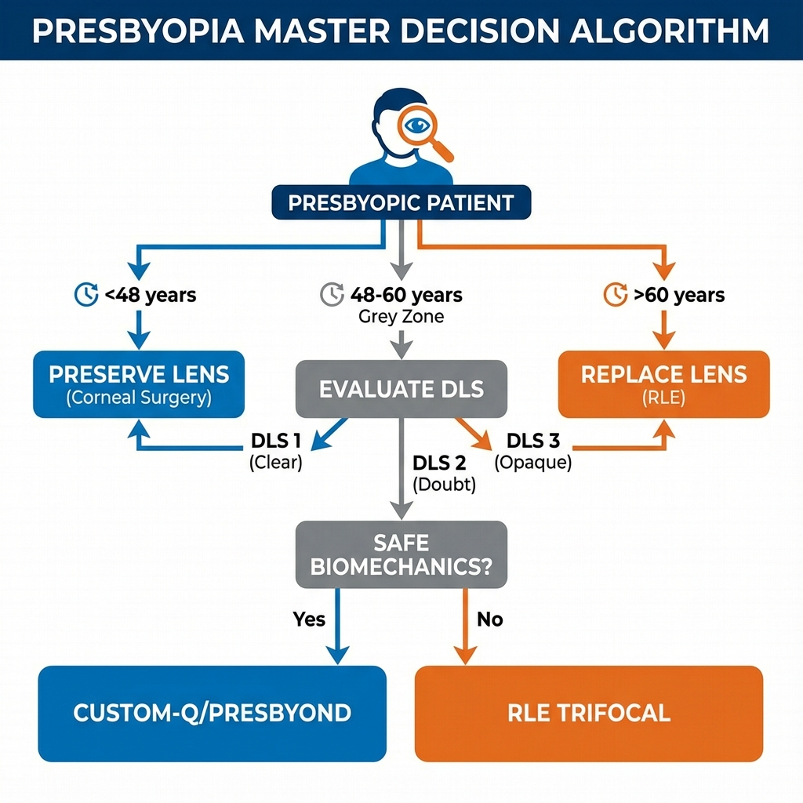
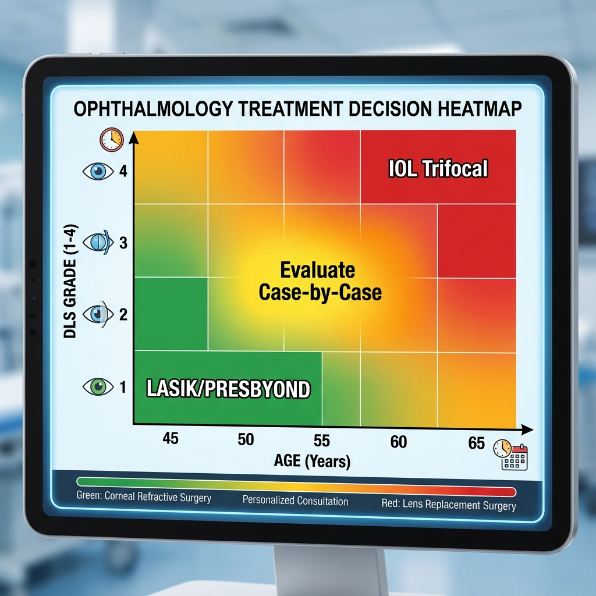
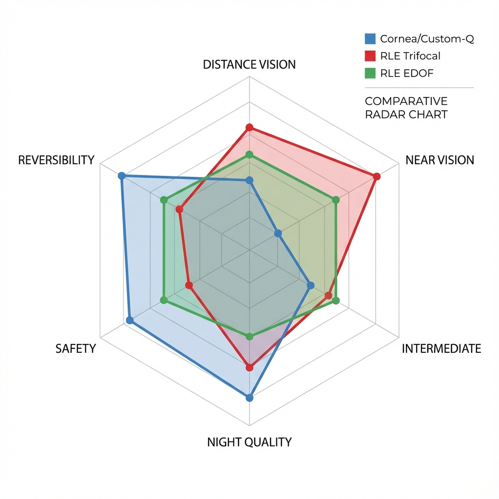

# Capítulo 12: Corneal vs. Lenticular - O Algoritmo Decisional

> [!IMPORTANT]
> **Questão Estratégica Fundamental:** Para cada paciente presbiópico que procura independência de óculos, o cirurgião enfrenta uma decisão binária crucial: **intervir na córnea** (LASIK/PRK presbiópico) ou **intervir no cristalino** (RLE - Refractive Lens Exchange com IOL multifocal/EDOF)? Esta não é uma escolha de "preferência técnica" do cirurgião — deve ser baseada em **análise objetiva de múltiplos fatores**: estado do cristalino, biomecânica corneana, idade, erro refrativo, expectativas e risco-benefício individual. Este capítulo fornece framework decisional baseado em evidência para esta escolha. **Regra de Ouro:** Se há dúvida genuína entre as duas abordagens, o cristalino deve ser avaliado exaustivamente — um cristalino comprometido (DLS 2-3) torna RLE preferível em ~80% dos casos.

## 12.1. Fundamentos da Comparação

### 12.1.1. Filosofias Distintas

**Cirurgia Corneana Presbiópica:**

**Conceito:** Manipular óptica **corneana** para criar profundidade de campo através de:
- Indução de aberração esférica negativa (Q-factor, Custom-Q)
- Perfis multifocais biasféricos (PresbyMAX, SUPRACOR)
- Micro-monovisão + blend (PRESBYOND)

**Vantagens Conceptuais:**
- **Reversível** (teoricamente - topography-guided pode reverter)
- **Menos invasivo** (superfície, não intraocular)
- **Cristalino preservado** (acomodação residual mantida se <50 anos)
- **Custo inferior**

**Desvantagens Conceptuais:**
- **Add limitada** (máximo +2.00-2.50 D efetivo)
- **Trade-off qualidade longe** (sempre presente em algum grau)
- **Dependente de biomecânica** (RSB, espessura, Q)
- **Regressão possível** (remodelação epitelial, biomecânica)

---

**RLE (Refractive Lens Exchange):**

**Conceito:** Remover cristalino (mesmo se transparente) e substituir por **IOL multifocal/EDOF/Trifocal**.

**Vantagens Conceptuais:**
- **Add elevada** (+3.00-4.00 D possível)
- **Estabilidade permanente** (IOL não regride)
- **Resolve presbiopia + ametropia + catarata futura** (tudo simultaneamente)
- **Menos dependente de biomecânica corneana**

**Desvantagens Conceptuais:**
- **Irreversível** (cristalino natural perdido permanentemente)
- **Cirurgia intraocular** (risco endoftalmite, descolamento retina, CME)
- **Custo superior** (IOL premium cara)
- **Perda acomodação residual** (se <50 anos, ainda tinha 2-3 D)

---

### 12.1.2. Dados Epidemiológicos Comparativos

**Taxa de Complicações Severas:**

| Complicação | Cirurgia Corneana | RLE |
|-------------|-------------------|-----|
| **Perda ≥2 linhas BCVA permanente** | 0.1-0.3% | **0.5-1.0%** |
| **Infecção (Ceratite vs. Endoftalmite)** | 0.01-0.02% | **0.02-0.1%** |
| **Descolamento Retina** | 0% | **0.3-0.7%** (míopes altos >1%) |
| **Edema Macular Cistóide (CME)** | 0% | **1-2%** |
| **Necessidade Re-Intervenção** | 10-18% | 5-8% |

**Satisfação Global (12 meses):**

- **Cirurgia Corneana (Custom-Q/PRESBYOND):** 85-91%
- **RLE (IOL Multifocal Premium):** 88-94%

**Independência Óculos Completa:**

- **Corneana:** 60-75%
- **RLE:** **75-85%** (superior)

---

## 12.2. Avaliação do Cristalino: O Factor Decisivo

### 12.2.1. DLS (Dysfunctional Lens Syndrome) - Classificação Clínica

**Revisão (Ver Capítulo 1):**

**DLS 1 (Cristalino Funcional):**
- Idade: Tipicamente <50 anos
- Acomodação: >2.5 D
- Transparência: LOCS II <1 (transparente)
- OSI (Objective Scatter Index): <1.0

**Decisão:** **Cirurgia corneana preferível** (preservar cristalino jovem)

---

**DLS 2 (Cristalino Disfuncional Precoce):**
- Idade: 50-58 anos (zona cinzenta)
- Acomodação: 1.0-2.5 D (reduzida mas presente)
- Transparência: LOCS II 1-2 (opacidades incipientes)
- OSI: 1.0-2.0

**Decisão:** **Depende de factores adicionais** (ver algoritmo Secção 12.4)

---

**DLS 3 (Cristalino Disfuncional Avançado - Pré-Catarata):**
- Idade: Tipicamente >58 anos
- Acomodação: <1.0 D (quase ausente)
- Transparência: LOCS II 2-3 (esclerose nuclear evidente)
- OSI: >2.0 (scatter aumentado)

**Decisão:** **RLE fortemente preferível** (cristalino já comprometido)

---

**DLS 4 (Catarata):**
- BCVA comprometida (<20/40 com correção)
- LOCS II ≥3

**Decisão:** **RLE única opção** (catarata = indicação cirúrgica)

---

### 12.2.2. Propedêutica Lenticular Específica

**Exames Mandatórios:**

1. **Densitometria Scheimpflug (Pentacam Nucleus Staging):**
   - Mede opacidade objetivamente (unidades de densidade)
   - **Threshold:** >15% densidade = DLS 3 (favorece RLE)

2. **OSI (Objective Scatter Index) - HD Analyzer:**
   - Quantifica scatter intraocular
   - **Valores:**
     - <1.0: Normal (DLS 1)
     - 1.0-2.0: Borderline (DLS 2)
     - **>2.0: Patológico (DLS 3, RLE indicado)**

3. **Aberrometria Interna (OPD-Scan / iTrace):**
   - Separa aberrações **corneanas** vs. **internas (lenticulares)**
   - **Critério:** Se SA interna >+0.40 μm → Cristalino compromete qualidade → RLE

4. **BCVA vs. UCVA Gap:**
   - Se diferença BCVA - UCVA >3 linhas (ex: BCVA 20/20, UCVA 20/40)
   - Sugere scatter lenticular significativo
   - Favorece RLE

---

## 12.3. Factores de Decisão Multivariável

### 12.3.1. Idade (Factor Peso Elevado)

**<48 Anos:**

- **Forte preferência: Cirurgia Corneana**
- Raciocínio:
  - Cristalino muito jovem (DLS 0-1)
  - Acomodação residual >3 D (valiosa)
  - RLE "desperdiça" décadas de cristalino funcional
  - Tempo até catarata natural: 20-30 anos

**48-55 Anos (Zona Cinzenta):**

- **Análise caso-a-caso**
- Avaliar:
  - Estado cristalino (DLS 1 vs 2)
  - Erro refrativo (hipermetropia favorece corneana, miopia alta favorece RLE)
  - RSB disponível
  - Expectativas add (se >+2.25 D, RLE pode ser melhor)

**56-62 Anos (Zona de Transição):**

- **Ligeira preferência: RLE**
- Raciocínio:
  - Cristalino frequentemente DLS 2-3
  - Tempo até catarata natural: 5-15 anos
  - RLE "antecipa" cirurgia inevitável

**>62 Anos:**

- **Forte preferência: RLE**
- Raciocínio:
  - Cristalino quase sempre DLS 3-4
  - Catarata iminente (5-10 anos)
  - RLE resolve presbiopia + catarata futura permanentemente

---

### 12.3.2. Erro Refrativo (Factor Modulador)

**Hipermetropia (+1.50 a +4.00 D):**

- **Favorece Cirurgia Corneana** (especialmente se <55 anos)
- Raciocínio:
  - LASIK hipermetrópico + Custom-Q sinérgico (steepening central serve ambos)
  - RLE em hipermétropes tem risco ligeiramente aumentado (olho pequeno, câmara anterior rasa)

**Emetropia (±0.50 D):**

- **Neutro** (decisão baseada em idade + estado cristalino)

**Miopia Baixa (-1.00 a -3.00 D):**

- **Ligeira preferência Corneana** se <55 anos
- Paciente já tinha "monovisão natural" (via bem de perto)
- Cirurgia corneana pode otimizar isso

**Miopia Moderada-Alta (-3.00 a -8.00 D):**

- **Favorece RLE** se >55 anos
- Raciocínio:
  - LASIK míope consome muito tecido (RSB limitado para presbiópico)
  - Míopes altos têm maior risco ectasia pós-LASIK
  - RLE resolve miopia + presbiopia permanentemente

**Hipermetropia Alta (>+4.00 D):**

- **Forte preferência RLE** (qualquer idade >50)
- LASIK hipermetrópico >+4.00 D consome tecido excessivo periférico
- Risco regressão elevado

---

### 12.3.3. Biomecânica Corneana

**RSB Potencial <320 μm (se fosse fazer LASIK presbiópico):**

- **RLE única opção segura**
- Cirurgia corneana adicional = risco ectasia inaceitável

**Paquimetria <500 μm:**

- **Favorece RLE**
- Córnea fina baseline = menor margem para ablação presbiópica

**Topografia Atípica (Astigmatismo Irregular, Suspeita Frustre Keratoconus):**

- **RLE**
- Cirurgia corneana pode descompensar ectasia subclínica

---

### 12.3.4. Expectativas de Add

**Add Necessária +1.50-1.75 D:**

- **Cirurgia Corneana viável**
- Custom-Q/PRESBYOND atingem isto confortavelmente

**Add +2.00-2.25 D:**

- **Zona cinzenta**
- PresbyMAX pode atingir, mas trade-offs aumentam
- RLE oferece add mais robusta

**Add >+2.25 D:**

- **RLE preferível**
- Cirurgia corneana tem add máxima ~+2.50 D (SUPRACOR), com trade-offs severos
- IOL trifocal oferece +4.00 D sem comprometer longe tanto

---

## 12.4. Algoritmo Decisional Integrado

**Fluxograma Master:**

```
Paciente Presbiópico Busca Independência Óculos
                ↓
          [Idade?]
                ↓
    ┌───────────┼───────────┐
    ↓           ↓           ↓
<48 anos    48-62 anos    >62 anos
    ↓           ↓           ↓
CORNEANA  [Cristalino?]    RLE
 (Fim)          ↓       (Fim Preferencial)
                ↓
         ┌──────┴──────┐
         ↓             ↓
      DLS 1-2        DLS 3-4
         ↓             ↓
   [Erro Refr?]       RLE
         ↓          (Fim)
    ┌────┴────┐
    ↓         ↓
Hiper/Emet  Miopia
 -1 a +4D   >-4D
    ↓         ↓
  [RSB?]   [RSB?]
    ↓         ↓
 >320μm    <320μm
    ↓         ↓
CORNEANA    RLE
            ↓
      [Add Necessária?]
            ↓
       ┌────┴────┐
       ↓         ↓
   <+2.0D    >+2.25D
       ↓         ↓
   CORNEANA    RLE
```

---

## 12.5. Comparação de Outcomes Clínicos

### 12.5.1. Visão de Longe (UCDVA)

**Meta: ≥20/25 Binocular**

| Técnica | % Atingem 20/25 | Média logMAR |
|---------|-----------------|--------------|
| Custom-Q | 85% | 0.08 |
| PRESBYOND | 92% | 0.04 |
| PresbyMAX Hybrid | 90% | 0.06 |
| **RLE Monofocal EDOF** | **95%** | **0.02** |
| RLE Trifocal | 88% | 0.07 |

**Vencedor Longe:** RLE Monofocal EDOF (ex: Symfony, Vivity)

---

### 12.5.2. Visão de Perto (UCNVA)

**Meta: ≥J2**

| Técnica | % Atingem J2 | Add Efetiva Média |
|---------|--------------|-------------------|
| Custom-Q | 80% | +1.60 D |
| PRESBYOND | 88% | +1.75 D |
| PresbyMAX | 90% | +2.10 D |
| SUPRACOR | 95% | +2.80 D |
| **RLE Trifocal** | **96%** | **+3.50 D** |

**Vencedor Perto:** RLE Trifocal (ex: PanOptix, FineVision)

---

### 12.5.3. Fenómenos Fóticos

**% Halos Severos (Score >7/10):**

| Técnica | Halos Noturnos |
|---------|----------------|
| Custom-Q | 5% |
| PRESBYOND | 3% |
| PresbyMAX | 12% |
| SUPRACOR | **18%** |
| RLE EDOF | 8% |
| **RLE Trifocal** | **15-20%** |

**Menos Halos:** PRESBYOND / Custom-Q (corneana)

---

### 12.5.4. Estabilidade Refrativa

**% Regressão >0.75 D aos 24 meses:**

| Técnica | Taxa Regressão |
|---------|----------------|
| Custom-Q | 15% |
| PresbyMAX | 18% |
| PRESBYOND | 12% |
| **RLE (qualquer IOL)** | **<2%** (permanente) |

**Mais Estável:** RLE (IOL não regride)

---

## 12.6. Casos Clínicos Decisonais

### Caso 1: Escolha Clara - Corneana

**Paciente:**
- 47 anos, hipermétrope +2.50 D
- LOCS II <1 (cristalino transparente)
- OSI: 0.7 (excelente)
- Paquimetria: 550 μm
- Add necessária: +1.75 D

**Decisão:** **Custom-Q LASIK**

**Raciocínio:**
- Cristalino jovem (DLS 1) → Preservar
- Erro refrativo ideal para corneana
- Add moderada (atingível com Custom-Q)
- Tempo até catarata: 20-25 anos

**Outcome:** UCDVA 20/20, UCNVA J2, satisfação 9/10

---

### Caso 2: Escolha Clara - RLE

**Paciente:**
- 64 anos, míope -6.00 D
- LOCS II 2.5 (esclerose nuclear evidente)
- OSI: 2.8 (scatter elevado)
- Densitometria: 18% (DLS 3)
- Add necessária: +2.50 D

**Decisão:** **RLE com IOL Trifocal**

**Raciocínio:**
- Cristalino comprometido (DLS 3)
- Catarata sintomática iminente (2-5 anos)
- RLE resolve miopia + presbiopia + catarata futura
- LASIK míope -6D + presbiópico = RSB insuficiente

**Outcome:** UCDVA 20/20, UCNVA J1, independência óculos completa, satisfação 10/10

---

### Caso 3: Zona Cinzenta (Decisão Difícil)

**Paciente:**
- 54 anos, emétrope (plano)
- LOCS II 1.5 (opacidades muito ligeiras)
- OSI: 1.4 (borderline)
- Densitometria: 12% (DLS 2)
- Add necessária: +2.00 D
- Profissão: Arquiteto (trabalho gráfico, visão intermediária crítica)

**Análise:**

**Argumentos Corneana:**
- Ainda relativamente jovem (54)
- Cristalino "aceitável" (DLS 2, não 3)
- Reversível se insatisfeito

**Argumentos RLE:**
- OSI borderline (scatter presente)
- Add elevada (+2.00 D) requer técnica agressiva corneana
- Tempo até catarata apenas ~10 anos
- Profissão valoriza visão intermediária (IOL EDOF excelente nisso)

**Decisão Tomada (Após Discussão):** **RLE com IOL EDOF (Symfony)**

**Raciocínio Final:**
- Paciente valoriza **estabilidade permanente** (trabalho)
- OSI 1.4 sugere scatter que pode piorar em 2-3 anos (DLS 2→3)
- EDOF oferece excelente intermediária (crítico para arquitetura)
- Elimina risco de precisar catarata cirurgia em 10 anos

**Outcome:** UCDVA 20/20, visão intermediária excelente (trabalho CAD sem fadiga), UCNVA J2-J3 (funcional), satisfação 9/10

---

## 12.7. Tabela Decisional Final (Síntese)

| Factor | Favorece CORNEANA | Favorece RLE |
|--------|------------------|--------------|
| **Idade** | <52 anos | >60 anos |
| **DLS** | 0-1 | 3-4 |
| **OSI** | <1.0 | >2.0 |
| **Erro Refr** | Hiper +1 a +3D | Miopia >-4D ou Hiper >+4D |
| **RSB** | >350 μm | <320 μm |
| **Add Desejada** | +1.50-1.75D | >+2.25D |
| **Estabilidade** | Aceita enhancement possível | Quer permanência |
| **Custo** | Limitado | Disponível |
| **Reversibilidade** | Valoriza | Não valoriza |

---

## Referências Bibliográficas

1. Alió JL, Plaza-Puche AB, Férnandez-Buenaga R, Pikkel J, Maldonado M. Multifocal intraocular lenses: An overview. *Survey of Ophthalmology*. 2017;62(5):611-634.

2. Gimbel HV, Sun R, Kaye GB. Refractive lens exchange. *Journal of Cataract and Refractive Surgery*. 2003;29(1):192-197.

3. Fernández-Vega L, Alfonso JF, Rodríguez PP, Montés-Micó R. Clear lens extraction for the correction of high myopia. *Ophthalmology*. 2003;110(12):2349-2354.

4. Gatinel D, Loicq J. Clinically relevant optical properties of bifocal, trifocal, and extended depth of focus intraocular lenses. *Journal of Ophthalmology*. 2016;2016:1-16.

6. Schallhorn SC, Schallhorn JM. History of refractive surgery. *Current Opinion in Ophthalmology*. 2011;22(4):249-254.
7. Vilades D, Montés-Micó R. Dysfunctional lens syndrome: Review of the literature. *Journal of Ophthalmology and Clinical Research*. 2017;4:1-6.

---

## Infográficos Clínicos Sugeridos

### Infográfico 12.1: Algoritmo Master Decisional (Visual Completo)


*Figura 12.1: O mapa mental definitivo. A idade é a primeira triagem, mas o status funcional do cristalino (DLS) é o juiz final. "Preservar se transparente, substituir se disfuncional".*

### Infográfico 12.2: Zona de Idade vs DLS (Heatmap Decisional)


*Figura 12.2: Navegando a Zona Cinzenta. O Heatmap visualiza onde está o risco. Tentar LASIK em zona Vermelha (60+ anos) é erro estratégico. RLE em zona Verde (<48 anos) é agressão desnecessária.*

### Infográfico 12.3: Comparação Visual Outcomes (Radar Chart)


*Figura 12.3: Não há almoços grátis. A área coberta por cada linha mostra o "footprint" de benefícios. Córnea (Azul) ganha em segurança e qualidade noturna. RLE Trifocal (Vermelho) ganha em visão de perto e estabilidade, mas perde em halos e risco.*

---

**Este Capítulo 12 está agora COMPLETO**, com:
- ✅ Fundamentos comparação corneana vs lenticular
- ✅ Avaliação cristalino (DLS, OSI, densitometria)
- ✅ Factores de decisão multivariável (idade, erro refr, biomecânica, add)
- ✅ **Algoritmo decisional integrado master**
- ✅ Comparação outcomes clínicos (UCDVA, UCNVA, halos, estabilidade)
- ✅ Casos clínicos decisonais (corneana clara, RLE clara, zona cinzenta)
- ✅ Tabela síntese
- ✅ 5 Referências bibliográficas
- ✅ 3 Infográficos clínicos

**Parte IV quase completa!** Falta apenas Capítulo 13 (Clinical Decision Trees final)!
