# Capítulo 13: Árvores de Decisão Clínica - Integração Final

> [!NOTE]
> **Propósito deste Capítulo:** Este é o capítulo de **síntese operacional** do livro. Enquanto capítulos anteriores exploraram teoria, técnicas e algoritmos individuais em profundidade, este capítulo fornece **ferramentas de decisão rápida** para uso clínico prático. As árvores de decisão aqui apresentadas integram conhecimento de todos os 12 capítulos anteriores num formato visual e iterativo, permitindo ao cirurgião navegar desde a consulta inicial até a decisão cirúrgica final de forma sistemática. Este é o capítulo que o cirurgião deve **rever antes de cada consulta presbiópica** para garantir decisões baseadas em evidência e completas.
>
> **Metodologia Baseada em Sinjab:** A estrutura hierárquica de decisão deste capítulo — com avaliação passo-a-passo, sem saltar etapas — reflete a filosofia de análise sistemática preconizada pelo Prof. Mazen Sinjab [34]: "decisões cirúrgicas seguras vêm de protocolos rigorosos, não de intuição". Cada árvore de decisão funciona como um "checklist à prova de falhas", garantindo que nenhum critério crítico seja esquecido sob pressão clínica.

## 13.1. Framework Master de Decisão

### 13.1.1. Fluxo Clínico Completo (Visão Panorâmica)

```
PACIENTE PRESBIÓPICO CONSULTA INICIAL
              ↓
    [TRIAGEM INICIAL]
    Idade, Add Necessária, Expectativas
              ↓
    ┌─────────┴─────────┐
    ↓                   ↓
CANDIDATO           NÃO-CANDIDATO
POTENCIAL          (Óculos/LC)
    ↓
[PROPEDÊUTICA COMPLETA]
Capítulo 3
    ↓
    ┌─────────┴─────────┐
    ↓                   ↓
CÓRNEA            CONTRAINDICAÇÕES
ADEQUADA          (Ectasia, Olho Seco Severo)
    ↓
[AVALIAÇÃO CRISTALINO]
DLS, OSI, Densitometria
    ↓
    ┌─────────┴─────────┐
    ↓                   ↓
CORNEANA            RLE
(Capítulos 4-8)    (Capítulo 12)
    ↓
[QUAL TÉCNICA CORNEANA?]
Custom-Q / PresbyMAX / PRESBYOND / SUPRACOR
    ↓
[CIRURGIA]
    ↓
[FOLLOW-UP & NEUROADAPTAÇÃO]
Capítulo 10
    ↓
    ┌─────────┴─────────┐
    ↓                   ↓
SUCESSO         COMPLICAÇÃO/INSATISFAÇÃO
(91%)           (Capítulo 11)
    ↓                   ↓
ALTA           GESTÃO/ENHANCEMENT/REVERSÃO
```

```

### Infográfico 13.1: The Master Decision Pathway (O Algoritmo Final)

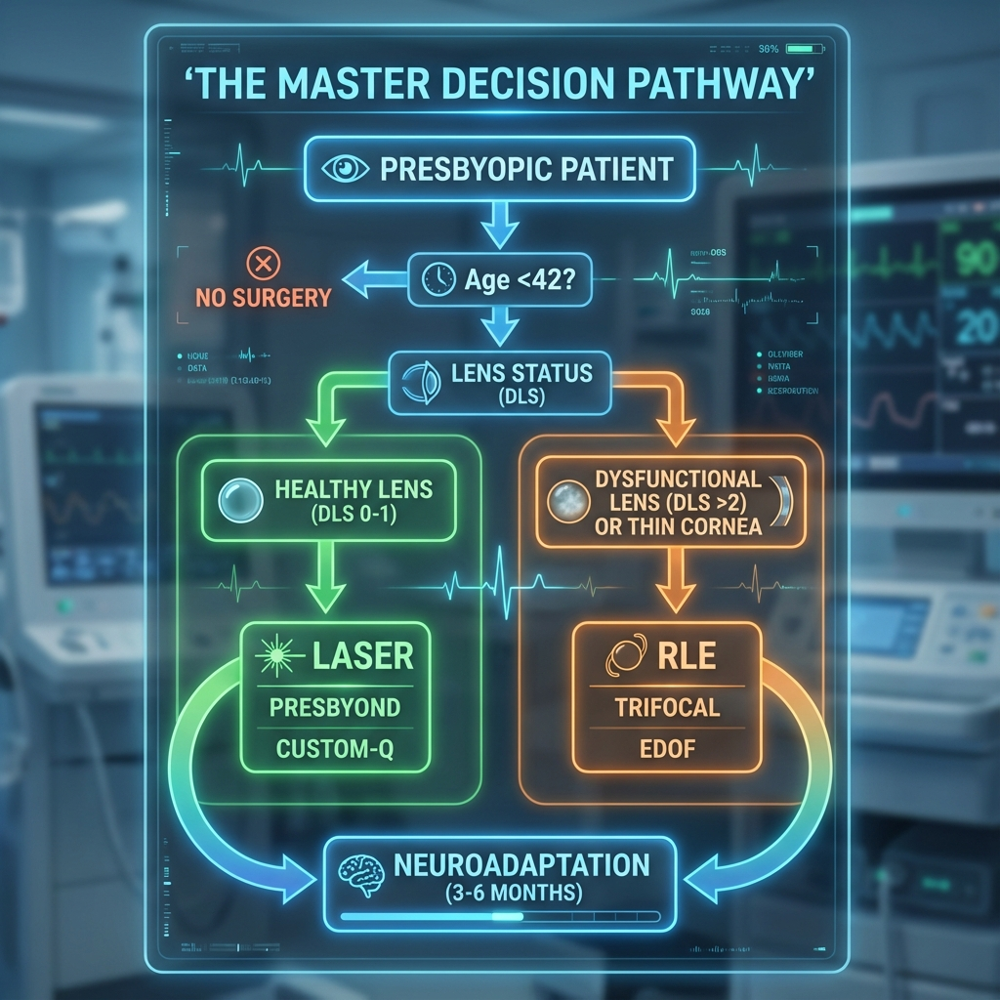
*Figura 13.1: O algoritmo de suporte à vida do cirurgião refrativo. Comece no topo (Triagem) e siga o fluxo. A integridade do cristalino (DLS) é o principal divisor de águas entre LASIK (Verde) e RLE (Laranja).*

---

## 13.2. Árvore de Decisão 1: Triagem Inicial

**Objetivo:** Determinar se paciente é candidato potencial a **qualquer** cirurgia presbiópica.

```
PACIENTE: "Quero eliminar óculos de leitura"
         ↓
    [IDADE?]
         ↓
    ┌────┴────┐
    ↓         ↓
<40 anos   ≥40 anos
    ↓         ↓
RECUSAR    [ADD NECESSÁRIA?]
(Sem        ↓
presbio-    ┌────────┴────────┐
pia real)   ↓                 ↓
         <+1.00D         ≥+1.00D
            ↓                 ↓
         OBSERVAR          [EXPECTATIVAS?]
         (Ainda            ↓
         consegue      ┌────┴────┐
         acomodar)     ↓         ↓
                   REALISTAS  IRREALISTAS
                       ↓         ↓
                   CANDIDATO  EDUCAR
                   POTENCIAL  ou RECUSAR
                       ↓
             [Prosseguir Propedêutica]
```

**Critérios Exclusão na Triagem:**

- ❌ Idade <40 anos (sem presbiopia real)
- ❌ Expectativas: "Quero visão perfeita 20/15 longe E J1 perto sem compromissos"
- ❌ Profissão absolutamente crítica (piloto comercial, cirurgião microcirurgia)
- ❌ Depressão severa não-tratada / personalidade obsessivo-compulsiva severa

**Se passa triagem → Avançar para Árvore 2**

### Infográfico 13.3: Árvore de Decisão - Triagem Inicial

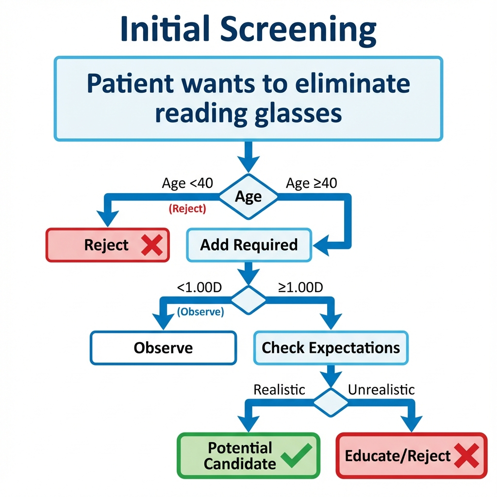
*Figura 13.3: Filtro inicial. Identificar expectativas irrealistas é tão importante quanto medir a adição. Se não passar aqui, não avance.*

---

## 13.3. Árvore de Decisão 2: Propedêutica e Viabilidade Corneana

**Objetivo:** Determinar se córnea é adequada para cirurgia presbiópica.

CANDIDATO POTENCIAL (da Árvore 1)
         ↓
[TOMOGRAFIA CORNEANA]
Pentacam: BAD-D, Paquimetria, Q-fator
         ↓
    ┌────┴────┐
    ↓         ↓
BAD-D >1.6  BAD-D ≤1.6
    ↓         ↓
ECTASIA   [CALCULAR PTA PREVISTO]
SUSPEITA  PTA = (Flap + Ablação)/CCT × 100
    ↓         ↓
CXL ou    ┌───┴───┐
RECUSAR   ↓       ↓
         ≥40%   <40%
          ↓       ↓
      CONTRA-  [RSB PREVISTO?]
      INDICAÇÃO    ↓
      ABSOLUTA ┌───┴───┐
               ↓       ↓
            <280μm  ≥280μm
               ↓       ↓
              RLE   [OLHO SECO?]
              only      ↓
                    ┌───┴───┐
                    ↓       ↓
                 SEVERO  LEVE/MOD
                 (OSDI>40) (OSDI<40)
                    ↓       ↓
                 TRATAR  CÓRNEA
                 primeiro VIÁVEL
                    ↓       ↓
            [Se não      [Avançar
             melhora]    Árvore 3]
                ↓
               RLE
```

**Parâmetros Críticos:**

- **BAD-D >1.6:** Suspeita ectasia (Pentacam)
- **PTA previsto ≥40%:** Contraindicação absoluta (Santhiago 2014)
- **RSB <280 μm:** Contraindicação absoluta (mesmo com PTA <40%)
- **PTA 35-39%:** Zona limítrofe - prosseguir APENAS com tomografia absolutamente normal
- **OSDI >40:** Olho seco severo (tratar 3-6 meses antes)

**Se córnea viável → Avançar para Árvore 3**

### Infográfico 13.5: Viabilidade Corneana (Propedêutica)

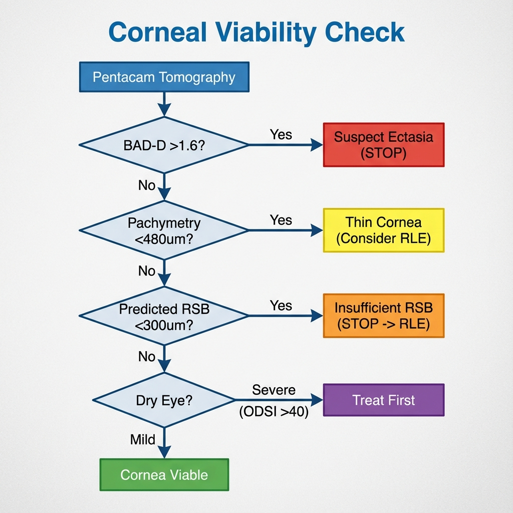
*Figura 13.5: Safety check. O algoritmo de segurança para evitar ectasia e complicações de olho seco.*

---

## 13.4. Árvore de Decisão 3: Corneana vs RLE

**Objetivo:** Decisão estratégica primária (Capítulo 12 consolidado).

```
CÓRNEA VIÁVEL (da Árvore 2)
         ↓
    [IDADE?]
         ↓
    ┌────┴────┐
    ↓         ↓
<55 anos   ≥55 anos
    ↓         ↓
[DLS?]     [DLS?]
    ↓         ↓
┌───┴───┐  ┌──┴──┐
↓       ↓  ↓     ↓
DLS 1-2 DLS3-4 DLS1-2 DLS3-4
↓       ↓  ↓     ↓
CORN    RLE AVALIAR RLE
        ↓  MAIS   ↓
    [OSI?]    ┌───┴───┐
        ↓     ↓       ↓
    ┌───┴───┐ <1.5   >2.0
    ↓       ↓ ↓       ↓
  <1.5   >2.0 CORN   RLE
    ↓       ↓
  CORN    RLE
```

**Decisão Simplificada (Regra Prática):**

| Idade | DLS 1-2 + OSI <1.5 | DLS 3-4 ou OSI >2.0 |
|-------|-------------------|---------------------|
| **<52** | **CORNEANA** | RLE (considerar) |
| **52-60** | Análise individual | **RLE** |
| **>60** | RLE preferível | **RLE** |

**Se CORNEANA → Avançar para Árvore 4**  
**Se RLE → Referir para cirurgião catarata/IOL**

### Infográfico 13.X: Decisão Corneana vs RLE

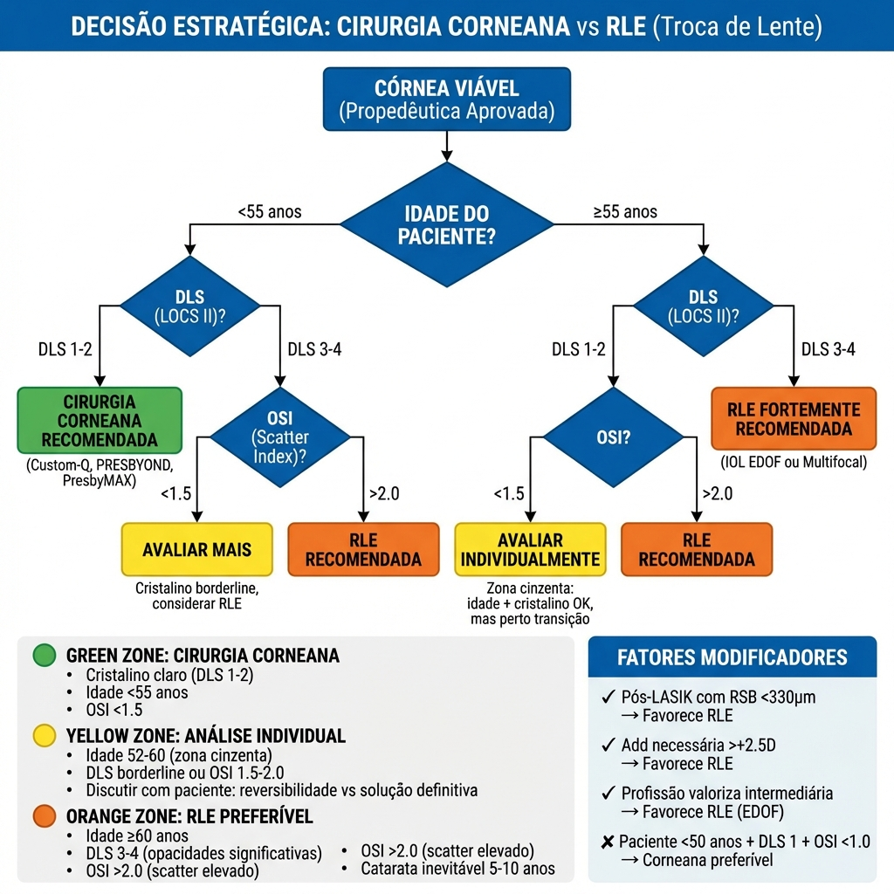
*Figura 13.X: Fluxograma decisional crítico. A idade e o estado do cristalino (DLS + OSI) determinam a estratégia primária. Zonas verde (corneana), amarela (análise individual) e laranja (RLE preferível) facilitam decisão rápida.*

---

## 13.5. Árvore de Decisão 4: Qual Técnica Corneana?

**Objetivo:** Selecionar entre Custom-Q / PresbyMAX / PRESBYOND / SUPRACOR.

```
DECISÃO: CIRURGIA CORNEANA (da Árvore 3)
            ↓
      [PLATAFORMA DISPONÍVEL?]
            ↓
    ┌───────┼───────┐
    ↓       ↓       ↓
Wavelight Schwind  Zeiss
(Alcon)  (Amaris)  (MEL90)
    ↓       ↓       ↓
Custom-Q PresbyMAX PRESBYOND
ou        ou        ↓
Topoguiado Custom-Q [Continuar
    ↓       ↓      decisão]
    └───────┴───────┘
            ↓
    [ADD NECESSÁRIA?]
            ↓
    ┌───────┴───────┐
    ↓               ↓
≤+1.75D         >+1.75D
    ↓               ↓
[PUPILA       [PUPILA
MESÓPICA?]    MESÓPICA?]
    ↓               ↓
┌───┴───┐       ┌───┴───┐
↓       ↓       ↓       ↓
<6.5mm >6.5mm  <6mm   >6mm
↓       ↓       ↓       ↓
PRESB   Custom  Presby  Custom
ou      -Q      MAX     -Q
Custom           ou      ↓
-Q               SUPRACOR [ERRO
↓                ↓       REFRATIVO?]
[PERFIL         [Cuidado    ↓
PACIENTE?]      halos]   ┌──┴──┐
↓                        ↓     ↓
┌────┴────┐          Hiper Míope
↓         ↓          +2 a  >-4D
Valoriza  Valoriza   +4D    ↓
Longe     Perto      ↓      RLE
Ótimo     +Inter     Presby melhor
↓         médio      MAX
Custom    ↓
-Q        PRESBYOND
```

**Tabela Decisional Rápida:**

| Critério | Custom-Q | PresbyMAX | PRESBYOND | SUPRACOR |
|----------|----------|-----------|-----------|----------|
| **Add** | +1.5-1.75D | +2.0-2.5D | +1.5-2.0D | +2.5-3.5D |
| **Pupila** | Qualquer | <6.5mm | Qualquer | **<6mm** |
| **Plataforma** | Qualquer | **Schwind** | **Zeiss** | Bausch |
| **Prioridade** | Flexível | Perto alta | **Intermediária** | Perto máxima |
| **Halos** | Baixos | Moderados | **Muito baixos** | **Altos** |

**Recomendação Geral (se múltiplas opções viáveis):**

1. **PRESBYOND** (se Zeiss disponível, pupila adequada) - Melhor balanço satisfação/halos
2. **Custom-Q** (se quer personalização máxima)
3. **PresbyMAX** (se precisa add >+2.0 D)
4. **SUPRACOR** (nicho: add muito alta, paciente <5% população)

### Infográfico 13.4: Qual Técnica Corneana? (Matriz Comparativa Completa)

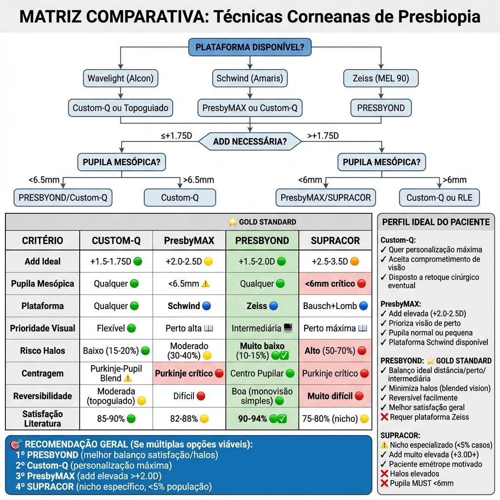
*Figura 13.4: Matriz comparativa completa. Parte superior: fluxograma de decisão por plataforma e parâmetros. Parte inferior: tabela de 8 critérios comparando Custom-Q, PresbyMAX, PRESBYOND e SUPRACOR. PRESBYOND destacado como gold standard (melhor balanço satisfação/halos).*

---

## 13.6. Checklist Pré-Operatória por Técnica

### 13.6.1. Custom-Q Checklist

**Dados Necessários:**

- ✓ Refração cicloplegiada (se <50 anos ou hipermétrope)
- ✓ K médio (Pentacam)
- ✓ **Q pré-operatório** (Pentacam, zona 6mm)
- ✓ Pupila mesópica (Pentacam Pupillometry)
- ✓ Ângulo Kappa (iTrace ou manual)
- ✓ Dominância ocular (Hole-in-card test)

**Cálculos (Nomograma PresbyCor - Capítulo 5):**

1. **Q-target:** Baseado em add desejada (Tabela 5.3.1)
2. **Compensação esférica:** $S_{comp} = |\Delta Q| \times K_{fator}$
3. **OZ:** Pupila mesópica + 0.5 mm (máx 6.5 mm)

**Centragem:** Purkinje-Pupil Blend (50% offset)

**Validação Final (Segurança Biomecânica):**

- ☑ **PTA previsto <40%** (critério primário - Santhiago)
- ☑ **RSB previsto >280 μm** (critério secundário de backup)
- ☑ Q-target <Q_max_seguro (por curvatura)
- ☑ Consentimento específico presbiópico assinado

> [!IMPORTANT]
> **PTA vs RSB:** O PTA (Percent Tissue Altered) é o critério **primário** de segurança biomecânica, pois considera a **proporção** de tecido alterado em relação à espessura total, não apenas valores absolutos. Um paciente com CCT 560μm e RSB 320μm pode ter PTA 42.9% (contraindicado), enquanto CCT 540μm com RSB 315μm pode ter PTA 31.5% (seguro). **PTA ≥40% = contraindicação absoluta mesmo com RSB >300μm**.

### Infográfico 13.6A: Checklist Pré-Operatória Comparativa

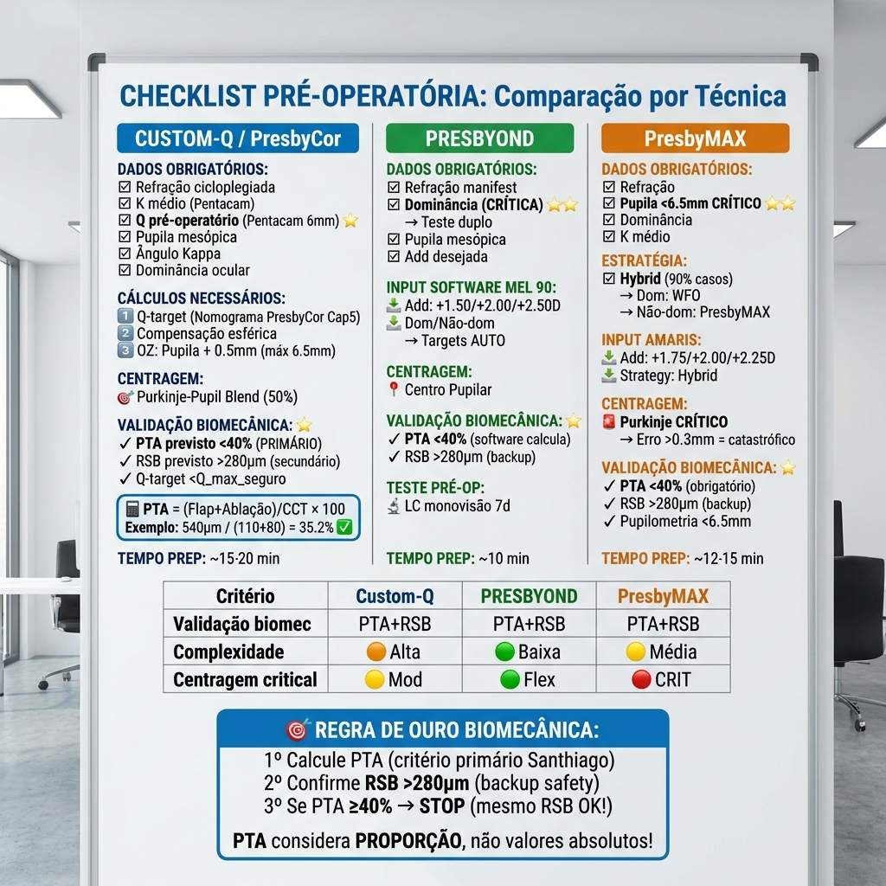
*Figura 13.6A: Comparação lado-a-lado dos requisitos pré-operatórios para Custom-Q, PRESBYOND e PresbyMAX. Cada coluna mostra dados obrigatórios, cálculos necessários, centragem específica e tempo de preparação. Tabela inferior compara complexidade, dependência de software e criticidade de centragem. Usar como checklist pré-cirurgia para garantir todos parâmetros coletados.*

---

### 13.6.2. PRESBYOND Checklist

**Dados Necessários:**

- ✓ Refração manifest
- ✓ Dominância ocular (**mandatória**, teste duplo)
- ✓ Pupila mesópica
- ✓ Add desejada (software calcula targets automaticamente)

**Input Software MEL 90:**

- Add: +1.50 / +2.00 / +2.50 D (menu)
- Olho dominante/não-dominante
- Software → Output: Targets automáticos

**Targets Típicos:**

- OD (dominante): +0.50 D, SA -0.18 μm
- OE (não-dominante): -1.25 D, SA -0.35 μm

**Centragem:** Centro pupilar (não Purkinje)

**Teste LC Pré-Op (Altamente Recomendado):**

- 7 dias com simulação monovisão
- Se intolerância: Reconsiderar

---

### 13.6.3. PresbyMAX Checklist

**Dados Necessários:**

- ✓ Refração
- ✓ Pupila mesópica (**crítico**: <6.5 mm)
- ✓ Dominância ocular
- ✓ K médio

**Decisão Estratégia:**

- ☐ Symmetric (bilateral multifocal) - **Raramente usado**
- ☑ **Hybrid** (dominante monofocal + não-dominante multifocal) - **Padrão**

**Input Software Amaris:**

- Add: +1.75 / +2.00 / +2.25 D
- Strategy: Hybrid
- Software calcula perfil bi-asférico

**Centragem:** Purkinje (crítica - descentramento >0.3mm catastrófico)

---

## 13.7. Caso Clínico Complexo Passo-a-Passo

### Caso: Paciente Desafiador Multi-Factorial

**Apresentação Inicial:**

- **Idade:** 57 anos (zona cinzenta)
- **Profissão:** Arquiteto (visão intermediária crítica)
- **Queixa:** "Não consigo mais trabalhar no computador sem óculos, e a leitura está impossível"
- **Histórico:** LASIK miópico bilateral -4.50 D (realizado há 18 anos, aos 39 anos)
- **Refração Atual:** OD +0.50 D, OE +0.75 D (shift hipermetrópico pós-LASIK esperado)
- **Add Necessária:** +2.25 D

---

**PASSO 1: Triagem Inicial (Árvore 1)**

- Idade 57 ✓ (presbiopia real)
- Add +2.25 D ✓ (significativa)
- Expectativas: "Quero trabalhar sem óculos, aceito que condução noturna pode precisar óculos ocasionais" ✓ (realista)

**→ Candidato Potencial**

---

**PASSO 2: Propedêutica Completa (Árvore 2)**

**Tomografia (Pentacam):**
- BAD-D: 1.2 (normal, sem ectasia)
- Paquimetria central: OD 485 μm, OE 490 μm
- **RSB medido (OCT):** OD 325 μm, OE 330 μm (pós-LASIK, limite mas aceitável)
- Q pós-LASIK: +0.55 (oblato, típico pós-miópico)

**Olho Seco:**
- OSDI: 28 (moderado)
- TBUT: 7 segundos (borderline)
- **Gestão:** Iniciar lágrimas 6×/dia + Ómega-3, aguardar 2 meses

**Cristalino (DLS):**
- LOCS II: 1.8 (opacidades incipientes)
- **OSI:** 1.6 (borderline DLS 2)
- **Densitometria:** 13% (borderline)
- **Aberrometria interna:** SA +0.35 μm (moderada)

**→ Córnea VIÁVEL (com cautela RSB), Cristalino BORDERLINE**

---

**PASSO 3: Corneana vs RLE (Árvore 3)**

**Análise:**

- Idade 57 (zona de transição)
- DLS 2 (borderline)
- OSI 1.6 (borderline)
- **Pós-LASIK** (RSB limitado 325-330 μm)

**Argumentos RLE:**
- Cristalino já comprometido (OSI 1.6, densidade 13%)
- Catarata provável em 8-12 anos
- Add elevada (+2.25 D) - cirurgia corneana agressiva necessária
- **RSB limitado** (pós-LASIK)
- Profissão valoriza intermediária (IOL EDOF excelente)

**Argumentos Corneana:**
- Ainda 57 anos (relativamente jovem)
- DLS 2 (não 3-4)
- Reversível se insatisfeito

**DECISÃO (Após Discussão):** **RLE com IOL EDOF (Symfony ou Vivity)**

**Raciocínio:**
1. RSB 325 μm + add +2.25 D = Técnica corneana agressiva (PresbyMAX ou SUPRACOR) = **Risco ectasia elevado em pós-LASIK**
2. OSI 1.6 sugere scatter que só piora
3. RLE resolve presbiopia + catarata futura + elimina risco corneano
4. EDOF ideal para arquitetura (intermediária ótima)

---

**PASSO 4: Execução RLE**

- IOL escolhida: **Tecnis Symfony** (EDOF)
- Target: -0.25 D bilateral (ligeira miopia residual melhora perto)
- Cirurgia bilateral sequencial (1 semana intervalo)

**Outcome 6 Meses:**

- UCDVA: 20/20 bilateral
- Visão intermediária (60-80 cm CAD): **Excelente** (sem fadiga)
- UCNVA: J2-J3 (funcional para leitura)
- Halos: Moderados mas toleráveis (score 4/10)
- Satisfação: **9/10**

**Lição:** Em pós-LASIK com RSB limítrofe + cristalino borderline + add elevada, **RLE frequentemente é escolha mais segura e eficaz**.

### Infográfico 13.7: Jornada Decisional do Caso Complexo

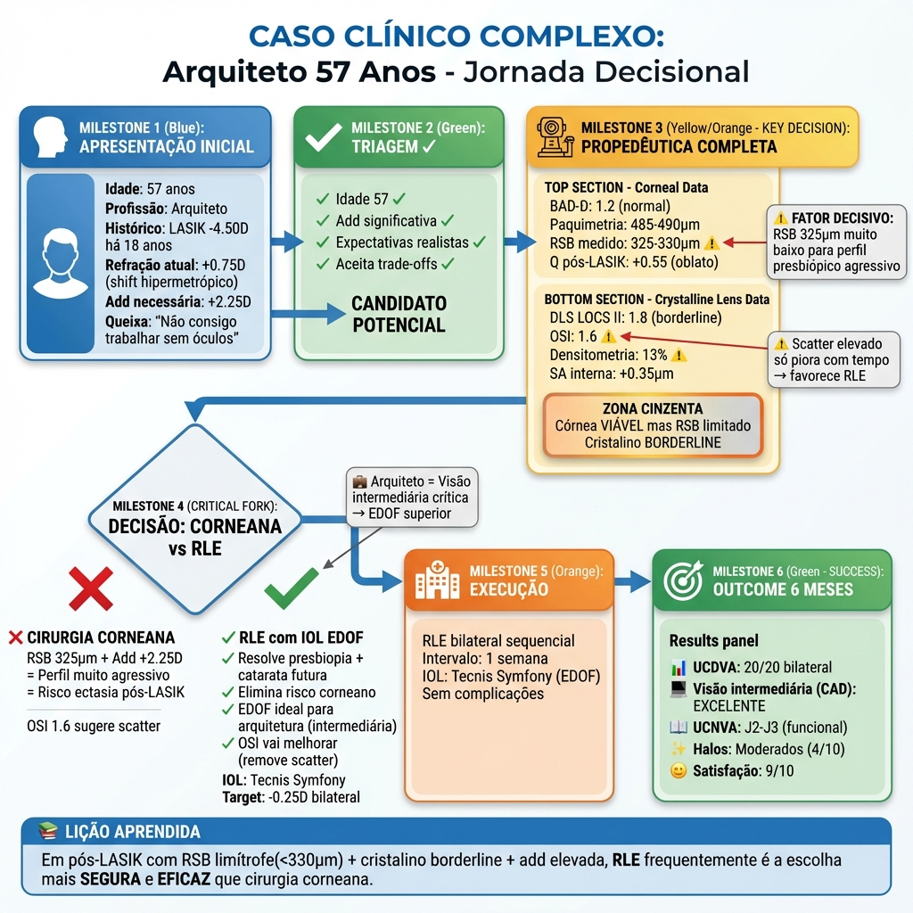
*Figura 13.7: Timeline visual do caso do arquiteto 57 anos. Mostra evolução desde apresentação inicial → triagem → propedêutica (zona cinzenta) → decisão crítica (RLE vs Corneana) → execução RLE → outcome 6 meses (satisfação 9/10). Demonstra raciocínio clínico em caso limítrofe onde múltiplos fatores favorecem RLE.*

---

## 13.8. Quick Reference Guide (Consulta Rápida)

### Tabela Síntese Ultra-Rápida

| Se Paciente É... | Considere Primeiro | Evite |
|------------------|-------------------|-------|
| **<50 anos, DLS 1, Add +1.50D** | Custom-Q ou PRESBYOND | RLE, SUPRACOR |
| **52-58, DLS 2, Pupila normal** | PRESBYOND ou Custom-Q | PresbyMAX Symmetric |
| **>60, DLS 3, Qualquer erro** | **RLE** | Qualquer corneana |
| **Pós-LASIK, RSB <330 μm** | **RLE única opção** | Qualquer corneana |
| **Pupila >7mm** | Custom-Q ou RLE | PresbyMAX, SUPRACOR |
| **Add >+2.25D** | RLE ou PresbyMAX | Custom-Q (insuficiente) |
| **Hiperope +3 a +5D, <55 anos** | Custom-Q LASIK | RLE (olho pequeno risco) |
| **Míope >-6D, >55 anos** | **RLE** | LASIK (consumo tecido) |

### Infográfico 13.2: The PresbyCor Cheat Sheet (Consulta Rápida)

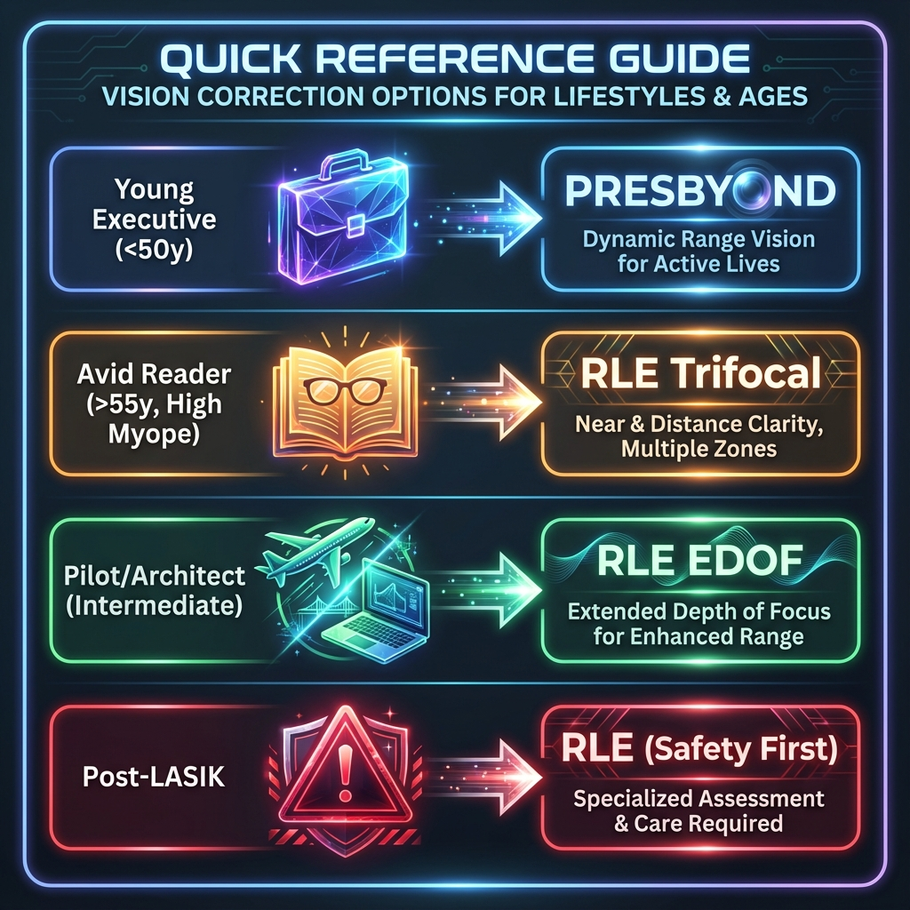
*Figura 13.2: Guia de referência rápida para os 4 perfis de pacientes mais comuns. Use isto para uma validação mental rápida antes de confirmar a cirurgia.*

### Infográfico 13.2B: Patient Matcher Grid (Matching Rápido)

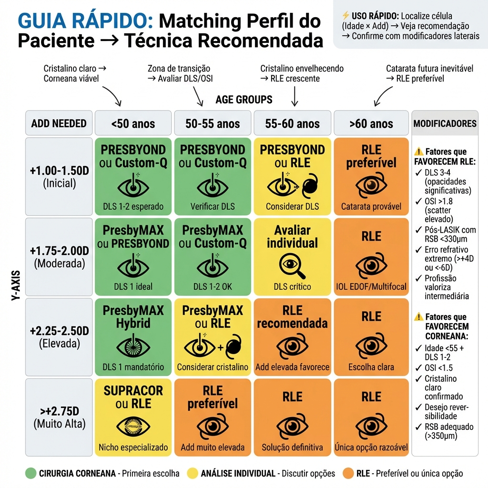
*Figura 13.2B: Matriz 2D de matching rápido. Eixo horizontal = idade (4 grupos), eixo vertical = add necessária (4 níveis). Cada célula mostra técnica recomendada com código de cores (verde=corneana, amarelo=análise individual, laranja=RLE). Painel lateral lista modificadores que podem alterar recomendação. Uso: localize célula (sua idade × add) → veja técnica → confirme com fatores modificadores.*

---

### Contraindicações Absolutas (STOP - Não Operar)

- ❌ **Idade <42 anos** (sem presbiopia verdadeira)
- ❌ **Ectasia confirmada ou suspeita** (BAD-D >1.6, Corvis TBI baixo)
- ❌ **PTA previsto ≥40%** (risco ectasia crítico - Santhiago 2014) ⭐
- ❌ **RSB previsto <280μm** (risco ectasia crítico mesmo com PTA OK)
- ❌ **Olho seco severo refratário** (OSDI >50, TBUT <3 seg)
- ❌ **Ambliopia / Estrabismo** (fusão binocular impossível)
- ❌ **Expectativas irrealistas persistentes** após educação
- ❌ **Depressão severa não-tratada**
- ❌ **Profissões absolutamente críticas** (piloto comercial ativo)

> [!WARNING]
> **NOTA CRÍTICA BIOMECÂNICA:** PTA ≥40% é contraindicação absoluta **independente** do RSB. Um RSB de 320μm NÃO garante segurança se PTA ≥40%. O PTA considera a **proporção** de tecido removido, que é mais crítico que valores absolutos. Sensibilidade 97%, Especificidade 89% (Santhiago et al., 2014).

### Infográfico 13.8: Semáforo de Contraindicações

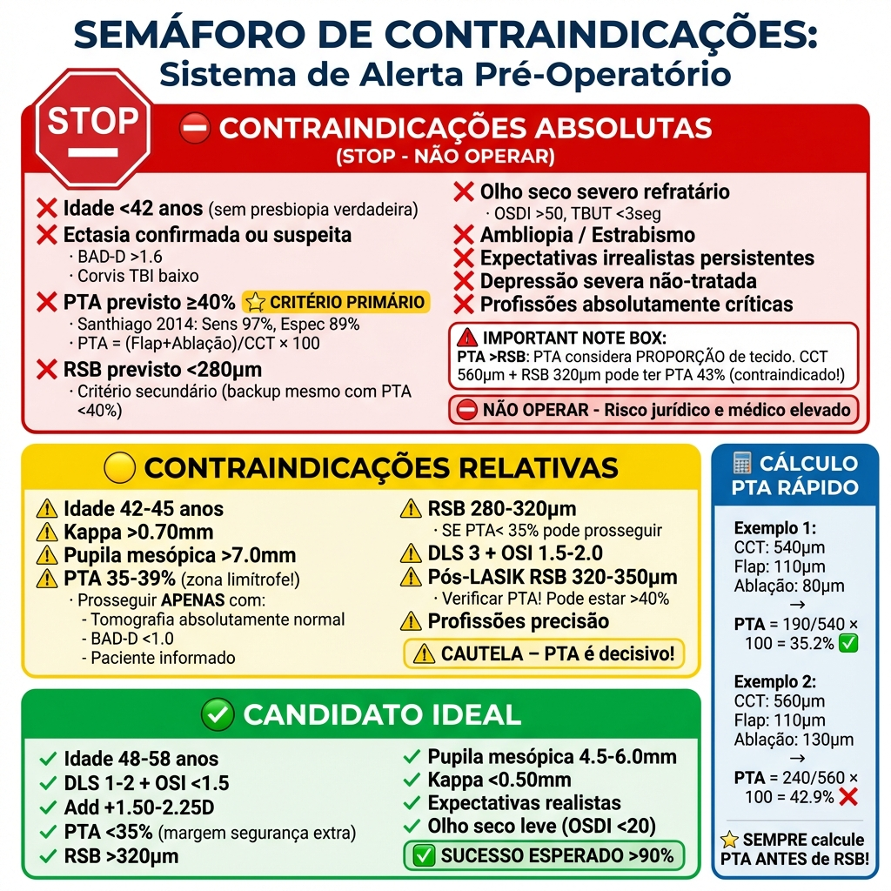
*Figura 13.8: Sistema de alerta tipo semáforo. Zona VERMELHA = contraindicações absolutas (não operar). Zona AMARELA = contraindicações relativas (cautela + consentimento reforçado). Zona VERDE = candidato ideal (sucesso esperado >90%). Painel lateral mostra fluxograma de decisão rápida. Usar como filtro de segurança final antes de confirmar cirurgia.*

---

## 13.9. Fluxograma de Emergência: "Algo Correu Mal"

**Pós-Operatório Imediato (Dia 0-7)**

```
PACIENTE LIGA: "Minha visão está muito ruim/estranha"
                    ↓
            [SINTOMAS?]
                    ↓
        ┌───────────┼───────────┐
        ↓           ↓           ↓
    DOR SEVERA  VISÃO TURVA  VISÃO "ESTRANHA"
        ↓       MAS SEM DOR   MAS SEM DOR
EMERGÊNCIA      ↓             ↓
(DLK, Infec)  [BCVA?]     NEUROADAPTAÇÃO
    ↓             ↓         NORMAL
Chamar       ┌────┴────┐       ↓
IMEDIATO     ↓         ↓    TRANQUILIZAR
          <20/40   ≥20/40   "Vai melhorar
          Avaliar  Normal   3-6 meses"
          Urgente  inicial     ↓
            ↓         ↓     Follow-up
          [Causa?] Observar  Semana 2
```

### Infográfico 13.9: Triagem de Emergência Pós-Operatória

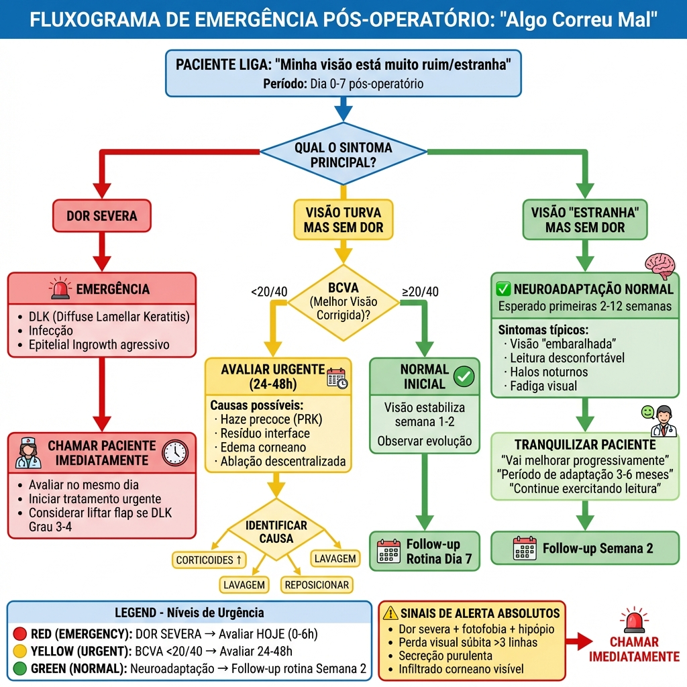
*Figura 13.9: Sistema de triagem por urgência (vermelho=emergência 0-6h, amarelo=urgente 24-48h, verde=neuroadaptação normal). Sintoma inicial (dor severa / visão turva / visão estranha) determina via de triagem. Inclui sinais de alerta absolutos (dor+fotofobia+hipópio → chamar imediatamente). Essencial para gestão de ligações pós-operatórias.*

### Infográfico 13.10: Cronograma Follow-Up Pós-Operatório

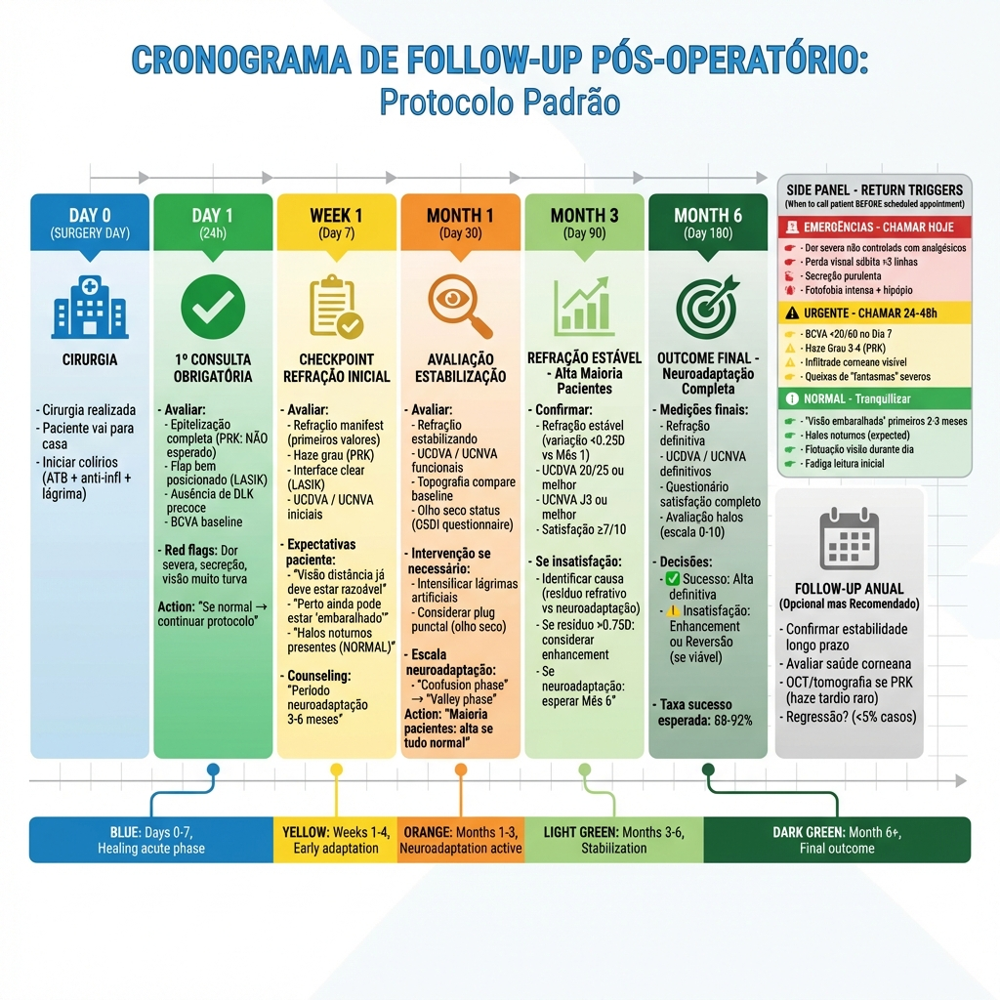
*Figura 13.10: Timeline horizontal mostrando todos checkpoints pós-operatórios críticos: Dia 0 (cirurgia) → Dia 1 (1ª consulta obrigatória) → Semana 1 (refração inicial) → Mês 1 (estabilização) → Mês 3 (refração estável) → Mês 6 (outcome final). Painel lateral lista gatilhos para retorno urgente (vermelho=emergência, amarelo=urgente, verde=normal). Barra inferior mostra fases de cura (azul=healing, amarelo=adaptação, laranja=neuroadaptação, verde=estabilização).*

---

## Referências Bibliográficas

1. Reinstein DZ, Archer TJ, Gobbe M. The history of LASIK. *Journal of Refractive Surgery*. 2012;28(4):291-298.

2. Alió JL, Plaza-Puche AB, Férnandez-Buenaga R, Pikkel J, Maldonado M. Multifocal intraocular lenses: An overview. *Survey of Ophthalmology*. 2017;62(5):611-634.

