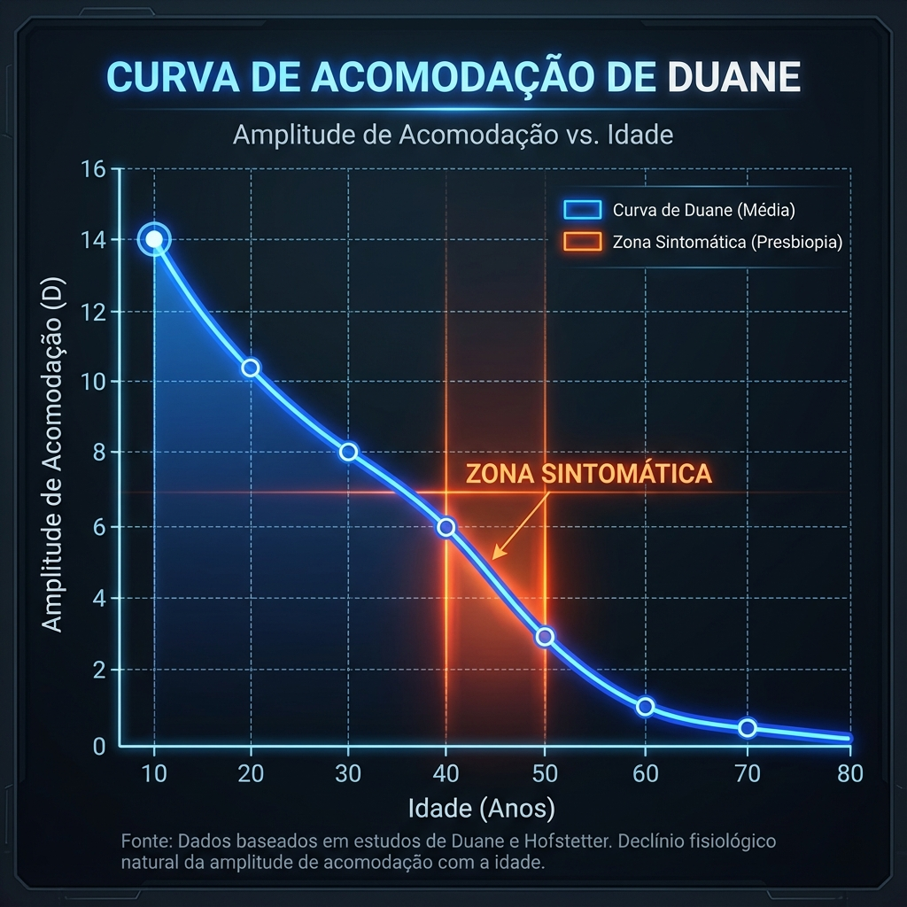
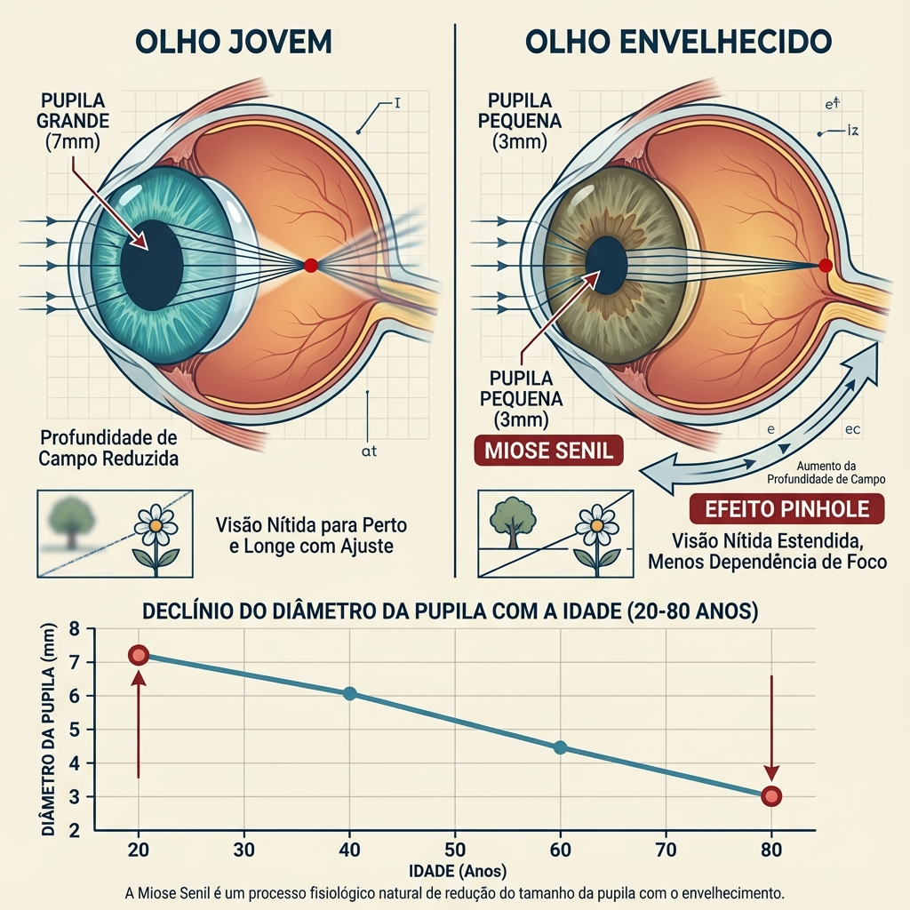

# Capítulo 1: Fundamentos da Presbiopia – Anatomia e Fisiopatologia

> [!NOTE]
> **Definição Clínica:** A presbiopia é definida como a perda progressiva e irreversível da amplitude de acomodação do cristalino, resultando na incapacidade de focar objetos a distâncias próximas. Este processo fisiológico universal começa na infância, tornando-se clinicamente manifesto tipicamente a partir da quarta década de vida. [1,2]

## 1.1. Anatomia do Aparelho Acomodativo

A função acomodativa normal depende da integridade e interação coordenada de três estruturas principais, conforme classicamente descrito por Helmholtz e confirmado por estudos modernos de imagem dinâmica (UBM/OCT):

*Figura 1.1: Mecanismo de Acomodação segundo Helmholtz. Painel esquerdo: Visão de longe (músculo relaxado, zônulas tensas). Painel direito: Visão de perto (músculo contraído, zônulas relaxadas, cristalino arredondado).*

### 1.1.1. O Músculo Ciliar: O Motor Primário

O músculo ciliar representa o motor neuromuscular da acomodação. Anatomicamente, consiste em três orientações de fibras musculares:

- **Fibras Longitudinais (Brücke):** Inserem-se na malha trabecular e esporão escleral, fornecendo tração anterior.
- **Fibras Radiais:** Camada intermédia que fornece força centrípeta.
- **Fibras Circulares (Müller):** Fibras internas tipo esfíncter que constringem o anel ciliar.

Sob estimulação parassimpática (via núcleo de Edinger-Westphal e gânglio ciliar), o músculo ciliar contrai-se, movendo o corpo ciliar anterior e centripetamente. Esta contração liberta a tensão nas fibras zonulares.

**Insight Clínico Crítico:** Estudos de Glasser e Campbell demonstraram que o músculo ciliar retém sua capacidade contrátil muito além do início da presbiopia, sugerindo que a falha é primariamente lenticular, não muscular. [3] Este achado tem implicações profundas: estratégias cirúrgicas focadas no músculo ciliar (como procedimentos de expansão escleral) falham em abordar a fisiopatologia raiz.

### 1.1.2. A Zônula de Zinn: O Sistema de Suspensão e Transmissão de Força

O aparelho zonular consiste em fibras elásticas (fibrilina-1 e fibrilina-2) que conectam o corpo ciliar ao equador do cristalino. Estas fibras são classificadas em:

- **Zônulas Anteriores:** Inserem-se na cápsula anterior do cristalino
- **Zônulas Posteriores:** Inserem-se na cápsula posterior do cristalino
- **Zônulas Equatoriais:** Os suportes estruturais primários

O sistema zonular funciona como um mecanismo de transmissão de força bidirecional. Quando o músculo ciliar está relaxado, o recuo elástico da membrana de Bruch e coroide mantém tensão centrífuga nas zônulas, o que achata o cristalino. Inversamente, a contração do músculo ciliar liberta esta tensão, permitindo que o cristalino assuma uma forma mais esférica.

**Consideração Biomecânica:** Alterações relacionadas à idade na elasticidade zonular (expressão diminuída de fibrilina, aumento de cross-linking) contribuem para a redução na resposta acomodativa, embora este efeito seja secundário às alterações lenticulares. [4]

### 1.1.3. O Cristalino: O Elemento Óptico Bicoconvexo Dinâmico

O cristalino é o efetor final da acomodação. A sua estrutura consiste em:

- **Cápsula do Cristalino:** Uma membrana basal (10-15 μm anteriormente, 4-5 μm posteriormente) com propriedades elásticas que fornecem força de moldagem
- **Epitélio do Cristalino:** Camada celular da superfície anterior responsável pela produção de fibras
- **Córtex do Cristalino:** Fibras periféricas mais novas com organelas celulares preservadas
- **Núcleo do Cristalino:** Fibras centrais compactadas com densidade e índice de refração progressivamente aumentados

**Propriedades Ópticas:**
- Poder dióptrico total: ~20-22 D (representando aproximadamente um terço do poder refrativo total do olho)
- Amplitude acomodativa aos 10 anos: ~14 D
- Amplitude acomodativa aos 40 anos: ~6 D (limiar clínico)
- Amplitude acomodativa aos 60 anos: <1 D

---

## 1.2. Mecanismo de Acomodação: A Teoria de Helmholtz

A teoria capsular de Helmholtz (1855) permanece o modelo de consenso para a acomodação. [5] Esta teoria postula:

### Visão de Longe (Estado Não Acomodado):
1. Músculo ciliar relaxado
2. Fibras zonulares mantêm tensão radial
3. Cristalino assume configuração achatada, oblata
4. Curvatura da superfície anterior reduzida (poder dióptrico diminuído)
5. Diâmetro equatorial aumentado

### Visão de Perto (Estado Acomodado):
1. Músculo ciliar contrai (estimulação parassimpática)
2. Corpo ciliar move-se anterior e centripetamente
3. Tensão zonular é libertada
4. Cápsula elástica molda a substância do cristalino numa forma mais esférica
5. Curvatura da superfície anterior aumentada (contribuinte primário para o aumento de poder)
6. Espessura do cristalino aumentada (dimensão axial)
7. Movimento para frente da superfície anterior do cristalino (~0.3-0.6 mm)
8. Diâmetro equatorial diminuído

**Contribuição Quantitativa:**
Durante a acomodação máxima, aproximadamente 75% da mudança dióptrica ocorre na superfície anterior do cristalino, com os restantes 25% provenientes da superfície posterior e alterações na espessura axial. [6] Esta assimetria explica por que a patologia capsular anterior (como na síndrome de pseudoexfoliação) afeta desproporcionalmente a capacidade acomodativa.

### Teorias Alternativas (Contexto Histórico)

**Teoria de Schachar (Controversa):**
Ronald Schachar propôs um mecanismo alternativo sugerindo que a tensão zonular equatorial aumenta durante a acomodação, causando aplanamento central e encurvamento periférico. Esta teoria contradiz Helmholtz e não foi validada por estudos modernos de imagem (OCT, Scheimpflug). Os procedimentos cirúrgicos baseados nesta teoria (bandas de expansão escleral) mostraram resultados inconsistentes e não são considerados baseados em evidência. [7]

---

## 1.3. Fisiopatologia: Teorias da Perda Acomodativa

Embora múltiplas teorias tenham sido propostas para explicar a presbiopia, o consenso científico atual apoia a **Teoria Lenticular** como o mecanismo primário.

### 1.3.1. A Teoria Lenticular (Mecanismo Primário)

Esta teoria atribui a presbiopia a alterações intrínsecas dentro do próprio cristalino:

#### Esclerose Nuclear e Elasticidade Diminuída

Com o envelhecimento, há um aumento progressivo na densidade e rigidez das fibras nucleares. Processos fisiopatológicos chave incluem:

- **Camadas Celulares Contínuas:** O cristalino cresce ao longo da vida adicionando novas fibras corticais, comprimindo as fibras mais antigas em direção ao núcleo. Aos 60 anos, o cristalino tem aproximadamente 2.200 camadas de fibras corticais comparado a ~1.500 aos 10 anos.
  
- **Agregação Proteica:** Modificações nas proteínas cristalinas relacionadas à idade (oxidação, glicação, cross-linking) levam a agregados de peso molecular aumentado. Estes agregados reduzem a maleabilidade do cristalino. [8]

- **Perda do Índice de Refração Gradiente (GRIN):** O cristalino normal tem um índice de refração gradiente do córtex (n=1.37) para o núcleo (n=1.41). O envelhecimento perturba este gradiente, afetando a qualidade óptica e a eficiência acomodativa.

- **Rigidez Biomecânica:** Estudos de Heys e Truscott demonstraram um aumento massivo (exponencial) na rigidez nuclear do cristalino com a idade. O módulo elástico do núcleo aumenta de ~200 Pa aos 20 anos para >30.000 Pa aos 60 anos. [9] Este endurecimento dramático torna a substância do cristalino resistente às forças de moldagem capsular, mesmo quando a tensão zonular é totalmente libertada.

**Implicação Clínica:**
Como o cristalino perde plasticidade e não o músculo ciliar que perde contratilidade, abordagens farmacológicas visando a estimulação do músculo ciliar (parassimpaticomiméticos) têm eficácia limitada. O cristalino simplesmente não consegue deformar-se adequadamente apesar da força muscular aumentada.

#### Alterações Capsulares

A própria cápsula do cristalino sofre modificações relacionadas à idade:

- **Espessura Aumentada:** A cápsula anterior engrossa de ~11 μm ao nascimento para ~15 μm aos 50 anos, reduzindo a sua força de moldagem.
- **Elasticidade Diminuída:** Cross-linking de colagénio IV e laminina capsular reduz a recuperação elástica.
- **Variação Regional:** A cápsula equatorial mostra as maiores alterações relacionadas à idade, contribuindo potencialmente para a distribuição de força alterada.

**Evidência Contra Falha Puramente Capsular:**
Se a elasticidade capsular fosse o problema primário, procedimentos de capsulotomia deveriam restaurar a acomodação, o que não acontece. Isto apoia a teoria nuclear como dominante.

#### Alterações Geométricas: Crescimento do Cristalino e Expansão Equatorial

O cristalino humano exibe crescimento contínuo ao longo da vida:

- **Diâmetro Equatorial:** Aumenta de ~6.5 mm ao nascimento para ~9.5 mm aos 80 anos
- **Espessura Axial:** Aumenta de ~3.5 mm aos 20 anos para ~5.0 mm aos 70 anos
- **Posição da Cápsula Anterior:** Move-se progressivamente para frente, reduzindo a profundidade da câmara anterior (~0.01-0.02 mm por ano)

Este crescimento contínuo tem dois efeitos:

1. **Hipótese de Folga Zonular:** O diâmetro equatorial aumentado pode reduzir a tensão zonular basal, diminuindo a amplitude de movimento disponível durante a acomodação.
2. **Restrição Geométrica:** O cristalino maior e mais esférico tem menos capacidade para mudança de forma adicional dentro do diâmetro fixo do anel ciliar.

### 1.3.2. A Teoria Geométrica (Contribuinte Secundário)

Proposta por Coleman, esta teoria sugere que alterações relacionadas à idade no vítreo e coroide alteram as relações de pressão hidrostática que normalmente assistem a acomodação. Embora estudos de imagem não tenham validado totalmente isto como um mecanismo primário, pode contribuir como um fator menor. [10]

### 1.3.3. A Teoria Extralenticular (Papel Mínimo)

Isto engloba alterações no músculo ciliar, zônulas e coroide. Como mencionado, estas estruturas retêm função, tornando este um contribuinte menor, na melhor das hipóteses.

*Figura 1.3: Comparação conceptual. Esquerda: Teoria Lenticular de Helmholtz (Consenso - Esclerose Nuclear). Direita: Teorias Extralenticulares (Controversas - Mudanças Geométricas).*

---

## 1.4. A Curva de Duane e Progressão Clínica

A perda de acomodação segue um padrão previsível, classicamente mapeado por Duane (1912) e revisto por Hofstetter. [11]

*Figura 1.2: Curva de Duane mostrando o declínio da amplitude de acomodação com a idade.*

### Fórmulas de Hofstetter

**Amplitude Máxima de Acomodação:**
$$A_{max} = 25 - 0.4 \times \text{Idade}$$

**Amplitude Mínima de Acomodação:**
$$A_{min} = 15 - 0.25 \times \text{Idade}$$

**Amplitude Média:**
$$A_{avg} = 18.5 - 0.3 \times \text{Idade}$$

### Marcos Relacionados à Idade

| Idade (Anos) | Amplitude Média (D) | Significância Clínica |
|-------------|----------------------|----------------------|
| 10 | 14.0 | Reserva fisiológica máxima |
| 20 | 12.0 | Acomodação funcional total |
| 30 | 9.0 | Declínio subquínico começa |
| 40 | 6.0 | **Limiar de presbiopia sintomática** |
| 45 | 4.5 | Requer óculos de leitura na maioria das iluminações |
| 50 | 2.5 | Dependência alta de auxílios ópticos |
| 60 | <1.0 | **Presbiopia absoluta** (nenhuma acomodação residual) |
| 70+ | ~0.5 | Falha acomodativa completa |

### Sintomatologia Clínica por Década

**Presbiopia Precoce (40-45 anos):**
- Dificuldade com tarefas prolongadas de perto
- Necessidade de iluminação aumentada ao ler
- "Síndrome dos braços curtos" (distância de trabalho aumentada)
- Sintomas piores em iluminação fraca (dilatação pupilar elimina efeito pinhole)
- Astenopia (fadiga ocular, dor de cabeça) após trabalho de perto

**Presbiopia Moderada (45-55 anos):**
- Necessidade constante de óculos de leitura
- Dificuldade com tarefas intermédias (trabalho no computador a ~60-80 cm)
- Dependência de lentes bifocais/progressivas

**Presbiopia Absoluta (>55 anos):**
- Nenhuma acomodação funcional residual
- Necessidade de trifocais para longe, intermédio e perto
- Estratégias cirúrgicas devem assumir reserva acomodativa zero

### Implicação Cirúrgica da Curva de Duane

Ao operar um paciente de 45 anos (acomodação residual ~4.5 D), o cirurgião pode alavancar a capacidade acomodativa restante do paciente para suplementar a profundidade de campo induzida cirurgicamente. Aos 55 anos, a estratégia deve assumir total dependência dos mecanismos pseudo-acomodativos (profundidade de campo por aberração esférica, micro-monovisão) criados pelo procedimento cirúrgico.

**Planeamento de Retoque:**
Para um paciente de PresbyLASIK tratado inicialmente aos 48 anos, que retorna aos 58 anos queixando-se de visão de perto reduzida, o alvo refrativo deve ser ajustado mais agressivamente (potencialmente -1.50 D a -1.75 D no olho não dominante) para compensar a perda completa da acomodação residual que ocorreu na década interveniente.

---

## 1.5. Classificação da Síndrome do Cristalino Disfuncional (DLS)

O conceito moderno de Síndrome do Cristalino Disfuncional (Dysfunctional Lens Syndrome - DLS), popularizado por Waring IV e Rocha, propõe uma classificação funcional baseada na qualidade óptica em vez de meramente na opacidade catarata. [12,13]

### Estágio 1: Disfunção Precoce do Cristalino (Idades 40-50)

**Características:**
- Perda de acomodação (presbiopia)
- Cristalino transparente (LOCS III Grau 0-1)
- Aberrações internas mínimas (HOA total ocular - HOA corneana <0.30 μm)
- Sensibilidade ao contraste preservada (>1.5 log units a 12 cpd)
- Dispersão de luz normal (Straylight <1.2 log units)

**Recomendação Cirúrgica:**
**Correção Corneana da Presbiopia** (PresbyLASIK, Custom-Q, PRESBYOND)

**Racional:**
O cristalino retém excelente qualidade óptica e dispersão mínima. Substituir um cristalino claro é uma intervenção agressiva com riscos cirúrgicos (descolamento de retina, endoftalmite) que não são justificados quando a modulação corneana pode fornecer visão funcional.

### Estágio 2: Disfunção Moderada do Cristalino (Idades 50-65)

**Características:**
- Falha acomodativa completa
- Dispersão de luz precoce (Straylight 1.2-1.4 log units)
- Aberrações internas aumentadas (particularmente a aberração esférica interna torna-se crescentemente positiva)
- Cor nuclear leve (LOCS III NO2, NC2)
- Sensibilidade ao contraste reduzida (<1.3 log units a 12 cpd)
- Glare e halos (especialmente condução noturna)

**Recomendação Cirúrgica:**
**Decisão de Zona Cinzenta**

A escolha entre correção corneana e troca de lente refrativa (RLE) depende de múltiplos fatores:

**Favorecer Abordagem Corneana se:**
- Idade <55 anos
- Hipermetropia baixa a moderada (+1.00 a +3.00 D)
- Paciente prioriza evitar cirurgia intraocular
- Espessura corneana e biomecânica adequadas
- Sem queixas significativas de glare

**Favorecer RLE se:**
- Hipermetropia alta (>+3.50 D) – reduz profundidade de ablação corneana
- Glare/halos significativos impactando qualidade de vida
- Catarata precoce com sintomas visuais além da presbiopia
- Paciente deseja solução "definitiva" (eliminando cirurgia de catarata futura)
- Risco de fechamento angular (íris em platô, ângulos estreitos) – remoção do cristalino aprofunda câmara anterior

### Estágio 3: Disfunção Avançada do Cristalino (Catarata)

**Características:**
- Opacidade clinicamente significativa (LOCS III ≥3 em qualquer parâmetro)
- Redução da acuidade visual não corrigível com refração
- Dispersão de luz significativa (Straylight >1.4 log units)
- Aberrações internas aumentadas (HOA >0.50 μm)
- Prejuízo funcional (dificuldade de leitura mesmo com adição, prejuízo na condução noturna)

**Recomendação Cirúrgica:**
**Extração de Catarata com LIO Multifocal/EDOF**

**Racional:**
O cristalino é a fonte primária de degradação óptica. A correção corneana não consegue superar a dispersão e aberrações lenticulares. A substituição do cristalino aborda cirurgicamente tanto a presbiopia quanto a catarata.

*Figura 1.4: Árvore de decisão cirúrgica baseada no Estadiamento da Síndrome do Cristalino Disfuncional (DLS).*

### Ferramentas de Avaliação Objetiva para Estadiamento DLS

Ferramentas diagnósticas modernas permitem estadiamento quantitativo:

1. **Densitometria Scheimpflug (Pentacam):**
   - Unidades de densidade do cristalino (densidade nuclear média >18% sugere Estágio 2-3)
   
2. **Aberrometria de Frente de Onda (iTrace):**
   - Comparar aberrações totais oculares vs. aberrações corneanas
   - Aberração interna >0.30 μm sugere contribuição lenticular
   
3. **Índice de Dispersão Objetiva (OSI) (HD Analyzer):**
   - OSI <1.0 = Cristalino claro (Estágio 1)
   - OSI 1.0-3.0 = Disfunção precoce (Estágio 2)
   - OSI >3.0 = Dispersão significativa (Estágio 3)
   
4. **Função de Sensibilidade ao Contraste (CSV-1000):**
   - Redução em frequências espaciais altas (12-18 cpd) indica dispersão lenticular

---

## 1.6. Erro Refrativo e Presbiopia: Interações Clínicas

A experiência da presbiopia varia dramaticamente baseada no erro refrativo pré-existente.

### Miopia e Presbiopia

**Compensação Natural:**
Míopes possuem uma vantagem inerente: o seu ponto próximo não corrigido é mais perto do que emétropes. Um míope de -2.00 D tem um ponto próximo a ~50 cm sem correção.

**Paradoxo Clínico:**
Míopes frequentemente adiam o tratamento da presbiopia porque podem simplesmente remover seus óculos de longe para ler. Contudo, isto cria desvantagens ópticas:
- Perda de visão binocular se apenas um olho não for corrigido
- Distância de trabalho subótima (muito perto, causando tensão postural)
- Perda de visão intermédia

**Desafio Cirúrgico:**
Ao tratar míopes presbitas com cirurgia corneana, o desafio é preservar a sua vantagem natural de visão de perto. Estratégias incluem:
- **Monovisão Modificada:** Corrigir olho dominante para plano, deixar olho não dominante a -0.75 a -1.25 D
- **PresbyLASIK com Alvo de Distância Reduzido:** Aceitar ligeira miopia residual (-0.50 D) em ambos os olhos para manter algum foco natural de perto

### Hipermetropia e Presbiopia

**Efeito Composto:**
Hipermétropes experimentam um início mais cedo e mais abrupto de sintomas presbiópicos porque:
- Devem acomodar mesmo para visão de longe (se não corrigidos)
- O seu requisito de adição de perto é efetivamente maior (correção de longe + adição de perto)
- Exemplo: Um hipermétrope de +2.00 D aos 45 anos precisa de +2.00 D para longe e um adicional de +1.50 D para perto = total +3.50 D de poder de lente para leitura

**Vantagem Cirúrgica:**
Hipermétropes são os candidatos ideais para correção corneana presbiópica porque a cirurgia aborda ambos os problemas simultaneamente:
- Perfil de ablação naturalmente incurva a córnea central (corrige hipermetropia)
- O mesmo incurvamento fornece a adição de perto (correção da presbiopia)
- Taxas de satisfação altas (>90% na literatura)

### Emetropia e Presbiopia

**Desafio Máximo:**
Emétropes representam os candidatos cirúrgicos presbiópicos de maior risco porque:
- Excelente visão de longe cria altas expectativas
- Qualquer perda de qualidade visual de longe é perceptível e mal tolerada
- Nenhum "erro" refrativo para "consertar" – apenas presbiopia

**Abordagem Estratégica:**
- Alvos conservadores (indução mínima de aberração esférica)
- Micro-monovisão preferida sobre perfis multifocais completos
- Aconselhamento pré-operatório extensivo sobre trade-offs
- Considerar soluções baseadas em lentes (LIO fácica ou RLE precoce) se o paciente não estiver disposto a aceitar qualquer compromisso na visão de longe

*Figura 1.5: Matriz de decisão clínica correlacionando o erro refrativo prévio com a estratégia de correção da presbiopia e sintomas esperados.*

---

## 1.7. Presbiopia e Dinâmica Pupilar

O tamanho da pupila muda com a idade e condições de iluminação, afetando profundamente a função visual na presbiopia.

### Alterações Pupilares Relacionadas à Idade (Miose Senil)

O diâmetro pupilar normal diminui com a idade:

*Figura 1.6: Impacto da senescência na dinâmica pupilar. Esquerda: Olho jovem (pupila grande, menor profundidade de campo). Direita: Olho idoso (miose senil, efeito pinhole natural que aumenta a profundidade de campo).*

| Idade (Anos) | Diâmetro Fotópico (Luz Brilhante) | Diâmetro Mesópico (Luz Fraca) |
|-------------|----------------------------------|------------------------------|
| 20-30 | 3.0-4.0 mm | 6.0-7.0 mm |
| 40-50 | 2.5-3.5 mm | 5.0-6.0 mm |
| 60-70 | 2.0-3.0 mm | 4.0-5.0 mm |
| 80+ | 1.5-2.5 mm | 3.0-4.0 mm |

**Mecanismo:**
Responsividade reduzida do músculo esfíncter da íris e rigidez aumentada da íris devido a cross-linking de colagénio e densidade de inervação neural diminuída.

### Implicações Ópticas para Cirurgia de Presbiopia

**Efeito Pinhole (Auxílio Natural de Visão de Perto):**
Pupilas pequenas aumentam a profundidade de campo bloqueando raios aberrados periféricos, melhorando a visão de perto. É por isso que presbitas relatam melhor leitura em luz brilhante (miose) versus luz fraca (midríase).

**Interação com Perfil Cirúrgico:**
- **Perfis Centrais Multifocais (PresbyMAX, SUPRACOR):** Dependem da miose fotópica para direcionar luz através da zona de perto central
- **Perfis Asféricos (Custom-Q, PRESBYOND):** Desempenho varia com tamanho pupilar; pupilas maiores aumentam o efeito de aberração esférica mas também aumentam halos

**Avaliação Pupilar Pré-Operatória:**
Medir tanto o diâmetro pupilar fotópico quanto mesópico é obrigatório:
- **Pupila Fotópica Pequena (<2.5 mm):** Pode não utilizar zona óptica completa; risco de supercorreção
- **Pupila Mesópica Grande (>6.5 mm):** Alto risco de halos noturnos com qualquer perfil presbiópico; considerar alvos de asfericidade reduzida ou monovisão

---

## 1.8. Abordagens Farmacológicas para Presbiopia (Visão Geral Breve)

Embora a correção cirúrgica seja o foco deste texto, entender as tentativas farmacológicas fornece contexto para suas limitações.

### Agentes Parassimpaticomiméticos (Pilocarpina)

**Mecanismo:**
Estimular a contração do músculo ciliar e induzir miose (efeito pinhole para profundidade de campo).

**Limitação:**
Como estabelecido, o músculo ciliar retém função, mas o cristalino não consegue deformar-se. O benefício primário é o efeito pinhole da miose, não verdadeira acomodação. Efeitos colaterais significativos incluem dor de cabeça, visão escurecida e miopia aumentada.

### Agentes de Amolecimento do Cristalino (Experimental)

**Conceito:**
Agentes químicos para romper cross-links de proteínas do cristalino e restaurar elasticidade.

**Status:**
Pesquisa de fase inicial; sem produtos clinicamente viáveis. Desafios significativos incluem biodisponibilidade ocular e potenciais efeitos cataratogênicos.

### Futuro: Restauração da Acomodação

A verdadeira restauração da acomodação exigiria:
1. Substituição da substância do cristalino por um material deformável (ainda teórico)
2. LIOs com capacidade de acomodação (modelos atuais mostram <1.5 D de amplitude funcional)

---

## Referências

1. Gilmartin B. The etiology of presbyopia: a summary of the role of lenticular and extralenticular structures. *Ophthalmic Physiol Opt*. 1995;15(5):431-437.
2. Atchison DA. Accommodation and presbyopia. *Ophthalmic Physiol Opt*. 1995;15(4):255-272.
3. Glasser A, Campbell MC. Presbyopia and the optical changes in the human crystalline lens with age. *Vision Res*. 1998;38(2):209-229.
4. Strenk SA, Semmlow JL, Strenk LM, et al. Age-related changes in human ciliary muscle and lens: a magnetic resonance imaging study. *Invest Ophthalmol Vis Sci*. 1999;40(6):1162-1169.
5. Helmholtz H. *Über die Akkommodation des Auges*. Albrecht von Graefes Archiv für Ophthalmologie. 1855;1(2):1-74.
6. Pierscionek BK, Weale RA. The optics of the eye-lens and lenticular senescence. *Doc Ophthalmol*. 1995;89(4):321-335.
7. Schachar RA. Cause and treatment of presbyopia with a method for increasing the amplitude of accommodation. *Ann Ophthalmol*. 1992;24(12):445-447, 452.
8. Truscott RJ. Age-related nuclear cataract: a lens transport problem. *Ophthalmic Res*. 2000;32(5):185-194.
9. Heys KR, Cram SL, Truscott RJ. Massive increase in the stiffness of the lens nucleus with age: the basis for presbyopia? *Mol Vis*. 2004;10:956-963.
10. Coleman DJ. On the hydraulic suspension theory of accommodation. *Trans Am Ophthalmol Soc*. 1986;84:846-868.
11. Duane A. Normal values of the accommodation at all ages. *JAMA*. 1912;59(12):1010-1013.
12. Waring GO IV, Rocha KM. Characterization of the dysfunctional lens syndrome and a review of the literature. *Curr Opin Ophthalmol*. 2015;26(4):277-282.
13. Rocha KM, Waring GO IV, Stulting RD. Dysfunctional lens index: a new method to assess vision quality in pseudophakic and non-pseudophakic patients. *J Cataract Refract Surg*. 2016;42(5):738-744.

---

## Infográficos Clínicos Sugeridos

### Infográfico 1.1: Mecanismo de Acomodação de Helmholtz (Animação Bidimensional)

**Descrição:**  
Dois painéis comparativos lado a lado mostrando o estado não-acomodado vs. acomodado do aparelho cristaliniano.

**Painel Esquerdo: Visão de Longe (Estado Não-Acomodado)**

**Anatomia:**
- **Músculo Ciliar:** Relaxado (colorir verde claro), posição posteriorizada
- **Fibras Zonulares:** Tensas (linhas vermelhas esticadas), com setas indicando tensão radial centrífuga
- **Cristalino:** Formato achatado/oblato (elipse horizontal)
  - Diâmetro equatorial: ~9.0 mm
  - Espessura axial central: ~4.0 mm
  - Superfície anterior: Curvatura reduzida (raio ~10 mm)
- **Cápsula do Cristalino:** Fina linha azul envolvendo o cristalino, mostrando compressão pelas zônulas
- **Trajetória de Raios Luminosos:** Raios paralelos (objeto distante) convergindo na retina (ponto focal nítido)

**Labels:**
- "Músculo Ciliar Relaxado"
- "Tensão Zonular Máxima → Aplanamento do Cristalino"
- "Poder Dióptrico Mínimo (~20 D)"
- "Foco em Objetos Distantes (Infinito Óptico)"

---

**Painel Direito: Visão de Perto (Estado Acomodado – Máxima Acomodação)**

**Anatomia:**
- **Músculo Ciliar:** Contraído (colorir verde escuro/denso), posicionado anterior e centripetamente
  - Setas indicando contração circular das fibras de Müller
- **Fibras Zonulares:** Relaxadas (linhas vermelhas tracejadas/frouxas), sem tensão
- **Cristalino:** Formato esférico (quase circular)
  - Diâmetro equatorial: ~8.5 mm (redução de ~0.5 mm)
  - Espessura axial central: ~5.0 mm (aumento de ~1.0 mm)
  - Superfície anterior: Curvatura aumentada dramaticamente (raio ~6 mm)
  - **Movimento anterior:** Seta mostrando deslocamento de ~0.4 mm do cristalino em direção à córnea
- **Cápsula do Cristalino:** Moldando ativamente o cristalino (setas indicando força elástica de moldagem)
- **Trajetória de Raios Luminosos:** Raios divergentes (objeto próximo a 33 cm) convergindo na retina

**Labels:**
- "Músculo Ciliar Contraído (Estimulação Parassimpática)"
- "Tensão Zonular Libertada → Cristalino Assume Forma Esférica"
- "Poder Dióptrico Máximo (~23 D em jovem = +3.0 D de acomodação)"
- "Foco em Objetos Próximos (Ponto Próximo ~10 cm aos 20 anos)"

---

**Anotações Comparativas (Caixas Inferiores):**

**Mudanças Quantificadas Durante Acomodação Máxima (14 D aos 10 anos):**
- ↑ Curvatura anterior: 75% da mudança dióptrica total [Ref. 6]
- ↑ Espessura axial: +20-25%
- ↓ Diâmetro equatorial: -5 a -8%
- → Movimento anterior: 0.3-0.6 mm

**Caixa de Texto Crítica:**  
"**Implicação para Presbiopia:** Com o envelhecimento, a rigidez nuclear aumenta exponencialmente (modulus elástico: 200 Pa aos 20 anos → 30.000 Pa aos 60 anos [Ref. 9]). Mesmo com músculo ciliar funcionante e tensão zonular libertada, o cristalino rígido **não se moldeia adequadamente**, resultando em perda de acomodação."

**Objetivo:**  
Demonstrar visualmente o mecanismo biomecânico normal de acomodação segundo Helmholtz, estabelecendo a base para compreender porque este sistema falha na presbiopia.

---

### Infográfico 1.2: A Curva de Duane e Progressão Clínica da Presbiopia

**Descrição:**  
Gráfico de linha mostrando o declínio da amplitude de acomodação ao longo da vida, com zonas clinicamente relevantes demarcadas.

**Eixo X:** Idade (anos) – escala de 10 a 80 anos  
**Eixo Y:** Amplitude de Acomodação (Dioptrias) – escala de 0 a 16 D

**Curva Principal (Azul Escuro – Amplitude Média):**
- Fórmula de Hofstetter sobreposta: \( A_{avg} = 18.5 - 0.3 \times \text{Idade} \)
- Pontos marcados aos 10, 20, 30, 40, 50, 60, 70 anos

**Dados da Curva:**
| Idade | Amplitude Média |
|-------|----------------|
| 10 | 14.0 D |
| 20 | 12.0 D |
| 30 | 9.0 D |
| 40 | 6.0 D ← **Limiar de Presbiopia Sintomática** |
| 45 | 4.5 D |
| 50 | 2.5 D |
| 60 | <1.0 D ← **Presbiopia Absoluta** |
| 70+ | ~0.5 D |

**Zonas Sombreadas Verticais (Fases Clínicas):**

1. **Zona Verde (10-35 anos): "Reserva Fisiológica Completa"**
   - Label: "Acomodação plena (>8 D)"
   - Sintomas: Nenhum

2. **Zona Amarela (35-42 anos): "Declínio Subclínico"**
   - Label: "Pré-presbiopia (6-8 D)"
   - Sintomas: Fadiga visual ocasional ao ler (especialmente má iluminação)

3. **Zona Laranja (42-50 anos): "Presbiopia Sintomática Precoce"**
   - Label: "Janela de PresbyLASIK Ideal"
   - Sintomas: Necessidade de óculos de leitura, "braços curtos"
   - Acomodação residual: 2.5-6.0 D (permite estratégias híbridas)

4. **Zona Vermelha (50-65 anos): "Presbiopia Moderada a Avançada"**
   - Label: "Consideração DLS Estádio 2 / RLE"
   - Sintomas: Dependência total de óculos multifocais/progressivos
   - Acomodação: <2.5 D (cirurgia deve assumir zero acomodação)

5. **Zona Cinzenta (>65 anos): "Presbiopia Absoluta + Catarata"**
   - Label: "RLE Mandatória"
   - Acomodação: ~0 D
   - Cristalino: Opacificação crescente

**Linhas Horizontais de Referência:**

- **Linha Vermelha Tracejada a 3.0 D:**  
  Label: "Mínimo Funcional para Leitura Confortável (33 cm)"
  
- **Linha Verde Tracejada a 6.0 D:**  
  Label: "Limiar de Sintomas Presbiópicos (Duane 1912)"

**Anotações Laterais (Direita):**

- **40 anos:** Ícone de livro + óculos → "Primeira prescrição de adição +1.00 a +1.50 D"
- **50 anos:** Ícone de trabalho computador → "Dificuldade intermédia exige bifocais/progressivas"
- **60 anos:** Ícone de cristalino opaco → "Avaliar catarata (DLS Estádio 2-3)"

**Caixa Inferior (Implicação Cirúrgica):**  
"**Planeamento de Retoque:** Paciente operado aos 48 anos (acomodação ~4.0 D) que retorna aos 58 anos (acomodação ~0.5 D) necessita ajuste mais agressivo (anisometropia -1.50 a -1.75 D) para compensar perda total da acomodação residual que anteriormente 'auxiliava' o efeito presbiópico corneano."

**Objetivo:**  
Fornecer compreensão visual da progressão temporal da presbiopia e identificar janelas etárias ideais para intervenção cirúrgica corneana vs. lenticular.

---

### Infográfico 1.3: Fisiopatologia da Presbiopia – Teorias Comparativas

**Descrição:**  
Três painéis ilustrados mostrando as teorias principais do mecanismo da presbiopia.

**Painel 1: Teoria Lenticular (MECANISMO PRIMÁRIO – Verde Destacado)**

**Diagrama do Cristalino em Corte Transversal:**

**Cristalino Jovem (20 anos) – Esquerda:**
- **Núcleo (Centro):** Pequeno, coloração clara (amarelo pálido)
  - Densidade: Baixa
  - Rigidez: 200 Pa (módulo elástico)
- **Córtex (Periférico):** Amplo, camadas lamelares visíveis
- **Cápsula:** Fina (~11 μm anterior), elástica
- **Fibras Celulares:** 1.500 camadas
- **Resposta à Força Capsular:** Setas verdes indicando deformação fácil → forma esférica quando tensão zonular liberta

**Cristalino Envelhecido (60 anos) – Direita:**
- **Núcleo (Centro):** Grande, coloração escura (castanho/amarelo denso)
  - Densidade: Muito alta (compressão de 2.200 camadas)
  - Rigidez: **30.000 Pa** (aumento de 150×) [Ref. 9]
  - **Agregação Proteica:** Cristalinas oxidadas/glicadas (cross-linking)
- **Córtex:** Reduzido, comprimido perifericamente
- **Cápsula:** Espessada (~15 μm), menos elástica
- **Resposta à Força Capsular:** Setas vermelhas bloqueadas (cruz vermelha) → **Resistente à deformação**, permanece rígido mesmo com tensão zonular libertada

**Labels:**
- "Esclerose Nuclear: Aumento exponencial de rigidez com idade"
- "Perda de elasticidade → Falha de moldagem capsular"
- **"Conclusão: O cristalino não consegue mudar de forma, independentemente da força muscular"**

---

**Painel 2: Teoria Geométrica (CONTRIBUINTE SECUNDÁRIO – Amarelo)**

**Diagrama Anatômico:**

- **Anel Ciliar:** Círculo fixo (diâmetro constante ~12 mm)
- **Cristalino aos 20 anos:** Pequeno (diâmetro equatorial 6.5 mm), grande folga zonular
  - Setas bidirecionais amplas mostrando movimento radial possível durante acomodação
- **Cristalino aos 60 anos:** Grande (diâmetro equatorial 9.5 mm), cristalino quase preenche o espaço ciliar
  - Setas bidirecionais estreitas (movimento limitado)
  - Espessura axial aumentada: empurra íris anteriormente (reduz câmara anterior)

**Labels:**
- "Crescimento Contínuo do Cristalino: +0.02 mm/ano no diâmetro"
- "Hipótese de Folga Zonular Reduzida: Menos 'amplitude de movimento' disponível"
- **"Efeito: Contribuinte menor (~10-15% da perda acomodativa total)"**

---

**Painel 3: Teoria Extralenticular (PAPEL MÍNIMO – Vermelho Claro)**

**Estruturas Avaliadas:**

1. **Músculo Ciliar:**
   - **Jovem:** Colorir verde (funcional)
   - **Idoso:** Colorir verde (ainda funcional! [Ref. 3])
   - **Testes Eletrofisiológicos:** Contração preservada até 70+ anos
   - **Conclusão:** Músculo **NÃO** é o problema

2. **Zônulas:**
   - **Jovem:** Fibrilina-1/2 íntegra
   - **Idoso:** Cross-linking aumentado, mas **transmissão de força preservada**
   - **Conclusão:** Função zonular mantida

3. **Coroide/Vítreo (Teoria de Coleman):**
   - Alterações de pressão hidrostática
   - **Evidência:** Não validado por OCT dinâmico
   - **Conclusão:** Efeito marginal se existente

**Label Final:**  
"**Estas estruturas retêm função. Por isso, estratégias cirúrgicas visando músculo ciliar (ex: bandas de expansão escleral) falharam sistematicamente.**"

---

**Caixa de Síntese Inferior:**

| Teoria | Contribuição | Implicação Terapêutica |
|--------|--------------|------------------------|
| **Lenticular (Esclerose Nuclear)** | **85-90%** | Cirurgia deve focar córnea (PresbyLASIK) ou substituir cristalino (RLE) |
| Geométrica (Crescimento) | 10-15% | Efeito secundário, não-alvo terapêutico |
| Extralenticular (Músculo/Zônulas) | <5% | Estratégias musculares ineficazes |

**Objetivo:**  
Clarificar a base científica da presbiopia e explicar porque abordagens cirúrgicas lenticulares/corneanas são eficazes, enquanto estratégias musculares (escleral expansion) falharam.

---

### Infográfico 1.4: Classificação DLS (Dysfunctional Lens Syndrome) e Árvore de Decisão Cirúrgica

**Descrição:**  
Fluxograma de decisão baseado no estadiamento DLS.

**Topo (Paciente Presbita Sintomático – 45-65 anos):**

---

**NÍVEL 1: Avaliação Inicial do Cristalino**

**Pergunta Central:**  
"Qual o grau de disfunção lenticular?"

**Ferramentas Diagnósticas (caixa lateral):**
- LOCS III (Lâmpada de Fenda)
- Densitometria Pentacam
- OSI (Objective Scatter Index)
- Aberrometria interna

---

**RAMIFICAÇÃO 1 (Verde): DLS Estádio 1 – Disfunção Precoce (45-55 anos)**

**Características:**
- **LOCS:** 0-1 (cristalino claro)
- **Densitometria:** <12%
- **OSI:** <1.0
- **SA Interna:** +0.05 a +0.15 μm
- **Sintomas:** Apenas presbiopia (sem glare/halos de origem lenticular)

**Decisão Cirúrgica:**  
→ **PresbyLASIK / Custom-Q** (Correção Corneana)

**Justificação:**  
"O cristalino retém excelente qualidade óptica. Modificação corneana fornece visão funcional sem riscos de cirurgia intraocular."

**Taxa de Satisfação Literatura:** 85-92% [Alió 2006]

---

**RAMIFICAÇÃO 2 (Amarelo): DLS Estádio 2 – Disfunção Moderada (50-65 anos)**

**Características:**
- **LOCS:** 2 (nuclear opalescence leve, cor nuclear NC2)
- **Densitometria:** 12-18%
- **OSI:** 1.0-2.5
- **SA Interna:** +0.15 a +0.30 μm
- **Sintomas:** Presbiopia + glare noturno ligeiro + sensibilidade ao contraste reduzida

**Decisão Cirúrgica (Zona Cinzenta):**  
→ **Análise Multifatorial**

**Sub-Ramificação A (Favorecer PresbyLASIK):**
- Idade <55 anos
- Hipermetropia baixa (+1.00 a +3.00 D)
- Paciente deseja evitar cirurgia intraocular
- Leito Estromal Residual (RSB) e biomecânica corneana adequados

**Sub-Ramificação B (Favorecer RLE):**
- Idade >55 anos
- Hipermetropia alta (>+3.50 D)
- Queixas de glare impactando qualidade de vida
- Paciente aceita cirurgia intraocular e deseja solução "definitiva"

**Taxa de Satisfação:** 70-85% (PresbyLASIK) vs. 85-95% (RLE com IOL multifocal)

---

**RAMIFICAÇÃO 3 (Vermelho): DLS Estádio 3 – Catarata (>55 anos típico)**

**Características:**
- **LOCS:** ≥3 em qualquer parâmetro
- **Densitometria:** >18%
- **OSI:** >2.5
- **BCVA:** Reduzida pela opacidade (não corrigível apenas com refração)
- **Sintomas:** Presbiopia + perda visual objetiva + glare severo

**Decisão Cirúrgica:**  
→ **RLE com IOL Multifocal/EDOF**  
(ou Extração de Catarata se já clinicamente indicada)

**Justificação:**  
"O cristalino é a fonte primária de degradação óptica. PresbyLASIK não pode superar scatter lenticular. Substituição do cristalino aborda simultaneamente catarata e presbiopia."

**Taxa de Satisfação:** 90-95%

---

**Caixa Inferior (Regra de Ouro):**  
"**Nunca operar PresbyLASIK em DLS Estádio 3.** Adicionar aberração esférica negativa corneana num olho com scatter lenticular severo resulta em degradação visual catastrófica sem ganho de profundidade de campo."

**Objetivo:**  
Fornecer algoritmo claro e baseado em evidência para decidir entre correção corneana vs. lenticular baseado no estadiamento funcional do cristalino.

---

### Infográfico 1.5: Interação Erro Refrativo - Presbiopia (Matriz Clínica)

**Descrição:**  
Comparação visual de como hipermétropes, míopes e emétropes experimentam presbiopia diferentemente.

**Estrutura: Três Colunas Comparativas**

---

**COLUNA 1 (Verde): HIPERMÉTROPE (+2.00 D, Idade 45)**

**Cenário Pré-Cirúrgico:**
- **Visão de Longe Não Corrigida:** Turva (necessita óculos sempre)
- **Visão de Perto Não Corrigida:** Muito turva (hipermetropia + presbiopia = duplo déficit)
- **Requisito Dióptrico para Leitura:** +2.00 D (longe) + +1.50 D (perto) = **+3.50 D total**

**Experiência Subjetiva:**
- "Nunca vi bem sem óculos em minha vida"
- Dependência total de correção óptica

**Estratégia PresbyLASIK:**
- **Alvo:** Corrigir hipermetropia + adicionar profundidade de campo
- **Perfil de Ablação:** Hiperópico naturalmente cria Q hiper-prolato (sinergismo!)
- **Q-target:** -0.80 a -1.00
- **Anisometropia (Micro-Monovisão):** Opcional (não-dominante -0.50 D)

**Resultado Típico:**
- UCDVA: 20/25
- UCNVA: J2-J3
- **Taxa de Satisfação:** 90-95% [Ref. 4]

**Razão do Sucesso:**
- Todo ganho visual (longe E perto)
- Nenhuma "perda" percebida
- Expectativas fáceis de superar

**Label:** "**CANDIDATO IDEAL – Máxima Satisfação**"

---

**COLUNA 2 (Amarelo): MÍOPE (-3.00 D, Idade 45)**

**Cenário Pré-Cirúrgico:**
- **Visão de Longe Não Corrigida:** Turva (necessita óculos para condução, TV)
- **Visão de Perto Não Corrigida:** **Excelente!** (Ponto próximo a ~33 cm)
- **"Vantagem Natural":** Pode ler sem óculos removendo correção de longe

**Experiência Subjetiva:**
- "Vejo bem de perto sem óculos. Não quero perder isto!"
- Ambivalência sobre cirurgia

**Desafio Cirúrgico:**
- LASIK miópico convencional induz Q positivo (oblato) → Halos
- Para criar presbiopia, precisa **reverter oblatividade** + induzir **prolatividade** → Consumo de tecido elevado

**Estratégia Adaptada:**
- **Opção A – Monovisão Modificada (Mais Comum):**
  - Dominante: 0.00 D
  - Não-dominante: -1.25 a -1.75 D (preserva vantagem natural de perto)
  - Q-modification mínimo
- **Opção B – PresbyLASIK Bilateral:**
  - Q-target moderado (-0.60 μm SA)
  - Micro-monovisão ligeira
  - **Atenção:** Halos noturnos mais proeminentes (pupila míope geralmente >6 mm)

**Resultado Típico:**
- UCDVA: 20/20 (dominante)
- UCNVA: J3-J4
- **Taxa de Satisfação:** 75-85% (inferior a hipermétropes)

**Razão da Menor Satisfação:**
- Perda da vantagem natural de perto
- Trade-off mais evidente (halos noturnos)

**Label:** "**CANDIDATO COMPLEXO – Gestão de Expectativas Crucial**"

---

**COLUNA 3 (Vermelho): EMÉTROPE (±0.50 D, Idade 45)**

**Cenário Pré-Cirúrgico:**
- **Visão de Longe Não Corrigida:** **Perfeita 20/15-20/20**
- **Visão de Perto Não Corrigida:** Turva (apenas presbiopia)

**Experiência Subjetiva:**
- "Sempre tive visão perfeita. Agora só preciso de óculos para ler."
- **Expectativas Máximas**
- Zero tolerância a perda de qualidade visual de longe

**Maior Risco:**
- **Nenhum ganho objetivo em distância**
- Qualquer perda de linhas de CDVA (mesmo 1 linha) é altamente perceptível
- Todo benefício é em perto, mas com "custo" em longe (halos, contraste)

**Estratégia (Extremamente Conservadora):**
- **Teste de LC Obrigatório:** 7-10 dias de monovisão simulada
  - **Se falha:** Contraindicar cirurgia
- **Se tolerado:**
  - Q-target reduzido (-0.30 a -0.40 μm, menos agressivo)
  - Micro-monovisão mínima (-0.75 D não-dominante)
  - Zona óptica generosa (6.5-7.0 mm para reduzir halos)

**Resultado Típico:**
- UCDVA: 20/20 a 20/25 (possível perda de 1 linha)
- UCNVA: J3-J4 (leitura funcional mas não perfeita)
- **Taxa de Satisfação:** 65-80% (mais baixa)

**Razão da Baixa Satisfação:**
- Perda de "perfeição" de longe
- Halos noturnos menos tolerados
- Arrependimento pós-cirúrgico mais comum

**Label:** "**MAIOR RISCO – Seleção Rigorosa + Consentimento Exaustivo**"

---

**Tabela de Síntese Inferior:**

| Erro Refrativo | Satisfação Pós-PresbyLASIK | Razão Principal | Recomendação |
|----------------|---------------------------|-----------------|--------------|
| Hipermetropia (+1 a +4 D) | ★★★★★ (90-95%) | Duplo benefício (longe + perto) | **Proceder com confiança** |
| Miopia (-1 a -6 D) | ★★★★☆ (75-85%) | Perda de vantagem natural de perto | Monovisão preferível |
| Emetropia (±0.5 D) | ★★★☆☆ (65-80%) | Nenhum ganho em distância | **Seleção extremamente rigorosa** |

**Objetivo:**  
Demonstrar que o erro refrativo de base modifica profundamente a experiência da presbiopia e o resultado cirúrgico esperado, permitindo aconselhamento realista e seleção adequada.

---

### Infográfico 1.6: Dinâmica Pupilar e Envelhecimento – Impacto na Profundidade de Campo

**Descrição:**  
Gráfico duplo mostrando alteração pupilar com idade e efeito na DoF natural.

**Painel Superior: Diâmetro Pupilar vs. Idade**

**Eixo X:** Idade (20-80 anos)  
**Eixo Y:** Diâmetro Pupilar (mm)

**Duas Curvas:**

1. **Curva Superior (Amarela): Pupila Mesópica (Condições Escotópicas)**
   - 20 anos: 6.5-7.0 mm
   - 40 anos: 5.0-6.0 mm
   - 60 anos: 4.0-5.0 mm
   - 80 anos: 3.0-4.0 mm
   - Label: "Pupila Noturna (Condução, Ambientes Escuros)"

2. **Curva Inferior (Azul): Pupila Fotópica (Luz Brilhante)**
   - 20 anos: 3.0-4.0 mm
   - 40 anos: 2.5-3.5 mm
   - 60 anos: 2.0-3.0 mm
   - 80 anos: 1.5-2.5 mm
   - Label: "Pupila Diurna (Leitura, Iluminação Interna)"

**Zona Sombreada Entre as Curvas:**  
"Amplitude de Variação Pupilar (Reduz com Idade → Miose Senil)"

---

**Painel Inferior: Profundidade de Campo (DoF) Natural vs. Diâmetro Pupilar**

**Eixo X:** Diâmetro Pupilar (2-7 mm)  
**Eixo Y:** DoF (Dioptrias)

**Curva Hiperbólica (Vermelha):**  
Relação inversa quadrática: \( \text{DoF} \propto \frac{1}{d^2} \)

**Dados Marcados:**
| Diâmetro Pupilar | DoF Natural | Contexto |
|------------------|-------------|----------|
| 2.0 mm | ~2.50 D | Idoso em luz brilhante → Leitura fácil (efeito pinhole extremo) |
| 3.0 mm | ~1.10 D | Adulto médio lendo |
| 4.0 mm | ~0.60 D | Adulto em iluminação moderada |
| 6.0 mm | ~0.30 D | Jovem à noite → Sem DoF útil (necessita acomodação plena) |

**Anotações:**

**Ponto 1 (3 mm – Zona Verde):**  
"Presbitas idosos beneficiam-se de miose senil: pupila pequena cria pinhole natural que melhora leitura em luz brilhante."

**Ponto 2 (6 mm – Zona Vermelha):**  
"Jovens com pupila grande dependem totalmente de acomodação ativa. Perda de acomodação (presbiopia) é devastadora sem DoF natural de compensação."

---

**Implicação Cirúrgica (Caixa Inferior):**

**Avaliação Pupilar Pré-Operatória Obrigatória:**

1. **Pupila Fotópica Pequena (<2.5 mm):**
   - DoF natural já elevada
   - Risco: Pode não utilizar zona óptica completa de perfil multifocal
   - **Conduta:** Reduzir target de SA ou considerar que paciente pode não necessitar cirurgia agressiva

2. **Pupila Mesópica Grande (>6.5 mm):**
   - Magnificação dramática de aberrações induzidas (\( Z_4^0 \propto d^5 \))
   - Halos noturnos intoleráveis
   - **Conduta:** Reduzir SA target, aumentar OZ, ou contraindicar PresbyLASIK multifocal

**Regra de Seleção de Zona Óptica:**  
\( \text{OZ}_{\text{ideal}} = \text{Pupila Mesópica} + 0.5 \text{ a } 1.0 \text{ mm} \)

**Objetivo:**  
Demonstrar a interação crítica entre tamanho pupilar, idade, e profundidade de campo natural, e como isto influencia planeamento cirúrgico de PresbyLASIK.

---

---

### Infográfico 1.7: "O Modelo de Cebola" – A Biomecânica da Esclerose Nuclear

*Figura 1.7: Diagrama evolutivo demonstrando o mecanismo físico de compactação nuclear ("crowding") como causa primária da perda de moldabilidade do cristalino.*

---

### Infográfico 1.8: O Paradoxo do Esforço Neural

*Figura 1.8: Gráfico correlacionando o aumento exponencial do drive neural (esforço) com o declínio linear da resposta mecânica, ilustrando a etiologia da astenopia presbiópica.*

