# Capítulo 1: Fundamentos da Presbiopia – Anatomia e Fisiopatologia

> [!NOTE]
> **Definição Clínica:** A presbiopia é definida como a perda progressiva e irreversível da amplitude de acomodação do cristalino, resultando na incapacidade de focar objetos a distâncias próximas. Este processo fisiológico universal começa na infância, tornando-se clinicamente manifesto tipicamente a partir da quarta década de vida. [1,2]

## 1.1. Anatomia do Aparelho Acomodativo

A função acomodativa normal depende da integridade e interação coordenada de três estruturas principais, conforme classicamente descrito por Helmholtz e confirmado por estudos modernos de imagem dinâmica (UBM/OCT):

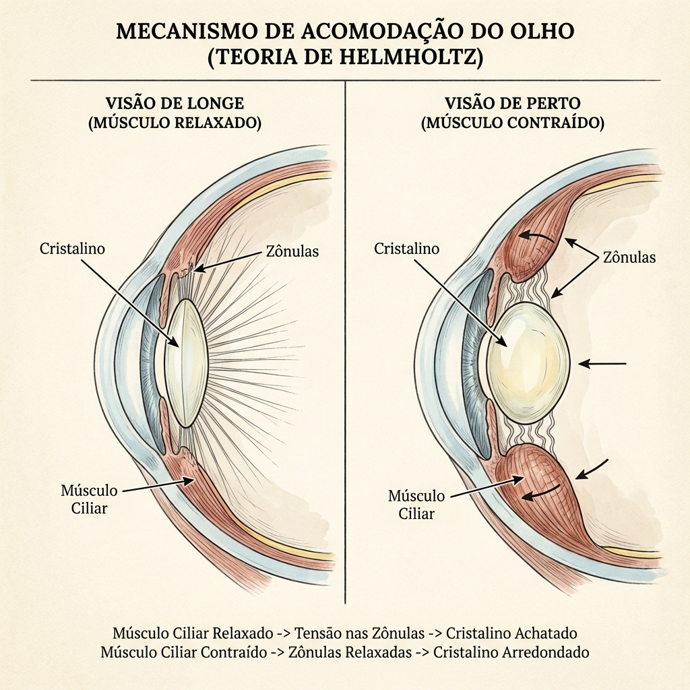
*Figura 1.1: Mecanismo de Acomodação segundo Helmholtz. Painel esquerdo: Visão de longe (músculo relaxado, zônulas tensas). Painel direito: Visão de perto (músculo contraído, zônulas relaxadas, cristalino arredondado).*

### 1.1.1. O Músculo Ciliar: O Motor Primário

O músculo ciliar representa o motor neuromuscular da acomodação. Anatomicamente, consiste em três orientações de fibras musculares:

- **Fibras Longitudinais (Brücke):** Inserem-se na malha trabecular e esporão escleral, fornecendo tração anterior.
- **Fibras Radiais:** Camada intermédia que fornece força centrípeta.
- **Fibras Circulares (Müller):** Fibras internas tipo esfíncter que constringem o anel ciliar.

Sob estimulação parassimpática (via núcleo de Edinger-Westphal e gânglio ciliar), o músculo ciliar contrai-se, movendo o corpo ciliar anterior e centripetamente. Esta contração liberta a tensão nas fibras zonulares.

**Insight Clínico Crítico:** Estudos de Glasser e Campbell demonstraram que o músculo ciliar retém sua capacidade contrátil muito além do início da presbiopia, sugerindo que a falha é primariamente lenticular, não muscular. [3] Este achado tem implicações profundas: estratégias cirúrgicas focadas no músculo ciliar (como procedimentos de expansão escleral) falham em abordar a fisiopatologia raiz.

### 1.1.2. A Zônula de Zinn: O Sistema de Suspensão e Transmissão de Força

O aparelho zonular consiste em fibras elásticas (fibrilina-1 e fibrilina-2) que conectam o corpo ciliar ao equador do cristalino. Estas fibras são classificadas em:

- **Zônulas Anteriores:** Inserem-se na cápsula anterior do cristalino
- **Zônulas Posteriores:** Inserem-se na cápsula posterior do cristalino
- **Zônulas Equatoriais:** Os suportes estruturais primários

O sistema zonular funciona como um mecanismo de transmissão de força bidirecional. Quando o músculo ciliar está relaxado, o recuo elástico da membrana de Bruch e coroide mantém tensão centrífuga nas zônulas, o que achata o cristalino. Inversamente, a contração do músculo ciliar liberta esta tensão, permitindo que o cristalino assuma uma forma mais esférica.

**Consideração Biomecânica:** Alterações relacionadas à idade na elasticidade zonular (expressão diminuída de fibrilina, aumento de cross-linking) contribuem para a redução na resposta acomodativa, embora este efeito seja secundário às alterações lenticulares. [4]

### 1.1.3. O Cristalino: O Elemento Óptico Bicoconvexo Dinâmico

O cristalino é o efetor final da acomodação. A sua estrutura consiste em:

- **Cápsula do Cristalino:** Uma membrana basal (10-15 μm anteriormente, 4-5 μm posteriormente) com propriedades elásticas que fornecem força de moldagem
- **Epitélio do Cristalino:** Camada celular da superfície anterior responsável pela produção de fibras
- **Córtex do Cristalino:** Fibras periféricas mais novas com organelas celulares preservadas
- **Núcleo do Cristalino:** Fibras centrais compactadas com densidade e índice de refração progressivamente aumentados

**Propriedades Ópticas:**
- Poder dióptrico total: ~20-22 D (representando aproximadamente um terço do poder refrativo total do olho)
- Amplitude acomodativa aos 10 anos: ~14 D
- Amplitude acomodativa aos 40 anos: ~6 D (limiar clínico)
- Amplitude acomodativa aos 60 anos: <1 D

> [!IMPORTANT]
> **Nota Crítica:** A amplitude de acomodação **não é um valor fixo**, mas uma **variável fisiológica dinâmica** que declina continuamente ao longo da vida, conforme descrito pela Curva de Donders (Seção 1.4). Os valores acima representam médias populacionais em idades específicas, com variação individual de ±1.0 a 2.0 D dependendo de fatores genéticos, ambientais e padrões de demanda visual. [11]

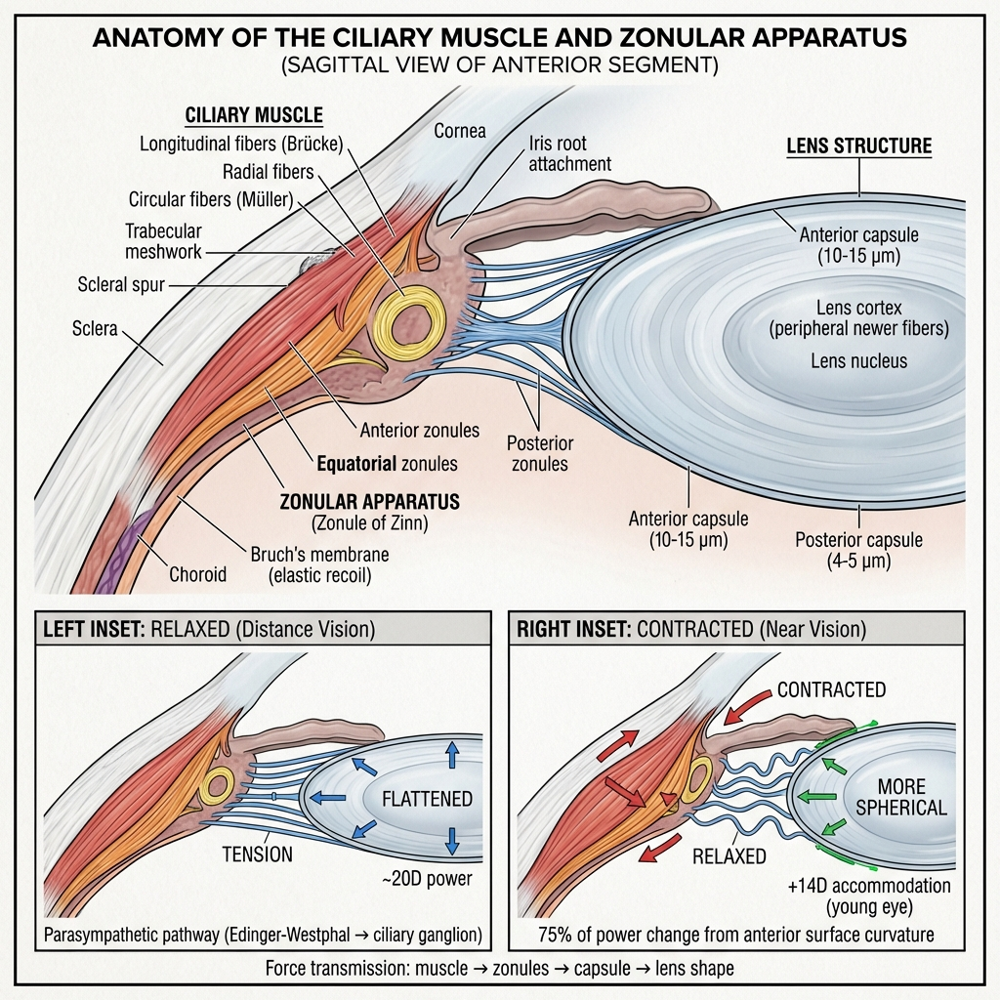
*Figura 1.1: Anatomia do aparelho acomodativo em corte sagital. **Painel Principal:** Estruturas anatômicas chave incluindo músculo ciliar (fibras longitudinais/radiais/circulares em vermelho/laranja/amarelo), aparelho zonular (fibras azuis) e cristalino (estrutura biconvexa). **Insets Esquerdo/Direito:** Comparação dos estados relaxado vs contraído mostrando mecanismo de Helmholtz. Note como a contração muscular libera tensão zonular, permitindo que a cápsula elástica molde o cristalino em forma mais esférica (+14D). A via parassimpá tica (Edinger-Westphal → gânglio ciliar) é destacada. Aproximadamente 75% da mudança de poder ocorre na superfície anterior do cristalino.*

---

## 1.2. Mecanismo de Acomodação: A Teoria de Helmholtz

A teoria capsular de Helmholtz (1855) permanece o modelo de consenso para a acomodação. [5] Esta teoria postula:

### Visão de Longe (Estado Não Acomodado):
1. Músculo ciliar relaxado
2. Fibras zonulares mantêm tensão radial
3. Cristalino assume configuração achatada, oblata
4. Curvatura da superfície anterior reduzida (poder dióptrico diminuído)
5. Diâmetro equatorial aumentado

### Visão de Perto (Estado Acomodado):
1. Músculo ciliar contrai (estimulação parassimpática)
2. Corpo ciliar move-se anterior e centripetamente
3. Tensão zonular é libertada
4. Cápsula elástica molda a substância do cristalino numa forma mais esférica
5. Curvatura da superfície anterior aumentada (contribuinte primário para o aumento de poder)
6. Espessura do cristalino aumentada (dimensão axial)
7. Movimento para frente da superfície anterior do cristalino (~0.3-0.6 mm)
8. Diâmetro equatorial diminuído

**Contribuição Quantitativa:**
Durante a acomodação máxima, aproximadamente 75% da mudança dióptrica ocorre na superfície anterior do cristalino, com os restantes 25% provenientes da superfície posterior e alterações na espessura axial. [6] Esta assimetria explica por que a patologia capsular anterior (como na síndrome de pseudoexfoliação) afeta desproporcionalmente a capacidade acomodativa.

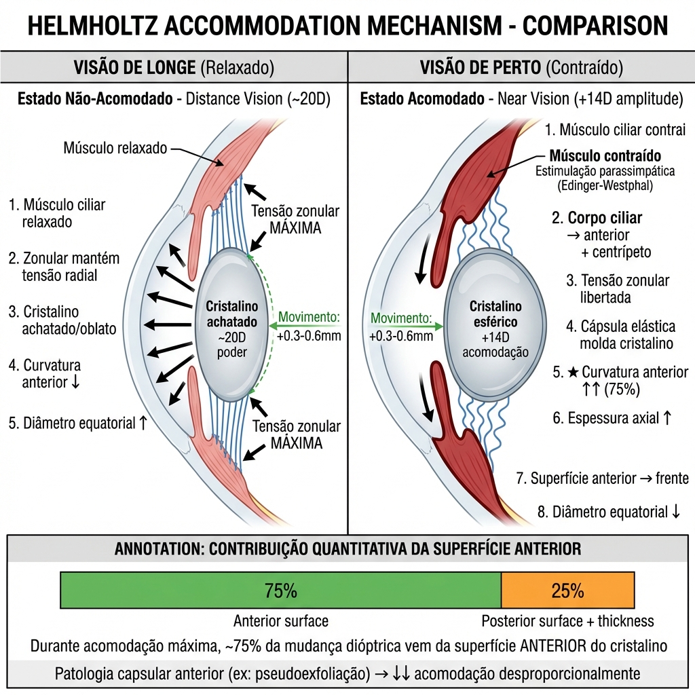
*Figura 1.2: Mecanismo de acomodação de Helmholtz. **Painel Esquerdo (Visão de Longe):** Estado não-acomodado mostrando músculo ciliar relaxado, zônulas sob tensão máxima e cristalino achatado (~20D). **Painel Direito (Visão de Perto):** Estado acomodado com músculo contraído (estimulação parassimpática via Edinger-Westphal), zônulas liberadas e cristalino esférico (+14D). Sequências numeradas (1-5 e 1-8) detalham cada etapa do processo. Anotação inferior destaca que 75% da mudança dióptrica provém da superfície ANTERIOR, explicando vulnerabilidade à patologia capsular anterior.*

### Teorias Alternativas (Contexto Histórico)

**Teoria de Schachar (Controversa):**
Ronald Schachar propôs um mecanismo alternativo sugerindo que a tensão zonular equatorial aumenta durante a acomodação, causando aplanamento central e encurvamento periférico. Esta teoria contradiz Helmholtz e não foi validada por estudos modernos de imagem (OCT, Scheimpflug). Os procedimentos cirúrgicos baseados nesta teoria (bandas de expansão escleral) mostraram resultados inconsistentes e não são considerados baseados em evidência. [7]

---

## 1.3. Fisiopatologia: Teorias da Perda Acomodativa

Embora múltiplas teorias tenham sido propostas para explicar a presbiopia, o consenso científico atual apoia a **Teoria Lenticular** como o mecanismo primário.

### 1.3.1. A Teoria Lenticular (Mecanismo Primário)

Esta teoria atribui a presbiopia a alterações intrínsecas dentro do próprio cristalino:

#### Esclerose Nuclear e Elasticidade Diminuída

Com o envelhecimento, há um aumento progressivo na densidade e rigidez das fibras nucleares. Processos fisiopatológicos chave incluem:

- **Camadas Celulares Contínuas:** O cristalino cresce ao longo da vida adicionando novas fibras corticais, comprimindo as fibras mais antigas em direção ao núcleo. Aos 60 anos, o cristalino tem aproximadamente 2.200 camadas de fibras corticais comparado a ~1.500 aos 10 anos.
  
- **Agregação Proteica:** Modificações nas proteínas cristalinas relacionadas à idade (oxidação, glicação, cross-linking) levam a agregados de peso molecular aumentado. Estes agregados reduzem a maleabilidade do cristalino. [8]

- **Perda do Índice de Refração Gradiente (GRIN):** O cristalino normal tem um índice de refração gradiente do córtex (n=1.37) para o núcleo (n=1.41). O envelhecimento perturba este gradiente, afetando a qualidade óptica e a eficiência acomodativa.

- **Rigidez Biomecânica:** Estudos de Heys e Truscott demonstraram um aumento massivo (exponencial) na rigidez nuclear do cristalino com a idade. O módulo elástico do núcleo aumenta de ~200 Pa aos 20 anos para >30.000 Pa aos 60 anos. [9] Este endurecimento dramático torna a substância do cristalino resistente às forças de moldagem capsular, mesmo quando a tensão zonular é totalmente libertada.

**Implicação Clínica:**
Como o cristalino perde plasticidade e não o músculo ciliar que perde contratilidade, abordagens farmacológicas visando a estimulação do músculo ciliar (parassimpaticomiméticos) têm eficácia limitada. O cristalino simplesmente não consegue deformar-se adequadamente apesar da força muscular aumentada.

#### Alterações Capsulares

A própria cápsula do cristalino sofre modificações relacionadas à idade:

- **Espessura Aumentada:** A cápsula anterior engrossa de ~11 μm ao nascimento para ~15 μm aos 50 anos, reduzindo a sua força de moldagem.
- **Elasticidade Diminuída:** Cross-linking de colagénio IV e laminina capsular reduz a recuperação elástica.
- **Variação Regional:** A cápsula equatorial mostra as maiores alterações relacionadas à idade, contribuindo potencialmente para a distribuição de força alterada.

**Evidência Contra Falha Puramente Capsular:**
Se a elasticidade capsular fosse o problema primário, procedimentos de capsulotomia deveriam restaurar a acomodação, o que não acontece. Isto apoia a teoria nuclear como dominante.

#### Alterações Geométricas: Crescimento do Cristalino e Expansão Equatorial

O cristalino humano exibe crescimento contínuo ao longo da vida:

- **Diâmetro Equatorial:** Aumenta de ~6.5 mm ao nascimento para ~9.5 mm aos 80 anos
- **Espessura Axial:** Aumenta de ~3.5 mm aos 20 anos para ~5.0 mm aos 70 anos
- **Posição da Cápsula Anterior:** Move-se progressivamente para frente, reduzindo a profundidade da câmara anterior (~0.01-0.02 mm por ano)

Este crescimento contínuo tem dois efeitos:

1. **Hipótese de Folga Zonular:** O diâmetro equatorial aumentado pode reduzir a tensão zonular basal, diminuindo a amplitude de movimento disponível durante a acomodação.
2. **Restrição Geométrica:** O cristalino maior e mais esférico tem menos capacidade para mudança de forma adicional dentro do diâmetro fixo do anel ciliar.

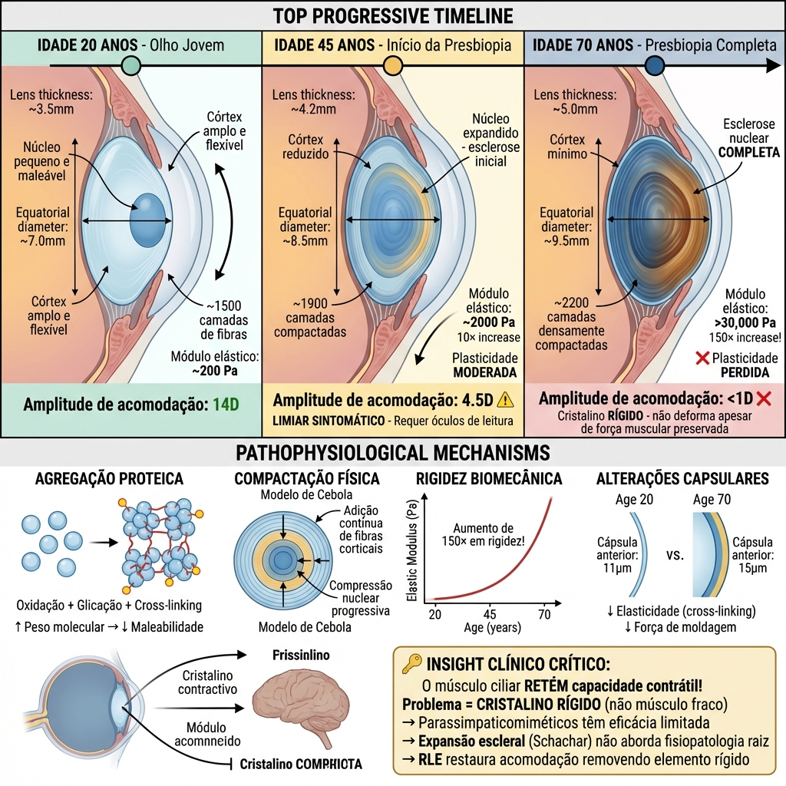
*Figura 1.2: Progressão temporal da teoria lenticular da presbiopia. **Timeline Superior:** Três estágios mostrando transformação do cristalino dos 20 aos 70 anos. Idade 20: Córtex amplo, núcleo pequeno maleável, módulo elástico 200 Pa, amplitude 14D. Idade 45: Esclerose nuclear inicial, módulo 2000 Pa (10× aumento), amplitude 4.5D (limiar sintomático). Idade 70: Esclerose completa, módulo >30,000 Pa (150× aumento), amplitude <1D, cristalino rígido e não-deformável. **Painéis Inferiores:** Quatro mecanismos fisiopatológicos chave: agregação proteica, compactação física (modelo de cebola), rigidez biomecânica (gráfico exponencial) e alterações capsulares. Insight clínico destaca que músculo ciliar RETÉM contratilidade, identificando cristalino rígido como problema primário.*

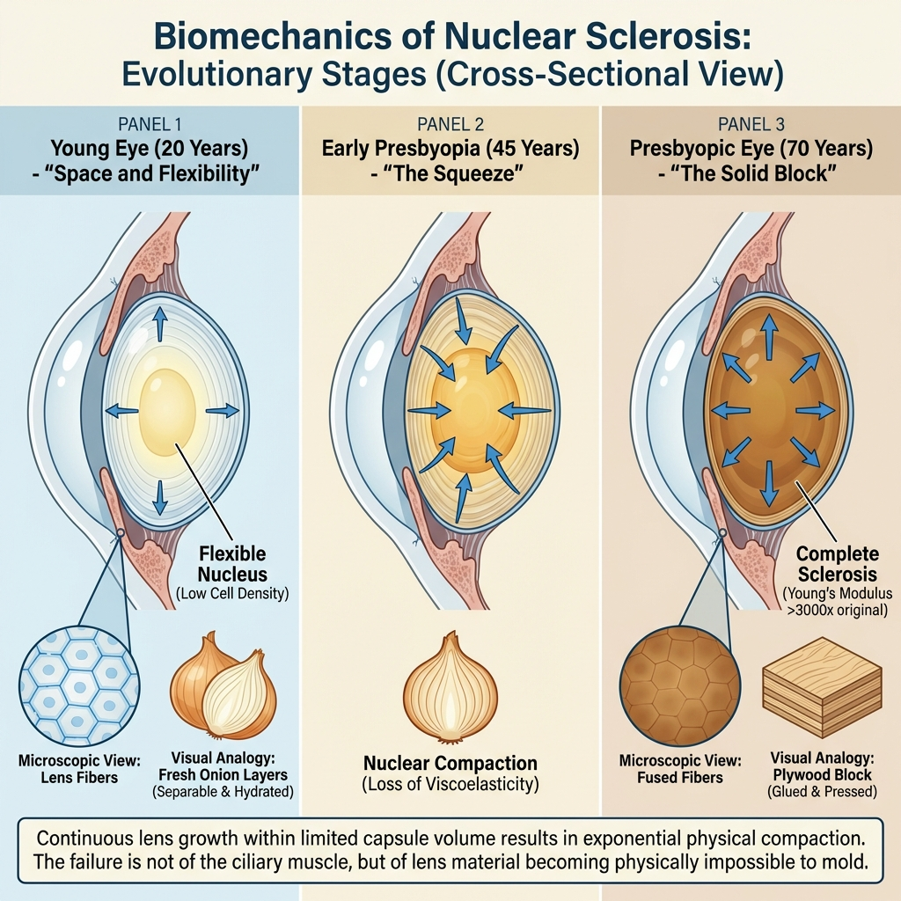
*Figura 1.7: O "Modelo de Cebola" demonstrando a progressão da esclerose nuclear. Painel Esquerdo: Olho jovem (20 anos) com núcleo flexível e córtex amplo. Painel Central: Início da presbiopia (45 anos) com compactação nuclear progressiva. Painel Direito: Olho presbita (70 anos) com esclerose completa e rigidez aumentada em 3000×. A compactação física do cristalino dentro da cápsula de volume limitado é o mecanismo primário da presbiopia.*

### 1.3.2. A Teoria Geométrica (Contribuinte Secundário)

Proposta por Coleman, esta teoria sugere que alterações relacionadas à idade no vítreo e coroide alteram as relações de pressão hidrostática que normalmente assistem a acomodação. Embora estudos de imagem não tenham validado totalmente isto como um mecanismo primário, pode contribuir como um fator menor. [10]

### 1.3.3. A Teoria Extralenticular (Papel Mínimo)

Isto engloba alterações no músculo ciliar, zônulas e coroide. Como mencionado, estas estruturas retêm função, tornando este um contribuinte menor, na melhor das hipóteses.

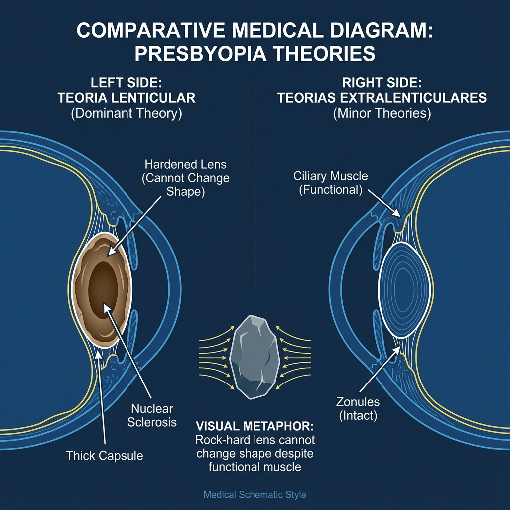
*Figura 1.3: Comparação conceptual. Esquerda: Teoria Lenticular de Helmholtz (Consenso - Esclerose Nuclear). Direita: Teorias Extralenticulares (Controversas - Mudanças Geométricas).*

---

## 1.4. A Curva de Duane e Progressão Clínica

> [!IMPORTANT]
> **A Amplitude de Acomodação como Variável Dinâmica:** 
> A amplitude de acomodação não é um valor constante, mas uma **curva de declínio fisiológico** descrita por Alexander Duane em 1912 e refinada por Hofstetter. Qualquer valor isolado (como 4,5 D) representa apenas **um ponto específico dessa curva** — neste caso, aproximadamente 43-44 anos de idade. O valor real de cada paciente deve ser medido objetivamente através de métodos como o teste de acomodação push-up/push-down ou análise de qualidade óptica (OQAS). A variabilidade interindividual pode atingir ±2,0 D na mesma faixa etária. [11,14]

**Métodos de Medição Objetiva da Amplitude de Acomodação:**

1. **Push-Up Test (Teste de Aproximação):** 
  Método clássico e prático. O paciente fixa um alvo de leitura (texto N5 ou 0.4M) enquanto este é aproximado progressivamente até que o texto torne-se borrado de forma irreversível. A distância em centímetros onde ocorre o blur é convertida em dioptrias pela fórmula: Amplitude (D) = 100/distância (cm). Limitação: depende da cooperação do paciente e pode superestimar a amplitude em ~1.0 D devido ao esforço acomodativo máximo versus uso confortável. [14]

2. **OQAS (Optical Quality Analysis System):** 
  Sistema objetivo baseado em tecnologia de duplo-passo (double-pass) que analisa a qualidade óptica do olho através da Point Spread Function (PSF). Fornece métricas objetivas incluindo OSI (Objective Scatter Index), MTF (Modulation Transfer Function) e pseudo-acomodação residual. Vantagem: independente da resposta subjetiva do paciente, permitindo quantificação precisa da capacidade funcional de foco. [15]

A perda de acomodação segue um padrão previsível, classicamente mapeado por Duane (1912) e revisto por Hofstetter. [11]

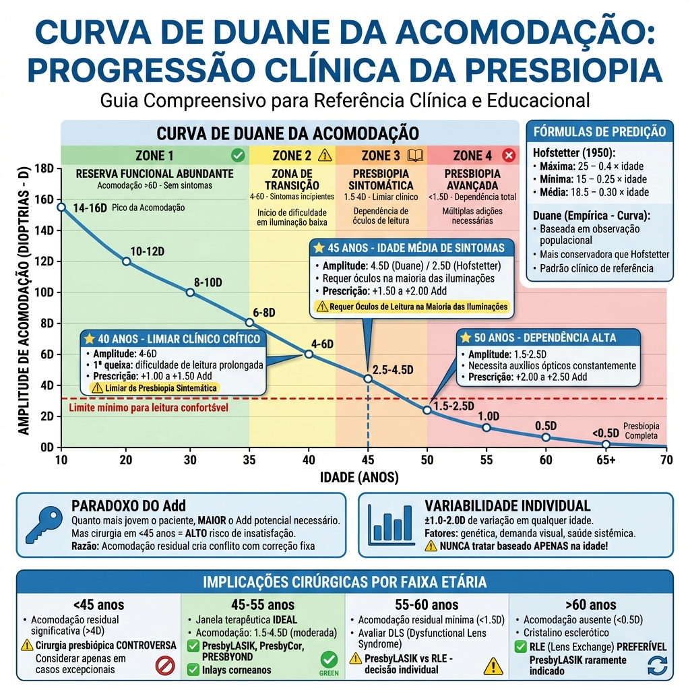
*Figura 1.4: Curva de Duane mostrando progressão clínica completa da presbiopia. **Gráfico Central:** Curva de declínio da amplitude de acomodação (10-70 anos) com 4 zonas coloridas - Verde (Reserva Abundante >6D), Amarela (Transição 4-6D), Laranja (Sintomática 1.5-4D), Vermelha (Avançada <1.5D). **Marcos Clínicos:** Três milestones destacados aos 40, 45 e 50 anos com amplitudes esperadas e prescrições ópticas típicas. **Painel Superior Direito:** Fórmulas de Hofstetter (máxima, mínima, média) e comparação com Duane empírica. **Painel Inferior:** Implicações cirúrgicas por faixa etária - cirurgia controversa <45 anos, janela ideal 45-55 anos (PresbyLASIK/PresbyCor), decisão individualizada 55-60 anos, RLE preferível >60 anos. **Insights Chave:** Paradoxo do Add (pacientes jovens necessitam mais correção mas têm maior risco de insatisfação) e variabilidade individual (±1-2D - nunca tratar baseado APENAS na idade).*

### Fórmulas de Hofstetter

**Amplitude Máxima de Acomodação:**
$$A_{max} = 25 - 0.4 \times \text{Idade}$$

**Amplitude Mínima de Acomodação:**
$$A_{min} = 15 - 0.25 \times \text{Idade}$$

**Amplitude Média:**
$$A_{avg} = 18.5 - 0.3 \times \text{Idade}$$

> [!WARNING]
> **Variação Geográfica e Onset Precoce de Presbiopia: Uma Realidade Tropical** 
> 
> **Importante para Cirurgiões no Brasil e Regiões Tropicais:**
> 
> As curvas de Duane (1912) e as fórmulas de Hofstetter (1950) foram derivadas de populações predominantemente caucasianas residentes em latitudes temperadas (Europa Ocidental e América do Norte, 40-55° latitude). **Estudos epidemiológicos recentes demonstram que a presbiopia apresenta onset SIGNIFICATIVAMENTE mais precoce em regiões tropicais e equatoriais** devido à exposição cumulativa aumentada à radiação ultravioleta (UV) e temperaturas ambiente elevadas. [16,17]
>
> **Dados Comparativos por Latitude:**
> - **Índia** (10-30° latitude): Onset médio aos **37 anos** [16]
> - **Brasil** (regiões Norte/Nordeste, 0-15° latitude): Onset reportado entre **38-40 anos** [17]
> - **Inglaterra** (51-54° latitude): Onset médio aos **43 anos** [16]
> - **Escandinávia** (>55° latitude): Onset aos **44-45 anos** [16]
>
> **Mecanismo Fisiopatológico:** 
> A radiação UV-B (280-315 nm) e radiação infravermelha (calor) penetram o cristalino, induzindo estresse oxidativo crônico. Este processo acelera:
> 1. Agregação proteica prematura (cristalinas α, β, γ)
> 2. Cross-linking oxidativo precoce das fibras lenticulares
> 3. Perda antecipada da elasticidade nuclear
> 4. Barreira química precoce que impede antioxidantes endógenos de alcançar células lenticulares [16,17]
>
> O envelhecimento lenticular em regiões tropicais é equivalente a **viver 5-7 anos a mais** em termos de exposição cumulativa ao UV comparado a populações temperadas.
>
> **Implicações Clínicas Práticas para o Brasil:**
> 1. **Ajustar Janela Terapêutica:** Considerar cirurgia presbiópica a partir de **40 anos** (vs. 45 anos em literaturas internacionais) em pacientes sintomáticos brasileiros, especialmente em regiões de alta insolação (Nordeste, Centro-Oeste, Norte).
> 2. **Medição Obrigatória:** NUNCA assumir amplitude acomodativa baseada APENAS na idade. Sempre medir objetivamente (push-up test, OQAS, aberrometria).
> 3. **Aconselhamento Preventivo:** Enfatizar proteção UV (óculos de sol com bloqueio UVA/UVB 100%) como medida preventiva para retardar presbiopia em pacientes jovens (<35 anos).
> 4. **Screening Diferenciado:** População brasileira urbana com alta exposição solar ocupacional (trabalhadores de construção, agricultura, atividades ao ar livre) podem apresentar presbiopia sintomática já aos **38-39 anos**.
>
> **Conclusão:** As curvas de Duane e Hofstetter permanecem **ferramentas de referência válidas**, mas devem ser interpretadas como **limites superiores** em populações tropicais. O cirurgião brasileiro deve estar atento a sintomas presbiópicos 3-5 anos mais cedo do que descrito em literatura norte-americana/europeia.

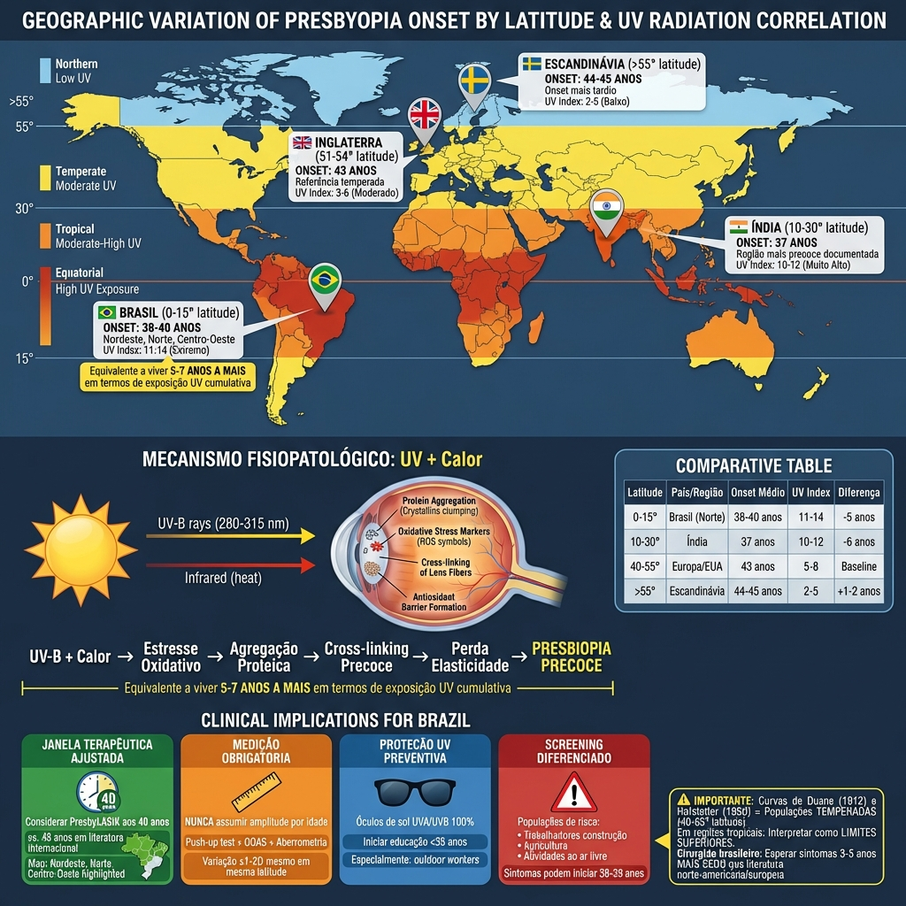
*Figura 1.5: Variação geográfica global do onset de presbiopia correlacionada com exposição UV por latitude. **Mapa Superior:** Zonas coloridas por latitude (Equatorial 0-15° vermelho, Tropical 15-30° laranja, Temperada 30-55° amarelo, Norte >55° azul) com marcadores para Brasil (38-40 anos), Índia (37 anos), Inglaterra (43 anos) e Escandinávia (44-45 anos). **Painel Central:** Mecanismo fisiopatológico mostrando UV-B + calor induzindo estresse oxidativo → agregação proteica → cross-linking precoce → perda de elasticidade (equivalente a 5-7 anos adicionais de envelhecimento lenticular). **Painéis Inferiores:** Quatro implicações clínicas para Brasil - janela terapêutica ajustada (40 vs 45 anos), medição obrigatória (nunca assumir por idade), proteção UV preventiva e screening diferenciado para populações de alta exposição solar. **Tabela Comparativa:** Dados quantitativos por latitude mostrando diferença de -5 a -6 anos em regiões tropicais. **Anotação Destacada:** Curvas de Duane/Hofstetter são baseadas em populações temperadas e devem ser interpretadas como limites superiores em regiões tropicais.*

### Marcos Relacionados à Idade

| Idade (Anos) | Amplitude Média (D) | Significância Clínica |
|-------------|----------------------|----------------------|
| 10 | 14.0 | Reserva fisiológica máxima |
| 20 | 12.0 | Acomodação funcional total |
| 30 | 9.0 | Declínio subquínico começa |
| **38-40** | **~7.0** | **Onset precoce em regiões tropicais (Brasil, Índia)** |
| 40 | 6.0 | **Limiar de presbiopia sintomática (populações temperadas)** |
| 45 | 4.5 | **Ponto de transição DLS-I** (fadiga visual, leitura ~22 cm) |
| 50 | 2.5 | Dependência alta de auxílios ópticos |
| 60 | <1.0 | **Presbiopia absoluta** (nenhuma acomodação residual) |
| 70+ | ~0.5 | Falha acomodativa completa |

> [!NOTE]
> **Interpretação Clínica do Valor 4,5 D:** 
> Um paciente com amplitude residual de 4,5 D possui ponto próximo a aproximadamente 22 cm (1/4,5 = 0,22 m). Contudo, para leitura **confortável e sustentada**, o olho deve utilizar apenas 50-67% de sua capacidade máxima, portanto este paciente já apresenta **astenopia** (fadiga visual) em tarefas prolongadas, marcando o início da **Síndrome do Cristalino Disfuncional Estágio I** (DLS-I). O valor de 4,5 D **não deve ser assumido** como padrão universal aos 45 anos — a amplitude real deve ser medida individualmente. [12,14]

### Sintomatologia Clínica por Década

**Presbiopia Precoce (40-45 anos):**
- Dificuldade com tarefas prolongadas de perto
- Necessidade de iluminação aumentada ao ler
- "Síndrome dos braços curtos" (distância de trabalho aumentada)
- Sintomas piores em iluminação fraca (dilatação pupilar elimina efeito pinhole)
- Astenopia (fadiga ocular, dor de cabeça) após trabalho de perto

**Presbiopia Moderada (45-55 anos):**
- Necessidade constante de óculos de leitura
- Dificuldade com tarefas intermédias (trabalho no computador a ~60-80 cm)
- Dependência de lentes bifocais/progressivas

**Presbiopia Absoluta (>55 anos):**
- Nenhuma acomodação funcional residual
- Necessidade de trifocais para longe, intermédio e perto
- Estratégias cirúrgicas devem assumir reserva acomodativa zero

### Implicação Cirúrgica da Curva de Duane

Ao operar um paciente de 45 anos — tipicamente com amplitude residual de aproximadamente 4,0 a 5,0 D segundo a Curva de Duane, mas que **deve ser medida pré-operatoriamente** — o cirurgião pode alavancar a capacidade acomodativa restante para suplementar a profundidade de campo induzida cirurgicamente. Aos 55 anos, a estratégia deve assumir total dependência dos mecanismos pseudo-acomodativos (profundidade de campo por aberração esférica, micro-monovisão) criados pelo procedimento cirúrgico.

**Planeamento de Retoque:**
Para um paciente de PresbyLASIK tratado inicialmente aos 48 anos, que retorna aos 58 anos queixando-se de visão de perto reduzida, o alvo refrativo deve ser ajustado mais agressivamente (potencialmente -1.50 D a -1.75 D no olho não dominante) para compensar a perda completa da acomodação residual que ocorreu na década interveniente.

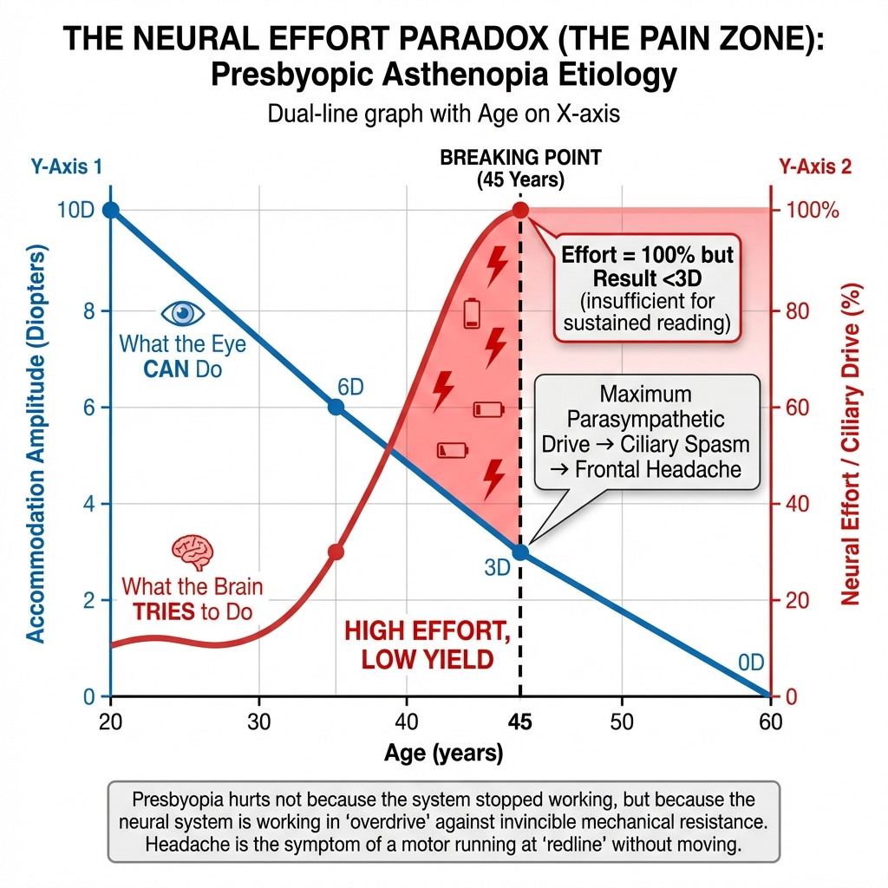
*Figura 1.8: O Paradoxo do Esforço Neural na presbiopia. O gráfico mostra a divergência dramática entre a capacidade mecânica declinante do cristalino (curva azul) e o esforço neural crescente (curva vermelha), atingindo o pico aos 45 anos. A "Zona da Dor" (40-48 anos, área sombreada em vermelho) representa o período de alto esforço neural contra resistência mecânica invencível, explicando a astenopia e cefaleia características da presbiopia incipiente.*

---

## 1.5. Classificação da Síndrome do Cristalino Disfuncional (DLS)

O conceito moderno de Síndrome do Cristalino Disfuncional (Dysfunctional Lens Syndrome - DLS), popularizado por Waring IV e Rocha, propõe uma classificação funcional baseada na qualidade óptica em vez de meramente na opacidade catarata. [12,13]

### Estágio 1: Disfunção Precoce do Cristalino (Idades 40-50)

**Características:**
- Perda de acomodação (presbiopia)
- Cristalino transparente (LOCS III Grau 0-1)
- Aberrações internas mínimas (HOA total ocular - HOA corneana <0.30 μm)
- Sensibilidade ao contraste preservada (>1.5 log units a 12 cpd)
- Dispersão de luz normal (Straylight <1.2 log units)

**Recomendação Cirúrgica:**
**Correção Corneana da Presbiopia** (PresbyLASIK, Custom-Q, PRESBYOND)

**Racional:**
O cristalino retém excelente qualidade óptica e dispersão mínima. Substituir um cristalino claro é uma intervenção agressiva com riscos cirúrgicos (descolamento de retina, endoftalmite) que não são justificados quando a modulação corneana pode fornecer visão funcional.

### Estágio 2: Disfunção Moderada do Cristalino (Idades 50-65)

**Características:**
- Falha acomodativa completa
- Dispersão de luz precoce (Straylight 1.2-1.4 log units)
- Aberrações internas aumentadas (particularmente a aberração esférica interna torna-se crescentemente positiva)
- Cor nuclear leve (LOCS III NO2, NC2)
- Sensibilidade ao contraste reduzida (<1.3 log units a 12 cpd)
- Glare e halos (especialmente condução noturna)

**Recomendação Cirúrgica:**
**Decisão de Zona Cinzenta**

A escolha entre correção corneana e troca de lente refrativa (RLE) depende de múltiplos fatores:

**Favorecer Abordagem Corneana se:**
- Idade <55 anos
- Hipermetropia baixa a moderada (+1.00 a +3.00 D)
- Paciente prioriza evitar cirurgia intraocular
- Espessura corneana e biomecânica adequadas
- Sem queixas significativas de glare

**Favorecer RLE se:**
- Hipermetropia alta (>+3.50 D) – reduz profundidade de ablação corneana
- Glare/halos significativos impactando qualidade de vida
- Catarata precoce com sintomas visuais além da presbiopia
- Paciente deseja solução "definitiva" (eliminando cirurgia de catarata futura)
- Risco de fechamento angular (íris em platô, ângulos estreitos) – remoção do cristalino aprofunda câmara anterior

### Estágio 3: Disfunção Avançada do Cristalino (Catarata)

**Características:**
- Opacidade clinicamente significativa (LOCS III ≥3 em qualquer parâmetro)
- Redução da acuidade visual não corrigível com refração
- Dispersão de luz significativa (Straylight >1.4 log units)
- Aberrações internas aumentadas (HOA >0.50 μm)
- Prejuízo funcional (dificuldade de leitura mesmo com adição, prejuízo na condução noturna)

**Recomendação Cirúrgica:**
**Extração de Catarata com LIO Multifocal/EDOF**

**Racional:**
O cristalino é a fonte primária de degradação óptica. A correção corneana não consegue superar a dispersão e aberrações lenticulares. A substituição do cristalino aborda cirurgicamente tanto a presbiopia quanto a catarata.

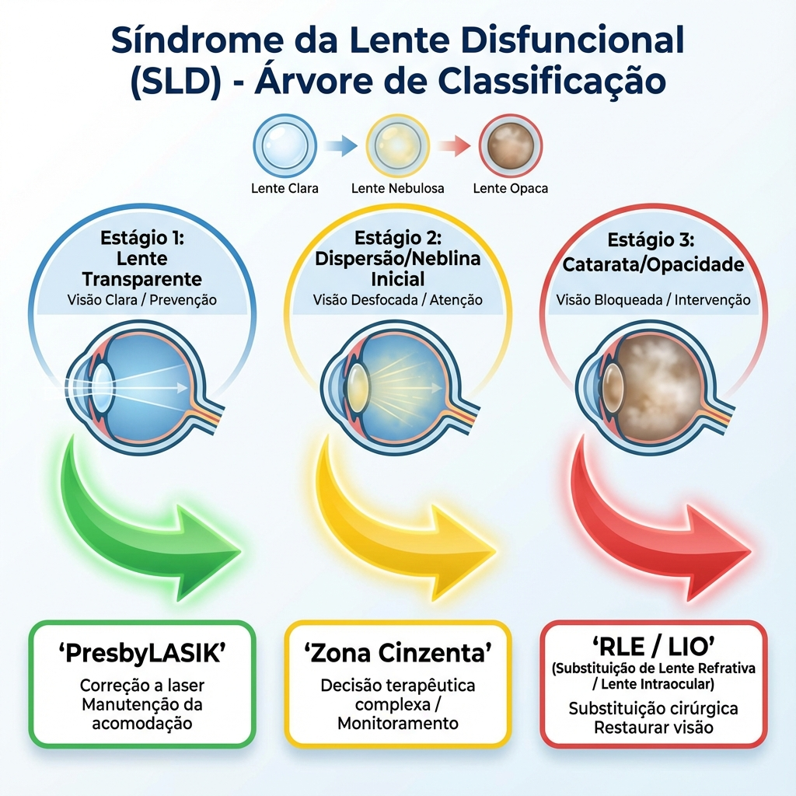
*Figura 1.4: Árvore de decisão cirúrgica baseada no Estadiamento da Síndrome do Cristalino Disfuncional (DLS).*

### Ferramentas de Avaliação Objetiva para Estadiamento DLS

Ferramentas diagnósticas modernas permitem estadiamento quantitativo:

1. **Densitometria Scheimpflug (Pentacam):**
  - Unidades de densidade do cristalino (densidade nuclear média >18% sugere Estágio 2-3)
  
2. **Aberrometria de Frente de Onda (iTrace):**
  - Comparar aberrações totais oculares vs. aberrações corneanas
  - Aberração interna >0.30 μm sugere contribuição lenticular
  
3. **Índice de Dispersão Objetiva (OSI) (HD Analyzer):**
  - OSI <1.0 = Cristalino claro (Estágio 1)
  - OSI 1.0-3.0 = Disfunção precoce (Estágio 2)
  - OSI >3.0 = Dispersão significativa (Estágio 3) [16,17]
  
4. **Função de Sensibilidade ao Contraste (CSV-1000):**
  - Redução em frequências espaciais altas (12-18 cpd) indica dispersão lenticular

---

## 1.6. Erro Refrativo e Presbiopia: Interações Clínicas

A experiência da presbiopia varia dramaticamente baseada no erro refrativo pré-existente.

### Miopia e Presbiopia

**Compensação Natural:**
Míopes possuem uma vantagem inerente: o seu ponto próximo não corrigido é mais perto do que emétropes. Um míope de -2.00 D tem um ponto próximo a ~50 cm sem correção.

**Paradoxo Clínico:**
Míopes frequentemente adiam o tratamento da presbiopia porque podem simplesmente remover seus óculos de longe para ler. Contudo, isto cria desvantagens ópticas:
- Perda de visão binocular se apenas um olho não for corrigido
- Distância de trabalho subótima (muito perto, causando tensão postural)
- Perda de visão intermédia

**Desafio Cirúrgico:**
Ao tratar míopes presbitas com cirurgia corneana, o desafio é preservar a sua vantagem natural de visão de perto. Estratégias incluem:
- **Monovisão Modificada:** Corrigir olho dominante para plano, deixar olho não dominante a -0.75 a -1.25 D
- **PresbyLASIK com Alvo de Distância Reduzido:** Aceitar ligeira miopia residual (-0.50 D) em ambos os olhos para manter algum foco natural de perto

### Hipermetropia e Presbiopia

**Efeito Composto:**
Hipermétropes experimentam um início mais cedo e mais abrupto de sintomas presbiópicos porque:
- Devem acomodar mesmo para visão de longe (se não corrigidos)
- O seu requisito de adição de perto é efetivamente maior (correção de longe + adição de perto)
- Exemplo: Um hipermétrope de +2.00 D aos 45 anos precisa de +2.00 D para longe e um adicional de +1.50 D para perto = total +3.50 D de poder de lente para leitura

**Vantagem Cirúrgica:**
Hipermétropes são os candidatos ideais para correção corneana presbiópica porque a cirurgia aborda ambos os problemas simultaneamente:
- Perfil de ablação naturalmente incurva a córnea central (corrige hipermetropia)
- O mesmo incurvamento fornece a adição de perto (correção da presbiopia)
- Taxas de satisfação altas (>90% na literatura)

### Emetropia e Presbiopia

**Desafio Máximo:**
Emétropes representam os candidatos cirúrgicos presbiópicos de maior risco porque:
- Excelente visão de longe cria altas expectativas
- Qualquer perda de qualidade visual de longe é perceptível e mal tolerada
- Nenhum "erro" refrativo para "consertar" – apenas presbiopia

**Abordagem Estratégica:**
- Alvos conservadores (indução mínima de aberração esférica)
- Micro-monovisão preferida sobre perfis multifocais completos
- Aconselhamento pré-operatório extensivo sobre compromissos
- Considerar soluções baseadas em lentes (LIO fácica ou RLE precoce) se o paciente não estiver disposto a aceitar qualquer compromisso na visão de longe

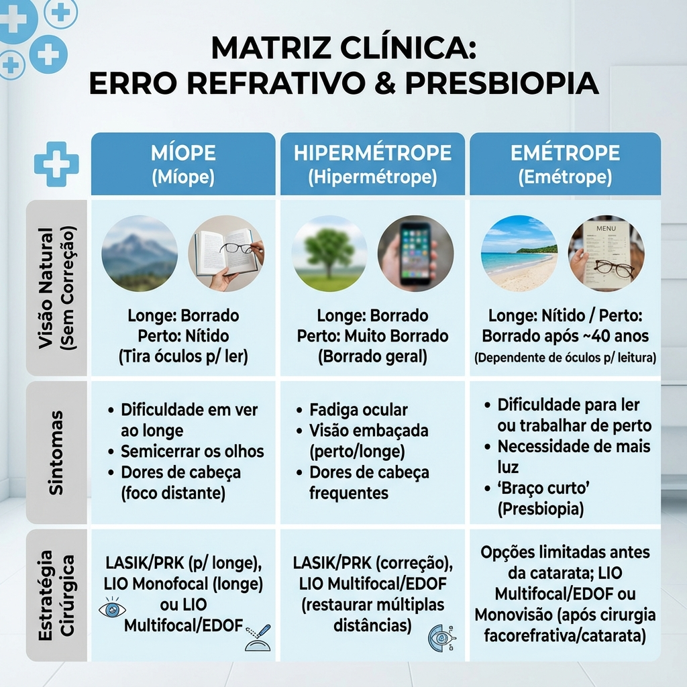
*Figura 1.5: Matriz de decisão clínica correlacionando o erro refrativo prévio com a estratégia de correção da presbiopia e sintomas esperados.*

---

## 1.7. Presbiopia e Dinâmica Pupilar

O tamanho da pupila muda com a idade e condições de iluminação, afetando profundamente a função visual na presbiopia.

### Alterações Pupilares Relacionadas à Idade (Miose Senil)

O diâmetro pupilar normal diminui com a idade:

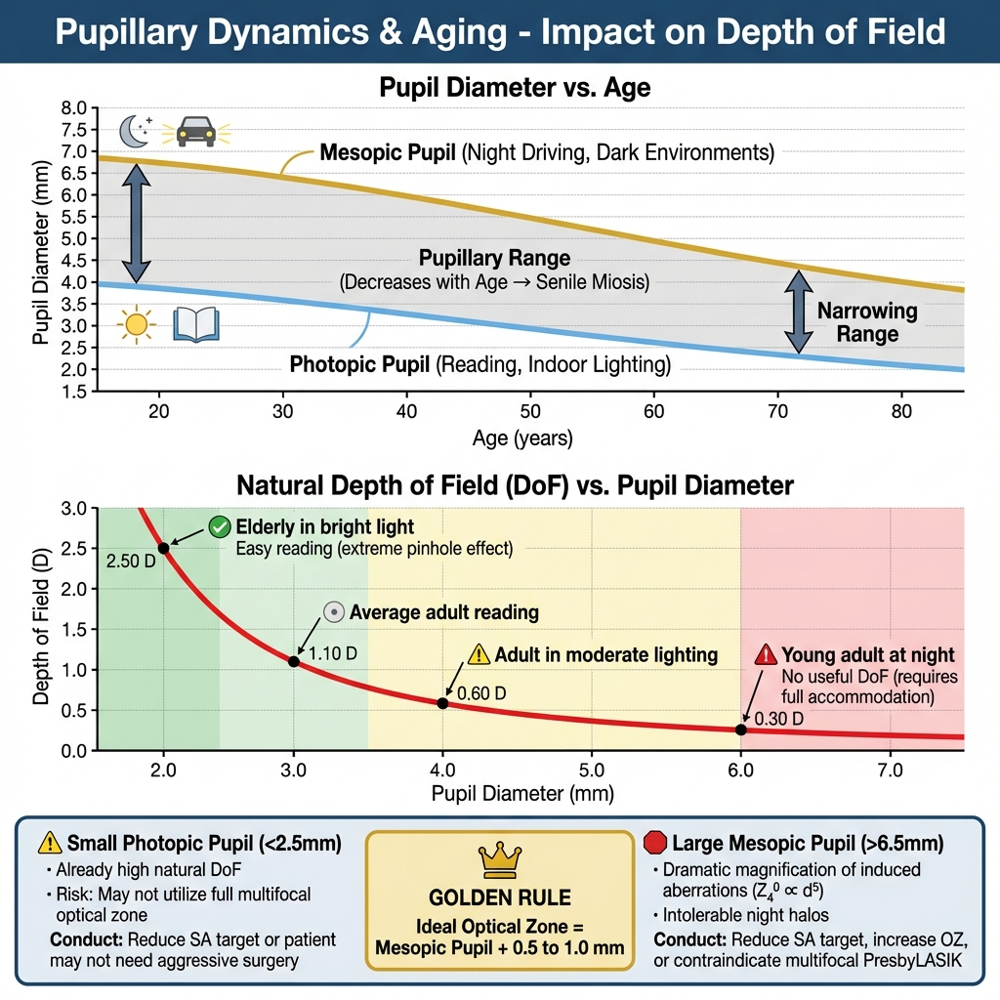
*Figura 1.6: Impacto da senescência na dinâmica pupilar. Esquerda: Olho jovem (pupila grande, menor profundidade de campo). Direita: Olho idoso (miose senil, efeito pinhole natural que aumenta a profundidade de campo).*

| Idade (Anos) | Diâmetro Fotópico (Luz Brilhante) | Diâmetro Mesópico (Luz Fraca) |
|-------------|----------------------------------|------------------------------|
| 20-30 | 3.0-4.0 mm | 6.0-7.0 mm |
| 40-50 | 2.5-3.5 mm | 5.0-6.0 mm |
| 60-70 | 2.0-3.0 mm | 4.0-5.0 mm |
| 80+ | 1.5-2.5 mm | 3.0-4.0 mm |

**Mecanismo:**
Responsividade reduzida do músculo esfíncter da íris e rigidez aumentada da íris devido a cross-linking de colagénio e densidade de inervação neural diminuída.

### Implicações Ópticas para Cirurgia de Presbiopia

**Efeito Pinhole (Auxílio Natural de Visão de Perto):**
Pupilas pequenas aumentam a profundidade de campo bloqueando raios aberrados periféricos, melhorando a visão de perto. É por isso que presbitas relatam melhor leitura em luz brilhante (miose) versus luz fraca (midríase).

**Interação com Perfil Cirúrgico:**
- **Perfis Centrais Multifocais (PresbyMAX, SUPRACOR):** Dependem da miose fotópica para direcionar luz através da zona de perto central
- **Perfis Asféricos (Custom-Q, PRESBYOND):** Desempenho varia com tamanho pupilar; pupilas maiores aumentam o efeito de aberração esférica mas também aumentam halos

**Avaliação Pupilar Pré-Operatória:**
Medir tanto o diâmetro pupilar fotópico quanto mesópico é obrigatório:
- **Pupila Fotópica Pequena (<2.5 mm):** Pode não utilizar zona óptica completa; risco de supercorreção
- **Pupila Mesópica Grande (>6.5 mm):** Alto risco de halos noturnos com qualquer perfil presbiópico; considerar alvos de asfericidade reduzida ou monovisão

---

## 1.8. Abordagens Farmacológicas para Presbiopia (Visão Geral Breve)

Embora a correção cirúrgica seja o foco deste texto, entender as tentativas farmacológicas fornece contexto para suas limitações.

### Agentes Parassimpaticomiméticos (Pilocarpina)

**Mecanismo:**
Estimular a contração do músculo ciliar e induzir miose (efeito pinhole para profundidade de campo).

**Limitação:**
Como estabelecido, o músculo ciliar retém função, mas o cristalino não consegue deformar-se. O benefício primário é o efeito pinhole da miose, não verdadeira acomodação. Efeitos colaterais significativos incluem dor de cabeça, visão escurecida e miopia aumentada.

### Agentes de Amolecimento do Cristalino (Experimental)

**Conceito:**
Agentes químicos para romper cross-links de proteínas do cristalino e restaurar elasticidade.

**Status:**
Pesquisa de fase inicial; sem produtos clinicamente viáveis. Desafios significativos incluem biodisponibilidade ocular e potenciais efeitos cataratogênicos.

### Futuro: Restauração da Acomodação

A verdadeira restauração da acomodação exigiria:
1. Substituição da substância do cristalino por um material deformável (ainda teórico)
2. LIOs com capacidade de acomodação (modelos atuais mostram <1.5 D de amplitude funcional)

---

## Referências Bibliográficas

1. Gilmartin B. The etiology of presbyopia: a summary of the role of lenticular and extralenticular structures. *Ophthalmic Physiol Opt*. 1995;15(5):431-437.
2. Atchison DA. Accommodation and presbyopia. *Ophthalmic Physiol Opt*. 1995;15(4):255-272.
3. Glasser A, Campbell MC. Presbyopia and the optical changes in the human crystalline lens with age. *Vision Res*. 1998;38(2):209-229.
4. Strenk SA, Semmlow JL, Strenk LM, et al. Age-related changes in human ciliary muscle and lens: a magnetic resonance imaging study. *Invest Ophthalmol Vis Sci*. 1999;40(6):1162-1169.
5. Helmholtz H. *Über die Akkommodation des Auges*. Albrecht von Graefes Archiv für Ophthalmologie. 1855;1(2):1-74.
6. Pierscionek BK, Weale RA. The optics of the eye-lens and lenticular senescence. *Doc Ophthalmol*. 1995;89(4):321-335.
7. Schachar RA. Cause and treatment of presbyopia with a method for increasing the amplitude of accommodation. *Ann Ophthalmol*. 1992;24(12):445-447, 452.
8. Truscott RJ. Age-related nuclear cataract: a lens transport problem. *Ophthalmic Res*. 2000;32(5):185-194.
9. Heys KR, Cram SL, Truscott RJ. Massive increase in the stiffness of the lens nucleus with age: the basis for presbyopia? *Mol Vis*. 2004;10:956-963.
10. Coleman DJ. On the hydraulic suspension theory of accommodation. *Trans Am Ophthalmol Soc*. 1986;84:846-868.
11. Duane A. Normal values of the accommodation at all ages. *JAMA*. 1912;59(12):1010-1013.
12. Waring GO IV, Rocha KM. Characterization of the dysfunctional lens syndrome and a review of the literature. *Curr Opin Ophthalmol*. 2015;26(4):277-282.
13. Rocha KM, Waring GO IV, Stulting RD. Dysfunctional lens index: a new method to assess vision quality in pseudophakic and non-pseudophakic patients. *J Cataract Refract Surg*. 2016;42(5):738-744.
14. Ostrin LA, Glasser A. Accommodation measurements in a prepresbyopic and presbyopic population. *J Cataract Refract Surg*. 2004;30(7):1435-1444.
15. Charman WN. Developments in the correction of presbyopia I: spectacle and contact lenses. *Ophthalmic Physiol Opt*. 2014;34(1):8-29.
16. Vilaseca M, Padilla A, Ondategui JC, et al. Optical quality one month after verisyse and Veriflex phakic IOL implantation and Zeiss MEL 80 LASIK for myopia from 5.00 to 16.50 diopters. *J Refract Surg*. 2009;25(8):689-698.
17. Artal P, Benito A, Pérez GM, et al. An objective scatter index based on double-pass retinal images of a point source to classify cataracts. *PLoS One*. 2011;6(2):e16823.

---
