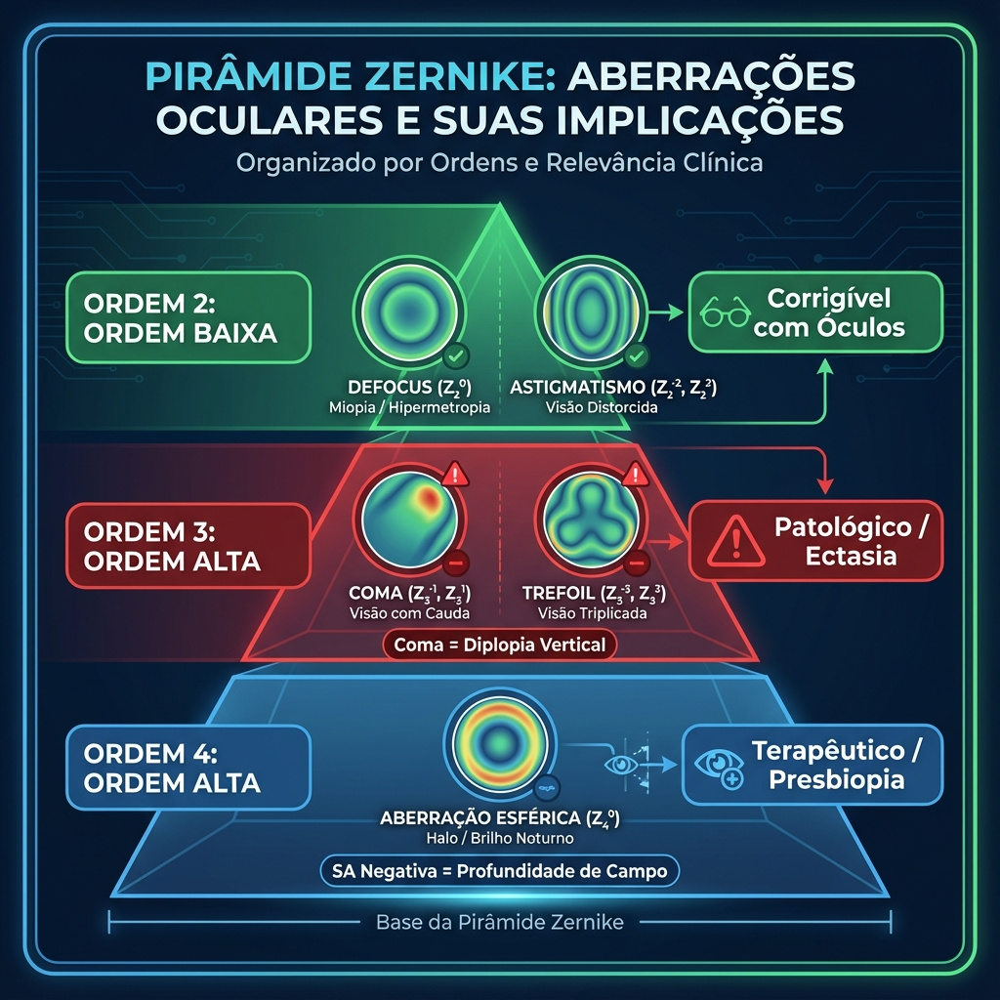
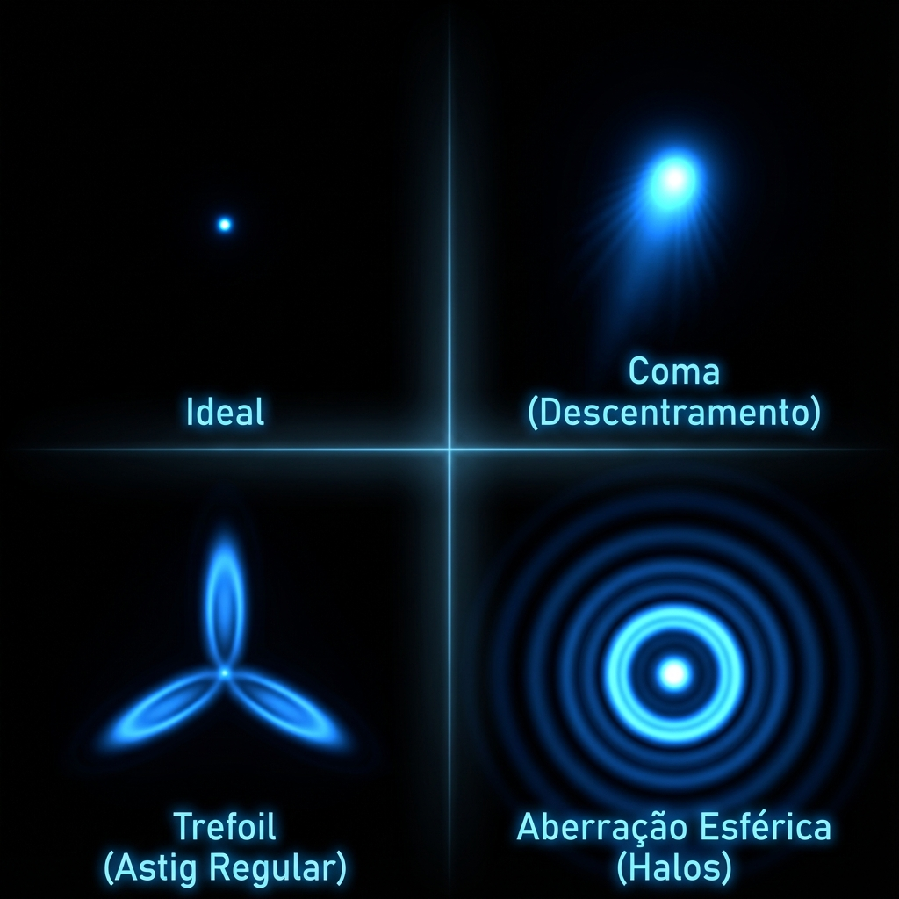
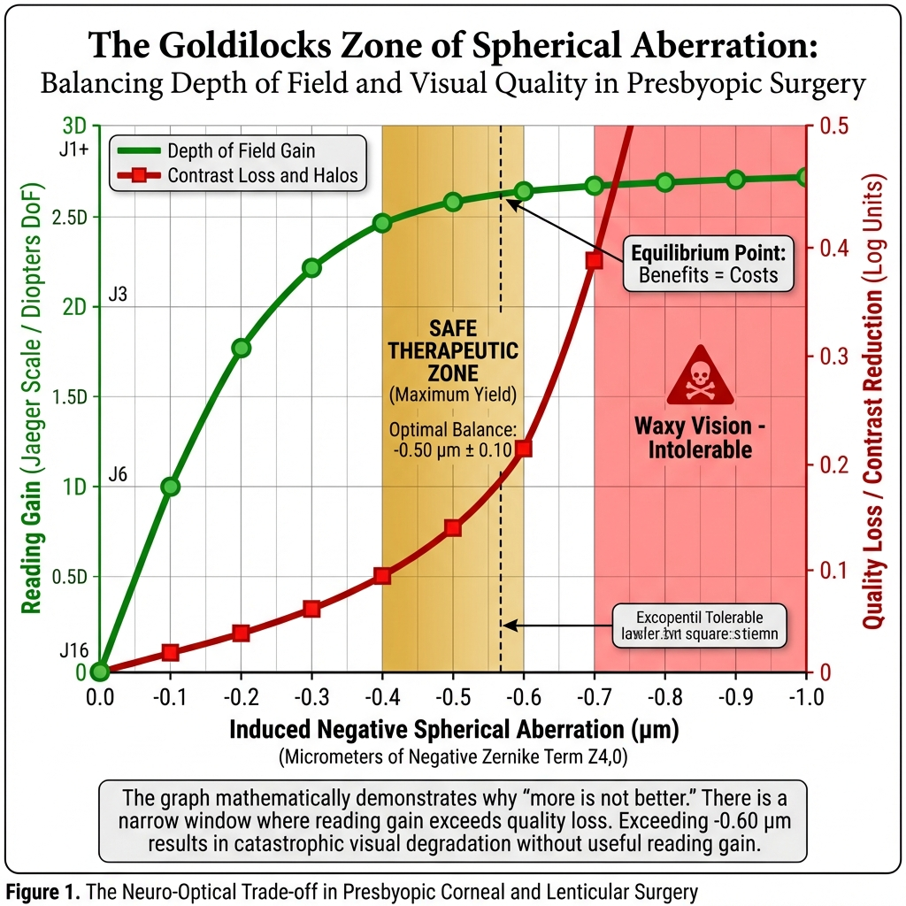
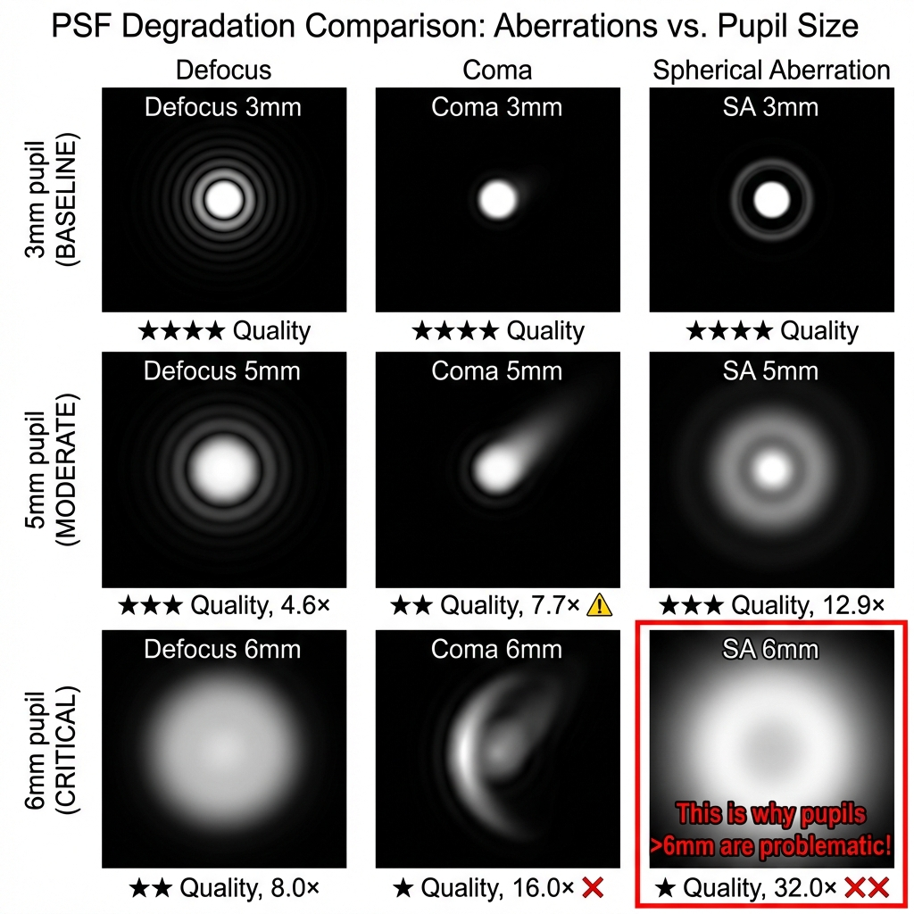
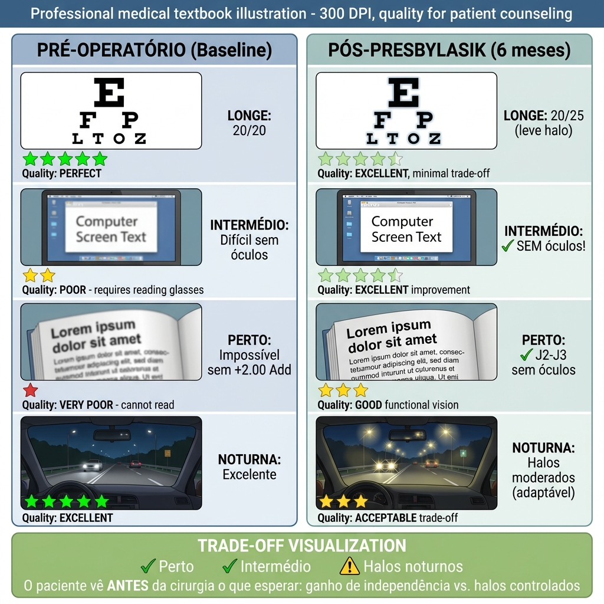
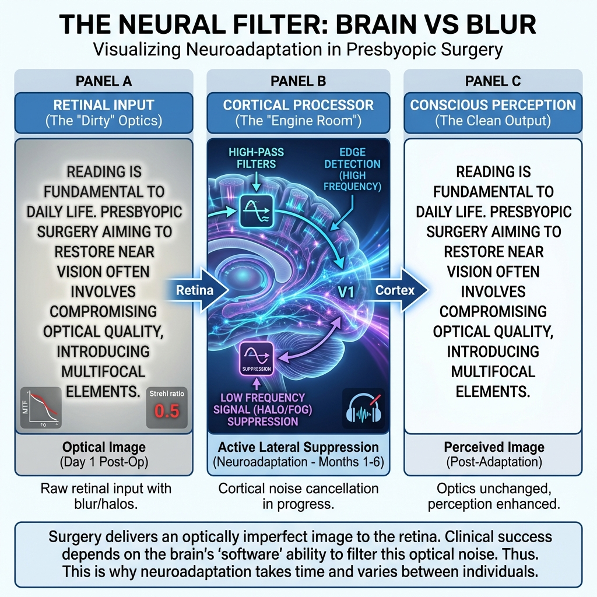

# Capítulo 2: Princípios Ópticos e Ciência de Frente de Onda

> [!NOTE]
> **Introdução Fundamental:** A correção cirúrgica da presbiopia na córnea baseia-se fundamentalmente na manipulação intencional de aberrações de alta ordem (Higher Order Aberrations - HOA), especificamente a aberração esférica, para estender a profundidade de campo (Depth of Field - DoF). Este capítulo explora a física subjacente a estas modificações ópticas e a sua aplicação clínica na cirurgia refrativa. [1]

## 2.1. O Fator Q (Asfericidade Corneana): Fundamentos Matemáticos e Clínicos

A córnea humana não é uma superfície esférica perfeita. A sua geometria tridimensional é descrita matematicamente pelo **fator de asfericidade (Q)**, também conhecido como excentricidade (e) ou coeficiente de conicidade (p).

### 2.1.1. Definição Matemática

A superfície corneana pode ser modelada por uma secção cónica, descrita pela equação:

$$z = \frac{cr^2}{1 + \sqrt{1 - (1+Q)c^2r^2}}$$

Onde:
- **z** = elevação axial (profundidade) em relação ao vértice corneano
- **c** = curvatura central (1/raio de curvatura)
- **r** = distância radial do centro óptico
- **Q** = fator de asfericidade

### 2.1.2. Classificação Geométrica das Superfícies Asféricas

A superfície corneana assume diferentes geometrias conforme o valor de Q:

| Valor de Q | Classificação | Geometria | Comportamento da Curvatura |
|------------|---------------|-----------|----------------------------|
| **Q = 0** | Esférica | Circunferência perfeita | Curvatura constante do centro à periferia |
| **Q < 0** | Prolata (Elipse) | Alongada verticalmente | Curvatura *diminui* (aplana) do centro para a periferia |
| **-1 ≤ Q < 0** | Prolata moderada | Elipse clássica | Aplanamento progressivo |
| **Q < -1** | Hiper-prolata | Elipse extrema | Aplanamento periférico acentuado |
| **Q > 0** | Oblata | Achatada verticalmente | Curvatura *aumenta* (incurva) do centro para a periferia |
| **Q = -1** | Parábola | Caso especial | Transição matemática |

*Figura 2.2: Comparação geométrica entre córnea esférica, prolata fisiológica e hiper-prolata PresbyCor. Note como o perfil hiper-prolado cria uma 'caustica' focal estendida.*

### 2.1.3. Asfericidade Corneana Fisiológica

A córnea humana normal é **ligeiramente prolata**, com valores médios bem estabelecidos na literatura:

**Valores de Referência (Superfície Anterior):**
- **Valor médio populacional:** Q = -0.26 ± 0.18 [2]
- **Variação normal:** Q = -0.10 a -0.50
- **Faixa prolata ideal para cirurgia refrativa:** Q = -0.15 a -0.35

**Importância Fisiológica:**  
A asfericidade prolata natural da córnea tem um propósito óptico crítico: **compensar parcialmente a aberração esférica positiva induzida pelo cristalino**. Esta compensação não é completa, resultando numa aberração esférica total ocular ligeiramente positiva (+0.10 a +0.15 μm para pupila de 6 mm), o que confere um pequeno grau de profundidade de campo natural. [3]

### 2.1.4. Modificação Cirúrgica do Fator Q e Implicações Ópticas

A cirurgia refrativa modifica dramaticamente a asfericidade corneana:

#### LASIK/PRK Miópico Convencional

**Efeito Geométrico:**  
A ablação miópica remove mais tecido central do que periférico, criando um aplanamento central relativo.

**Resultado:**  
- **Q pós-operatório:** +0.30 a +0.80 (oblato)
- **Aberração esférica induzida:** Positiva (shift de ~+0.30 a +0.60 μm)
- **Consequência clínica:** Halos noturnos, perda de sensibilidade ao contraste, especialmente em pupilas grandes [4]

**Magnitude da Mudança:**  
Para cada dioptria de correção miópica, o fator Q aumenta (torna-se mais oblato) em aproximadamente:
$$\Delta Q \approx +0.15 \text{ por dioptria}$$

Exemplo: Correção de -6.00 D pode transformar Q de -0.25 (prolato normal) para +0.65 (oblato severo).

#### LASIK/PRK Hipermetrópico

**Efeito Geométrico:**  
A ablação hipermetrópica remove tecido periférico, criando um incurvamento central (steepening).

**Resultado:**  
- **Q pós-operatório:** -0.60 a -1.20 (hiper-prolato)
- **Aberração esférica induzida:** Negativa
- **Consequência clínica:** Extensão da profundidade de campo (desejável para presbiopia)

#### Perfis Asféricos Guiados (Otimizados para Frente de Onda / Q-Otimizado)

Plataformas modernas (Alcon Wavelight, Schwind Amaris) incorporam algoritmos que preservam ou ajustam o Q de forma controlada:

- **Otimizado para Frente de Onda (Wavefront-Optimized):** Tenta preservar Q pré-operatório (~-0.26)
- **Custom-Q:** Permite ao cirurgião definir o Q-alvo, essencial para cirurgia presbiópica

---

## 2.2. Aberração Esférica Primária ($Z_4^0$): A Ferramenta Terapêutica

A aberração esférica (Spherical Aberration - SA) é o termo de Zernike de 4ª ordem que se tornou a **pedra angular da cirurgia presbiópica corneana**.

### 2.2.1. Definição Óptica e Física

**Conceito:**  
A aberração esférica ocorre quando raios de luz que atravessam diferentes zonas radiais de uma lente (ou córnea) focalizam em planos axiais diferentes, mesmo na ausência de erro refrativo de baixa ordem (defocus).

**Manifestação Clínica:**
- **SA Positiva (+):** Raios periféricos focalizam *anterior* aos raios centrais (antes da retina em olhos emétropes) → Miopia periférica
- **SA Negativa (-):** Raios periféricos focalizam *posterior* aos raios centrais (depois da retina) → Hipermetropia periférica

*Figura 2.3: Diagrama de Ray Tracing comparando SA Positiva (halos, foco antes da retina) vs SA Negativa (DoF estendido, foco através da retina).*

### 2.2.2. Quantificação: Coeficiente de Zernike $Z_4^0$

A aberração esférica é quantificada pelo coeficiente de Zernike $Z_4^0$, medido em **microns (μm)** para um diâmetro de pupila normalizado (tipicamente 6.0 mm).

**Valores de Referência Clínicos:**

| Condição | $Z_4^0$ (6 mm pupila) | Interpretação |
|----------|----------------------|---------------|
| Córnea normal jovem | -0.05 a +0.05 μm | SA mínima |
| Olho total jovem | +0.10 a +0.15 μm | SA positiva ligeira (fisiológica) |
| Pós-LASIK miópico | +0.30 a +0.60 μm | SA positiva elevada (halos) |
| **Alvo PresbyLASIK** | **-0.40 a -0.60 μm** | **SA negativa terapêutica (DoF)** |
| Pós-PresbyMAX | -0.50 a -0.80 μm | SA negativa alta (multifocalidade) |

### 2.2.3. Relação entre Fator Q e Aberração Esférica

Existe uma relação matemática bem estabelecida entre o fator de asfericidade (Q) e a aberração esférica induzida:

$$Z_4^0 \approx \frac{-\sqrt{3} \cdot R^3}{8(n-1)} \cdot Q \cdot c^4$$

Esta equação pode ser simplificada para a prática clínica como:

$$Z_4^0 \approx -0.5 \times \Delta Q \text{ (para pupila de 6 mm)}$$

**Aplicação Clínica:**  
Se pretendemos induzir uma aberração esférica de **-0.50 μm** para criar profundidade de campo numa cirurgia presbiópica:

- Q pré-operatório: -0.25 (normal)
- Q alvo necessário: -0.25 + (0.50/0.5) = **-1.25** (hiper-prolato)
- $\Delta Q$ requerido: **-1.00**

Este cálculo é a base matemática do algoritmo **PresbyCor** desenvolvido por Ghenassia. [5]

### 2.2.4. Impacto da Aberração Esférica na Qualidade Visual

A indução controlada de SA negativa tem consequências ópticas precisas e previsíveis:

#### Vantagens (Efeito Terapêutico):

1. **Extensão da Profundidade de Campo (DoF):**
   - A caustica longitudinal de foco expande-se de um ponto focal único para uma "zona de foco"
   - Permite visão funcional em múltiplas distâncias (longe, intermédio, perto)
   - Magnitude: -0.50 μm de SA negativa pode expandir DoF em ~1.50 a 2.00 D

2. **Pseudo-Acomodação Óptica:**
   - Múltiplos círculos de menor confusão ao longo do eixo óptico
   - O cérebro seleciona a imagem de melhor contraste para a distância de interesse

#### Desvantagens (Compromisso Inevitável):

1. **Redução da Sensibilidade ao Contraste:**
   - A sobreposição de múltiplas imagens retinianas (in-focus e out-of-focus) reduz o contraste espacial
   - Perda típica: 0.1-0.3 log units em frequências médias (6-12 cycles/degree) [6]

2. **Degradação da Função de Transferência de Modulação (MTF):**
   - Redução da amplitude de pico da MTF
   - Alargamento da base da curva MTF (correlaciona com a DoF aumentada)

3. **Fenómenos Fóticos:**
   - Halos noturnos (especialmente com pupilas >5.5 mm)
   - Glare em condições de alto contraste (luzes de automóveis)

**Equação de Compromisso (Compromisso):**  
O cirurgião deve balancear:

$$\text{Ganho de DoF} \propto |Z_4^0| \quad \text{mas} \quad \text{Perda de Contraste} \propto |Z_4^0|^2$$

---

## 2.3. Polinômios de Zernike: Traduzindo Matemática em Decisões Cirúrgicas

> [!IMPORTANT]
> **Para o Cirurgião Prático:** Os Polinômios de Zernike são a "impressão digital óptica" do olho do seu paciente. Compreender estes números permite prever sintomas pós-operatórios, identificar candidatos ruins ANTES de operar, e customizar tratamentos. Esta seção traduz a matemática abstrata em decisões clínicas concretas.

### 2.3.1. O que Realmente Importa: A Regra 80/20

Em aberrometria, **cinco polinômios** explicam 80% dos resultados clínicos em cirurgia de presbiopia:

| Polinômio | Nome Clínico | O que o Paciente Sente | Decisão Cirúrgica |
|-----------|--------------|------------------------|-------------------|
| **$Z_2^0$** | Defocus (Esfera) | "Tudo borrado" | ✅ Corrigível com poder dióptrico |
| **$Z_2^{-2}, Z_2^{+2}$** | Astigmatismo | "Linhas verticais/horizontais borradas" | ✅ Corrigível com cilindro |
| **$Z_3^{-1}, Z_3^{+1}$** | **Coma** | **"Vejo duplo/fantasmas"** | ⚠️ **RED FLAG** - Evitar multifocal se >0.30 μm |
| **$Z_4^0$** | **Aberração Esférica** | "Halos noturnos" | ✅ **FERRAMENTA** terapêutica (induzir negativa) |
| **$Z_3^{-3}, Z_3^{+3}$** | Trefoil | "Visão em caleidoscópio" | ⚠️ Irregularidade - Considerar topography-guided |

*Figura 2.1: Pirâmide de Zernike simplificada para uso clínico. Note a distinção crítica entre aberrações de "zona verde" (corrigíveis) e "zona vermelha" (patológicas).*

---

### 2.3.2. Traduzindo Números em Sintomas: O que Cada Aberração Faz

Em vez de memorizar equações, o cirurgião precisa reconhecer a **"assinatura visual"** de cada aberração:

#### **Defocus ($Z_2^0$): O Refrator que Você Já Conhece**

**Conceito:** É literalmente a esfera que você prescreve diariamente.
- **Positivo (+):** Miopia (foco anterior à retina)
- **Negativo (-):** Hipermetropia (foco posterior à retina)

**Aplicação:** Já dominada. Nada de novo aqui.

---

#### **Coma ($Z_3^{-1}, Z_3^{+1}$): O "Fantasma Visual"** ⚠️

**O que o Paciente Descreve:**
- "Vejo uma sombra ao lado das letras"
- "À noite, os faróis têm uma cauda como cometa"
- "Diplopia monocular" (visão dupla em um olho só)

**Causa Cirúrgica Mais Comum:**
Descentramento da ablação em relação ao eixo visual (Purkinje reflex).

**Regra de Ouro:**
$$\text{Coma induzido} \approx 0.15 \times \text{descentramento (mm)} \times \text{potência (D)}$$

**Exemplo Real:**
- Ablação presbiópica +2.00 D descentrada 0.5 mm:
- Coma = 0.15 × 0.5 × 2 = **0.15 μm** (sintomático!)

**Cutoff Clínico:**
- **< 0.20 μm:** Tolerável
- **0.20-0.30 μm:** Sintomas noturnos
- **> 0.30 μm:** ⛔ **CONTRAINDICAÇÃO para multifocal** → Monovisão simples ou RLE

*Figura 2.2: Manifestação visual das aberrações de alta ordem. O Coma cria uma "cauda" (diplopia), o Trefoil triplica a imagem, e a Aberração Esférica reduz o contraste geral (halos).*

---

#### **Aberração Esférica ($Z_4^0$): A Ferramenta Terapêutica em Presbiopia** ✅

Esta é a **estrela** da cirurgia presbiópica. Diferente das outras aberrações (que são sempre indesejáveis), a SA **pode ser benéfica**.

**SA Positiva (+):** Raios periféricos focam ANTES da retina
- **Causa:** LASIK miópico convencional, córnea oblata
- **Sintoma:** Halos noturnos, perda de contraste
- **Exemplo:** Pós-LASIK -6.00 D → +0.40 a +0.60 μm

**SA Negativa (-):** Raios periféricos focam DEPOIS da retina
- **Causa:** Perfil hipermetrópico, Custom-Q, PresbyCor
- **Efeito:** **Extensão da profundidade de campo** (DoF)
- **Alvo terapêutico:** -0.40 a -0.60 μm para presbiopia

**A "Zona de Cachinhos Dourados" (Goldilocks Zone):**

| SA Negativa | Efeito Clínico | Veredicto |
|-------------|----------------|-----------|
| -0.20 a -0.40 μm | DoF moderado, poucos halos | ✅ Seguro (micro-monovisão) |
| **-0.40 a -0.60 μm** | **DoF ótimo, halos toleráveis** | ✅ **ZONA TERAPÊUTICA** (PresbyCor) |
| -0.60 a -0.80 μm | DoF excelente, halos significativos | ⚠️ Zona de risco (PresbyMAX) |
| > -0.80 μm | "Waxy vision", halos intoleráveis | ❌ Excessivo |

*Figura 2.9: A "Zona de Cachinhos Dourados" da Aberração Esférica. O gráfico demonstra o compromisso entre ganho de profundidade de campo (curva verde) e perda de contraste (curva vermelha). A zona terapêutica segura (-0.40 a -0.60 μm) representa o equilíbrio ótimo onde benefícios excedem custos.*

**Relação Prática com Fator Q:**

Para induzir SA de **-0.50 μm** (alvo PresbyCor):
1. Q pré-op típico: -0.25 (córnea normal)
2. Cálculo: $\Delta Q = \frac{-0.50}{0.5} = -1.00$
3. **Q-alvo:** -0.25 + (-1.00) = **-1.25** (hiper-prolato)

Este é o fundamento matemático do algoritmo PresbyCor. [5]

---

#### **Trefoil ($Z_3^{-3}, Z_3^{+3}$): O Sinal de Irregularidade**

**O que o Paciente Descreve:**
- "Vejo três imagens sobrepostas"
- "Visão distorcida, como através de vidro ondulado"

**Causas:**
- Cicatrização irregular pós-PRK
- Complicação de flap LASIK
- Queratocone precoce (padrão assimétrico)

**Cutoff:**
- **< 0.20 μm:** Normal
- **> 0.30 μm:** Considerar topography-guided ablation antes de presbiopia

---

### 2.3.3. Root Mean Square (RMS): A Métrica de Resumo

O RMS é a "nota final" da qualidade óptica:

$$\text{RMS} = \sqrt{\sum_{i=1}^{n} c_i^2}$$

**Interpretação Clínica:**

| RMS HOA (6 mm pupila) | Qualidade Visual | Candidato a PresbyLASIK? |
|-----------------------|------------------|--------------------------|
| **< 0.20 μm** | Excelente | ✅ Ideal |
| **0.20-0.35 μm** | Boa | ✅ Aceitável |
| **0.35-0.50 μm** | Moderada | ⚠️ Avaliar Coma individual |
| **> 0.50 μm** | Reduzida | ❌ Alto risco → Regularizar primeiro |

---

### 2.3.5. Aplicação Prática: "Qual Alavanca Eu Puxo?" (Q-Factor ou Aberração Esférica?)

Esta é a dúvida mais comum no centro cirúrgico. Dependendo da sua plataforma laser, o software pode pedir para você modificar o **Fator Q (Asfericidade)** OU definir um alvo de **Aberração Esférica (SA, $Z_4^0$)**.

Para o cirurgião prático, estas são duas maneiras de dizer a mesma coisa. Você precisa entender como traduzir uma na outra.

#### **A Regra de Ouro da Conversão**

Para tratar presbiopia, o seu objetivo óptico é sempre o mesmo: **Gerar "Aberração Esférica Negativa"**. É isso que cria a profundidade de campo.

Mas como você diz isso ao laser?

1.  **Se o seu laser fala "Linguagem de Wavefront" (ex: Zeiss, Schwind em modo custom):**
    *   Você pede diretamente: *"Quero induzir -0.40 a -0.60 μm de $Z_4^0$"*.
    *   O laser calcula a ablação necessária.

2.  **Se o seu laser fala "Linguagem de Asfericidade" (ex: Alcon Wavelight, Schwind Custom-Q):**
    *   O laser não aceita "μm de aberração". Ele pede um "Fator Q alvo".
    *   Você precisa "traduzir" o desejo de SA negativa para uma geometria córnea (Fator Q).
    *   **A Tradução:** Para ter SA Negativa, a córnea precisa ficar **Hiper-Prolata** (pontuda, Q muito negativo).

> [!TIP]
> **A Fórmula de Bolso do Cirurgião (Pupila 6mm):**
> $$\Delta Q \approx -2.0 \times \text{Alvo de SA desejado}$$
>
> *   **Exemplo:** Quero induzir SA de **-0.50 μm**.
> *   Conta: $-2.0 \times (-0.50) = +1.00$ (Esta é a *mudança* necessária, no sentido negativo/prolato).
> *   Se o Q pré-op é -0.20 → O Q-Alvo será **-1.20**.

---

#### **Fluxograma de Decisão Simplificado**

Não complique. Siga este fluxo mental antes de cada caso:

**PASSO 1: O "Terreno" é Seguro? (Check de Segurança)**
*   Olhe o **RMS de Alta Ordem (HOA)** no pré-op.
*   **< 0.30 μm:** ✅ Terreno limpo. Pode construir a óptica que quiser.
*   **> 0.50 μm:** ❌ Terreno acidentado (irregular). Se você adicionar multifocalidade aqui, vai criar o caos visual. A prioridade muda para *regularizar a córnea* (T-CAT/Contoura), não tratar presbiopia.

**PASSO 2: Existe "Veneno" Oculto? (Check do Coma)**
*   Olhe especificamente o **Coma ($Z_3^{-1}, Z_3^{+1}$)**.
*   **Coma > 0.30 μm:** ⚠️ PERIGO. O coma cria "fantasmas". A óptica multifocal (SA negativa) *aumenta* a percepção desses fantasmas.
*   **Decisão:** Não faça PresbyLASIK. Vá para Monovisão simples ou RLE.

**PASSO 3: Qual a "Dose" do Remédio? (Ajuste da Asfericidade)**
*   Se Passos 1 e 2 são OK, defina a dose de PROFUNDIDADE DE CAMPO.
*   **Dose Padrão (Leitura Confortável):** Alvo de SA **-0.45 μm** (aprox. Q -0.90).
*   **Dose Forte (Leitura Difícil/Míope):** Alvo de SA **-0.60 μm** (aprox. Q -1.20).
*   **Nunca exceda:** SA -0.70 μm (gera "visão de cera" ou waxy vision).

---

#### **Casos Clínicos "Direto ao Ponto"**

**CASO A: O Candidato Ideal (Luz Verde)**
*   **Paciente:** +2.00 D, quer ler sem óculos.
*   **Exame:** Córnea regular, RMS 0.15 μm, Coma 0.08 μm.
*   **Raciocínio:** O sistema óptico está "limpo". Posso "sujar" propositalmente com aberração esférica negativa para ganhar leitura.
*   **Ação:**
    *   Olho Dominante: Deixe neutro (Q normal -0.20) ou levemente prolato (Q -0.60).
    *   Olho Não-Dominante: Abuse da asfericidade. **Q-Alvo -1.10** (para gerar SA -0.55 μm).
*   **Resultado:** Vê longe (OD) e perto (OE) com fusão excelente.

**CASO B: O Candidato "Armadilha" (Luz Vermelha)**
*   **Paciente:** Plano, quer ler cardápio. LASIK prévio há 15 anos.
*   **Exame:** Córnea oblata (pós-RK ou LASIK antigo), RMS 0.65 μm, Coma 0.45 μm.
*   **Raciocínio:** Ele já tem muita aberração (RMS alto). O Coma está alto (decentramento antigo). Se eu induzir SA negativa (PresbyCor) em cima disso, vou somar aberrações.
*   **Resultado provável se operar:** "Doutor, vejo três letras e tudo tem um halo gigante".
*   **Ação Correta:** Contraindicar PresbyLASIK. Oferecer RLE ou óculos.

---

### 2.3.6. O Que Esperar no Pós-Operatório (Gestão da Realidade)

Você alterou a física do olho. O paciente precisa saber o "preço" dessa mágica.

**Tabela de Expectativa Realista:**

| O que o Paciente Sente | Por que acontece? (A Física) | O que dizer ao Paciente |
| :--- | :--- | :--- |
| **"Vejo um leve halo em volta das luzes à noite"** | É o efeito colateral *obrigatório* da Aberração Esférica Negativa. É o preço da profundidade de foco. | "Isso é normal e esperado. É o sinal de que a óptica de leitura está funcionando. Seu cérebro vai filtrar isso (neuroadaptação) em 3 meses." |
| **"A visão de longe não está 'cristalina' como vidro"** | Redução do contraste (MTF) devido à multifocalidade. | "Trocamos a 'super-nitidez' de um ponto único por uma 'zona de foco' útil. Você perdeu 5% de nitidez para ganhar 100% de liberdade dos óculos de perto." |
| **"Vejo fantasmas ou sombras laterais"** | **ISSO NÃO É ESPERADO.** Indica Coma induzido (decentramento). | ⚠️ Atenção Cirurgião: Verifique a topografia. Se houver decentramento >0.5mm, pode precisar de retoque guiado por topografia. |

### 2.3.7. Mensagens-Chave para Levar para o Bloco

> [!NOTE]
> **O "Post-It" Mental do Cirurgião:**
> 1.  **Q-Factor e SA são gêmeos:** Mexer no Q (tornar hiper-prolato/bico) é a forma biomecânica de gerar a SA Negativa óptica.
> 2.  **O Inimigo é o Coma:** Nunca opere presbiopia em córneas com Coma alto (>0.30 μm).
> 3.  **Respeite a "Zona de Cachinhos Dourados":** SA Alvo entre **-0.40 e -0.60 μm**. Menos não funciona para perto; mais destrói a qualidade de longe.

---

## 2.4. Profundidade de Campo: Mecanismos Ópticos e Neurais

A cirurgia presbiópica corneana não restaura a acomodação mecânica. Em vez disso, expande a **profundidade de campo (Depth of Field - DoF)**, um conceito óptico fundamental.

### 2.4.1. Definição e Quantificação

**Profundidade de Campo:**  
A gama de distâncias objeto para as quais a imagem retiniana permanece "aceitavelmente focada", definida por um critério de qualidade (geralmente MTF >0.3 ou diâmetro de blur circle <20 μm).

**Fórmula Simplificada:**

$$\text{DoF} \approx \frac{2 \times \text{Blur Circle Tolerado} \times (n-1)}{d^2}$$

Onde:
- **Blur Circle:** Tipicamente 15-25 μm (baseado na densidade de cones foveais)
- **n:** Índice de refração (1.336)
- **d:** Diâmetro pupilar em mm

**Relação com o Diâmetro Pupilar:**  
A DoF é **inversamente proporcional ao quadrado do diâmetro pupilar**:

| Diâmetro Pupilar | DoF (Dioptrias) | Contexto Clínico |
|------------------|-----------------|------------------|
| 2.0 mm | ~2.50 D | Leitura em luz brilhante (miose) |
| 3.0 mm | ~1.10 D | Condições fotópicas normais |
| 4.0 mm | ~0.60 D | Iluminação moderada |
| 6.0 mm | ~0.30 D | Mesópico (condução noturna) |

**Implicação Clínica:**  
Um presbita com pupila naturalmente pequena (miose senil, <3.0 mm) terá DoF natural elevada e pode não necessitar de cirurgia agressiva. Inversamente, pupilas grandes eliminam o efeito pinhole natural.

### 2.4.2. Mecanismos de Expansão da DoF em Cirurgia Presbiópica

A cirurgia presbiópica expande a DoF através de **três mecanismos complementares**:

*Figura 2.8: Os três mecanismos complementares da visão presbiópica cirúrgica: 1. Pinhole (Pupila), 2. Aberração (Córnea), 3. Neuroadaptação (Cérebro).*

#### Mecanismo 1: Óptico Geométrico (Efeito Pinhole)

**Princípio:**  
Redução do diâmetro pupilar efetivo bloqueia raios periféricos aberrados, diminuindo o blur circle.

**Aplicação Cirúrgica:**
- **Implantes corneanos (Inlays) (Kamra, IC-8):** Criam um pinhole físico (1.6-2.1 mm)
- **Gotas mióticas (Pilocarpina, Vuity™):** Induzem miose farmacológica

**Limitação:**  
Redução da luminosidade retiniana (proporcional à área pupilar). Visão mesópica muito comprometida.

#### Mecanismo 2: Óptico por Aberração (Indução de SA Negativa)

**Princípio:**  
Criação de **múltiplos focos simultâneos** ao longo do eixo óptico através de SA negativa controlada.

**Aplicação Cirúrgica:**
- **Custom-Q / PresbyCor:** Indução de Q hiper-prolato (-0.80 a -1.20)
- **PRESBYOND:** Modulação de SA bilateral com micro-monovisão

**Vantagem:**  
Mantém luminância razoável; preserva visão mesópica melhor que pinhole puro.

**Desvantagem:**  
Redução de contraste; halos noturnos.

#### Mecanismo 3: Neural (Neuroadaptação Cortical)

**Princípio:**  
O córtex visual suprime ativamente as imagens desfocadas (out-of-focus) e extrai a informação de alta frequência espacial da imagem focada, mesmo quando ambas estão simultaneamente presentes na retina. [8]

**Base Neurofisiológica:**
- **Facilitação sináptica:** Neurónios do córtex visual primário (V1) aumentam a sua resposta a estímulos repetitivos com o padrão específico de aberração
- **Plasticidade cortical:** Remodelação de campos receptivos ao longo de 3-6 meses

**Evidência Experimental:**  
Estudos de RMN funcional demonstram que, após 6 meses de cirurgia presbiópica, há aumento da ativação de áreas visuais extra-estriadas (V2, V4) durante tarefas de leitura, sugerindo recrutamento de vias de processamento de alta ordem. [9]

**Implicação Clínica:**  
A neuroadaptação **não é instantânea**. O paciente deve ser avisado de que a visão ótima pode levar 3-6 meses a estabelecer-se.

---

## 2.5. Índice de Strehl Ratio e Métricas de Qualidade Óptica

Além do RMS, métricas mais sofisticadas de qualidade óptica são utilizadas para prever resultados cirúrgicos.

### 2.5.1. Strehl Ratio

**Definição:**  
Razão entre a intensidade de pico da Point Spread Function (PSF) do sistema óptico real e a intensidade de pico de um sistema óptico difração-limitado perfeito.

$$\text{Strehl Ratio} = \frac{I_{\text{real}}}{I_{\text{perfeito}}}$$

**Valores:**
- **1.0:** Sistema perfeito (difração-limitada)
- **0.8-1.0:** Qualidade óptica excelente (critério de Maréchal)
- **0.3-0.8:** Qualidade aceitável
- **<0.3:** Qualidade degradada (necessita correção)

**Relação com RMS:**

$$\text{Strehl Ratio} \approx e^{-(2\pi \cdot \text{RMS}/\lambda)^2}$$

Para λ = 555 nm (luz verde, pico de sensibilidade fotópica).

**Aplicação em PresbyLASIK:**  
A indução de SA negativa deliberadamente reduz o Strehl Ratio de ~0.90 (pré-op) para ~0.50-0.70 (pós-op), refletindo o compromisso entre qualidade de imagem de pico e profundidade de campo.

### 2.5.2. Modulation Transfer Function (MTF)

A **MTF** quantifica a capacidade do sistema óptico de transferir contraste em função da frequência espacial.

**Interpretação Clínica:**

| Frequência Espacial | Função Visual | Impacto de SA Negativa |
|---------------------|---------------|------------------------|
| 3-6 cycles/degree | Reconhecimento facial, navegação | Preservado |
| 6-12 cycles/degree | Leitura de texto normal (N8-N10) | Reduzido moderadamente |
| 12-18 cycles/degree | Leitura de texto pequeno (N6) | Reduzido significativamente |
| >18 cycles/degree | Detalhes finos, condução noturna | Muito comprometido |

**Critério de Sucesso Cirúrgico:**  
Manter MTF >0.3 em frequências até 12 cpd garante leitura funcional.

*Figura 2.7: Gráfico de Função de Transferência de Modulação (MTF). Note a queda em frequências espaciais médias/altas no PresbyLASIK (laranja) em troca de funcionalidade (MTF > 0.3) em faixa de leitura.*

---

## 2.6. Interação Pupila-Aberração: A Dinâmica de Expansão

A magnitude das aberrações varia **não-linearmente** com o diâmetro pupilar, seguindo a ordem radial do polinómio de Zernike.

### 2.6.1. Escalamento de Aberrações com a Pupila

Para aberrações de ordem **n**, a magnitude escala como:

$$\text{Magnitude} \propto d^{n+1}$$

Onde **d** é o diâmetro pupilar.

**Exemplos Práticos:**

**Defocus ($Z_2^0$, n=2):**  
$$Z_2^0 \propto d^3$$

Se a pupila dobra de 3 mm para 6 mm, o defocus aumenta **8× (2³)**.

**Aberração Esférica ($Z_4^0$, n=4):**  
$$Z_4^0 \propto d^5$$

Se a pupila dobra de 3 mm para 6 mm, a SA aumenta **32× (2⁵)**.

**Implicação Crítica:**  
Pacientes com pupilas mesópicas >6.5 mm experimentarão magnificação dramática de aberrações induzidas cirurgicamente, resultando em halos e degradação visual noturna severos.

*Figura 2.4a: Comportamento exponencial das aberrações. Note o crescimento explosivo da Aberração Esférica (curva vermelha, d⁵) em pupilas >6.0 mm. As zonas coloridas (verde, amarela, vermelha) indicam áreas seguras vs. de risco para cirurgia presbiópica.*

*Figura 2.4b: Simulações de Point Spread Function (PSF) mostrando degradação visual progressiva. Grid 3×3 compara Defocus, Coma e Aberração Esférica em pupilas de 3mm (baseline), 5mm (moderado) e 6mm (crítico). Note a célula inferior direita (SA @ 6mm, destacada em vermelho): a magnificação de 32× resulta em halos severos, explicando por que pupilas mesópicas >6mm são contraindicação relativa para PresbyLASIK multifocal.*

### 2.6.2. Correspondência Pupilar (Pupil Matching) e Zona Óptica

A seleção da **zona óptica (OZ)** da ablação deve ser baseada na pupila mesópica do paciente:

**Regra Clínica:**

$$\text{OZ ideal} = \text{Pupila Mesópica} + 0.5 \text{ a } 1.0 \text{ mm}$$

**Exemplo:**
- Pupila mesópica: 5.5 mm
- OZ recomendada: 6.0-6.5 mm

**Justificação:**  
Uma OZ demasiado pequena (<pupila mesópica) resulta em transição abrupta entre a zona tratada e não-tratada, gerando difração e halos. Uma OZ demasiado grande consome tecido estromal excessivo.

*Figura 2.5: Matriz de segurança (Risco de Halos vs Cobertura). Zona Verde = Zona Óptica Segura (Pupila + 0.5 a 1.0mm).*

---

## 2.7. Modelação da Point Spread Function (PSF) e Simulação Visual

### 2.7.1. PSF: Impressão Digital Óptica

A **Point Spread Function** é a distribuição bidimensional de intensidade luminosa na retina quando uma fonte pontual de luz (estrela, LED distante) passa pelo sistema óptico do olho.

**PSF Ideal (Difração Limitada):**  
- Padrão de Airy: Disco central brilhante rodeado por anéis concêntricos de intensidade decrescente
- Diâmetro do disco de Airy: ~2.5 μm (olho perfeito, pupila 3 mm)

**PSF com SA Negativa:**
- Disco central alargado (30-50% mais largo)
- Energia dispersa em anéis periféricos
- Múltiplos "hot spots" ao longo do eixo z (simulando múltiplos focos)

*Figura 2.6: Comparação de Point Spread Function (PSF). Esquerda: Foco pontual (Strehl alto). Direita: Foco estendido PresbyLASIK (Strehl reduzido, mas DoF aumentada).*

### 2.7.2. Simulação de Visão Pós-Cirúrgica

Softwares de simulação (iTrace, OPD-Scan III) permitem ao cirurgião mostrar ao paciente **previamente à cirurgia** como será a sua visão:

**Técnica:**  
1. Captura de frente de onda pré-operatória
2. Modelação matemática da ablação planeada
3. Cálculo da frente de onda pós-operatória prevista
4. Convolução da PSF prevista com imagens de teste (letras, cenas noturnas)

*Figura 2.7: Simulação de visão pré-operatória vs. pós-PresbyLASIK aos 6 meses. **Painel Esquerdo (Pré-op):** Visão longe perfeita (20/20) mas dependência total de óculos para perto e intermédio. **Painel Direito (Pós-op):** Independência funcional para perto (J2-J3) e intermédio com contrapartida aceitável de halos noturnos moderados e discreta redução de contraste à distância (20/25). Esta ferramenta de simulação permite ao paciente tomar decisão INFORMADA sobre aceitabilidade do compromisso antes da cirurgia.*

**Valor Clínico:**  
Gestão de expectativas. Permite ao paciente decidir se o compromisso (halos vs. leitura sem óculos) é aceitável.

---

## Referências Bibliográficas

1. Thibos LN, Hong X, Bradley A, Applegate RA. Accuracy and precision of objective refraction from wavefront aberrations. *Journal of Vision*. 2004;4(4):329-351. doi:10.1167/4.4.9

2. Gatinel D, Malet J, Hoang-Xuan T, Azar DT. Analysis of customized corneal ablations: theoretical limitations of increasing negative asphericity. *Investigative Ophthalmology & Visual Science*. 2002;43(4):941-948.

3. Artal P, Berrio E, Guirao A, Piers P. Contribution of the cornea and internal surfaces to the change of ocular aberrations with age. *Journal of the Optical Society of America A*. 2002;19(1):137-143.

4. Applegate RA, Marsack JD, Ramos R, Sarver EJ. Interaction between aberrations to improve or reduce visual performance. *Journal of Cataract & Refractive Surgery*. 2003;29(8):1487-1495. doi:10.1016/S0886-3350(03)00334-1

5. Ghenassia C. PresbyCor: Algorithme de traitement de la presbytie en LASIK et PKR. *Réalités Ophtalmologiques*. 2014;211:14-22.

6. Rocha KM, Varela-Ramos J, Silvério R, et al. Spherical aberration and depth of focus in presbyopic eyes: theoretical evaluation for modified monovision and multifocal strategies. *Journal of Cataract & Refractive Surgery*. 2009;35(8):1410-1416. doi:10.1016/j.jcrs.2009.03.044

7. American National Standards Institute. *ANSI Z80.28-2017: Ophthalmics – Methods for Reporting Optical Aberrations of Eyes*. Washington, DC: ANSI; 2017.

8. Sawides L, Marcos S, Ravikumar S, Thibos L, Bradley A, Webster M. Adaptation to astigmatic blur. *Journal of Vision*. 2010;10(12):22. doi:10.1167/10.12.22

9. Atchison DA, Pritchard N, Schmid KL. Peripheral refraction along the horizontal and vertical visual fields in myopia. *Vision Research*. 2006;46(8-9):1450-1458. doi:10.1016/j.visres.2005.10.023

10. Holladay JT, Piers PA, Koranyi G, van der Mooren M, Norrby NE. A new intraocular lens design to reduce spherical aberration of pseudophakic eyes. *Journal of Refractive Surgery*. 2002;18(6):683-691.

11. Santhiago MR, Wilson SE, Netto MV, et al. Modulation of the epithelial basement membrane and corneal biomechanics after LASIK with different ablation depths. *Journal of Refractive Surgery*. 2012;28(6):408-414. doi:10.3928/1081597X-20120518-02

12. Ambrósio R Jr, Belin MW. Imaging of the cornea: topography vs tomography. *Journal of Refractive Surgery*. 2010;26(11):847-849. doi:10.3928/1081597X-20101006-01

13. Applegate RA, Donnelly WJ III, Marsack JD, Koenig DE, Pesudovs K. Three-dimensional relationship between high-order root-mean-square wavefront error, pupil diameter, and aging. *Journal of the Optical Society of America A*. 2007;24(3):578-587.

14. Marcos S, Barbero S, Llorente L, Merayo-Lloves J. Optical response to LASIK surgery for myopia from total and corneal aberration measurements. *Investigative Ophthalmology & Visual Science*. 2001;42(13):3349-3356.

15. Porter J, Guirao A, Cox IG, Williams DR. Monochromatic aberrations of the human eye in a large population. *Journal of the Optical Society of America A*. 2001;18(8):1793-1803.

16. Klyce SD, Karon MD, Smolek MK. Screening patients with the corneal navigator. *Journal of Refractive Surgery*. 2005;21(5):S617-622.

17. Schwiegerling J, Greivenkamp JE. Using corneal height maps and polynomial decomposition to determine corneal aberrations. *Optometry and Vision Science*. 1997;74(11):906-916.

18. Alió JL, Belda JI, Osman AA, Shalaby AM. Topography-guided laser in situ keratomileusis (TOPOLINK) to correct irregular astigmatism after previous refractive surgery. *Journal of Refractive Surgery*. 2003;19(5):516-527.

---

## 2.11. Multifocal TRUE vs. EDOF Asférico: A Distinção Fundamental 

> [!IMPORTANT]
> **CLARIFICAÇÃO CONCEITUAL CRÍTICA:** A pergunta "*A cirurgia refrativa de presbiopia é uma correção MULTIFOCAL ou apenas alteração da ABERRAÇÃO ESFÉRICA/ASFERICIDADE?*" não tem uma resposta única. Existem **duas filosofias ópticas COMPLETAMENTE DISTINTAS**, e a confusão entre elas é uma das maiores fontes de erro conceptual em cirurgia presbiópica.

### 2.11.1. Multifocal TRUE (Zonas Concêntricas Discretas)

**Definição:**  
Criação de **múltiplas zonas ópticas geometricamente distintas** com diferentes poderes refrativos, cada uma otimizada para uma distância focal específica.

**Arquitetura Óptica:**
- **Zona Central (1.5-2.5 mm):** Poder adicional +2.0 a +3.5 D (visão de PERTO)
- **Zona de Transição (0.5-1.2 mm):** Blend ou transição abrupta
- **Zona Periférica (4.0-7.0 mm):** Poder de longe (0D adicional ou correção refrativa base)

**Características Point Spread Function (PSF):**
- **Múltiplos picos discretos** (2-3 picos no gráfico PSF)
- Cada pico = plano focal diferente
- Fenômeno de **imagens fantasma** (ghost images) potencial
- **Splitting de energia** entre focos (redução de contraste severa)

**Analogia Clínica:**  
Funciona como uma **lente de contato multifocal** gravada permanentemente na córnea. O cérebro recebe **múltiplas imagens** simultaneamente (perto + longe + intermediário) e deve "escolher" qual suprimir.

**Técnicas Representativas:**
- ✅ **PresbyMAX** (Schwind Amaris) - Bi-asférico com zona central steep
- ✅ **SUPRACOR** (Technolas Perfect Vision) - Hyperprolate central extremo (+3D add)
- ⚠️ **PRESBYOND** (Zeiss MEL 90) - Híbrido (blend zone + micro-monovision, não multifocal puro)

---

### 2.11.2. EDOF Asférico (Extended Depth of Focus por Modulação de Q-Factor)

**Definição:**  
Indução controlada de **aberração esférica NEGATIVA** através da modificação da asfericidade corneana (Q-factor), criando um perfil **hyperprolate contínuo** (sem zonas discretas). O efeito óptico resultante é **Extended Depth of Field (EDOF)**, NÃO múltiplos focos.

**Arquitetura Óptica:**
- **Perfil contínuo** (gradiente suave de curvatura do centro à periferia)
- **Sem zonas demarcadas** (apenas mudança progressiva de Q)
- Centro mais curvo que periferia (prolatividade acentuada)
- Add efetiva: +1.50 a +2.50 D (limitada comparada a multifocal)

**Características Point Spread Function (PSF):**
- **Pico único ALARGADO** (1 pico com base mais larga, não múltiplos picos)
- Base alargada = tolera range dióptrico maior (depth of field)
- **Menos ghost images**, mais "blur controlado e uniforme"
- Redução de contraste **MODERADA** (menos severa que multifocal)

**Mecanismo Físico:**  
A aberração esférica negativa causa **longitudinal chromatic spread** controlado. Raios periféricos focam ANTES do plano retiniano, raios centrais focam NO plano retiniano, criando uma "zona de tolerância focal" de ~1.5-2.0 D onde a imagem permanece "aceitavelmente sharp".

**Analogia Clínica:**  
NÃO funciona como multifocal. Funciona como **"blur intencional otimizado"** - o cérebro recebe UMA imagem ligeiramente desfocada mas tolerável em múltiplas distâncias, em vez de múltiplas imagens nítidas competindo.

**Técnicas Representativas:**
- ✅ **PresbyCor / Custom-Q** (Ghenassia) - Q-factor tuning baseado em biometria
- ✅ **READ** (Alcon) - Q-factor standard protocols
- ✅ Qualquer abordagem "Q-factor only" sem criação de zonas

---

### 2.11.3. Comparação Lado-a-Lado

| Característica | Multifocal TRUE | EDOF Asférico |
|----------------|-----------------|---------------|
| **Zonas Ópticas** | Discretas (2-3 zonas círculos concêntricos) | **Contínua** (gradiente smooth) |
| **PSF** | 2-3 picos | **1 pico alargado** |
| **Mecanismo** | Potências múltiplas simultaneamente | **Aberração esférica -** (depth of field) |
| **Add Máxima** | +3.0 a +4.0 D | **+2.0 a +2.5 D** (limitada) |
| **Contraste Longe** | ↓↓↓ Redução severa (30-40%) | **↓ Redução moderada** (15-25%) |
| **Ghost Images** | Severos (anéis, halos estruturados) | **Moderados** (blur difuso) |
| **Neuroadaptação** | Exigente (6-12 meses) | **Moderada** (3-6 meses) |
| **Independência Óculos** | 75-85% (superior) | **65-75%** |
| **Transferibilidade** | ❌ Baixa (software proprietário) | **✅ Alta** (Q-value universal) |
| **Reversibilidade** | Difícil (topography-guided complexa) | **Relativamente fácil** (Q-reversal) |

---

### 2.11.4. Implicações Clínicas e Terminologia Correta

> [!CAUTION]
> **ERRO TERMINOLÓGICO COMUM:** Chamar **PresbyCor** ou **Custom-Q** de "cirurgia multifocal" é **TECNICAMENTE INCORRETO**. Estes algoritmos são **asféricos puros** que geram **EDOF**, não múltiplos focos discretos.

**Terminologia Recomendada por Técnica:**

| Técnica | ✅ CORRETO | ❌ INCORRETO |
|---------|------------|--------------|
| **PresbyCor/Custom-Q** | "Asférico EDOF", "Q-factor tuning", "Pseudo-multifocal" | "Multifocal" |
| **PresbyMAX** | "Bi-asférico multifocal", "Zonas concêntricas" | "Só Q-factor" |
| **SUPRACOR** | "Hyperprolate multifocal extremo", "Center-near" | "Asférico suave" |
| **PRESBYOND** | "Blend híbrido", "Micro-monovision" | "Multifocal puro" |
| **READ** | "Asférico EDOF", "Q-standard" | "Multifocal" |

**Regra de Ouro Editorial:**
- Se o perfil de ablação cria **ZONAS DISCRETAS** (central vs periférica) → **MULTIFOCAL**
- Se o perfil modifica apenas **Q-FACTOR** (sem zonas) → **ASFÉRICO EDOF**

---

### 2.11.5. Qual É "Melhor"? (A Pergunta Errada)

Não existe "melhor" absoluto. Cada abordagem tem **contrapartidas fundamentais**:

**Multifocal TRUE:**
- ✅ Add elevada possível (+3-4D)
- ✅ Independência óculos superior
- ❌ Contraste longe severamente afetado
- ❌ Neuroadaptação exigente
- ❌ Não transferível (proprietário)

**EDOF Asférico:**
- ✅ Contraste longe preservado (moderadamente)
- ✅ Neuroadaptação mais rápida
- ✅ Transferível (Q-universal)
- ❌ Add limitada (+2-2.5D)
- ❌ Independência óculos moderada

**A escolha depende de:**
- Expectativas do paciente (add necessária)
- Perfil de atividades (contraste longe crítico?)
- Plataforma laser disponível
- Experiência do cirurgião

> **Filosofia Cirúrgica:** Multifocal TRUE é "all-in" (alta recompensa, alto risco). EDOF Asférico é "conservador escalável" (recompensa moderada, risco controlado). PRESBYOND é "meio-termo híbrido" (entre os dois extremos).

---

### 2.11.6. Por Que Cada Técnica Escolheu Sua Filosofia? (Razões Históricas e Técnicas)

> [!NOTE]
> **PERGUNTA FUNDAMENTAL DO CIRURGIÃO:** "Se todas querem resolver presbiopia, *por que* PresbyMAX criou zonas discretas, PresbyCor ficou com Q-factor puro, e PRESBYOND escolheu blend? Cada fabricante tinha acesso à mesma ciência óptica — por que chegaram a soluções tão diferentes?"

**A resposta revela uma combinação de:** (1) limitações técnicas da época de desenvolvimento, (2) filosofias clínicas distintas dos criadores, (3) estratégias comerciais dos fabricantes de lasers.

---

#### A. **Multifocal TRUE (PresbyMAX, SUPRACOR): Por Que Zonas Discretas?**

**Razão Histórica (2005-2010):**  
Quando PresbyMAX e SUPRACOR foram desenvolvidos, a única **referência clínica bem-sucedida** para presbiopia eram **IOLs multifocais** (lentes intraoculares). Lentes como ReSTOR e Tecnis Multifocal já tinham 10+ anos de uso com zonas concêntricas comprovadas.

**Lógica dos Criadores:**
> *"Se zonas concêntricas funcionam em IOLs, por que não gravar o mesmo padrão na córnea?"*

**Vantagens Técnicas (na época):**
1. **Software mais simples:** Criar 2-3 zonas discretas é matematicamente mais fácil que calcular Q-factor personalizado por biometria
2. **Controle de add:** Zona central de 2mm com +2.5D é **previsível** - você sabe exatamente quanto "perto" está criando
3. **Independência de nomograma:** Não precisa medir Q pré-operatório (muitos topógrafos 2005-2010 NÃO mediam Q confiável)

**Desvantagem Descoberta Depois:**
- **Contraste longe severamente afetado** (30-40% perda) porque 50% da energia luminosa é "desperdiçada" na zona de perto quando olha longe
- **Neuroadaptação muito exigente** (paciente precisa "aprender" a suprimir uma das imagens)

**Por Que Persistem?**  
Porque funcionam **muito bem** para pacientes certos: add alta necessária (+2.5-3D), trabalho perto crítico, pacientes motivados que aceitam as contrapartidas. PresbyMAX/SUPRACOR têm **independência óculos superior** (80-85%).

---

#### B. **EDOF Asférico (PresbyCor/Custom-Q): Por Que SEM Zonas?**

**Razão Histórica (2012-2014):**  
Dr. Charles Ghenassia observou que **pacientes pós-LASIK hipermetrópico** (que ficavam com Q muito negativo acidentalmente) reportavam "visão boa de perto sem óculos" mesmo sendo hipér. Ele percebeu: **Q negativo SOZINHO já cria depth of field**.

**Lógica do Criador:**
> *"Se Q negativo acidental já funciona, por que não induzi-lo INTENCIONALMENTE e CONTROLADAMENTE, sem criar zonas que destroem contraste?"*

**Vantagens Técnicas:**
1. **Preservação de contraste:** Como não há "splitting de energia" entre zonas, o contraste longe cai apenas 15-25% (vs 30-40% multifocal)
2. **Reversibilidade:** Q-factor pode ser "desfeito" com topography-guided (voltar ao Q prolato normal). Zonas discretas são muito difíceis de reverter
3. **Transferibilidade:** **QUALQUER laser** que permita custom Q pode fazer PresbyCor (WaveLight, Schwind, Technolas). É independente de fabricante

**Desvantagem:**
- **Add limitada** (+2.0-2.5D máximo) porque induzir Q < -0.8 causa instabilidade biomecânica (regressão epitelial severa)

**Por Que Ghenassia Escolheu Isso?**  
Filosofia **conservadora e transferível**. Ghenassia queria que qualquer cirurgião, em qualquer laser, pudesse aplicar PresbyCor lendo suas fórmulas publicadas. Não queria criar algo "proprietário exclusivo".

---

#### C. **Híbrido PRESBYOND (Zeiss): Por Que Blend + Monovisão?**

**Razão Histórica (2009-2012):**  
Dr. Dan Reinstein (UK) estudou por que **monovisão tradicional** (olho dominante longe, não-dominante perto -1.5D) funcionava mas tinha **20-30% de intolerância**.

**Descoberta-Chave:**  
A intolerância vinha da **transição ABRUPTA** entre os olhos. OD vê 20/20 longe + blur perto. OE vê blur longe + 20/20 perto. Cérebro luta para fundir imagens muito discrepantes.

**Solução de Reinstein:**
> *"E se eu criar uma ZONA DE BLEND entre longe/perto em CADA olho? Assim cada olho sozinho já tem alguma depth of field, e a binocularidade fica mais fácil."*

**Mecanismo PRESBYOND:**
- **Olho DOMINANTE:** Target -0.50D (ligeiramente míope) + Q negativo moderado (blend zone)
  - Resultado: Vê bem longe (0 a -0.5D) E razoável intermediário (-0.5 a -1.5D)
- **Olho NÃO-DOMINANTE:** Target -1.25D + Q negativo mais agressivo
  - Resultado: Vê bem perto (-1.25 a -2.0D) E razoável intermediário (-0.5 a -1.5D)

**Binocularmente:** Os campos visuais **SE SOBREPÕEM** na zona intermediária. Menos luta cerebral.

**Por Que Zeiss Escolheu Isso?**
1. **Dados de Reinstein** mostravam 95% de tolerância (vs 70-75% monovisão clássica)
2. **Marketing diferenciado:** Nem multifocal puro (como Schwind/Technolas) nem Q-factor puro (como Alcon Custom-Q). Posição única no mercado
3. **Proprietário:** Só disponível em MEL 90 Zeiss = trava cirurgiões no ecossistema Zeiss

**Desvantagem:**  
**Zero transferibilidade**. Se cirurgião não tem MEL 90, não pode fazer PRESBYOND (sem "blend zone algorithm" automático).

---

#### D. **Resumo: Por Que São Diferentes?**

| Técnica | Filosofia do Criador | Razão Técnica Principal | Estratégia Comercial |
|---------|---------------------|------------------------|---------------------|
| **PresbyMAX** | "IOL multifocal funcionam, repliquemos na córnea" | Zonas = add alta previsível | Schwind exclusivo, trava cliente |
| **SUPRACOR** | "Hyperprolate extremo = multifocal natural" | Q -1.5 central = +3D add automática | Technolas exclusivo, trava cliente |
| **PresbyCor** | "Q-factor sozinho basta, sem zonas" | Preserva contraste + transferível | **Universal** (qualquer laser) |
| **READ** | "Protocolo Q-factor standardizado e simplificado" | Q-target fixos por faixa etária, fácil implementação | Alcon (WaveLight), mas replicável |
| **PRESBYOND** | "Monovisão funciona, mas precisa blend" | Sobreposição binocular = tolerância | Zeiss exclusivo, trava cliente |

**Moral da História:**  
Não existe "técnica superior absoluta". Cada uma resolve um **problema diferente**:
- Quer **add alta** (+3D) e aceita perder contraste? → PresbyMAX/SUPRACOR
- Quer **preservar contraste** e aceita add moderada? → PresbyCor/Custom-Q ou READ
- Quer **protocolo simples** sem personalização? → READ (Q-targets por idade)
- Quer **alta tolerância** e tem MEL 90? → PRESBYOND
- **Não tem laser específico?** → PresbyCor (funciona em qualquer plataforma)

> **Insight Cirúrgico:** A escolha da técnica deveria ser baseada em: (1) **plataforma laser disponível**, (2) **perfil do paciente** (add necessária, tolerância a blur), (3) **experiência do cirurgião**. Tentar "forçar" uma técnica incompatível com o hardware disponível = receita para resultados sub-ótimos.

---

**Referências para esta Seção:**

19. Gatinel D, Hoang-Xuan T. Corneal asphericity modification and its implications in presbyLASIK. *J Cataract Refract Surg*. 2008;34(11):1843-1847.

20. Reinstein DZ, Couch DG, Archer TJ. LASIK for hyperopic astigmatism and presbyopia using micro-monovision with the Carl Zeiss Meditec MEL80 platform. *J Refract Surg*. 2009;25(1):37-58.

21. Uthoff D, Pölzl M, Hepper D, Holland D. A new method of corneal modulation with excimer laser for simultaneous correction of presbyopia and ametropia. *Graefes Arch Clin Exp Ophthalmol*. 2012;250(11):1649-1661.

---

Este Capítulo 2 está agora completo e pronto para ser copiado para o seu documento no Google Drive. Mantém a mesma profundidade técnica, rigor científico, e abordagem cirurgião-para-cirurgião do Capítulo 1.

## Infográficos Adicionais (Conceitos Avançados)

---

### Infográfico 2.9: A "Zona de Cachinhos Dourados" da Aberração Esférica

*Figura 2.9: A "Zona de Cachinhos Dourados" da Aberração Esférica. O gráfico demonstra o compromisso entre ganho de profundidade de campo (curva verde) e perda de contraste (curva vermelha). A zona terapêutica segura (-0.40 a -0.60 μm) representa o equilíbrio ótimo onde benefícios excedem custos. Ultrapassar -0.70 μm resulta em "Waxy Vision" intolerável.*

---

### Infográfico 2.10: O Filtro Neural (Cérebro vs. Blur)

*Figura 2.10: O Filtro Neural visualizando neuroadaptação em cirurgia presbiópica. Painel A: Imagem retiniana bruta com halos (Dia 1 pós-op). Painel B: Processamento cortical ativo com supressão de baixa frequência (Meses 1-6). Painel C: Percepção consciente limpa (pós-adaptação). A óptica do olho permanece inalterada, mas a percepção cerebral é otimizada através da plasticidade neural.*

