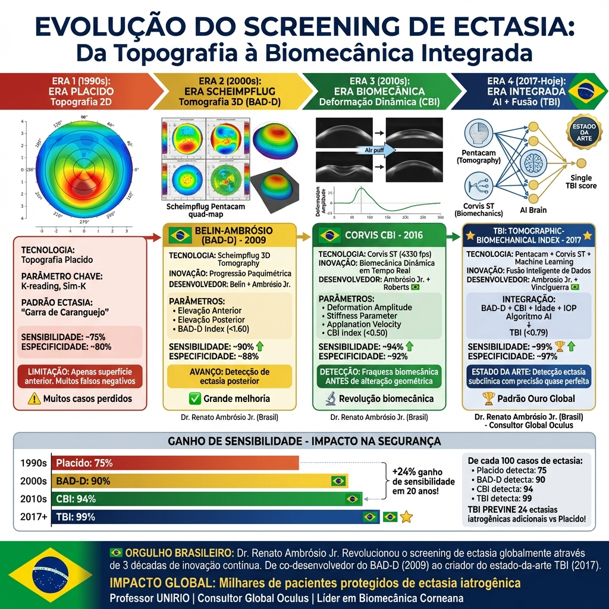
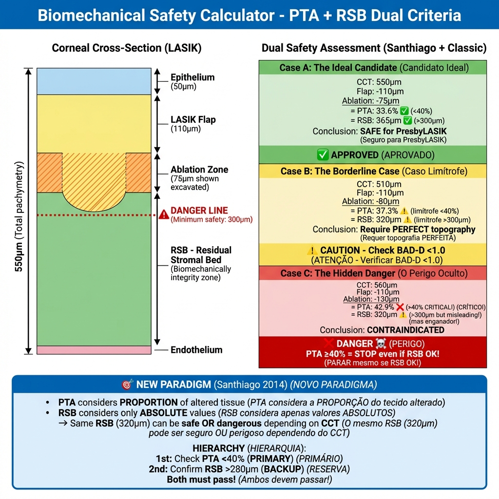
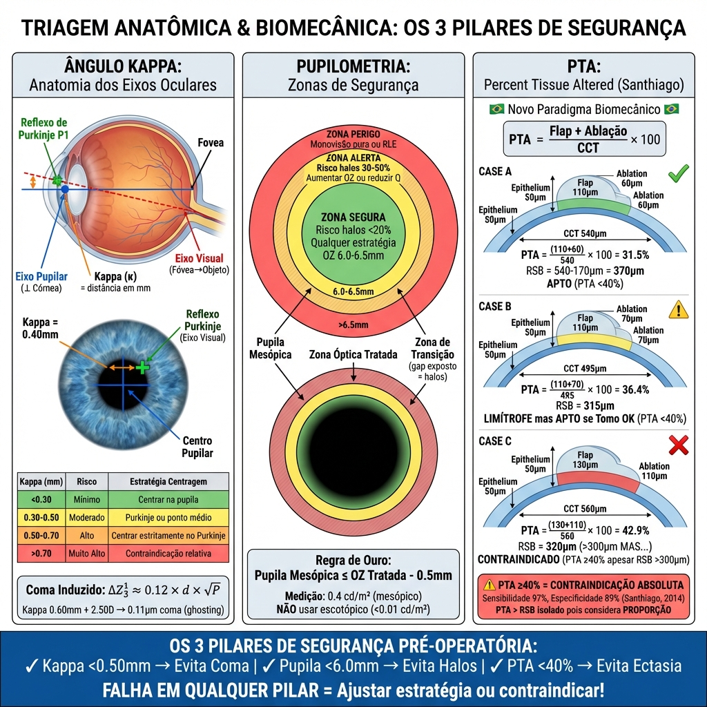

# Capítulo 3: Avaliação Pré-Operatória e Seleção de Pacientes

> [!CAUTION]
> **Importância Clínica Crítica:** A seleção do paciente é o fator determinante do sucesso em cirurgia presbiópica corneana. Ao contrário da cirurgia de catarata, onde a melhoria visual é quase garantida pela remoção da opacidade, a cirurgia refrativa em presbitas (especialmente emétropes ou hipermétropes baixos) envolve um compromisso óptico (compromisso) inevitável entre qualidade de imagem e profundidade de campo. Uma seleção inadequada resulta em insatisfação irreversível. [1]

## 3.1. Perfil do Candidato Ideal à Cirurgia Corneana

A literatura internacional (Alió, Illueca, Reinstein) define janelas de oportunidade precisas para a abordagem corneana (PresbyLASIK/Custom-Q) versus lenticular (Troca de Lente Refrativa - RLE). [2,3]

### 3.1.1. Idade: A Variável Crítica

**Faixa Ideal: 45 a 60 anos**

**Justificação Fisiológica:**

- **Limite Inferior (45 anos):**
  - Acomodação residual: ~3.0-4.0 D (Curva de Duane)
  - Manifestação clínica de presbiopia já estabelecida
  - Cristalino ainda transparente na maioria dos casos (DLS Estádio 1)
  
- **Limite Superior (60 anos):**
  - Risco aumentado de catarata incipiente (LOCS II-III)
  - Aumento das aberrações internas do cristalino
  - Consideração crescente de RLE como solução mais definitiva

**Casos Especiais:**

**Pacientes <45 anos (Presbiopia Precoce):**
- Possível em hipermétropes altos (compensação acomodativa excessiva levando a fadiga cíclica precoce)
- Considerar se sintomas bem documentados e amplitude acomodativa <5.0 D (medida objetivamente via push-up test — ver Seção 1.4 do Capítulo 1 para detalhes metodológicos — ou esperada pela idade segundo Curva de Duane [1])
- **Atenção:** Progressão futura da presbiopia exigirá retoque

*Figura 3.1b: Infográfico ilustrando as janelas de oportunidade em cirurgia presbiópica.*

**Detalhes da Imagem:**

**Objetivo Educacional:**
Um gráfico estilo Gantt que define *quando* fazer *o quê*. Resolve a dúvida comum: "55 anos é velho demais para LASIK ou cedo demais para Lente Intraocular (RLE)?"

---

## 1. Descrição Visual (Layout)

**Formato:** Linha do Tempo Horizontal (Idade: 20 a 80 Anos).

### Zona 1: A Era da Correção Simples (20 - 40 Anos)
*   **Cor:** Azul Claro.
*   **Status do Cristalino:** Claro, Acomodação Ativa.
*   **Procedimento Gold Standard:** LASIK/PRK Monofocal.
*   **Presbiopia:** Ausente.

### Zona 2: O "Sweet Spot" Presbita Corneano (40 - 55 Anos)
*   **Cor:** Verde Vibrante.
*   **Status do Cristalino:** Claro (DLS 0-1), mas Acomodação em falha.
*   **Procedimento Gold Standard:** **PresbyLASIK / Custom-Q**.
*   **Lógica:** O cristalino ainda é bom demais para ser removido, mas a presbiopia já incomoda. É o domínio da córnea.

### Zona 3: A "Zona Cinzenta" Decisional (55 - 65 Anos)
*   **Cor:** Amarelo/Laranja (Gradiente de transição).
*   **Status do Cristalino:** Disfunção do Cristalino (DLS 2). Início de opacidade e aberração esférica interna.
*   **Procedimento:** **Batalha Decisional**.
    *   Se Cristalino Claro + Alta Miopia → PresbyLASIK (Cauteloso).
    *   Se Hipermetropia + DLS 2 → **RLE (Early Cataract)**.
*   **Ícone:** Balança de pratos (Córnea vs. Cristalino).

### Zona 4: A Era Lenticular (65+ Anos)
*   **Cor:** Roxo.
*   **Status do Cristalino:** Catarata ou Pré-Catarata (DLS 3).
*   **Procedimento Gold Standard:** **RLE / Cirurgia de Catarata** com LIO Multifocal.
*   **Lógica:** A córnea não deve ser tocada (preservada para qualidade óptica), a solução é substituir a lente doente.

---

## 2. Elementos Críticos

*   **Sliders de Sobreposição:** Mostrar que pacientes hipermétropes entram na Zona 4 mais cedo (aos 55) do que míopes (aos 65).
*   **Annotação de Risco:** Na Zona 3, adicionar aviso: "Cuidado com o 'Double Whammy' (Aberração Corneana + Aberração Lenticular)".

## 3. Legenda Explicativa
"A cirurgia certa na idade errada é um erro médico. O PresbyLASIK brilha na janela dos 40-55 anos. Tentar estender a sua indicação para a 'Zona Cinzenta' dos 60 anos compete com uma RLE que seria definitiva e mais eficaz."
 

**Pacientes >60 anos:**
- Mandatório: Avaliação lenticular rigorosa (OCT de segmento anterior, densitometria Pentacam)
- Se DLS Estádio 2-3: RLE é preferível
- Se cristalino excepcionalmente claro: Cirurgia corneana ainda viável

### 3.1.2. Erro Refrativo: Estratificação de Resultados

A satisfação cirúrgica varia dramaticamente conforme o erro refrativo de base.

#### Hipermétropes (+0.75 a +4.00 D): Candidatos Ideais

**Taxa de Satisfação Literatura:** 85-95% [4]

**Razões do Sucesso:**

1. **Duplo Benefício Refrativo:**
  - Corrige a hipermetropia de longe (melhoria objetiva)
  - Adiciona profundidade de campo para perto
  - Paciente nunca teve boa visão sem óculos; qualquer ganho é percebido positivamente

2. **Compatibilidade Biomecânica:**
  - Ablação hipermetrópica naturalmente cria perfil prolato/hiper-prolato
  - Sinergismo com algoritmos de indução de aberração esférica negativa

3. **Estabilidade:**
  - Menor risco de regressão comparado a míopes altos (ablação central vs. periférica)

**Limitações por Magnitude:**

| Hipermetropia | Estratégia | Considerações |
|---------------|------------|---------------|
| +0.75 a +2.50 D | **PresbyLASIK ideal** | Ablação <70 μm, estabilidade excelente |
| +2.50 a +4.00 D | PresbyLASIK ou RLE | Considerar idade e qualidade lenticular |
| >+4.00 D | **RLE preferível** | Ablação >100 μm, risco de regressão e haze |

#### Míopes (-1.00 a -6.00 D): Candidatos Complexos

**Taxa de Satisfação Literatura:** 70-85% (inferior a hipermétropes) [5]

**Desafios Específicos:**

1. **Vantagem Natural para Perto:**
  - Míopes têm excelente visão de perto não corrigida
  - Cirurgia "remove" esta capacidade
  - Expectativa psicológica: "Não quero perder a minha leitura"

2. **Oblatividade Pós-LASIK:**
  - LASIK miópico convencional induz Q positivo (oblato)
  - Para criar presbiopia, precisa reverter esta oblatividade e ainda induzir prolatividade
  - Consumo de tecido significativo
  - Risco de aberração esférica positiva excessiva (halos)

3. **Estratégias Adaptadas:**

**Monovisão Modificada (Mais Comum):**
- **Olho dominante:** Corrigido para emetropia (0.00 D)
- **Olho não-dominante:** Deixado em miopia residual (-1.25 a -1.75 D)
- Perfil asférico mínimo ou nulo
- Vantagem: Preserva a "memória muscular" do cérebro de usar um olho para perto

**PresbyLASIK Bilateral (Mais Agressivo):**
- Indução de SA negativa bilateral
- Micro-monovisão (+0.50 D de anisometropia)
- Risco: Halos noturnos mais proeminentes devido à pupila tipicamente maior em míopes jovens

**Valores Críticos de Decisão:**

| Miopia | Pupila Mesópica | Estratégia Recomendada |
|--------|----------------|------------------------|
| -1.00 a -3.00 D | <5.5 mm | PresbyLASIK bilateral viável |
| -1.00 a -3.00 D | >6.0 mm | Monovisão (evitar SA negativa agressiva) |
| -3.00 a -6.00 D | Qualquer | **Monovisão preferencial** |
| >-6.00 D | Qualquer | Considerar Faco-Refrativa ou RLE |

#### Emétropes (±0.50 D): Grupo de Maior Risco

*Figura 3.3b: Algoritmo de decisão restritiva para o alto risco do paciente emétrope.*

**Detalhes da Imagem:**

**Objetivo Educacional:**
Visualizar o conceito de "Seleção Psicológica" do Dr. Guy Holland. Mostrar que o sucesso da cirurgia presbiópica depende tanto da personalidade do paciente quanto da dioptria [13].

---

## 1. Descrição Visual (Layout)

**Formato:** Matriz de Espectro (Slider Scale).

### O Espectro de Personalidade (Eixo X Superior)
Uma barra gradiente que vai do "Obsessivo" ao "Adaptativo".

**Extremo Esquerdo: "O Perfeccionista" (Tipo A / Obsessivo)**
*   **Ícones:** Régua, Esquadro, Lupa.
*   **Características:**
    *   Exige visão 20/20 nítida (J1) em todas as distâncias.
    *   Foca nos defeitos (halos, ligeiro blur).
    *   Baixa tolerância à ambiguidade visual.
    *   Analisa a visão "um olho de cada vez".
*   **Zona Óptica Recomendada:** Monofocalidade (Óculos), Lentes Intraoculares Monofocais.
*   **Risco PresbyLASIK:** MUITO ALTO (Unhappy 20/20 patient).

**Extremo Direito: "O Adaptativo" (Tipo B / Easy-going)**
*   **Ícones:** Rede de descanso, Livro aberto, Paisagem.
*   **Características:**
    *   Prioriza liberdade de óculos sobre nitidez absoluta.
    *   Aceita "bom o suficiente" (J3 é ok para ver o menu).
    *   Ignora defeitos visuais menores.
    *   Vê a imagem "binocularmente".
*   **Zona Óptica Recomendada:** PresbyLASIK Agressivo (Custom-Q), Lentes Trifocais/EDOF.
*   **Risco PresbyLASIK:** BAIXO (Candidato Ideal).

### O "Botão de Sintonização" (Metáfora Central)
Uma imagem central de um botão de volume ou sintonizador de rádio.
*   **Ação:** O cirurgião deve "ajustar" a agressividade do tratamento (Target Q/Adição) de acordo com a posição do paciente neste espectro.
*   **Regra:** "Quanto mais à esquerda (Perfeccionista), MENOS asfericidade induzida."

---

## 2. Legenda Explicativa
"Não operamos olhos, operamos córtexes visuais acoplados a personalidades. Um resultado óptico que encanta um paciente Tipo B pode ser considerado uma mutilação visual por um paciente Tipo A. O 'Filtro de Holland' deve ser aplicado antes de qualquer topografia."

**Taxa de Satisfação Literatura:** 65-80% (mais baixa) [6]

**Razão da Baixa Satisfação:**

- **Excelente visão de longe pré-operatória**
- Qualquer perda de linhas de CDVA (Corrected Distance Visual Acuity) é altamente perceptível
- Não existe "ganho" objetivo em distância
- Todo o benefício é em perto, mas com "custo" em longe

**Critérios de Aceitação Estritos:**

1. **Teste de Lente de Contacto Obrigatório:**
  - Monovisão simulada por 5-7 dias
  - Se paciente reporta tontura, desequilíbrio ou perda de profundidade: **Contraindicação absoluta**

2. **Perfil Psicológico:**
  - Paciente com profissão não-crítica (não engenheiro, não piloto, não cirurgião)
  - Aceitação explícita documentada do compromisso
  - Expectativas realistas ("Vou ler sem óculos, mas a minha visão noturna pode ter halos")

3. **Opção Conservadora:**
  - Target de SA negativa reduzido (-0.30 a -0.40 μm, em vez de -0.50 μm)
  - Micro-monovisão ligeira (-0.75 D no não-dominante, em vez de -1.25 D)

---

## 3.2. Estado do Cristalino: Classificação DLS e Decisão Cirúrgica

A decisão entre cirurgia corneana e lenticular depende fundamentalmente da classificação do **Dysfunctional Lens Syndrome (DLS)**.

### 3.2.1. Propedêutica de Avaliação Lenticular

#### Exame Clínico à Lâmpada de Fenda

**Sistema de Classificação LOCS III (Lens Opacities Classification System III):**

| Parâmetro | Grau 0-1 | Grau 2-3 | Grau 4-6 |
|-----------|----------|----------|----------|
| **Nuclear Opalescence (NO)** | Claro | Amarelamento ligeiro | Opacidade densa |
| **Nuclear Color (NC)** | Incolor | Amarelo/castanho | Castanho escuro |
| **Cortical (C)** | Sem opacidades | Raios/vacúolos <25% | Opacidades >25% área |
| **Posterior Subcapsular (P)** | Ausente | Placa <2mm | Placa >2mm |

**Interpretação para Cirurgia Presbiópica:**
- **LOCS ≤1 em todos os parâmetros:** Cristalino adequado para PresbyLASIK
- **LOCS 2:** Zona cinzenta, avaliação complementar obrigatória
- **LOCS ≥3 em qualquer parâmetro:** RLE indicada

#### Densitometria de Scheimpflug (Pentacam)

**Quantificação Objetiva da Opacidade Nuclear:**

Medição da densidade de retroespalhamento luminoso em unidades Pentacam.

**Valores de Referência:**

| Densidade Média Nuclear | Interpretação | Conduta Cirúrgica |
|-------------------------|---------------|-------------------|
| <8% | Cristalino jovem, claro | **PresbyLASIK seguro** |
| 8-12% | Alterações precoces | Avaliar scatter (OSI) |
| 12-18% | Disfunção moderada (DLS 2) | Considerar RLE se idade >55 |
| >18% | Catarata | **RLE mandatório** |

**Vantagem sobre LOCS:** 
Objetivo, reprodutível, independente de observador.

#### Objective Scatter Index (OSI) – HD Analyzer

O OSI quantifica o **scatter de luz intraocular**, correlacionando diretamente com queixas de glare e halos.

**Metodologia:** 
Análise de duplo passo (double-pass) da PSF.

**Valores Normativos:**

| Idade | OSI Normal | OSI Limítrofe | OSI Anormal |
|-------|-----------|---------------|-------------|
| 20-40 anos | <0.7 | 0.7-1.0 | >1.0 |
| 40-55 anos | <1.0 | 1.0-1.5 | >1.5 |
| 55-65 anos | <1.5 | 1.5-2.5 | >2.5 |
| >65 anos | <2.0 | 2.0-3.0 | >3.0 |

**Interpretação para PresbyLASIK:**

- **OSI <1.0:** Excelente qualidade óptica lenticular, candidato ideal
- **OSI 1.0-2.0:** Scatter ligeiro, prosseguir com cautela
  - Avisar paciente que fenómenos fóticos pós-LASIK podem ser magnificados
- **OSI >2.0:** Alto scatter interno
  - **Contraindicação relativa** para PresbyLASIK (adicionar SA negativa corneana não criará DoF eficaz)
  - Favorecer RLE

#### Aberrometria Total vs. Corneana (iTrace / OPD-Scan)

**Objetivo:** 
Isolar as aberrações internas (predominantemente lenticulares) das aberrações corneanas.

**Cálculo:**
$$\text{Aberrações Internas} = \text{Aberrações Totais Oculares} - \text{Aberrações Corneanas}$$

**Aberração Esférica Interna ($Z_4^0$ interno):**

| SA Interna (6 mm) | Interpretação | Decisão Cirúrgica |
|-------------------|---------------|-------------------|
| +0.05 a +0.15 μm | Cristalino jovem normal | **PresbyLASIK ideal** |
| +0.15 a +0.30 μm | Envelhecimento lenticular | Prosseguir, mas reduzir target SA negativa corneana |
| >+0.30 μm | Disfunção óptica lenticular | **Contraindicar PresbyLASIK** (RLE preferível) |

**Raciocínio:** 
Se o cristalino já possui SA positiva elevada, adicionar SA negativa corneana pode:
1. Anular-se mutuamente (sem ganho de DoF)
2. Criar aberrações de alta ordem complexas (coma, trefoil) por interação não-linear

---

## 3.3. Propedêutica Corneana Essencial

### 3.3.1. Tomografia de Segmento Anterior (Pentacam / Galilei)

**Objetivos:**

1. **Rastreio de Ectasia (Queratocone Frustre)**
2. **Avaliação de Biomecânica (Espessura e Distribuição Paquimétrica)**
3. **Medição de Asfericidade (Q-value)**

#### Protocolo de Interpretação Sistemática (Baseado em Sinjab)

A análise tomográfica nesta obra segue o rigoroso protocolo "Five Steps to Start" preconizado pelo **Prof. Mazen Sinjab** [35,36], garantindo uma avaliação hierárquica e à prova de falhas:

1. **Qualidade de Captura (QS):** Confirmação técnica prévia.
2. **Mapas de Curvatura (Axial/Tangencial):** Identificação de padrões (Symmetric Bowtie, Asymmetric, Skewed).
3. **Mapas de Elevação (BFS):** Análise da elevação anterior e posterior (ilhas de elevação).
4. **Mapa Paquimétrico:** Avaliação da espessura no ponto mais fino e progressão paquimétrica.
5. **Integração Biomecânica (Tomographic/Biomechanical Index):** Correlação final para decisão.

> [!NOTE]
> **Nota Pessoal do Autor:** O protocolo sistemático de interpretação tomográfica preconizado pelo Prof. Sinjab foi fundamental na formação clínica do autor. Sua abordagem metodológica — "mapa-por-mapa, índice-por-índice, nunca pular etapas" — ensina que **a segurança em cirurgia refrativa não vem de intuição, mas de sistematização rigorosa**. Cada árvore de decisão deste livro (especialmente Capítulo 13) reflete esta filosofia de análise hierárquica que Sinjab incorpora em suas obras *Refractive Surgery: A Guide to Assessment and Management* (2015) e *Boilerplate for Corneal Tomography* (2012), referências obrigatórias para qualquer cirurgião refrativo sério.

> **Prof. Mazen Sinjab** é reconhecido globalmente como um dos maiores educadores em propedêutica corneana moderna. Sua metodologia de ensino — combinando fundamentação teórica profunda com protocolos práticos de leitura tomográfica — formou gerações de cirurgiões refrativos ao redor do mundo. Suas obras são consideradas "bíblias" da interpretação de Scheimpflug, traduzindo complexidade técnica em algoritmos decisórios aplicáveis.

Esta sistematização é fundamental para distinguir corneas normais, suspeitas e patológicas com precisão.

*Figura 3.0: Fluxograma de triagem propedêutica e propedêutica armada para avaliação sistemática de segurança biomecânica.*

#### Parâmetros de Rastreio de Ectasia

**Índices de Belin-Ambrósio Enhanced Ectasia Display (BAD-D):**

| Parâmetro | Normal | Suspeito | Ectásico |
|-----------|--------|----------|----------|
| **BAD-D** | <1.60 | 1.60-2.60 | >2.60 |
| **TBI (Corvis)** | <0.50 | 0.50-0.79 | ≥0.80 |
| **CBI (Corvis)** | <0.50 | 0.50-0.79 | ≥0.80 |

**Contraindicação Absoluta de PresbyLASIK:**
- BAD-D >1.60
- ISV (Index of Surface Variance) >37
- IVA (Index of Vertical Asymmetry) >0.28

> [!NOTE]
> **Contribuição Brasileira: Dr. Renato Ambrósio Jr.** 🇧🇷
>
> O **BAD-D (Belin-Ambrósio Enhanced Ectasia Display)** foi co-desenvolvido pelo brasileiro **Dr. Renato Ambrósio Jr.**, Professor da Universidade Federal do Estado do Rio de Janeiro e fundador do Rio de Janeiro Corneal Tomography and Biomechanics Study Group.
>
> **Evolução Revolucionária:**
> 1. **BAD-D (2009):** Integração de elevação anterior, posterior e progressão paquimétrica em índice único - Sensibilidade ~90%
> 2. **CBI - Corvis Biomechanical Index (2016):** Primeiro índice combinando deformação corneana dinâmica - Sensibilidade ~94% 
> 3. **TBI - Tomographic Biomechanical Index (2017):** Fusão de tomografia Scheimpflug + biomecânica Corvis ST com Inteligência Artificial - **Sensibilidade ~99%** [21,22]
>
> **Impacto Clínico:** O TBI representa o **estado da arte** em screening pré-LASIK, detectando ectasia subclínica que escapa à topografia convencional e mesmo ao BAD-D isolado. A integração de biomecânica dinâmica com tomografia estática revolucionou a segurança da cirurgia refrativa globalmente.
>
> **Orgulho Brasileiro:** Assim como Santhiago com o PTA, Ambrósio é consultor global da Oculus (Pentacam) e seus índices salvaram incontáveis pacientes de ectasia iatrogênica. Dois brasileiros, dois pilares da segurança refrativa mundial. 🇧🇷

**Raciocínio:** 
Ablações presbiópicas (especialmente hipermetrópicas) thin the cornea perifericamente e induzem biomechanical stress. Córneas suspeitas podem sofrer ectasia iatrogénica pós-cirúrgica.

#### Biomecânica Dinâmica Avançada: CBI e TBI (Ambrósio)

**Limitação do BAD-D Isolado:** 
Topografia e paquimetria são medidas **estáticas**. Córneas com ceratocone incipiente podem ter geometria normal mas apresentar **fraqueza biomecânica** (rigidez reduzida). O BAD-D pode ser falsamente normal nestes casos.

**Corvis ST: Avaliação Dinâmica da Deformação Corneana**

O Corvis ST (Oculus) dispara pulso de ar controlado e captura deformação corneana em alta velocidade (4330 frames/segundo) usando câmera Scheimpflug de ultra-alta velocidade.

**Parâmetros Biomecânicos Medidos:**
- **Deformation Amplitude (DA):** Profundidade máxima de deformação (córneas fracas deformam mais)
- **Stiffness Parameter at A1 (SP-A1):** Resistência à deformação (córneas ceratocônicas têm SP baixo)
- **Maximum Deformation Radius:** Raio de curvatura no pico de deformação
- **Applanation Velocity:** Velocidade de aplanação (córneas rígidas respondem mais rápido)

**CBI (Corvis Biomechanical Index) - Ambrósio et al., 2016:**

Índice combinado usando Machine Learning para integrar múltiplos parâmetros biomecânicos, distinguindo olhos normais de ceratocone.

| CBI | Interpretação | Biomecânica | Conduta |
|-----|---------------|-------------|---------|
| <0.50 | Normal | Rigidez adequada | ✅ Seguro para LASIK |
| 0.50-0.79 | Borderline | Rigidez reduzida | ⚠️ Avaliar TBI ou considerar PRK |
| ≥0.80 | Ectasia | Fraqueza biomecânica | ❌ Contraindicação absoluta |

**TBI (Tomographic-Biomechanical Index) - Ambrósio et al., 2017:**

**Conceito:** Fusão de **BAD-D (tomografia estática)** + **CBI (biomecânica dinâmica)** usando algoritmos de Inteligência Artificial.

$$\text{TBI} = f_{IA}(\text{BAD-D}, \text{CBI}, \text{idade}, \text{IOP})$$

> **O TBI usa Machine Learning para combinar tomografia + biomecânica, detectando padrões sutis de ectasia invisíveis ao olho humano e superiores a cada índice isolado.**

| TBI | Interpretação | Conduta |
|-----|---------------|---------|
| <0.50 | Normal | ✅ Seguro LASIK |
| 0.50-0.79 | Borderline | ⚠️ PRK preferível ou crosslinking profilático |
| ≥0.80 | Ectasia | ❌ Contraindicação absoluta |

**Performance Diagnóstica Comparativa (Vinciguerra et al., 2016):**

| Índice | AUC (Área sob ROC) | Sensibilidade | Especificidade |
|--------|-------------------|---------------|----------------|
| **TBI** | **0.996** | **98.7%** | **97.2%** |
| BAD-D sozinho | 0.932 | 89.4% | 88.1% |
| CBI sozinho | 0.977 | 94.3% | 92.6% |

**Ganho do TBI:** +9.3% sensibilidade vs BAD-D, +4.4% vs CBI

**Caso Clínico Ilustrativo:**

Paciente feminino, 45 anos, +2.00 D, candidata PresbyLASIK.

**Avaliação Convencional:**
- Topografia Placido: Normal (symmetric bowtie)
- BAD-D: **1.45** (Normal <1.60) ✅
- Paquimetria: 520 μm (adequada)
- **Decisão preliminar:** APTA para LASIK

**Avaliação Biomecânica (Corvis ST):**
- CBI: **0.68** (Borderline 0.50-0.79) ⚠️
- Deformation Amplitude: Aumentada (1.18 mm, normal <1.10 mm)
- Stiffness Parameter: Reduzido

**Integração (TBI):**
- TBI: **0.75** (Borderline, próximo a 0.79) ⚠️

**Decisão Final Ajustada:** 
Córnea **biomecanicamente fraca** apesar de geometria normal. Opções:
1. **PRK conservador** (preserva biomecânica, sem flap)
2. **Crosslinking profilático** + cirurgia pós 6 meses (técnica Athens Protocol)
3. **Contraindicar** cirurgia corneana, considerar RLE

**Disponibilidade e Custo:**
- **CBI:** Requer Corvis ST (Oculus) - Custo ~R$ 200-300k
- **TBI:** Requer Pentacam + Corvis ST + software TBI - Custo total ~R$ 400-500k

**Alternativas sem TBI:**
Se TBI indisponível, **BAD-D + PTA ainda fornecem triagem robusta**. Em casos limítrofes:
- Favorecer **PRK** sobre LASIK
- Aplicar **margens de segurança mais conservadoras** (PTA <35% em vez de <40%)
- **Acompanhamento seriado** (topografia 6-12 meses para detectar progressão)

*Figura 3.9: Evolução Cronológica do Screening de Ectasia - Contribuições de Dr. Renato Ambrósio Jr. 🇧🇷 **Era 1 (1990s - Placido):** Topografia 2D com padrão "garra de caranguejo", sensibilidade 75%, muitos falsos negativos. **Era 2 (2000s - BAD-D):** Tomografia 3D Scheimpflug, co-desenvolvido por Belin + Ambrósio Jr., integração de elevação anterior/posterior + progressão paquimétrica, sensibilidade 90% (+15%). **Era 3 (2010s - CBI):** Biomecânica dinâmica com Corvis ST (4330 fps), desenvolvido por Ambrósio Jr. + Roberts, primeiro índice de deformação corneana em tempo real, sensibilidade 94% (+4%). Detecção de fraqueza biomecânica ANTES de alteração geométrica. **Era 4 (2017-Hoje - TBI):** Estado da Arte - fusão de tomografia + biomecânica com Machine Learning, desenvolvido por Ambrósio Jr. + Vinciguerra, integração inteligente BAD-D + CBI + idade + IOP, sensibilidade 99% (+5%). **Painel Inferior:** Gráfico de evolução mostrando ganho cumulativo de +24% sensibilidade em 20 anos. Impacto clínico: De cada 100 casos de ectasia, Placido detectava 75, BAD-D 90, CBI 94, TBI 99 - prevenindo 24 ectasias iatrogênicas adicionais vs método antigo. **Destaque:** Bandeiras brasileiras 🇧🇷 em todas contribuições de Ambrósio (Eras 2, 3, 4). **Rodapé:** Dr. Renato Ambrósio Jr. revolucionou screening de ectasia globalmente através de 3 décadas de inovação contínua, de co-desenvolvedor do BAD-D (2009) ao criador do TBI estado-da-arte (2017). Professor UNIRIO, Consultor Global Oculus, milhares de pacientes protegidos mundialmente.*

#### Espessura Corneana e Leito Estromal Residual (RSB)

*Figura 3.7b: Representação dos limites biomecânicos e interação entre espessura, ablação e risco ectásico.*

**Regra de Segurança:**
$$\text{LER} = \text{Paquimetria Mínima} - \text{Flap/Epitélio} - \text{Ablação} > 300 \, \mu m$$

Para PRK (sem flap):
$$\text{LER} = \text{Paquimetria Mínima} - 50 \, \mu m - \text{Ablação} > 300 \, \mu m$$

**Ablação Hiperópica Típica (+2.00 D presbyopic correction, zona óptica 6.0 mm):**
- Ablação central: ~10-15 μm
- Ablação periférica máxima: ~60-80 μm

**Exemplo de Cálculo:**

Paciente: +2.00 D hipermétrope, age 50, candidato PresbyLASIK (LASIK com Q target -0.80).

- Paquimetria central: 540 μm
- Paquimetria mínima (paracentral): 520 μm
- Flap (LASIK 110 μm): 110 μm
- Ablação periférica prevista: 75 μm

$$\text{LER} = 520 - 110 - 75 = 335 \, \mu m \, \checkmark \, \text{(Seguro)}$$

Se paquimetria mínima fosse 480 μm:
$$\text{LER} = 480 - 110 - 75 = 295 \, \mu m \, \times \, \text{(Limítrofe - Considerar PRK ou RLE)}$$

#### Curvatura e Asfericidade Corneana

**Queratometria (K) e Faixa Operável:**

| K Médio | Categoria | Implicações PresbyLASIK |
|---------|-----------|-------------------------|
| <40.00 D | **Córnea plana** | Risco de hipocorreção e regressão; reduzir target Q |
| 40.00-46.00 D | **Normal** | Ideal para cirurgia presbiópica |
| 46.00-48.00 D | **Córnea curva** | Viável mas aguarda maior indução de aberrações |
| >48.00 D | **Muito curva** | Suspeitar queratocone; rastreio ectasia obrigatório |

**Asfericidade Pré-Operatória (Q-value):**

Córneas muito oblatas (Q >+0.30, tipicamente pós-LASIK miópico prévio) ou muito prolatas (Q <-0.60) respondem de forma imprevisível à manipulação adicional de asfericidade.

**Regra Clínica:** 
Se Q pré-operatório estiver fora da faixa -0.10 a -0.40, o algoritmo de cálculo de Q-target deve ser ajustado ou alternativas não-corneanas devem ser consideradas.

---

### 3.3.2. Aberrometria e Centragem: Ângulo Kappa/Alpha

O descentramento da ablação multifocal **é a principalcausa de insucesso** em PresbyLASIK, induzindo coma vertical e diplopia monocular.

#### Anatomia dos Eixos Oculares

**Eixo Visual:** 
Linha que conecta o ponto de fixação foveal ao objeto fixado, passando pelo ponto nodal.

**Eixo Pupilar:** 
Linha perpendicular à córnea que passa pelo centro geométrico da pupila de entrada.

**Ângulo Kappa (κ):** 
Ângulo entre o eixo visual e o eixo pupilar. Equivalente clínico: distância linear entre o reflexo de Purkinje (1ª imagem de Purkinje = representação do eixo visual) e o centro da pupila.

**Ângulo Alpha (α):** 
Ângulo entre o eixo visual e o eixo óptico (linha de simetria do sistema óptico).

**Na Prática Clínica:** 
Kappa e Alpha são frequentemente confundidos; a medida relevante é o **Chord Mu** ou **Distância Kappa**, medida em mm.

#### Medição do Ângulo Kappa

**Métodos:**

1. **Manual (Offset de Purkinje):**
  - Paciente fixa luz coaxial
  - Medir distância do reflexo de Purkinje ao centro pupilar
  - Instrumento: régua milimetrica na lâmpada de fenda

2. **Automatizado (Topografia/Aberrometria):**
  - Pentacam: "Pupil Center Corneal Vertex Distance"
  - iTrace: "Kappa Angle"
  - OPD-Scan III: "Angle Kappa"

**Valores de Referência e Decisão Cirúrgica:**

| Kappa (mm) | Classificação | Risco em PresbyLASIK | Estratégia de Centragem |
|------------|---------------|----------------------|-------------------------|
| <0.30 mm | Baixo | **Mínimo** | Centrar na pupila (aceitável) |
| 0.30-0.50 mm | Moderado | **Moderado** | Centrar no Purkinje ou ponto médio |
| 0.50-0.70 mm | Alto | **Alto (coma induzido)** | Centrar estritamente no Purkinje |
| >0.70 mm | Muito alto | **Contraindicação relativa** | Considerar RLE ou monovisão pura (sem multifocalidade) |

**Cálculo de Indução de Coma por Descentramento:**

Fórmula aproximada (derivada de modelos de Zernike):
$$\Delta Z_3^1 \approx 0.12 \times d \times \sqrt{P}$$

Onde:
- **d** = descentramento em mm
- **P** = potência da ablação em dioptrias

**Exemplo Clínico:**

Paciente hipermétrope +2.50 D com Kappa = 0.60 mm.

Se a ablação for centrada na pupila (ignorando Kappa):
$$\Delta Z_3^1 = 0.12 \times 0.60 \times \sqrt{2.5} \approx 0.11 \, \mu m$$

Este valor de coma induzido é suficiente para causar sintomas de "ghosting" vertical (imagem dupla monocular).

**Conduta:** 
Centrar ablação no reflexo de Purkinje (eixo visual) em vez do centro pupilar.

---

### 3.3.3. Superfície Ocular e Filme Lacrimal

**Princípio Fundamental:** 
O filme lacrimal é a primeira superfície refrativa do olho (~40% da potência dióptrica total). Irregularidades lacrimais degradam qualquer correção óptica corneana.

#### Avaliação da Superfície Ocular

**1. Questionários Validados:**

- **OSDI (Ocular Surface Disease Index):** Score 0-100
  - <13: Normal
  - 13-22: Olho seco ligeiro
  - 23-32: Olho seco moderado
  - >32: Olho seco severo

**2. Testes Objetivos:**

**Tempo de Rutura do Filme Lacrimal (BUT - Break-Up Time):**
- Normal: >10 segundos
- Borderline: 5-10 segundos
- **Patológico (<5 segundos): Tratar obrigatoriamente antes de cirurgia**

**Teste de Schirmer (Produção Lacrimal):**
- Normal: >15 mm em 5 minutos
- Borderline: 10-15 mm
- **Severo (<5 mm): Contraindicação relativa; pré-tratar agressivamente**

**3. Avaliação das Glândulas de Meibomius:**

**Meibografia (LipiView / Sirius):**
- Grau 0: Sem perda glandular
- Grau 1: <25% perda
- Grau 2: 25-50% perda
- **Grau 3-4 (>50% perda): Alto risco de olho seco pós-LASIK severo**

**Disfunção de Meibomius (MGD) e PresbyLASIK:**

Pacientes com MGD moderada a severa desenvolvem olho seco sintomático muito agressivo pós-LASIK devido a:
1. Transecção de nervos corneanos (diminui reflexo lacrimal)
2. Irregularidade da superfície amplifica sintomas de irritação
3. Aberrações induzidas magnificam a irregularidade do filme lacrimal

**Protocolo de Pré-Tratamento:**

Antes de PresbyLASIK em paciente com MGD:
1. Express glandular (compressas quentes + massagem)
2. Lágrimas artificiais sem conservante 4x/dia
3. Suplementação oral Ómega-3 (1000-2000 mg/dia)
4. Considerar IPL (Intense Pulsed Light) ou expressão glandular profissional (Lipiflow)
5. **Reavaliação após 3 meses de tratamento**

---

### 3.3.4. Pupilometria e Protocolo de Segurança Pupilar

#### A Divergência na Literatura: 6,0 mm vs. 6,5 mm

Na literatura contemporânea sobre cirurgia de presbiopia, observa-se uma aparente divergência nos critérios de segurança pupilar. Algumas publicações referenciam **pupila mesópica de 6,0 mm** como limite de segurança, [8,9] enquanto outras sugerem **6,5 mm**. [10,11]

Esta divergência **não é uma contradição**, mas sim reflexo da **zona óptica efetiva (OZ)** utilizada por diferentes plataformas laser e algoritmos:

- Se o laser trata uma OZ de **6,0 mm** e a pupila dilata para **6,5 mm** em condições mesópicas, o paciente **experimentará halos severos** devido à exposição da zona de transição abrupta.
- Se o laser permite tratar uma OZ de **6,5 mm** ou **7,0 mm** (como Schwind Amaris), uma pupila mesópica de 6,5 mm permanece **segura**, pois está coberta pela zona tratada.

> [!IMPORTANT]
> **Regra Fundamental:** 
> O risco não está no tamanho absoluto da pupila, mas na **relação entre Diâmetro Pupilar Mesópico e Zona Óptica Tratada**.

**Fórmula de segurança:**
$$\text{Pupila Mesópica} \leq \text{OZ Tratada} - 0.5 \, \text{mm}$$

---

#### Protocolo de Classificação de Risco Pupilar

Para padronização neste tratado e empoderamento do cirurgião, estabelecemos a seguinte estratificação baseada na **pupilometria mesópica dinâmica** (medida em penumbra 0,4 cd/m², não escuro absoluto):

##### **1. Zona de Segurança (Verde): Pupila Mesópica < 6,0 mm**

**Status:** ✅ **IDEAL**

**Racional:** 
A pupila permanece contida dentro da zona óptica multifocal típica (6,0-6,5 mm para maioria dos lasers). O risco de disfotopsias noturnas (halos, glare) é **mínimo** (<10-20%).

**Conduta:** 
Paciente é candidato ideal para estratégias de adição total:
- **PresbyCor:** Q-target -0.8 a -1.0
- **PresbyMAX Symmetric:** Adição +2.00 D
- **SUPRACOR:** Perfil agressivo (zona central 3,3 mm)
- **PRESBYOND:** Blended Vision completo

**Referências Específicas por Plataforma:**
- **Alcon Wavelight:** OZ 6,0-6,5 mm → Pupila <6,0 mm = zona verde [16]
- **Schwind Amaris:** OZ até 7,0 mm → Margem ampla de segurança [17]
- **Zeiss MEL 90:** OZ 6,0-6,5 mm → Pupila <6,0 mm = ideal [18]
- **Bausch+Lomb Technolas:** OZ fixa 6,5 mm (SUPRACOR) → Pupila <6,0 mm = ideal [19]

---

##### **2. Zona de Alerta (Amarelo): Pupila Mesópica 6,0-6,5 mm**

**Status:** ⚠️ **ATENÇÃO**

**Racional:** 
O paciente está no limite. Em condições de direção noturna ou cinema, a pupila pode expor a zona de transição do laser, onde a mudança de curvatura é mais abrupta. Risco de **halos moderados** (30-50%).

**Conduta (Ajuste de Nomograma):**

**Opção A - Aumentar Zona Óptica:**
- Se paquimetria permitir (espessura >540 μm), ampliar OZ para **6,5-7,0 mm**
- Cálculo de viabilidade:
$$\text{Ablação periférica máxima} \approx \text{Esfera} \times 0.15 \times \text{OZ}^2$$
$$\text{RSB} = \text{Paquimetria} - \text{Flap} - \text{Ablação periférica} > 300 \, \mu m$$

**Exemplo Clínico:**
- Paciente: +2.00 D, paquimetria 520 μm, pupila mesópica 6,3 mm
- OZ ampliada para 6,5 mm: Ablação periférica ~75 μm
- RSB = 520 - 110 (flap) - 75 = **335 μm** ✅ Seguro

**Opção B - Reduzir Agressividade do Perfil:**
- **PresbyCor:** Alterar Q-target de -0.8 para **-0.6** (suaviza perfil, reduz halos)
- **PresbyMAX:** Reduzir adição de +2.00 D para **+1.50 D**
- **SUPRACOR:** **Contraindicar** (OZ fixa 6,5 mm + pupila 6,5 mm = zona de transição exposta)

**Opção C - Priorizar Blended Vision:**
- **PRESBYOND (Zeiss):** Estratégia preferencial
  - Depende mais de micro-monovisão (disparidade refrativa binocular)
  - Menos dependente de multifocalidade corneana agressiva
  - Melhor tolerado em pupilas grandes [20]

**Protocolo Clínico Obrigatório:**
1. Informar paciente sobre **risco elevado de halos** noturnos (consentimento específico documentado)
2. Teste de lente de contacto **obrigatório** se estratégia não for ajustada (monovisão simulada 7-10 dias)
3. Se paciente é condutor profissional noturno (caminhoneiro, taxista) → **Considerar contraindicar**

---

##### **3. Zona de Perigo (Vermelho): Pupila Mesópica > 6,5 mm**

**Status:** 🛑 **CONTRAINDICAÇÃO RELATIVA/ABSOLUTA**

**Racional:** 
Com pupilas mesópicas acima de 6,5 mm, é biomecanicamente difícil criar uma zona óptica multifocal que cubra toda a entrada pupilar sem remover tecido excessivo. O risco de **halos incapacitantes** é alto (>70%).

**Fisiopatologia:**
- Aberrações crescem exponencialmente com diâmetro pupilar ($\propto d^5$ para aberração esférica)
- OZ >7,0 mm consome tecido periférico proibitivo (ablação >100-120 μm em hipermétropes +2.00 D)
- PTA (Percentage Tissue Altered) >40% → Risco biomecânico de ectasia pós-LASIK [21]

**Conduta:**

**Evitar Absolutamente:**
- Perfis multifocais centrais agressivos (SUPRACOR, PresbyMAX Symmetric com adição >+1.50 D)
- Custom-Q com Q-target <-0.70

**Alternativas Viáveis:**

**Opção 1 - Monovisão Pura com Baixa Asfericidade:**
- Olho dominante: 0.00 D, Q-target **-0.30** (mínimo, apenas para compensar indução oblata)
- Olho não-dominante: -1.25 a -1.50 D, Q-target **-0.40**
- Sem multifocalidade corneana agressiva
- Dependência total de disparidade binocular para profundidade de campo
- **Taxa de halos:** ~20-30% (controlável) [22]

**Opção 2 - Contraindicar Cirurgia Corneana:**
- Favorecer **RLE (Troca de Lente Refrativa)** com LIO EDOF ou multifocal
- LIOs modernas (Symfony, Vivity, Synergy, PanOptix) têm desempenho independente de pupila
- Se cristalino DLS Estádio 1 (muito claro sem scatter), aguardar progressão ou aceitar técnica intraocular eletiva

**Taxa de Halos Severos na Literatura:**
- Pupila >6,5 mm + OZ 6,0 mm + multifocal agressivo: **70-85%** halos noturnos incapacitantes [23]
- Pupila >7,0 mm: **Contraindicação absoluta** (consensus statement ESCRS) [24]

---

#### Tabela de Síntese Clínica

| Pupila Mesópica | Classificação | Risco de Halos | Conduta Cirúrgica | Plataformas Viáveis |
|----------------|---------------|----------------|-------------------|---------------------|
| **< 5,0 mm** | 🟢 Verde (Ideal) | Mínimo (<10%) | Qualquer estratégia | Todas |
| **5,0-6,0 mm** | 🟢 Verde (Segura) | Baixo (10-20%) | Estratégias de adição total | Todas |
| **6,0-6,5 mm** | 🟡 Amarelo (Alerta) | Moderado (30-50%) | Aumentar OZ ou reduzir Q / Preferir PRESBYOND | PresbyCor conservador, PRESBYOND, PresbyMAX (OZ ampliada) |
| **> 6,5 mm** | 🔴 Vermelho (Perigo) | Alto (>70%) | Monovisão pura ou RLE | Monovisão mínima asfericidade |

---

#### Síntese para o Cirurgião

> **"Trate a Pupila, não apenas a Refração."**
>
> Se a pupila mesópica for **> 6,0 mm**, você deve obrigatoriamente:
> 1. **Aumentar a zona óptica** de tratamento para cobrir a dilatação, OU
> 2. **Reduzir a indução de asfericidade** (Q-target menos negativo), OU
> 3. **Optar por estratégia menos multifocal** (Blended Vision, Monovisão).
>
> Se nenhuma destas opções for viável sem comprometer o leito estromal residual (PTA >40%), o paciente **não deve ser operado** com técnica multifocal corneana.

---

#### Medição Correta da Pupilometria Mesópica

**Equipamentos Validados:**
- Pentacam Pupillometry (Oculus)
- iTrace (Tracey Technologies)
- OPD-Scan III (Nidek)
- Sirius (CSO)

**Condição de Iluminação Padronizada:**
- **Mesópico:** 0,4 cd/m² (penumbra, simulando condições de direção noturna urban)
- **Escotópico** (escuro total <0,01 cd/m²): **NÃO usar** para decisão cirúrgica (superestima pupila em ~0,5-1,0 mm)

**Protocolo de Medição:**
1. Paciente adaptado à penumbra por **5 minutos** (permite estabilização pupilar)
2. Medição automática de diâmetro pupilar horizontal e vertical
3. Usar **média aritmética** dos dois olhos se simétricos
4. Repetir medição se diferença >0,5 mm entre olhos (assimetria patológica - Síndrome de Adie?)
5. Documentar no prontuário com timestamp e condição de iluminação

**Armadilha Comum:** 
Não confundir pupila **mesópica** (0,4 cd/m², decisão cirúrgica) com pupila **escotópica** (<0,01 cd/m², valor superestimado usado em estudos militares mas irrelevante para vida civil).

*Figura 3.8: Triagem Anatômica & Biomecânica - Os 3 Pilares de Segurança. **Painel Esquerdo (Ângulo Kappa):** Anatomia dos eixos oculares mostrando Eixo Visual (linha vermelha tracejada da fóvea ao objeto) vs Eixo Pupilar (linha azul perpendicular à córnea). Reflexo de Purkinje marca eixo visual. Tabela de risco por distância Kappa (<0.30mm verde mínimo, 0.30-0.50mm amarelo moderado, 0.50-0.70mm laranja alto, >0.70mm vermelho contraindicação relativa). Fórmula de Coma induzido: ΔZ₃¹ ≈ 0.12 × d × √P. Exemplo: Kappa 0.60mm + 2.5D → 0.11μm coma (ghosting). **Painel Central (Pupilometria):** Zonas concêntricas de segurança pupilar. Zona Verde (<6.0mm, risco halos <20%, qualquer estratégia viável), Zona Amarela (6.0-6.5mm, risco 30-50%, aumentar OZ ou reduzir Q), Zona Vermelha (>6.5mm, risco >70%, monovisão pura ou RLE). Diagrama mostra relação entre Zona Óptica Tratada e Pupila Mesópica - gap exposto = halos. Regra de Ouro: Pupila Mesópica ≤ OZ Tratada - 0.5mm. Medição em 0.4 cd/m² (mesópico). **Painel Direito (PTA - Santhiago):** Novo Paradigma Biomecânico brasileiro. Fórmula: PTA = (Flap + Ablação) / CCT × 100. Três casos em corte corneano: Caso A (CCT 540μm, PTA 31.5%, RSB 370μm - APTO verde), Caso B (CCT 495μm, PTA 36.4%, RSB 315μm - LIMÍTROFE amarelo mas APTO se tomografia normal), Caso C (CCT 560μm, PTA 42.9%, RSB 320μm - CONTRAINDICADO vermelho apesar RSB >300μm). Threshold crítico: PTA ≥40% = Contraindicação Absoluta (Sensibilidade 97%, Especificidade 89%, Santhiago 2014). PTA superior a RSB isolado pois considera PROPORÇÃO. **Barra Inferior:** Os 3 Pilares - Kappa <0.50mm evita Coma, Pupila <6.0mm evita Halos, PTA <40% evita Ectasia. Falha em qualquer pilar = ajustar estratégia ou contraindicar.* [15]

---

## 3.4. Testes Funcionais e Simulação Pré-Operatória

### 3.4.1. Teste de Tolerância à Monovisão (Lente de Contacto)

**Gold Standard** para prever neuroadaptação.

**Protocolo:**

1. **Dominância Ocular:** [14]
  - Teste do buraco (Hole-in-Card test)
  - Teste de convergência
  
2. **Simulação:**
  - **Olho dominante:** Lente de contacto para emetropia (0.00 D)
  - **Olho não-dominante:** Lente de contacto induzindo miopia de -1.25 a -1.50 D

3. **Período de Teste:**
  - Mínimo: 3-5 dias
  - Ideal: 7-10 dias (permite neuroadaptação inicial)

4. **Avaliação:**

**Sucesso (Prosseguir Cirurgia):**
- Visão binocular confortável
- Leitura funcional sem óculos
- Sem tontura, náusea ou desequilíbrio
- Condução sem limitações

**Falha (Contraindicação):**
- Queixas de "visão estranha" persistentes
- Tontura ou náusea
- Dificuldade em tarefas de percepção de profundidade (estacionar, subir escadas)
- Paciente remove lente de contacto frequentemente

**Taxa de Intolerância na Literatura:** 10-15% dos pacientes falham teste de monovisão [7]

### 3.4.2. Simulação Visual com Software (iTrace Vision Simulator)

Permite ao paciente "ver" como será a sua visão pós-cirurgia através de:

1. **Captura de Frente de Onda Pré-Operatória**
2. **Modelação do Tratamento Planeado** (incorporando Q-target, SA induzida)
3. **Cálculo de Frente de Onda Pós-Operatória Prevista**
4. **Geração de Imagens Simuladas:**
  - Leitura de texto (jornal, menu)
  - Cena noturna (luzes de automóveis, street lights)
  - Rosto humano (reconhecimento facial)

**Valor Clínico:** 
Gestão de expectativas e consentimento informado visual. Paciente pode rejeitar cirurgia ao ver simulação de halos noturnos.

---
## 3.5. Contraindicações: Absolutas e Relativas

### 3.5.1. Contraindicações Absolutas

*Figura 3.10: Matriz colorida categorizando riscos e contraindicações.*

1. **Ceratocone ou Ectasia Corneana Manifesta**
  - Topografia com padrão de "garra de caranguejo", assimetria inferosuperior >1.4 D, afinamento inferior
  - História de progressão documentada
  - Qualquer grau de ceratocone é contraindicação ABSOLUTA para cirurgia refrativa corneana

2. **Espessura Corneana Insuficiente OU Alto Risco Biomecânico**

  **Critérios Clássicos:**
  - **Residual Stromal Bed (RSB) pós-ablação previsto <300 μm**
  - Paquimetria central <470 μm (margem de segurança insuficiente mesmo para PRK)

  > [!IMPORTANT]
  > **NOVO PARADIGMA: PTA (Percent Tissue Altered) de Santhiago**
  >
  > **PTA ≥ 40% = CONTRAINDICAÇÃO ABSOLUTA** [18,19,20]
  >
  > **Fórmula:** PTA = [(Espessura do Flap + Profundidade de Ablação) / Paquimetria Central] × 100
  >
  > **Racional Científico:**
  > Dr. Marcony R. Santhiago (brasileiro) demonstrou que PTA é **superior ao RSB isolado** como preditor de ectasia pós-LASIK (Sensibilidade 97%, Especificidade 89%). PTA considera a **proporção de tecido alterado**, não valores absolutos, oferecendo avaliação individualizada do risco biomecânico.
  >
  > **Exemplo Clínico:**
  > - Paciente A: CCT 560μm, Flap 110μm, Ablação 130μm → RSB 320μm ✅ **MAS** PTA 42.9% ❌ **CONTRAINDICADO!**
  > - Paciente B: CCT 495μm, Flap 110μm, Ablação 70μm → RSB 315μm ⚠️ **MAS** PTA 36.4% ✅ + Tomografia Normal → **APTO!**
  >
  > **Mensagem Crítica:** Em casos limítrofes, **PTA + Tomografia Normal** pode autorizar cirurgia mesmo com CCT mais baixa, SE PTA <40%. Inversamente, **PTA ≥40% contraindicica** mesmo com RSB >300μm.

3. **Instabilidade Refrativa**
  - Mudança >0.50 D na refração manifesta nos últimos 12 meses
  - Pacientes <21 anos (maturação refrativa incompleta)

4. **Condições Corneanas Ativas**
  - Ceratite herpética ativa ou recorrente (<12 meses desde último episódio)
  - Úlcera corneana ativa
  - Síndrome do olho seco severa (Schirmer <5 mm, BUT <5 segundos) não controlada [12]

5. **Doenças Sistêmicas com Impacto na Cicatrização**
  - Diabetes mellitus descompensado (HbA1c >8%)
  - Doenças autoimunes ativas não controladas (lúpus, artrite reumatoide, Sjögren)
  - Terapia imunossupressora crônica

6. **Gravidez e Lactação**
  - Instabilidade hormonal causa flutuações refrativas transitórias
  - Adiar cirurgia até 3 meses pós-desmameicos, tamoxifeno)

### 3.5.2. Contraindicações Relativas

**Prosseguir com extrema cautela ou considerar alternativas:**

1. **Pupilas Escotópicas Grandes (>6.5 mm)**
  - Aumenta risco de halos, glare e diplopia monocular em visão noturna
  - Considerar micro-monovisão conservadora ou RLE com LIO EDOF em vez de perfil multifocal agressivo

2. **Topografia Suspeita / Ectasia Subclínica (Forme Fruste)**

  > [!WARNING]
  > **Abordagem Moderna com PTA:**
  >
  > Mesmo com topografia **levemente suspeita** (assimetria inferior leve, índices tomográficos borderline), cirurgia pode ser considerada SE:
  >
  > - **PTA <35%** (margem extra de segurança, não apenas <40%) ✅
  > - **Tomografia seriada estável** (sem progressão em 6-12 meses) ✅
  > - **Índices biomecânicos normais** (CBI <0.5, TBI <0.79 se disponíveis) ✅
  > - **Idade >25 anos** (menor risco de progressão) ✅
  >
  > **OU considerar PRK** (preserva 110μm do flap → reduz PTA dramaticamente) como alternativa mais segura.
  >
  > **SE qualquer dúvida:** Realizar **Crosslinking Profilático** ANTES da cirurgia refrativa (técnica Athens Protocol).

3. **Profissões de Alto Risco Visual**
  - Pilotos, motoristas profissionais noturnos, cirurgiões
  - Qualquer comprometimento de visão de longe ou visão noturna pode ser inaceitável
  - Exigir consentimento informado extensivo e simulação de visão pós-operatória

4. **Emétropes com Expectativas Irrealistas**
  - Pacientes com visão de longe 20/15-20/20 que não toleram compromisso
  - Exigir trial com lentes de contato multifocais antes de cirurgia

5. **História de Cirurgia Corneana Prévia**
  - LASIK ou PRK prévia aumenta risco de irregularidade
  - Crosslinking corneano prévio (córnea mais rígida, ablação menos previsível)
  - Transplante de córnea (contraindicação quase absoluta)

6. **Olho Único Funcional**
  - Risco-benefício desfavorável
  - Se considerar, optar por técnicas minimamente invasivas (Raindrop inlay, lente fácica) em vez de ablação corneana irreversívelar e flutuação refrativa

---

## 3.6. Consentimento Informado: Documentação de Riscos Específicos

Para além do consentimento cirúrgico padrão, o PresbyLASIK exige documentação explícita de:

### Riscos e Limitações a Documentar:

1. **Halos e Glare Noturnos:**
  - Presente em >70% dos pacientes nos primeiros 3 meses
  - Permanente em ~15-20% (geralmente tolerável)
  - Pode limitar condução noturna

2. **Redução de Contraste:**
  - Perda de ~0.1-0.3 log units em sensibilidade ao contraste
  - Mais evidente em condições de baixa luminância

3. **Necessidade de Óculos Residuais:**
  - Para condução noturna prolongada: ~30% necessitam
  - Para leitura prolongada (>1 hora): ~20% necessitam
  - "Spectacle independence" vs. "Spectacle freedom" (diferença semântica crítica)

4. **Período de Neuroadaptação:**
  - 3-6 meses para estabilização completa
  - Visão flutuante inicial
  - "Semana do arrependimento" (primeira semana pós-operatória)

5. **Taxa de Retoque Cirúrgico:**
  - 10-20% dos pacientes requerem ajuste refrativo
  - Geralmente após 6-12 meses (após estabilização)

6. **Não-Reversibilidade:**
  - Alteração permanente da curvatura corneana
  - Reversão completa é impossível (pode atenuar-se com ablação subsequente, mas não eliminar totalmente)

---

## Referências Bibliográficas

1. Alió JL, Amparo F, Ortiz D, Moreno L. Corneal multifocality with excimer laser for presbyopia correction. *Current Opinion in Ophthalmology*. 2009;20(4):264-271. doi:10.1097/ICU.0b013e32832a7ded

2. Luger MH, Ewering T, Arba-Mosquera S. Consecutive myopic LASIK and photorefractive keratectomy for presbyopia and myopia. *Journal of Refractive Surgery*. 2012;28(1):17-23. doi:10.3928/1081597X-20111103-01

3. Reinstein DZ, Archer TJ, Gobbe M. LASIK for myopic astigmatism and presbyopia using non-linear aspheric micro-monovision with the Carl Zeiss Meditec MEL 80. *Journal of Refractive Surgery*. 2011;27(1):23-37. doi:10.3928/1081597X-20100212-04

4. Alió JL, Chaubard JJ, Caliz A, Sala E, Patel S. Correction of presbyopia by technovision central multifocal LASIK (presbyLASIK). *Journal of Refractive Surgery*. 2006;22(5):453-460.

5. Epstein RL, Gurgos MA. Presbyopia treatment by monovision. *Current Opinion in Ophthalmology*. 2009;20(4):238-240. doi:10.1097/ICU.0b013e32832a7dfa

6. Luger MH, McAlinden C, Buckhurst PJ, Wolffsohn JS, Verma S, Arba Mosquera S. Presbyopic LASIK using hybrid bi-aspheric micro-monovision ablation profile for presbyopic corneal treatment. *American Journal of Ophthalmology*. 2015;160(3):493-505. doi:10.1016/j.ajo.2015.05.021

7. Evans BJ. Monovision: a review. *Ophthalmic and Physiological Optics*. 2007;27(5):417-439. doi:10.1111/j.1475-1313.2007.00488.x

8. Ambrósio R Jr, Belin MW. Imaging of the cornea: topography vs tomography. *Journal of Refractive Surgery*. 2010;26(11):847-849. doi:10.3928/1081597X-20101006-01

9. Randleman JB, Trattler WB, Stulting RD. Validation of the Ectasia Risk Score System for preoperative laser in situ keratomileusis screening. *American Journal of Ophthalmology*. 2008;145(5):813-818. doi:10.1016/j.ajo.2007.12.033

10. Rocha KM, Waring GO IV, Stulting RD. Dysfunctional lens index: a new method to assess vision quality in pseudophakic and non-pseudophakic patients. *Journal of Cataract & Refractive Surgery*. 2016;42(5):738-744. doi:10.1016/j.jcrs.2016.02.024

11. Reinstein DZ, Archer TJ, Gobbe M. The corneal light reflex, pupil centre, and visual axis in refractive surgery. *Journal of Refractive Surgery*. 2009;25(12):1071-1074. doi:10.3928/1081597X-20091117-04

12. Lemp MA, Bron AJ, Baudouin C, et al. Tear osmolarity in the diagnosis and management of olho seco disease. *American Journal of Ophthalmology*. 2011;151(5):792-798. doi:10.1016/j.ajo.2010.10.032

13. Blackie CA, Korb DR, Knop E, Bedi R, Knop N, Holland EJ. Nonobvious obstructive meibomian gland dysfunction. *Cornea*. 2010;29(12):1333-1345. doi:10.1097/ICO.0b013e3181d4f366

14. Wright KW, Spiegel PH, Thompson LS. *Handbook of Pediatric Strabismus and Amblyopia*. New York: Springer; 2006. (Capítulo sobre dominância ocular)

15. Charman WN. Developments in the correction of presbyopia II: surgical approaches. *Ophthalmic and Physiological Optics*. 2014;34(4):397-426. doi:10.1111/opo.12129

16. Alcon Surgical. WaveLight EX500 Excimer Laser System - Surgeon Manual. Fort Worth, TX: Alcon Laboratories Inc; 2015.

17. Schwind Eye-Tech-Solutions. AMARIS Refractive Surgery Platform - Clinical Guide. Kleinostheim, Germany: Schwind; 2016.

18. Carl Zeiss Meditec. MEL 90 Excimer Laser System - User Manual. Jena, Germany: Carl Zeiss Meditec AG; 2014.

19. Bausch + Lomb. Technolas Perfect Vision SUPRACOR Algorithm - Clinical Reference. Munich, Germany: Bausch + Lomb; 2013.

20. Reinstein DZ, Carp GI, Archer TJ, Gobbe M. LASIK for presbyopia correction in emmetropic patients using aspheric ablation profiles and a micro-monovision protocol with the Carl Zeiss Meditec MEL 80 and VisuMax. *Journal of Refractive Surgery*. 2012;28(3):145-152.

21. Santhiago MR, Smadja D, Gomes BF, et al. Association between the percent tissue altered and post-laser in situ keratomileusis ectasia in eyes with normal preoperative topography. *American Journal of Ophthalmology*. 2014;158(1):87-95.

21. Ambrósio R Jr, Lopes BT, Faria-Correia F, et al. Integration of Scheimpflug-based corneal tomography and biomechanical assessments for enhancing ectasia detection. *Journal of Refractive Surgery*. 2017;33(7):434-443. doi:10.3928/1081597X-20170426-01

22. Vinciguerra R, Ambrósio R Jr, Elsheikh A, et al. Detection of keratoconus with a new biomechanical index. *Journal of Refractive Surgery*. 2016;32(12):803-810. doi:10.3928/1081597X-20160629-01

23. Ambrósio R Jr, Ramos I, Luz A, et al. Dynamic ultra-high speed Scheimpflug imaging for assessing corneal biomechanical properties. *Revista Brasileira de Oftalmologia*. 2013;72(2):99-102. doi:10.1590/S0034-72802013000200005

22. Goldberg DG. Comparison of myopes and hyperopes after laser in situ keratomileusis monovision. *Journal of Cataract & Refractive Surgery*. 2003;29(9):1695-1701.

23. Manche EE, Carr JD, Haw WW. Laser in situ keratomileusis for myopia and the optical zone. *Ophthalmology*. 1999;106(1):35-40.

24. Kohnen T, Bühren J, Kühne C, Mirshahi A. Wavefront-guided LASIK with the Zyoptix 3.1 system for the correction of myopia and compound myopic astigmatism with 1-year follow-up: clinical outcome and change in higher order aberrations. *Ophthalmology*. 2004;111(12):2175-2185.

---
