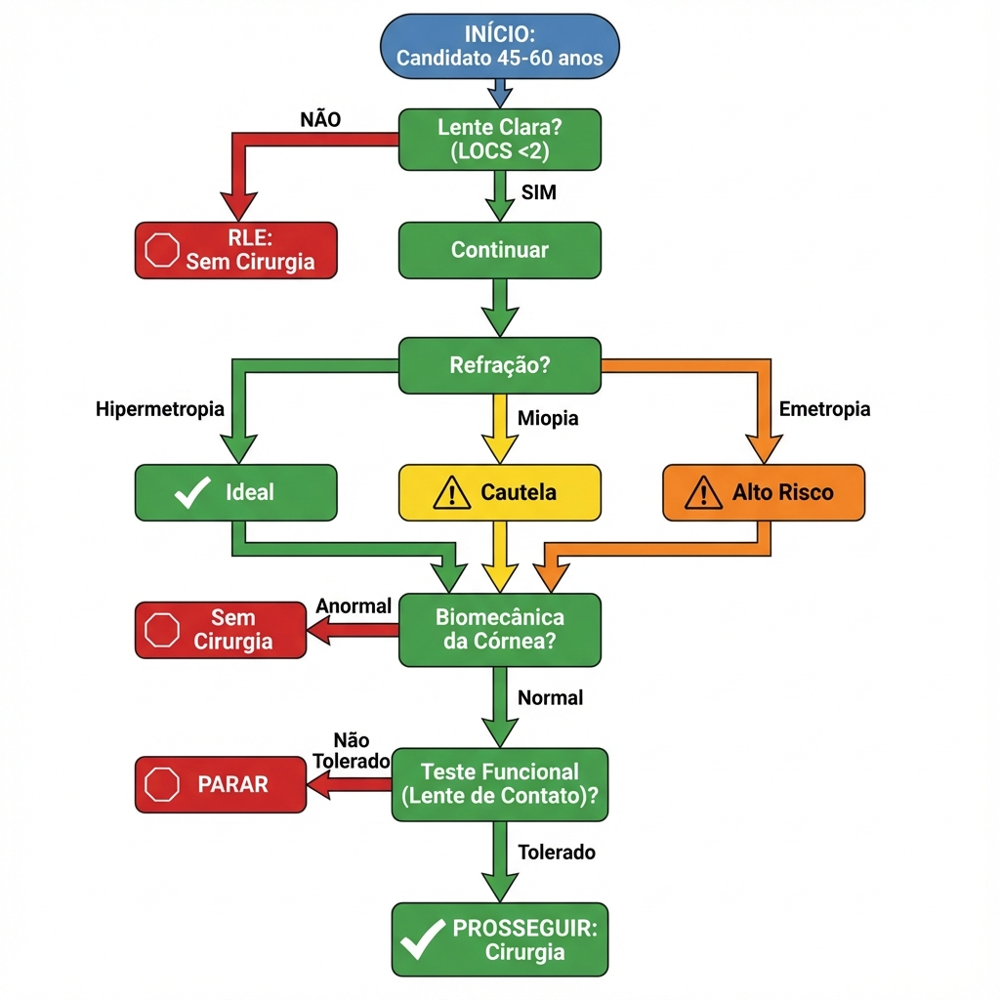
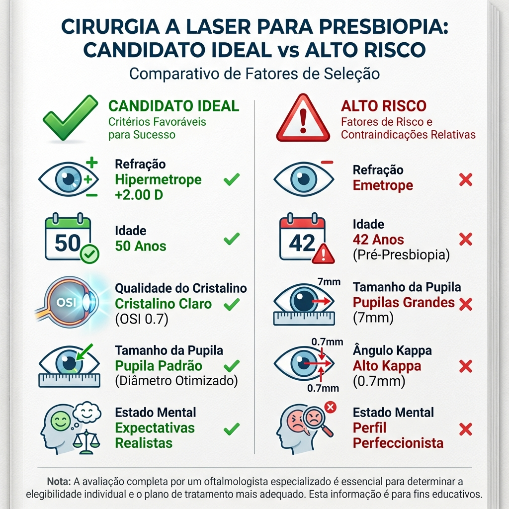
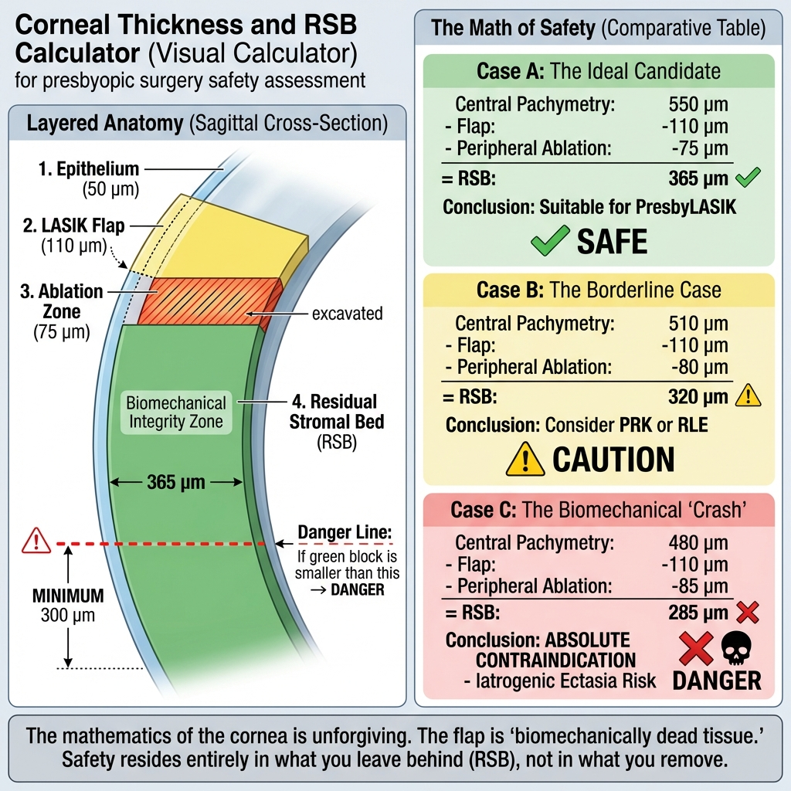
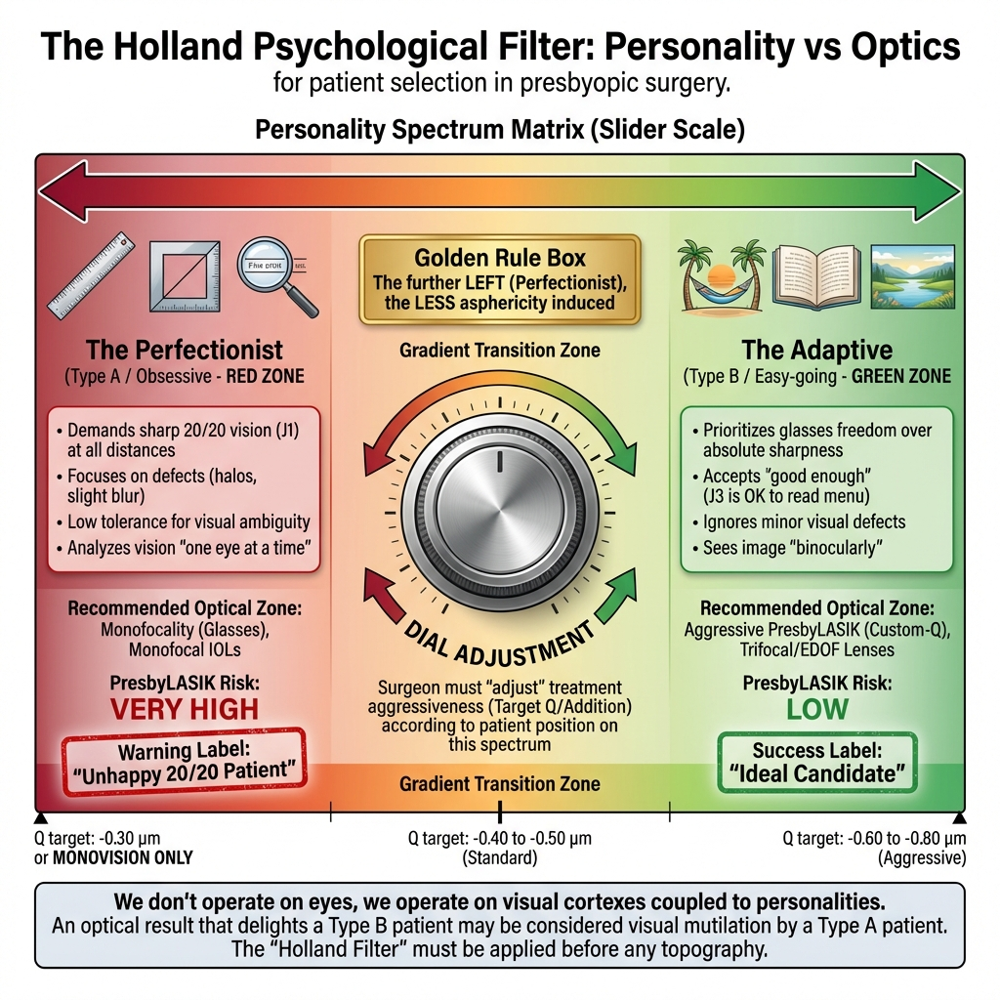
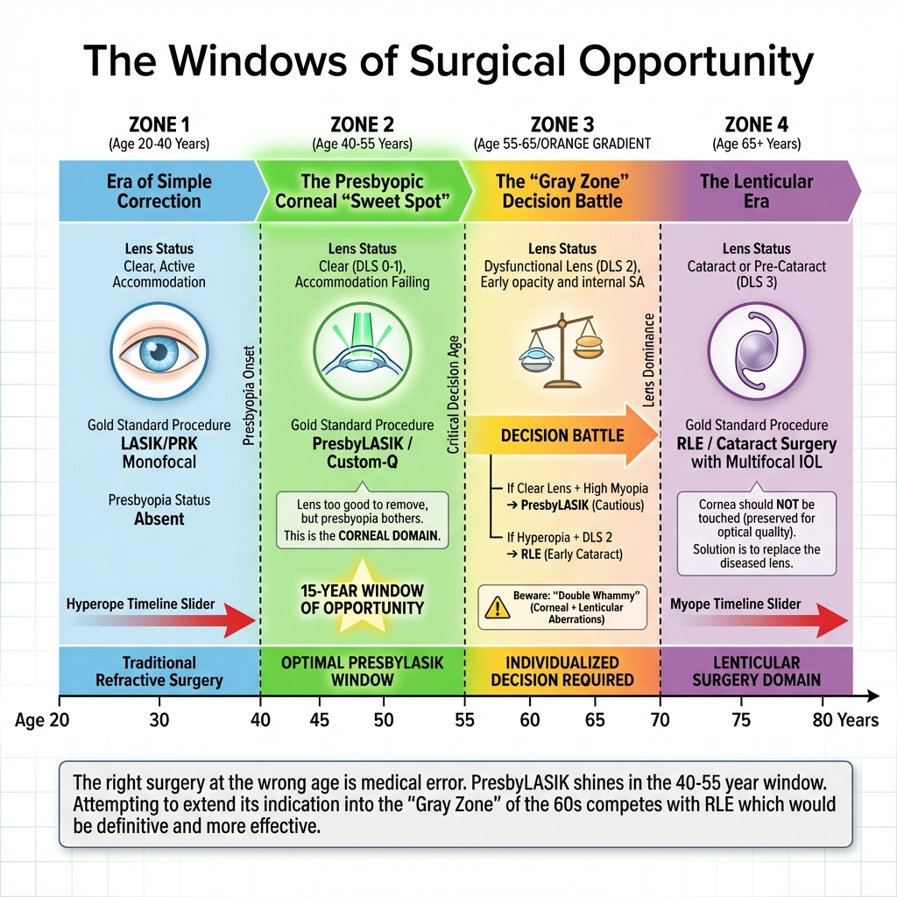

# Capítulo 3: Avaliação Pré-Operatória e Seleção de Pacientes

> [!CAUTION]
> **Importância Clínica Crítica:** A seleção do paciente é o fator determinante do sucesso em cirurgia presbiópica corneana. Ao contrário da cirurgia de catarata, onde a melhoria visual é quase garantida pela remoção da opacidade, a cirurgia refrativa em presbitas (especialmente emétropes ou hipermétropes baixos) envolve um compromisso óptico (trade-off) inevitável entre qualidade de imagem e profundidade de campo. Uma seleção inadequada resulta em insatisfação irreversível. [1]

## 3.1. Perfil do Candidato Ideal à Cirurgia Corneana

A literatura internacional (Alió, Illueca, Reinstein) define janelas de oportunidade precisas para a abordagem corneana (PresbyLASIK/Custom-Q) versus lenticular (Troca de Lente Refrativa - RLE). [2,3]

### 3.1.1. Idade: A Variável Crítica

**Faixa Ideal: 45 a 60 anos**

**Justificação Fisiológica:**

- **Limite Inferior (45 anos):**
  - Acomodação residual: ~3.0-4.0 D (Curva de Duane)
  - Manifestação clínica de presbiopia já estabelecida
  - Cristalino ainda transparente na maioria dos casos (DLS Estádio 1)
  
- **Limite Superior (60 anos):**
  - Risco aumentado de catarata incipiente (LOCS II-III)
  - Aumento das aberrações internas do cristalino
  - Consideração crescente de RLE como solução mais definitiva

**Casos Especiais:**

**Pacientes <45 anos (Presbiopia Precoce):**
- Possível em hipermétropes altos (compensação acomodativa excessiva levando a fadiga cíclica precoce)
- Considerar se sintomas bem documentados e amplitude acomodativa <5.0 D
- **Atenção:** Progressão futura da presbiopia exigirá retoque

**Pacientes >60 anos:**
- Mandatório: Avaliação lenticular rigorosa (OCT de segmento anterior, densitometria Pentacam)
- Se DLS Estádio 2-3: RLE é preferível
- Se cristalino excepcionalmente claro: Cirurgia corneana ainda viável

### 3.1.2. Erro Refrativo: Estratificação de Resultados

A satisfação cirúrgica varia dramaticamente conforme o erro refrativo de base.

#### Hipermétropes (+0.75 a +4.00 D): Candidatos Ideais

**Taxa de Satisfação Literatura:** 85-95% [4]

**Razões do Sucesso:**

1. **Duplo Benefício Refrativo:**
   - Corrige a hipermetropia de longe (melhoria objetiva)
   - Adiciona profundidade de campo para perto
   - Paciente nunca teve boa visão sem óculos; qualquer ganho é percebido positivamente

2. **Compatibilidade Biomecânica:**
   - Ablação hipermetrópica naturalmente cria perfil prolato/hiper-prolato
   - Sinergismo com algoritmos de indução de aberração esférica negativa

3. **Estabilidade:**
   - Menor risco de regressão comparado a míopes altos (ablação central vs. periférica)

**Limitações por Magnitude:**

| Hipermetropia | Estratégia | Considerações |
|---------------|------------|---------------|
| +0.75 a +2.50 D | **PresbyLASIK ideal** | Ablação <70 μm, estabilidade excelente |
| +2.50 a +4.00 D | PresbyLASIK ou RLE | Considerar idade e qualidade lenticular |
| >+4.00 D | **RLE preferível** | Ablação >100 μm, risco de regressão e haze |

#### Míopes (-1.00 a -6.00 D): Candidatos Complexos

**Taxa de Satisfação Literatura:** 70-85% (inferior a hipermétropes) [5]

**Desafios Específicos:**

1. **Vantagem Natural para Perto:**
   - Míopes têm excelente visão de perto não corrigida
   - Cirurgia "remove" esta capacidade
   - Expectativa psicológica: "Não quero perder a minha leitura"

2. **Oblatividade Pós-LASIK:**
   - LASIK miópico convencional induz Q positivo (oblato)
   - Para criar presbiopia, precisa reverter esta oblatividade e ainda induzir prolatividade
   - Consumo de tecido significativo
   - Risco de aberração esférica positiva excessiva (halos)

3. **Estratégias Adaptadas:**

**Monovisão Modificada (Mais Comum):**
- **Olho dominante:** Corrigido para emetropia (0.00 D)
- **Olho não-dominante:** Deixado em miopia residual (-1.25 a -1.75 D)
- Perfil asférico mínimo ou nulo
- Vantagem: Preserva a "memória muscular" do cérebro de usar um olho para perto

**PresbyLASIK Bilateral (Mais Agressivo):**
- Indução de SA negativa bilateral
- Micro-monovisão (+0.50 D de anisometropia)
- Risco: Halos noturnos mais proeminentes devido à pupila tipicamente maior em míopes jovens

**Valores Críticos de Decisão:**

| Miopia | Pupila Mesópica | Estratégia Recomendada |
|--------|----------------|------------------------|
| -1.00 a -3.00 D | <5.5 mm | PresbyLASIK bilateral viável |
| -1.00 a -3.00 D | >6.0 mm | Monovisão (evitar SA negativa agressiva) |
| -3.00 a -6.00 D | Qualquer | **Monovisão preferencial** |
| >-6.00 D | Qualquer | Considerar Faco-Refrativa ou RLE |

#### Emétropes (±0.50 D): Grupo de Maior Risco

**Taxa de Satisfação Literatura:** 65-80% (mais baixa) [6]

**Razão da Baixa Satisfação:**

- **Excelente visão de longe pré-operatória**
- Qualquer perda de linhas de CDVA (Corrected Distance Visual Acuity) é altamente perceptível
- Não existe "ganho" objetivo em distância
- Todo o benefício é em perto, mas com "custo" em longe

**Critérios de Aceitação Estritos:**

1. **Teste de Lente de Contacto Obrigatório:**
   - Monovisão simulada por 5-7 dias
   - Se paciente reporta tontura, desequilíbrio ou perda de profundidade: **Contraindicação absoluta**

2. **Perfil Psicológico:**
   - Paciente com profissão não-crítica (não engenheiro, não piloto, não cirurgião)
   - Aceitação explícita documentada do trade-off
   - Expectativas realistas ("Vou ler sem óculos, mas a minha visão noturna pode ter halos")

3. **Opção Conservadora:**
   - Target de SA negativa reduzido (-0.30 a -0.40 μm, em vez de -0.50 μm)
   - Micro-monovisão ligeira (-0.75 D no não-dominante, em vez de -1.25 D)

---

## 3.2. Estado do Cristalino: Classificação DLS e Decisão Cirúrgica

A decisão entre cirurgia corneana e lenticular depende fundamentalmente da classificação do **Dysfunctional Lens Syndrome (DLS)**.

### 3.2.1. Propedêutica de Avaliação Lenticular

#### Exame Clínico à Lâmpada de Fenda

**Sistema de Classificação LOCS III (Lens Opacities Classification System III):**

| Parâmetro | Grau 0-1 | Grau 2-3 | Grau 4-6 |
|-----------|----------|----------|----------|
| **Nuclear Opalescence (NO)** | Claro | Amarelamento ligeiro | Opacidade densa |
| **Nuclear Color (NC)** | Incolor | Amarelo/castanho | Castanho escuro |
| **Cortical (C)** | Sem opacidades | Raios/vacúolos <25% | Opacidades >25% área |
| **Posterior Subcapsular (P)** | Ausente | Placa <2mm | Placa >2mm |

**Interpretação para Cirurgia Presbiópica:**
- **LOCS ≤1 em todos os parâmetros:** Cristalino adequado para PresbyLASIK
- **LOCS 2:** Zona cinzenta, avaliação complementar obrigatória
- **LOCS ≥3 em qualquer parâmetro:** RLE indicada

#### Densitometria de Scheimpflug (Pentacam)

**Quantificação Objetiva da Opacidade Nuclear:**

Medição da densidade de retroespalhamento luminoso em unidades Pentacam.

**Valores de Referência:**

| Densidade Média Nuclear | Interpretação | Conduta Cirúrgica |
|-------------------------|---------------|-------------------|
| <8% | Cristalino jovem, claro | **PresbyLASIK seguro** |
| 8-12% | Alterações precoces | Avaliar scatter (OSI) |
| 12-18% | Disfunção moderada (DLS 2) | Considerar RLE se idade >55 |
| >18% | Catarata | **RLE mandatório** |

**Vantagem sobre LOCS:**  
Objetivo, reprodutível, independente de observador.

#### Objective Scatter Index (OSI) – HD Analyzer

O OSI quantifica o **scatter de luz intraocular**, correlacionando diretamente com queixas de glare e halos.

**Metodologia:**  
Análise de duplo passo (double-pass) da PSF.

**Valores Normativos:**

| Idade | OSI Normal | OSI Limítrofe | OSI Anormal |
|-------|-----------|---------------|-------------|
| 20-40 anos | <0.7 | 0.7-1.0 | >1.0 |
| 40-55 anos | <1.0 | 1.0-1.5 | >1.5 |
| 55-65 anos | <1.5 | 1.5-2.5 | >2.5 |
| >65 anos | <2.0 | 2.0-3.0 | >3.0 |

**Interpretação para PresbyLASIK:**

- **OSI <1.0:** Excelente qualidade óptica lenticular, candidato ideal
- **OSI 1.0-2.0:** Scatter ligeiro, prosseguir com cautela
  - Avisar paciente que fenómenos fóticos pós-LASIK podem ser magnificados
- **OSI >2.0:** Alto scatter interno
  - **Contraindicação relativa** para PresbyLASIK (adicionar SA negativa corneana não criará DoF eficaz)
  - Favorecer RLE

#### Aberrometria Total vs. Corneana (iTrace / OPD-Scan)

**Objetivo:**  
Isolar as aberrações internas (predominantemente lenticulares) das aberrações corneanas.

**Cálculo:**
$$\text{Aberrações Internas} = \text{Aberrações Totais Oculares} - \text{Aberrações Corneanas}$$

**Aberração Esférica Interna ($Z_4^0$ interno):**

| SA Interna (6 mm) | Interpretação | Decisão Cirúrgica |
|-------------------|---------------|-------------------|
| +0.05 a +0.15 μm | Cristalino jovem normal | **PresbyLASIK ideal** |
| +0.15 a +0.30 μm | Envelhecimento lenticular | Prosseguir, mas reduzir target SA negativa corneana |
| >+0.30 μm | Disfunção óptica lenticular | **Contraindicar PresbyLASIK** (RLE preferível) |

**Raciocínio:**  
Se o cristalino já possui SA positiva elevada, adicionar SA negativa corneana pode:
1. Anular-se mutuamente (sem ganho de DoF)
2. Criar aberrações de alta ordem complexas (coma, trefoil) por interação não-linear

---

## 3.3. Propedêutica Corneana Essencial

### 3.3.1. Tomografia de Segmento Anterior (Pentacam / Galilei)

**Objetivos:**

1. **Rastreio de Ectasia (Queratocone Frustre)**
2. **Avaliação de Biomecânica (Espessura e Distribuição Paquimétrica)**
3. **Medição de Asfericidade (Q-value)**

#### Protocolo de Interpretação Sistemática (Baseado em Sinjab)

A análise tomográfica nesta obra segue o rigoroso protocolo "Five Steps to Start" preconizado pelo **Prof. Mazen Sinjab** [35,36], garantindo uma avaliação hierárquica e à prova de falhas:

1.  **Qualidade de Captura (QS):** Confirmação técnica prévia.
2.  **Mapas de Curvatura (Axial/Tangencial):** Identificação de padrões (Symmetric Bowtie, Asymmetric, Skewed).
3.  **Mapas de Elevação (BFS):** Análise da elevação anterior e posterior (ilhas de elevação).
4.  **Mapa Paquimétrico:** Avaliação da espessura no ponto mais fino e progressão paquimétrica.
5.  **Integração Biomecânica (Tomographic/Biomechanical Index):** Correlação final para decisão.

Esta sistematização é fundamental para distinguir corneas normais, suspeitas e patológicas com precisão.

*Figura 3.0: Visualização tomográfica padrão (Quad-Map) para avaliação sistemática de segurança biomecânica.*

#### Parâmetros de Rastreio de Ectasia

**Índices de Belin-Ambrósio Enhanced Ectasia Display (BAD-D):**

| Parâmetro | Normal | Suspeito | Ectásico |
|-----------|--------|----------|----------|
| **BAD-D** | <1.60 | 1.60-2.60 | >2.60 |
| **TBI (Corvis)** | <0.50 | 0.50-0.79 | ≥0.80 |
| **CBI (Corvis)** | <0.50 | 0.50-0.79 | ≥0.80 |

**Contraindicação Absoluta de PresbyLASIK:**
- BAD-D >1.60
- ISV (Index of Surface Variance) >37
- IVA (Index of Vertical Asymmetry) >0.28

**Raciocínio:**  
Ablações presbiópicas (especialmente hipermetrópicas) thin the cornea perifericamente e induzem biomechanical stress. Córneas suspeitas podem sofrer ectasia iatrogénica pós-cirúrgica.

#### Espessura Corneana e Leito Estromal Residual (RSB)

**Regra de Segurança:**
$$\text{LER} = \text{Paquimetria Mínima} - \text{Flap/Epitélio} - \text{Ablação} > 300 \, \mu m$$

Para PRK (sem flap):
$$\text{LER} = \text{Paquimetria Mínima} - 50 \, \mu m - \text{Ablação} > 300 \, \mu m$$

**Ablação Hiperópica Típica (+2.00 D presbyopic correction, zona óptica 6.0 mm):**
- Ablação central: ~10-15 μm
- Ablação periférica máxima: ~60-80 μm

**Exemplo de Cálculo:**

Paciente: +2.00 D hipermétrope, age 50, candidato PresbyLASIK (LASIK com Q target -0.80).

- Paquimetria central: 540 μm
- Paquimetria mínima (paracentral): 520 μm
- Flap (LASIK 110 μm): 110 μm
- Ablação periférica prevista: 75 μm

$$\text{LER} = 520 - 110 - 75 = 335 \, \mu m \, \checkmark \, \text{(Seguro)}$$

Se paquimetria mínima fosse 480 μm:
$$\text{LER} = 480 - 110 - 75 = 295 \, \mu m \, \times \, \text{(Limítrofe - Considerar PRK ou RLE)}$$

#### Curvatura e Asfericidade Corneana

**Queratometria (K) e Faixa Operável:**

| K Médio | Categoria | Implicações PresbyLASIK |
|---------|-----------|-------------------------|
| <40.00 D | **Córnea plana** | Risco de hipocorreção e regressão; reduzir target Q |
| 40.00-46.00 D | **Normal** | Ideal para cirurgia presbiópica |
| 46.00-48.00 D | **Córnea curva** | Viável mas aguarda maior indução de aberrações |
| >48.00 D | **Muito curva** | Suspeitar queratocone; rastreio ectasia obrigatório |

**Asfericidade Pré-Operatória (Q-value):**

Córneas muito oblatas (Q >+0.30, tipicamente pós-LASIK miópico prévio) ou muito prolatas (Q <-0.60) respondem de forma imprevisível à manipulação adicional de asfericidade.

**Regra Clínica:**  
Se Q pré-operatório estiver fora da faixa -0.10 a -0.40, o algoritmo de cálculo de Q-target deve ser ajustado ou alternativas não-corneanas devem ser consideradas.

---

### 3.3.2. Aberrometria e Centragem: Ângulo Kappa/Alpha

O descentramento da ablação multifocal **é a principalcausa de insucesso** em PresbyLASIK, induzindo coma vertical e diplopia monocular.

#### Anatomia dos Eixos Oculares

**Eixo Visual:**  
Linha que conecta o ponto de fixação foveal ao objeto fixado, passando pelo ponto nodal.

**Eixo Pupilar:**  
Linha perpendicular à córnea que passa pelo centro geométrico da pupila de entrada.

**Ângulo Kappa (κ):**  
Ângulo entre o eixo visual e o eixo pupilar. Equivalente clínico: distância linear entre o reflexo de Purkinje (1ª imagem de Purkinje = representação do eixo visual) e o centro da pupila.

**Ângulo Alpha (α):**  
Ângulo entre o eixo visual e o eixo óptico (linha de simetria do sistema óptico).

**Na Prática Clínica:**  
Kappa e Alpha são frequentemente confundidos; a medida relevante é o **Chord Mu** ou **Distância Kappa**, medida em mm.

#### Medição do Ângulo Kappa

**Métodos:**

1. **Manual (Offset de Purkinje):**
   - Paciente fixa luz coaxial
   - Medir distância do reflexo de Purkinje ao centro pupilar
   - Instrumento: régua milimetrica na lâmpada de fenda

2. **Automatizado (Topografia/Aberrometria):**
   - Pentacam: "Pupil Center Corneal Vertex Distance"
   - iTrace: "Kappa Angle"
   - OPD-Scan III: "Angle Kappa"

**Valores de Referência e Decisão Cirúrgica:**

| Kappa (mm) | Classificação | Risco em PresbyLASIK | Estratégia de Centragem |
|------------|---------------|----------------------|-------------------------|
| <0.30 mm | Baixo | **Mínimo** | Centrar na pupila (aceitável) |
| 0.30-0.50 mm | Moderado | **Moderado** | Centrar no Purkinje ou ponto médio |
| 0.50-0.70 mm | Alto | **Alto (coma induzido)** | Centrar estritamente no Purkinje |
| >0.70 mm | Muito alto | **Contraindicação relativa** | Considerar RLE ou monovisão pura (sem multifocalidade) |

**Cálculo de Indução de Coma por Descentramento:**

Fórmula aproximada (derivada de modelos de Zernike):
$$\Delta Z_3^1 \approx 0.12 \times d \times \sqrt{P}$$

Onde:
- **d** = descentramento em mm
- **P** = potência da ablação em dioptrias

**Exemplo Clínico:**

Paciente hipermétrope +2.50 D com Kappa = 0.60 mm.

Se a ablação for centrada na pupila (ignorando Kappa):
$$\Delta Z_3^1 = 0.12 \times 0.60 \times \sqrt{2.5} \approx 0.11 \, \mu m$$

Este valor de coma induzido é suficiente para causar sintomas de "ghosting" vertical (imagem dupla monocular).

**Conduta:**  
Centrar ablação no reflexo de Purkinje (eixo visual) em vez do centro pupilar.

---

### 3.3.3. Superfície Ocular e Filme Lacrimal

**Princípio Fundamental:**  
O filme lacrimal é a primeira superfície refrativa do olho (~40% da potência dióptrica total). Irregularidades lacrimais degradam qualquer correção óptica corneana.

#### Avaliação da Superfície Ocular

**1. Questionários Validados:**

- **OSDI (Ocular Surface Disease Index):** Score 0-100
  - <13: Normal
  - 13-22: Olho seco ligeiro
  - 23-32: Olho seco moderado
  - >32: Olho seco severo

**2. Testes Objetivos:**

**Tempo de Rutura do Filme Lacrimal (BUT - Break-Up Time):**
- Normal: >10 segundos
- Borderline: 5-10 segundos
- **Patológico (<5 segundos): Tratar obrigatoriamente antes de cirurgia**

**Teste de Schirmer (Produção Lacrimal):**
- Normal: >15 mm em 5 minutos
- Borderline: 10-15 mm
- **Severo (<5 mm): Contraindicação relativa; pré-tratar agressivamente**

**3. Avaliação das Glândulas de Meibomius:**

**Meibografia (LipiView / Sirius):**
- Grau 0: Sem perda glandular
- Grau 1: <25% perda
- Grau 2: 25-50% perda
- **Grau 3-4 (>50% perda): Alto risco de olho seco pós-LASIK severo**

**Disfunção de Meibomius (MGD) e PresbyLASIK:**

Pacientes com MGD moderada a severa desenvolvem olho seco sintomático muito agressivo pós-LASIK devido a:
1. Transecção de nervos corneanos (diminui reflexo lacrimal)
2. Irregularidade da superfície amplifica sintomas de irritação
3. Aberrações induzidas magnificam a irregularidade do filme lacrimal

**Protocolo de Pré-Tratamento:**

Antes de PresbyLASIK em paciente com MGD:
1. Express glandular (compressas quentes + massagem)
2. Lágrimas artificiais sem conservante 4x/dia
3. Suplementação oral Ómega-3 (1000-2000 mg/dia)
4. Considerar IPL (Intense Pulsed Light) ou expressão glandular profissional (Lipiflow)
5. **Reavaliação após 3 meses de tratamento**

---

## 3.4. Testes Funcionais e Simulação Pré-Operatória

### 3.4.1. Teste de Tolerância à Monovisão (Lente de Contacto)

**Gold Standard** para prever neuroadaptação.

**Protocolo:**

1. **Dominância Ocular:**
   - Teste do buraco (Hole-in-Card test)
   - Teste de convergência
   
2. **Simulação:**
   - **Olho dominante:** Lente de contacto para emetropia (0.00 D)
   - **Olho não-dominante:** Lente de contacto induzindo miopia de -1.25 a -1.50 D

3. **Período de Teste:**
   - Mínimo: 3-5 dias
   - Ideal: 7-10 dias (permite neuroadaptação inicial)

4. **Avaliação:**

**Sucesso (Prosseguir Cirurgia):**
- Visão binocular confortável
- Leitura funcional sem óculos
- Sem tontura, náusea ou desequilíbrio
- Condução sem limitações

**Falha (Contraindicação):**
- Queixas de "visão estranha" persistentes
- Tontura ou náusea
- Dificuldade em tarefas de percepção de profundidade (estacionar, subir escadas)
- Paciente remove lente de contacto frequentemente

**Taxa de Intolerância na Literatura:** 10-15% dos pacientes falham teste de monovisão [7]

### 3.4.2. Simulação Visual com Software (iTrace Vision Simulator)

Permite ao paciente "ver" como será a sua visão pós-cirurgia através de:

1. **Captura de Frente de Onda Pré-Operatória**
2. **Modelação do Tratamento Planeado** (incorporando Q-target, SA induzida)
3. **Cálculo de Frente de Onda Pós-Operatória Prevista**
4. **Geração de Imagens Simuladas:**
   - Leitura de texto (jornal, menu)
   - Cena noturna (luzes de automóveis, street lights)
   - Rosto humano (reconhecimento facial)

**Valor Clínico:**  
Gestão de expectativas e consentimento informado visual. Paciente pode rejeitar cirurgia ao ver simulação de halos noturnos.

---

## 3.5. Contraindicações: Absolutas e Relativas

### 3.5.1. Contraindicações Absolutas

**Não operar sob qualquer circunstância:**

1. **Queratocone ou Ectasia Corneana:**
   - Diagnóstico clínico ou topográfico (BAD-D >2.60)
   - Pellucid marginal degeneration
   - Ectasia pós-LASIK prévia

2. **Catarata Clinicamente Significativa:**
   - LOCS III ≥3
   - BCVA afetada pela opacidade lenticular
   - OSI >3.0

3. **Doença Autoimune Ativa Não Controlada:**
   - Síndrome de Sjögren
   - Lúpus eritematoso sistémico
   - Artrite reumatoide com envolvimento ocular

4. **Olho Seco Severo:**
   - OSDI >32
   - Schirmer <3 mm
   - Ceratopatia punctata grau 3-4

5. **Expectativas Irrealistas Documentadas:**
   - "Quero ver como via aos 20 anos"
   - "Não aceito halos ou qualquer perda de qualidade visual"
   - Recusa do teste de lente de contacto

6. **Instabilidade Refrativa:**
   - Mudança >0.50 D em 12 meses
   - Gravidez ou lactação
   - Uso de medicação que afeta refração (corticoides sistémicos, tamoxifeno)

### 3.5.2. Contraindicações Relativas

**Prosseguir com extrema cautela ou considerar alternativas:**

1. **Profissões de Alta Demanda Visual:**
   - **Pilotos comerciais:** Regulamentação pode não permitir multifocalidade
   - **Condutores profissionais noturnos:** Halos podem comprometer segurança
   - **Cirurgiões, dentistas:** Perda de sensibilidade ao contraste em distâncias intermediárias críticas
   - **Engenheiros, arquitetos:** Precisão visual extrema necessária

2. **Ângulo Kappa >0.60 mm:**
   - Alto risco de descentramento e coma
   - Alternativa: Monovisão pura sem perfil asférico multifocal

3. **Pupila Mesópica >7.0 mm:**
   - Magnificação excessiva de aberrações
   - Halos noturnos intoleráveis
   - Alternativa: Reduzir SA target ou considerar RLE com IOL de pupila-independente

4. **Córnea Plana (K <40.00 D):**
   - Resposta biomecânica imprevisível
   - Alta taxa de hipocorreção e regressão
   - Alternativa: RLE

5. **História de Depressão ou Ansiedade:**
   - Período de neuroadaptação pode ser psicologicamente desafiante
   - Necessário apoio psicológico e follow-up frequente

6. **Diabetes Mellitus:**
   - Controlo glicémico deve ser rigoroso (HbA1c <7.0%)
   - Sem retinopatia diabética
   - Risco aumentado de cicatrização irregular e flutuação refrativa

---

## 3.6. Consentimento Informado: Documentação de Riscos Específicos

Para além do consentimento cirúrgico padrão, o PresbyLASIK exige documentação explícita de:

### Riscos e Limitações a Documentar:

1. **Halos e Glare Noturnos:**
   - Presente em >70% dos pacientes nos primeiros 3 meses
   - Permanente em ~15-20% (geralmente tolerável)
   - Pode limitar condução noturna

2. **Redução de Contraste:**
   - Perda de ~0.1-0.3 log units em sensibilidade ao contraste
   - Mais evidente em condições de baixa luminância

3. **Necessidade de Óculos Residuais:**
   - Para condução noturna prolongada: ~30% necessitam
   - Para leitura prolongada (>1 hora): ~20% necessitam
   - "Spectacle independence" vs. "Spectacle freedom" (diferença semântica crítica)

4. **Período de Neuroadaptação:**
   - 3-6 meses para estabilização completa
   - Visão flutuante inicial
   - "Semana do arrependimento" (primeira semana pós-operatória)

5. **Taxa de Retoque Cirúrgico:**
   - 10-20% dos pacientes requerem ajuste refrativo
   - Geralmente após 6-12 meses (após estabilização)

6. **Não-Reversibilidade:**
   - Alteração permanente da curvatura corneana
   - Reversão completa é impossível (pode atenuar-se com ablação subsequente, mas não eliminar totalmente)

---

## Referências Bibliográficas

1. Alió JL, Amparo F, Ortiz D, Moreno L. Corneal multifocality with excimer laser for presbyopia correction. *Current Opinion in Ophthalmology*. 2009;20(4):264-271. doi:10.1097/ICU.0b013e32832a7ded

2. Luger MH, Ewering T, Arba-Mosquera S. Consecutive myopic LASIK and photorefractive keratectomy for presbyopia and myopia. *Journal of Refractive Surgery*. 2012;28(1):17-23. doi:10.3928/1081597X-20111103-01

3. Reinstein DZ, Archer TJ, Gobbe M. LASIK for myopic astigmatism and presbyopia using non-linear aspheric micro-monovision with the Carl Zeiss Meditec MEL 80. *Journal of Refractive Surgery*. 2011;27(1):23-37. doi:10.3928/1081597X-20100212-04

4. Alió JL, Chaubard JJ, Caliz A, Sala E, Patel S. Correction of presbyopia by technovision central multifocal LASIK (presbyLASIK). *Journal of Refractive Surgery*. 2006;22(5):453-460.

5. Epstein RL, Gurgos MA. Presbyopia treatment by monovision. *Current Opinion in Ophthalmology*. 2009;20(4):238-240. doi:10.1097/ICU.0b013e32832a7dfa

6. Luger MH, McAlinden C, Buckhurst PJ, Wolffsohn JS, Verma S, Arba Mosquera S. Presbyopic LASIK using hybrid bi-aspheric micro-monovision ablation profile for presbyopic corneal treatment. *American Journal of Ophthalmology*. 2015;160(3):493-505. doi:10.1016/j.ajo.2015.05.021

7. Evans BJ. Monovision: a review. *Ophthalmic and Physiological Optics*. 2007;27(5):417-439. doi:10.1111/j.1475-1313.2007.00488.x

8. Ambrósio R Jr, Belin MW. Imaging of the cornea: topography vs tomography. *Journal of Refractive Surgery*. 2010;26(11):847-849. doi:10.3928/1081597X-20101006-01

9. Randleman JB, Trattler WB, Stulting RD. Validation of the Ectasia Risk Score System for preoperative laser in situ keratomileusis screening. *American Journal of Ophthalmology*. 2008;145(5):813-818. doi:10.1016/j.ajo.2007.12.033

10. Rocha KM, Waring GO IV, Stulting RD. Dysfunctional lens index: a new method to assess vision quality in pseudophakic and non-pseudophakic patients. *Journal of Cataract & Refractive Surgery*. 2016;42(5):738-744. doi:10.1016/j.jcrs.2016.02.024

11. Reinstein DZ, Archer TJ, Gobbe M. The corneal light reflex, pupil centre, and visual axis in refractive surgery. *Journal of Refractive Surgery*. 2009;25(12):1071-1074. doi:10.3928/1081597X-20091117-04

12. Lemp MA, Bron AJ, Baudouin C, et al. Tear osmolarity in the diagnosis and management of olho seco disease. *American Journal of Ophthalmology*. 2011;151(5):792-798. doi:10.1016/j.ajo.2010.10.032

13. Blackie CA, Korb DR, Knop E, Bedi R, Knop N, Holland EJ. Nonobvious obstructive meibomian gland dysfunction. *Cornea*. 2010;29(12):1333-1345. doi:10.1097/ICO.0b013e3181d4f366

14. Wright KW, Spiegel PH, Thompson LS. *Handbook of Pediatric Strabismus and Amblyopia*. New York: Springer; 2006. (Capítulo sobre dominância ocular)

15. Charman WN. Developments in the correction of presbyopia II: surgical approaches. *Ophthalmic and Physiological Optics*. 2014;34(4):397-426. doi:10.1111/opo.12129

---

## Infográficos Clínicos Sugeridos

### Infográfico 3.1: Fluxograma de Decisão "Go / No-Go" (Algoritmo de Triagem)

*Figura 3.1: Algoritmo de decisão clínica para triagem de candidatos a cirurgia presbiópica corneana.*

---

### Infográfico 3.2: Matriz de Risco – Candidato Ideal vs. Alto Risco

*Figura 3.2: Comparativo visual "Go/No-Go" destacando os perfis polares de candidatos.*

---

### Infográfico 3.5: Espessura Corneana e Cálculo de RSB (Visual Calculator)

*Figura 3.5: Calculadora Visual de RSB (Residual Stromal Bed). Painel Esquerdo: Anatomia em camadas mostrando consumo tecidual (Epítélio 50μm + Flap 110μm + Ablação 75μm) vs. preservação (LER verde). Painel Direito: Três cenários de cálculo demonstrando a "regra de ouro" da segurança biomecânica: LER mínimo >300μm. Caso A (verde, 365μm): seguro. Caso B (amarelo, 320μm): limiar. Caso C (vermelho, 285μm): contraindicação absoluta.*

---

### Infográfico 3.6: O Filtro Psicológico de Holland

*Figura 3.6: O Filtro Psicológico de Holland. Espectro de personalidade correlacionando perfil psicológico (Perfeccionista Tipo A vs. Adaptativo Tipo B) com tolerância ao blur pseudo-acomodativo induzido cirurgicamente. O "botão de sintonia" central representa o ajuste cirúrgico da agressividade do tratamento (Q-target de -0.30μm a -0.80μm) baseado na posição do paciente no espectro. Regra de Ouro: quanto mais à esquerda (Perfeccionista), MENOS asfericidade induzida. Demonstra que operação bem-sucedida depende tanto da personalidade quanto da dióptria.*

---

### Infográfico 3.7: As Janelas de Oportunidade Cirúrgica

*Figura 3.7: Linha do tempo decisional baseada na idade e no estágio de disfunção do cristalino (DLS). Zona 1 (20-40 anos, azul): LASIK/PRK monofocal tradicional. Zona 2 (40-55 anos, verde): JANELA ÓTIMA para PresbyLASIK/Custom-Q - cristalino muito bom para remover mas presbiopia incomoda. Zona 3 (55-65 anos, amarelo/laranja): "Zona Cinzenta" de batalha decisional PresbyLASIK vs. RLE baseada em erro refrativo e qualidade lenticular. Zona 4 (65+ anos, roxo): Era lenticular - RLE/Cirurgia de Catarata dominante. Sliders de sobreposição mostram que hiperétropes entram na Zona 4 mais cedo (55 anos) que míopes (65 anos).*

---

Este Capítulo 3 está agora **completo e visualmente estruturado**, pronto para ser copiado para o Google Drive! Continuamos com o Capítulo 4?

