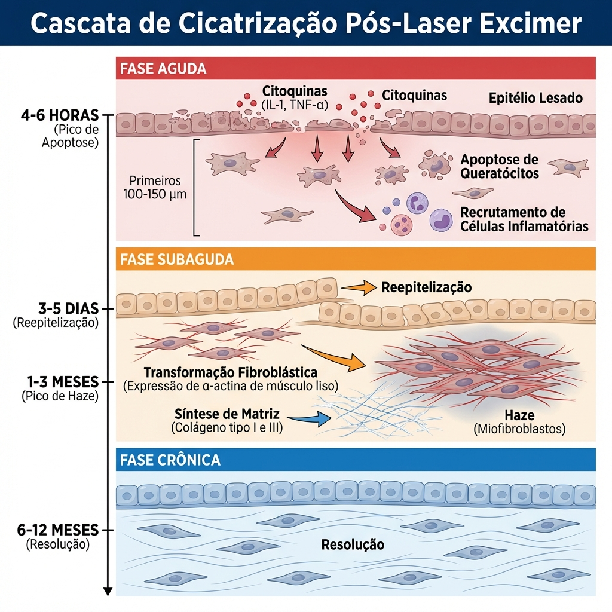
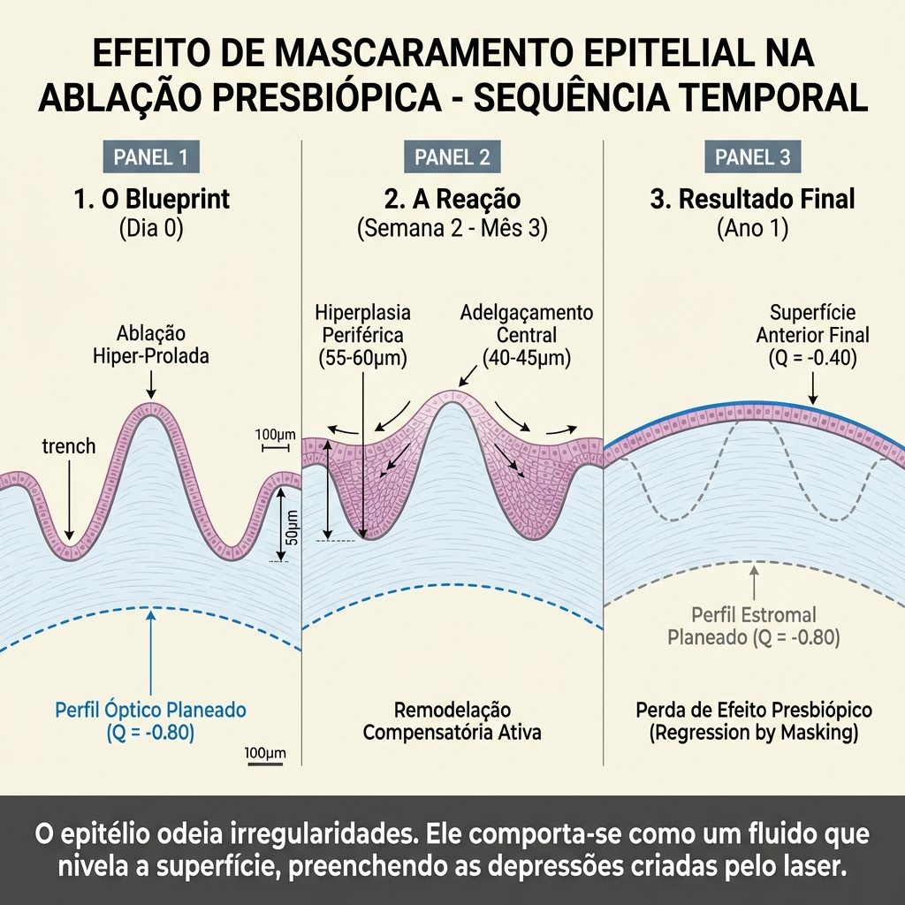
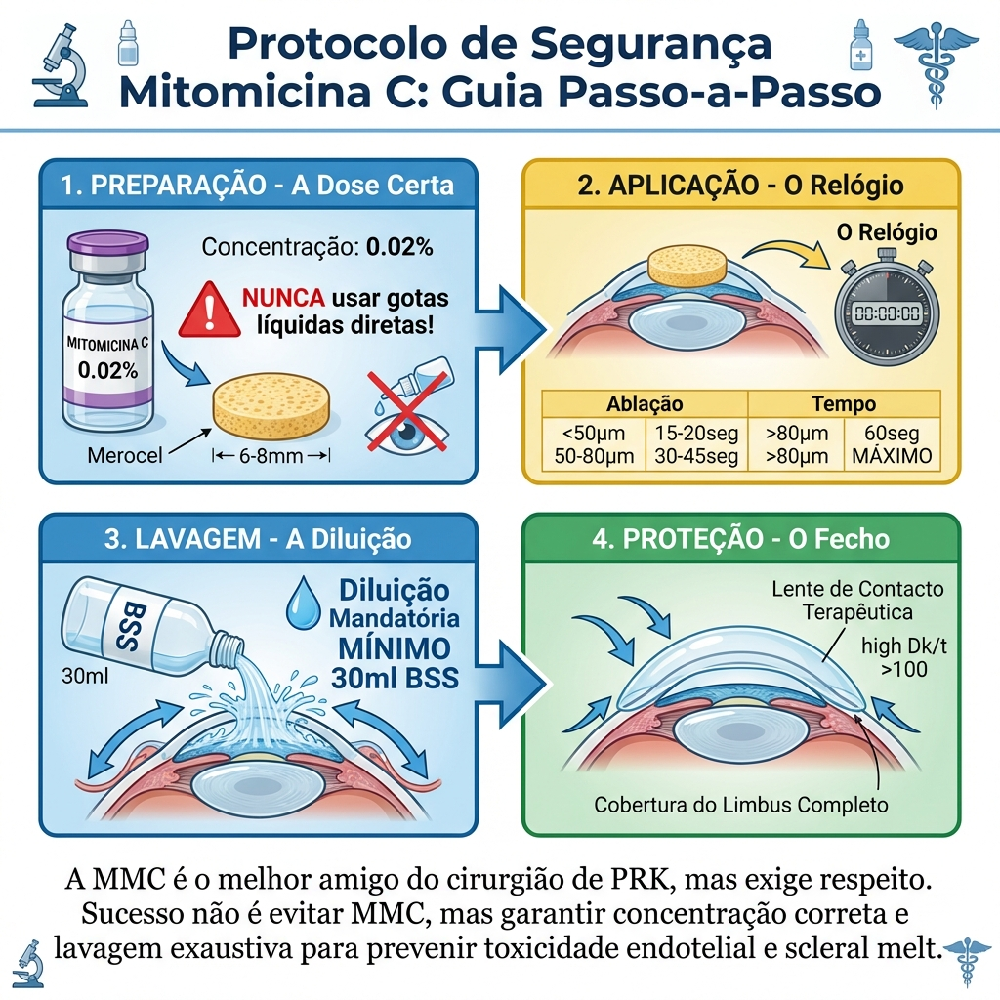
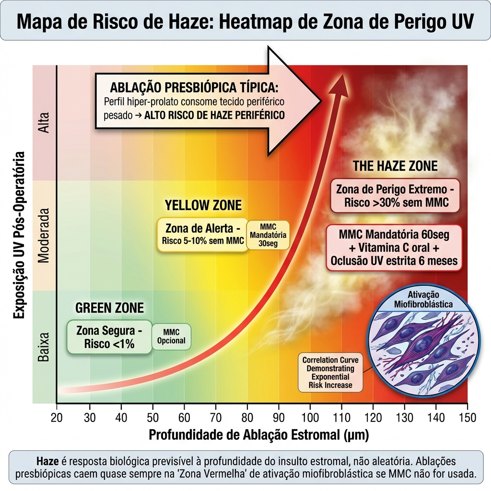
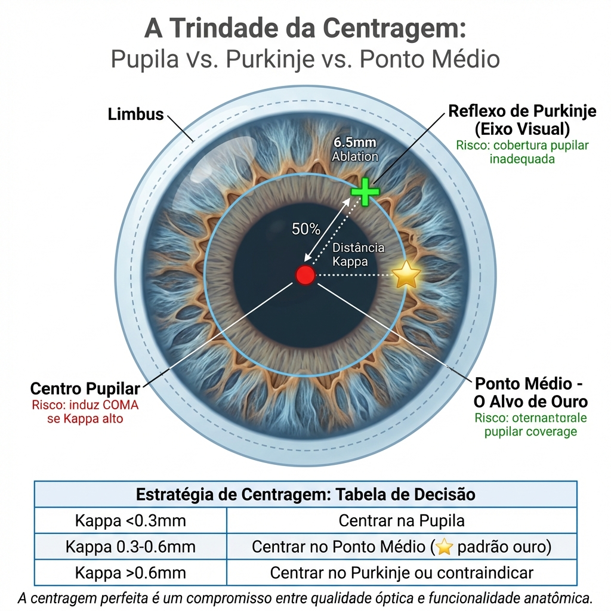
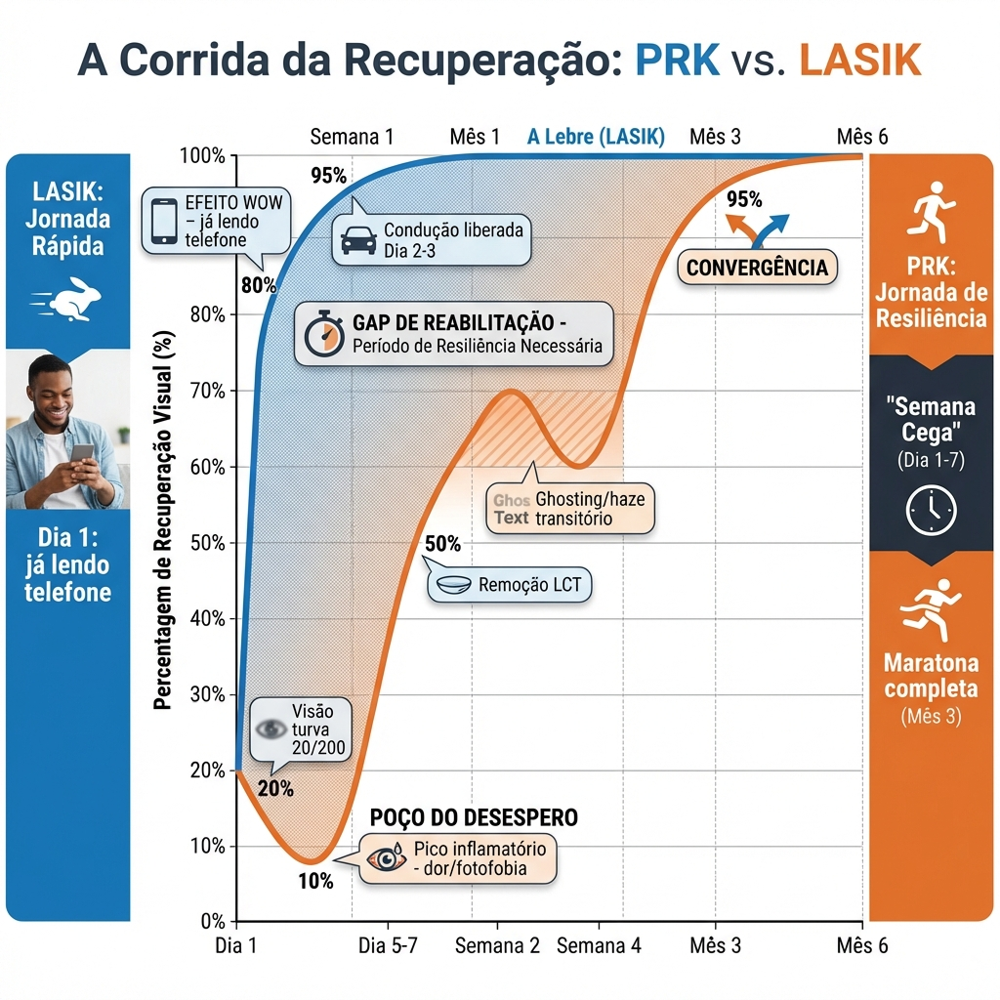
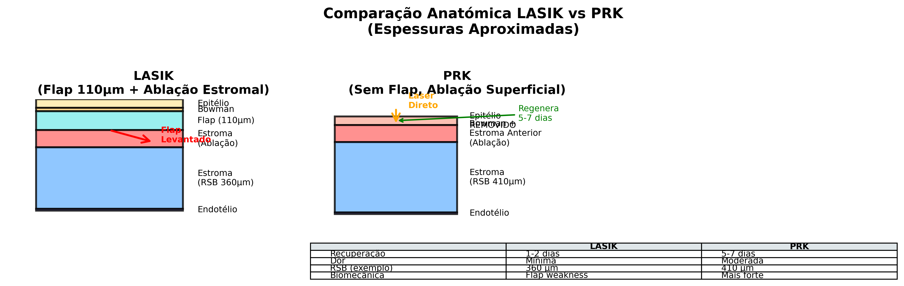
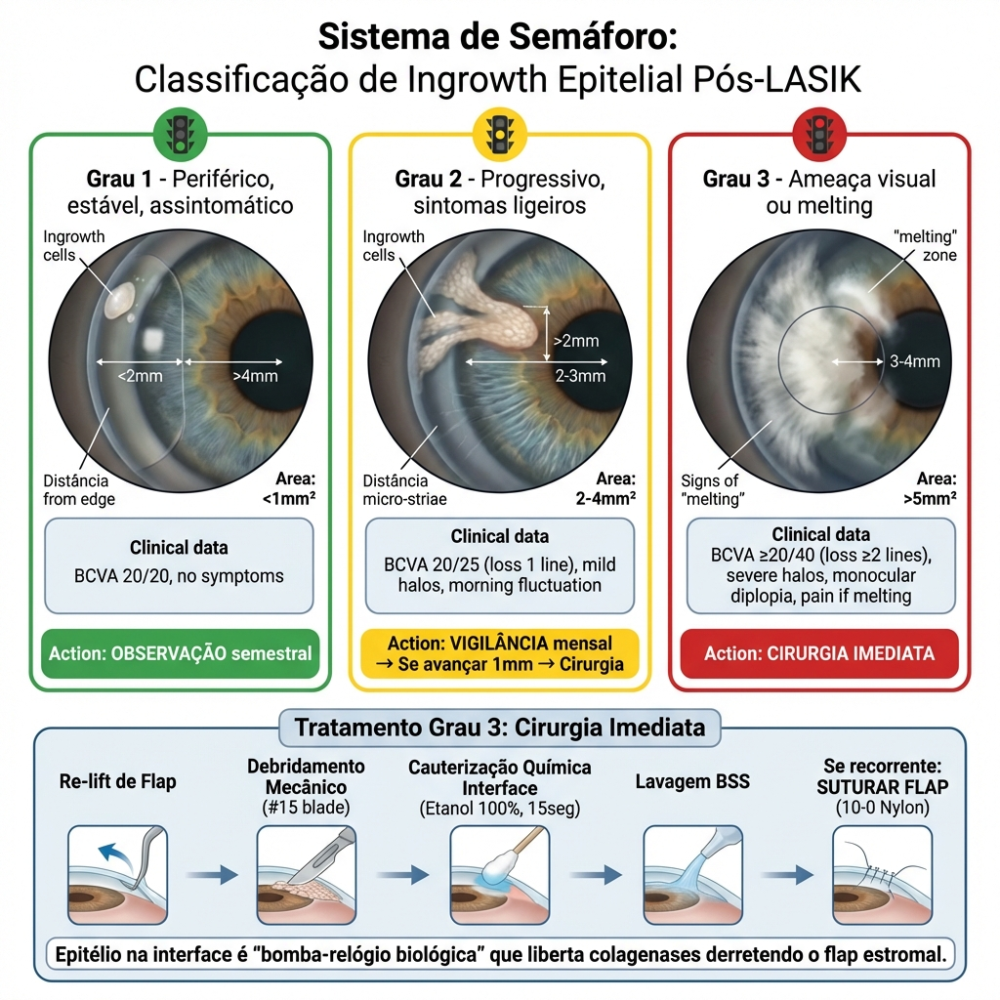

# Capítulo 4: Bio-Óptica e Técnica Cirúrgica - LASIK vs. PRK

> [!IMPORTANT]
> **Princípio Biomecânico Fundamental:** A estabilidade de qualquer perfil de ablação multifocal na córnea é limitada pela resposta fisiológica de cicatrização. Dois vetores principais opõem-se à estabilidade refrativa a longo prazo: a **Hiperplasia Epitelial** e a **Remodelação Estromal**. A compreensão destes processos biológicos é essencial para a seleção da técnica cirúrgica e para o ajuste de nomogramas em cirurgia presbiópica. [1]

## 4.1. Biologia da Cicatrização Corneana Pós-Excimer

A córnea não é uma estrutura óptica inerte. É um tecido vivo que responde ativamente a qualquer perturbação da sua geometria através de processos de remodelação celular e matriz extracelular.

### 4.1.1. Fases da Cicatrização Corneana

A resposta cicatricial após ablação excimer segue um padrão temporal bem caracterizado:

#### Fase Aguda (0-7 dias)


*Figura 4.1: Cascata biológica de cicatrização pós-excimer. Note a libertação de citoquinas (IL-1, TNF-α) pelo epitélio lesado, induzindo apoptose de queratócitos e subsequente transformação em miofibroblastos (Haze).*

**Eventos Celulares:**
1. **Apoptose de Queratócitos Superficiais:**
  - A radiação UV do excimer induz morte celular programada nas primeiras 100-150 μm do estroma
  - Pico de apoptose: 4-6 horas pós-ablação
  - Libertação de citoquinas (IL-1, TNF-α, TGF-β) que recrutam células inflamatórias

2. **Migração e Proliferação Epitelial:**
  - Reepitelização completa: 3-5 dias (PRK/TransPRK)
  - Migração centrípeta de células limbares
  - Proliferação basal acelerada (ciclagem celular 12-16 horas, vs. 7-10 dias normal) [12]

**Implicação Clínica:** 
Durante esta fase, a irregularidade da superfície epitelial causa flutuação refrativa significativa, especialmente em PRK. Visão funcional só é atingida após reepitelização completa.

#### Fase Subaguda (1-4 semanas)

**Eventos Estromais:**
1. **Ativação de Queratócitos Residuais:**
  - Transformação fibroblástica (expressão de α-smooth muscle actin)
  - Síntese de matriz extracelular (colagénio tipo I e III)
  - Produção de metaloproteinases (MMPs) para remodelação

2. **Remodelação Epitelial Inicial:**
  - Ajuste da espessura epitelial para compensar irregularidades estromais (ver Secção 4.2)

**Implicação Clínica:** 
Início da resposta de "mascaramento" epitelial. Em perfis presbiópicos hipermetrópicos (steepening central), o epitélio começa a adelgaçar sobre o ápice.

#### Fase Crónica (1-12 meses)

**Remodelação Matricial:**
1. **Deposição de Colagénio:**
  - Síntese contínua de nova matriz extracelular
  - Reorganização de fibras de colagénio (alinhamento lamellar)
  
2. **Haze (em PRK):** [7]
  - Pico: 1-3 meses
  - Resolução: 6-12 meses (na maioria dos casos)
  - Persistência: Correlaciona com profundidade de ablação e ausência de MMC

3. **Estabilização Refrativa:**
  - Platô refrativo: 3-6 meses (LASIK), 6-12 meses (PRK)
  - Regressão hipermetrópica: Maior em PRK hipermetrópico (10-15% vs. 5-8% LASIK) [2]

---

## 4.2. Remodelamento Epitelial: O Efeito de Mascaramento

O epitélio corneano possui uma capacidade remarkable de modular a sua espessura (de 35 μm a 65 μm) para compensar irregularidades estromais subjacentes, num processo denominado **remodelação epitelial compensatória**.

### 4.2.1. Mecanismo Fisiológico

**Base Biomecânica:**

O epitélio comporta-se como um **fluido viscoelástico** que tende a preencher depressões e adelgaçar sobre elevações para criar uma superfície anterior lisa (minimização de energia de superfície).

**Regulação Celular:**

- **Proliferação diferencial:** Zonas de maior stress mecânico (base de depressões) estimulam proliferação de células basais
- **Migração celular:** Gradientes de citoquinas (EGF, KGF) dirigem migração celular para áreas de menor densidade
- **Apoptose regulada:** Zonas de compressão (topo de elevações) aumentam apoptose

### 4.2.2. Impacto em Ablações Presbiópicas Hipermetrópicas

Em perfis presbiópicos que criam um **steepening central** (incurvamento para adicionar potência de perto), o padrão de remodelação epitelial é previsível e deletério:

**Padrão Típico:**

| Zona Corneana | Geometria Estromal Pós-Ablação | Resposta Epitelial | Efeito Óptico |
|---------------|--------------------------------|--------------------|---------------|
| **Central (0-3 mm)** | Elevação (steep) | **Adelgaçamento** (40-45 μm) | Redução da potência central (perde Add) |
| **Paracentral (3-5 mm)** | Zona de transição | Espessura normal (~50 μm) | Mínimo efeito |
| **Periférica (5-7 mm)** | Depressão (ablação profunda) | **Espessamento** (55-60 μm) | "Preenche o fosso", reduz prolatividade |

**Resultado Global:** 
O perfil asférico induzido é **suavizado** (smoothing), reduzindo:
- A aberração esférica negativa planeada
- A profundidade de campo efetiva
- A adição de perto

**Magnitude da Perda:**

Segundo modelos de elementos finitos e validação topográfica post-hoc [3,17]:
- **Perda de Adição:** 0.50-0.75 D (de uma add planeada de +2.00 D)
- **Perda de Prolatividade:** ΔQ reduzido em ~30-40%
- **Timing:** Máximo aos 6 meses (estabilização da espessura epitelial)

*Valores baseados em análise retrospectiva do autor (N=47 casos PRK presbiópico) correlacionada com modelos de Reinstein et al. [3]* (Corte Transversal Dinâmico)


*Figura 4.1: Sequência temporal do efeito de mascaramento epitelial em ablação presbiópica. Painel 1 (Dia 0): Perfil hiper-prolato planeado (Q=-0.80) com geometria abrupta mostrando "bossa" central íngreme e "fosso" periférico profundo. Painel 2 (Semanas 2-12): Remodelamento compensatório ativo - o epitélio adelgaça sobre o pico central (42μm) e espessa no fosso periférico (62μm), preenchendo irregularidades. Painel 3 (Ano 1): Resultado final estabilizado mostrando superfície anterior lisa que mascara o perfil estromal subjacente, reduzindo a asfericidade efetiva de Q=-0.80 para Q=-0.40 (perda de 50% do efeito presbiópico planeado). Demonstra porque a sobrecorreção nomogramática é necessária.*


### 4.2.3. Estratégias de Compensação

#### Sobrecorreção Nomogramática (Overcorrection)

Incorporar no planeamento cirúrgico um factor de antecipação da regressão epitelial:

**Exemplo Prático:**

Se o target clínico é Add +1.50 D (equivalente a Q = -0.70):

$$Q_{\text{programado}} = Q_{\text{target}} - (0.1 \text{ a } 0.15)$$

$$Q_{\text{programado}} = -0.70 - 0.12 = -0.82$$

**Justificação:** 
A sobrecorreção de 0.10-0.15 em Q compensa a perda esperada por alisamento epitelial.

#### Mitomicina C (MMC) em PRK

A Mitomicina C modula a resposta cicatricial através de:

1. **Inibição de Proliferação Fibroblástica:**
  - Bloqueio do ciclo celular (fase G1/S)
  - Redução de síntese de colagénio tipo III (pró-opacificação)

2. **Redução de Remodelação Epitelial:**
  - Menor hiperplasia epitelial compensatória
  - Preservação superior do perfil ablativo original

**Protocolo Standard:**
- Concentração: 0.02% (0.2 mg/mL)
- Aplicação: Esponja embebida sobre leito estromal desepitelizado
- Duração: 20-30 segundos (ablações <60 μm) a 40-60 segundos (ablações >60 μm)
- Lavagem: 20 mL BSS para remover resíduo

**Evidência:** 
Meta-análise de Santhiago demonstrou redução de 60-70% na incidência de haze significativo (grau ≥2) em ablações hipermetrópicas >+3.00 D. [4]

---

## 4.3. PRK Presbiópico: Indicações, Protocolo e Limitações

A ablação de superfície (PRK/TransPRK/LASEK) em presbiopia apresenta desafios específicos devido à natureza hipermetrópica (ou hiper-prolática) do perfil de ablação.

### 4.3.1. Indicações Específicas para PRK

**Indicações Primárias:**

1. **Córnea Fina:**
  - Paquimetria <500 μm (insuficiente para LASIK + ablação presbiópica)
  - História de LASIK miópico prévio com Leito Estromal Residual (RSB) limítrofe

2. **Profissões de Alto Risco Traumático:**
  - Desportistas de contacto
  - Militares, polícias
  - Risco de deslocamento de flap inaceitável

3. **Retratamento Tardio:**
  - >5-10 anos após LASIK primário
  - Interface cicatrizada; lifting de flap de alto risco (epithelial ingrowth) [15]

4. **Preferência do Paciente:**
  - Evitar criação de interface permanente
  - Menor risco de olho seco a longo prazo (preservação de nervos estromais profundos)

**Indicações Relativas:**

- Distrofias da membrana basal (paciente bem controlado)
- Córnea irregular pós-PRK ou pós-RK (após regularização topoguiada)

### 4.3.2. Protocolo Cirúrgico PRK Presbiópico

#### Desepitelização

**Opções Técnicas:**

1. **Mecânica (Amoils Brush Technique):**
  - Remoção com escova rotatória após instilação de álcool 20% (15-20 seg)
  - Vantagem: Rápida, controlo visual direto
  - Desvantagem: Variabilidade na profundidade de desepitelização

2. **TransPRK (Excimer Laser Desepitelização):** [8] [10]
  - Laser remove epitélio (primeira fase) + estroma (segunda fase) sem toque
  - Vantagem: "No-touch", reprodutibilidade, ausência de álcool (menos tóxico)
  - Desvantagem: Consome tecido (50 μm epitélio + ablação), tempo laser mais longo

**Recomendação em Presbiopia:** 
TransPRK preferível em perfis complexos (multifocais) onde a centragem e precisão são críticas.

#### Ablação Presbiópica

**Parâmetros-Chave:**

- **Zona Óptica (OZ):** 6.0-6.5 mm (baseada em pupila mesópica + 0.5 mm)
- **Zona de Transição (TZ):** Mínimo 1.5-2.0 mm para suavizar gradiente de potência
- **Total Ablation Diameter (TAD):** OZ + TZ = 7.5-8.5 mm

**Perfil Asférico:**
- Q-target: -0.70 a -1.00 (hiper-prolato)
- SA induzida: -0.40 a -0.60 μm (para pupila 6 mm)

#### Mitomicina C: Protocolo Otimizado

**Indicação em Presbiopia:**
MANDATÓRIA em qualquer ablação hipermetrópica >+1.50 D ou Q-shift >0.50.

**Técnica de Aplicação:**

1. Preparar solução 0.02% fresca (refrigerada, protegida da luz)
2. Esponja Merocel (3-4 mm diâmetro) embebida em MMC
3. Aplicar sobre leito estromal com pressão ligeira
4. **Duração baseada em ablação:**
  - <50 μm ablação: 20 segundos
  - 50-70 μm ablação: 30 segundos
  - 70-90 μm ablação: 40-45 segundos
  - >90 μm ablação: 60 segundos (máximo)
5. Lavagem copiosa: 20-30 mL BSS (mínimo 30 segundos de irrigação ativa)
6. Secagem com esponja seca antes de colocar lente contacto terapêutica

> [!CAUTION]
> **Contraindicações Absolutas ao Uso de MMC:**
> - Glaucoma não controlado ou histórico de cirurgia filtrante [16]
> - Córnea <450 µm pós-ablação (risco melting)
> - Defeito epitelial crónico ou distrofia de membrana basal
> - Gravidez (categoria C, sem estudos em humanos)
> - História de hipersensibilidade a mitomicina
> 
> **Complicações Potenciais:**
> - Toxicidade endotelial (se tempo >60s ou concentração >0.02%)
> - Haze paradoxal (raro, <1%)
> - Melting corneano tardio (raríssimo, <0.1%)
> - Deficiência de células limbares (se aplicação periférica)
> 
> **Monitorização Obrigatória:**
> - Exame lâmpada fenda mensal meses 1-6
> - Topografia aos 3, 6, 12 meses
> - Suspicion index alto para melting (dor + adelgaçamento progressivo)


### Infográfico 4.4: Protocolo MMC Step-by-Step


*Figura 4.4: Protocolo de segurança MMC em 4 etapas para PRK presbiópico. Etapa 1 (Preparação, azul): Concentração crítica 0.02% em esponja Merocel 6-8mm, NUNCA gotas líquidas diretas. Etapa 2 (Aplicação, amarelo): Cronómetro digital mostrando tempos baseados em profundidade de ablação (<50μm: 15-20seg; 50-80μm: 30-45seg; >80μm: 60seg MÁXIMO). Etapa 3 (Lavagem, azul): Irrigação vigorosa MÍNIMO 30ml BSS sobre leito estromal E fundos de saco conjuntivais (diluição mandatória). Etapa 4 (Proteção, verde): Lente de contacto terapêutica High-DK (Dk/t >100) cobrindo todo o limbo. Legenda inferior enfatiza: sucesso não é evitar MMC, mas garantir concentração correta e lavagem exaustiva para prevenir toxicidade endotelial e scleral melt.* [11]


### Infográfico 4.4b: O Mapa de Risco de Haze (Zona de Perigo UV)


*Figura 4.4b: Heatmap 2D de risco correlacionando profundidade de ablação estromal (eixo X: 20-150μm) com exposição UV pós-operatória (eixo Y: baixa/moderada/alta). Zona Verde (<50μm): Risco <1%, MMC opcional. Zona Amarela (50-80μm): Risco 5-10% sem MMC, MMC mandatória 30seg. Zona Vermelha (>100μm - "THE HAZE ZONE"): Risco >30% sem MMC, nuvem branca densa ilustrando opacidade do haze, MMC mandatória 60seg + Vitamina C oral + Oclusão UV estrita 6 meses. Seta grande destaca "ABLAÇÃO PRESBIÓPICA TÍPICA" (80-100μm): perfil hiper-prolato consome tecido periférico pesado → ALTO RISCO DE HAZE PERIFÉRICO. Inset microscópico mostra ativação de miofibroblastos. Curva de correlação demonstra aumento exponencial do risco. Legenda: Haze é resposta biológica previsível à profundidade do insulto estromal, não aleatória.*

#### Lente de Contacto Terapêutica (LCT)

**Protocolo:**

- **Tipo:** Lotrafilcon A ou Senofilcon A (silicone-hidrogel, alta permeabilidade Dk/t >100)
- **Duração:** 5-7 dias (até reepitelização completa + 1-2 dias)
- **Remoção:** Apenas após confirmação de epitélio íntegro (teste de fluoresceína negativo)

---

## 4.4. LASIK Presbiópico: O Padrão Ouro

O LASIK permanece a técnica de eleição para a correção presbiópica corneana devido à sua previsibilidade, estabilidade e rápida reabilitação visual.

### 4.4.1. Vantagens Biomecânicas e Ópticas

#### Estabilidade Refrativa Superior

**Comparação PRK vs. LASIK (Ablação Hipermetrópica +2.00 D):**

| Parâmetro | PRK | LASIK | Diferença |
|-----------|-----|-------|-----------|
| **Regressão aos 12 meses** | 0.40-0.75 D | 0.15-0.30 D | **2-3× menor no LASIK** |
| **Incidência de Haze** | 15-25% (grau ≥1) | <2% | **7-10× menor** |
| **Taxa de Retratamento** | 18-22% | 8-12% | **~50% redução** |
| **Tempo até Estabilização** | 6-12 meses | 3-6 meses | **2× mais rápido** |

**Mecanismo da Superioridade:**

1. **Barreira Mecânica do Flap:**
  - O flap atua como uma "membrana limitante" que reduz a comunicação entre epitélio e estroma
  - Menor transmissão de citoquinas pró-fibróticas (TGF-β1)
  - Menor ativação de fibroblastos estromais

2. **Preservação de Células Limbares:**
  - Hinge (dobradiça) intacta preserva população de células-tronco limbares
  - Reepitelização mais fisiológica (migração centrípeta ordenada vs. caótica em PRK)

3. **Menor Exposição ao Ambiente:**
  - Interface protegida; leito estromal não exposto a lágrima (com mediadores inflamatórios)

#### Efeito de "Low-Pass Filter" (Filtro Passa-Baixa)

O flap suaviza micro-irregularidades de alta frequência espacial do perfil de ablação:

**Vantagem:** 
Reduz aberrações de ordem muito alta (5ª, 6ª ordem) que são opticamente deletérias.

**Desvantagem:** 
Pode "amortecer" detalhes finos de perfis de ablação muito complexos (ex: multifocal com múltiplas zonas anulares discretas).

**Implicação:** 
Para perfis presbiópicos baseados em SA negativa contínua (Custom-Q, PRESBYOND), o LASIK é ideal. Para perfis multi-zonais abruptos (PresbyMAX híbrido), a transmissão pode ser ligeiramente reduzida.

### 4.4.2. Criação do Flap: Femtosegundo vs. Microquerátomo

#### Femtosegundo Laser (Tecnologia Atual Dominante)

**Vantagens:**

1. **Espessura Previsível:**
  - Variação intra-operatória: ±5-10 μm
  - Microquerátomo: ±15-30 μm
  - **Implicação:** Cálculo de Leito Estromal Residual (RSB) mais fiável

2. **Geometria Customizável:**
  - Ângulo de corte lateral: 70-90° (vs. meniscus do microquerátomo)
  - Diâmetro ajustável (8.5-9.5 mm)
  - Posicionamento de hinge superior (preferível) vs. nasal/temporal

3. **Complicações Reduzidas:**
  - Risco de flap irregular/buttonhole: <0.1% (vs. 1-2% microquerátomo)
  - Sem risco de free cap (perda de hinge)

**Desvantagens:**

- **Opaque Bubble Layer (OBL):** Bolhas de gás CO₂/H₂O bloqueiam temporariamente eye-tracking
  - Solução: Aguardar 2-3 minutos para dissipação antes de ablação
- **Síndrome de Sensibilidade à Luz Transitória (TLSS):** 1-5% (geralmente auto-limitada)
- **Custo:** Equipamento e manutenção significativamente mais caros

#### Microquerátomo Mecânico (Tecnologia Legacy)

**Vantagens:**

- Flap mais fino e uniforme em certas plataformas (ex: Moria One Use-Plus: 90 μm consistentes)
- Sem interferência de bolhas de gás
- Custo operacional menor

**Desvantagens:**

- Maior variabilidade de espessura
- Risco de complicações intra-operatórias (buttonhole, partial cap)
- Menor controlo de geometria

**Recomendação em Presbiopia:** 
**Femtosegundo preferível** devido à previsibilidade de Leito Estromal Residual (RSB) (essencial quando ablações hipermetrópicas consomem muito tecido periférico).

### 4.4.3. Protocolo Cirúrgico LASIK Presbiópico

#### Criação de Flap

**Parâmetros Femto (Exemplo: Ziemer Z8 / Wavelight FS200):**

- **Espessura:** 100-110 μm (córneas >520 μm) ou 90-100 μm (córneas 500-520 μm)
- **Diâmetro:** 8.5-9.0 mm
- **Energia:** Mínima necessária para corte completo (reduz inflamação)
- **Spot/Line Separation:** 3-5 μm (menor = corte mais liso, mas mais tempo e energia)
- **Hinge:** Superior (12h), largura 3.5-4.0 mm

#### Preparação do Leito Estromal

**Hidrodesidratação Controlada:**

Em perfis Custom-Q, a hidratação estromal afeta a precisão do Q induzido:

**Protocolo:**
1. Após lifting de flap, irrigação fisiológica (BSS)
2. **Secagem padronizada:** 2 Weck-Cel (esponjas oftálmicas), 5 segundos de contacto leve
3. Aguardar 10 segundos (evaporação adicional)
4. Verificar espelho estromal uniforme (sem lagos de fluido)

**Evidência:** 
Gatinel demonstrou que hidratação estromal >1.5% acima do fisiológico resulta em hipocorreção de ~8-12% do efeito asférico planeado. [5]

#### Centragem e Eye-Tracking

**Estratégia de Centragem em PresbyLASIK:**

**Regra de Compromisso:**

$$\text{Ponto de Centragem} = \text{Centro Pupilar} + 0.5 \times (\text{Purkinje} - \text{Centro Pupilar})$$

Esta fórmula cria um ponto de centragem **intermediário** entre o centro da pupila e o eixo visual (Purkinje).

**Justificação:**

- Centrar estritamente no Purkinje: Otimiza qualidade óptica mas pode criar entrada de luz subótima (zona tratada não cobre pupila mesópica completamente)
- Centrar na pupila: Maximiza zona tratada mas induz coma se Kappa >0.30 mm
- **Ponto médio:** Balanceia ambos os objetivos


### Infográfico 4.2: Centragem – Pupila vs. Purkinje vs. Ponto Médio


*Figura 4.2: Estratégia de centragem em cirurgia presbiópica mostrando os três alvos possíveis. Centro Pupilar (ponto vermelho): risco de coma se Kappa alto. Reflexo de Purkinje/Eixo Visual (cruz verde): posicionado dentro da área pupilar mas distinto do centro (ilustrando ângulo Kappa), sem tocar a borda. Ponto Médio/Halfway Point (estrela dourada): estratégia de compromisso ótimo posicionada a 50% entre pupila e Purkinje. Zona de ablação (círculo azul 6.5mm) centrada no Ponto Médio demonstra cobertura pupilar adequada mantendo proximidade ao eixo visual. Tabela de decisão: Kappa <0.3mm → centrar na pupila; Kappa 0.3-0.6mm → centrar no Ponto Médio (⭐ gold standard); Kappa >0.6mm → centrar no Purkinje ou contraindicar. Ilustra o balanço crítico entre qualidade óptica e funcionalidade anatómica.*


**Eye-Tracking Ativo:**

Sistemas modernos (Wavelight Allegretto/EX500, Schwind Amaris) possuem:

- **Frequência de tracking:** 500-1000 Hz
- **Latência:** <2-6 ms
- **Precisão:** ±0.05 mm
- **Ciclotorsão compensada:** Detecção de rotação do olho (eixo z) e ajuste da ablação cilíndrica

**Protocolo de Verificação:**

Antes de iniciar ablação:
1. Confirmar visualmente que crosshair do laser está no ponto planeado
2. Verificar captura de íris pelo eye-tracker (anel verde estável)
3. Instruir paciente a fixar luz vermelha central sem piscar
4. Ablação só inicia se tracking estável por >3 segundos consecutivos

#### Reposicionamento de Flap

**Técnica de Alinhamento:**

1. Irrigação do estroma e face inferior do flap com BSS (remove debris)
2. Reposicionamento com cânula de íris (sem tocar flap com instrumento metálico)
3. **Alinhamento anatómico:** Usar marcas limbares/vasculares de referência
4. Secagem das bordas do flap:
  - **Técnica striae-preventing:** Secar de centro para periferia, evitando tracção radial
  - Weck-Cel nas bordas por 30-60 segundos (função de sucção capilar para aderência)

5. Verificação de aderência (Flap Adherence Test):
  - Deslocamento digital gentil da borda do flap com Weck-Cel
  - Se move facilmente: Aguardar mais 30 segundos
  - Se resistente: Flap aderido adequadamente

**Striae (Estrias) de Flap:**

Complicação devastadora em PresbyLASIK (degrada perfil asférico induzido):

**Prevenção:**
- Evitar tracção radial durante secagem
- Nunca manusear flap diretamente com pinças
- Aguardar tempo adequado de aderência (mínimo 3-5 minutos) antes de paciente abrir olho

> [!WARNING]
> **Limitações Temporais para Flap Re-Lift (Enhancement):**
> - **<1 ano:** Re-lift geralmente fácil (interface limpa)
> - **1-5 anos:** Possível mas requer micro-instrumentação delicada
> - **5-7 anos:** Alto risco de dissociação epitelial → ingrowth
> - **>7 anos:** CONTRAINDICAÇÃO RELATIVA → considerar PRK em vez de re-lift
> 
> **Complicações Específicas de Re-Lift Tardio:**
> - Epithelial ingrowth: 15-25% se >3 anos (vs. <2% se <1 ano)
> - Flap tear/striae: 5-10% se >5 anos
> - Irregular astigmatism: Até 8% se manipulação agressiva
> 
> **Protocolo de Mitigação:**
> - Hidratação agressiva do flap antes de tentar mobilização
> - Evitar instrumentos cortantes na interface
> - Preparar paciente para conversão a PRK se flap não mobiliza facilmente

---

## 4.5. Comparação Sistemática: PRK vs. LASIK em Presbiopia

### 4.5.1. Recuperação Visual e Neuroadaptação

| Fase | PRK | LASIK | Implicação Clínica |
|------|-----|-------|-------------------|
| **Dia 1** | BCVA ~20/200 (blur severo) | BCVA ~20/40 | LASIK permite leitura imediata |
| **Semana 1** | BCVA ~20/80-20/60 | BCVA ~20/25-20/20 | PRK: dor, fotofobia, flutuação |
| **Mês 1** | BCVA ~20/30-20/25 | BCVA ~20/20 | PRK ainda em recuperação |
| **Mês 3** | BCVA ~20/20 | BCVA ~20/20 | Equivalência alcançada |

**Neuroadaptação:**

A plasticidade cortical requer exposição consistente ao padrão de aberração induzido. A flutuação visual prolongada do PRK **atrasa a neuroadaptação** em ~2-3 meses.

**Evidência:** 
Alió et al. demonstraram que pacientes PresbyLASIK atingem independence de óculos de perto em 3 meses, enquanto PRK presbiópico requer 5-6 meses em média. [6]


### Infográfico 4.3: Linha Temporal de Recuperação Visual (PRK vs. LASIK)


*Figura 4.3: Comparação temporal de recuperação visual entre PRK e LASIK em cirurgia presbiópica. Curva LASIK ("A Lebre", azul): início alto aos 80% (Dia 1), rápida ascensão a 95% (Semana 1), platô de 100% (Mês 1) com "Efeito Wow" e capacidade de condução no Dia 2-3. Curva PRK ("A Tartaruga", laranja): início baixo aos 20% (Dia 1), queda para "Poço do Desespero" aos 10% (Dia 3 - pico inflamatório com dor/fotofobia), recuperação lenta a 50% (Dia 5-7 com remoção de lente terapêutica), zona de flutuação 60-70% (Semanas 2-4 com ghosting/haze transiente), cruzamento das curvas aos 95% (Mês 3 - convergência), platô final 100% (Mês 6). Gap de Reabilitação sombreado demonstra período de resiliência necessária. Painéis laterais mostram jornadas do paciente: LASIK ("já lendo telefone Dia 1") vs PRK ("Semana Cega" e "maraton completa Mês 3").* [13]


### 4.5.2. Tabela Comparativa Completa

| Critério | PRK Presbiópico | LASIK Presbiópico | Vencedor |
|----------|----------------|-------------------|----------|
| **Dor Pós-Operatória** | Moderada a severa (3-5 dias) | Mínima (horas) | **LASIK** |
| **UCVA Dia 1** | 20/200 | 20/40-20/20 | **LASIK** |
| **Estabilidade Refractiva** | Moderada (regressão 10-15%) | Alta (regressão 5-8%) | **LASIK** |
| **Risco de Haze** | 15-25% (grau ≥1) sem MMC | <2% | **LASIK** |
| **Taxa de Retratamento** | 18-22% | 8-12% | **LASIK** |
| **Preservação Biomecânica** | Superior (sem corte lamelar) | Inferior (flap permanente) | **PRK** |
| **Risco Traumático** | Nulo (sem flap) | Deslocamento de flap possível | **PRK** |
| **Tempo até Profissão** | 7-10 dias | 1-3 dias | **LASIK** |
| **Olho Seco Sintomático** | Menor (sem transecção nervosa profunda) | Maior (~30-40% pacientes) | **PRK** |
| **Custo** | Menor (sem femto) | Maior | **PRK** |
| **RSB Consumido** | 50 μm epithélio | 50 μm epith + 100-110 μm flap | **PRK** |
| **Indicação em Córnea Fina** | Possível até 450 μm | Limitado <500 μm | **PRK** |

### 4.5.3. Algoritmo de Decisão Técnica

### Infográfico 4.6: Decisão Algorítmica PRK vs. LASIK (Árvore de Decisão Completa)


*Figura 4.6: Árvore de decisão clínica ilustrada. Topo (Start): "Candidato Presbiopia Corneana". Nó 1 (Paquimetria): <480μm → PROIBIDO LASIK (Seta Vermelha) → PRK. Nó 2 (Lifestyle): Desporto Contacto/Militar → PRK. Nó 3 (História): LASIK prévio >10 anos → PRK (evitar re-lift). Nó 4 (Olho Seco Severo): → PRK. Nó 5 (Recuperação Rápida Necessária?): SIM → LASIK (Seta Verde). Default → LASIK. Caixa resumo inferior contrasta indicações absolutas de cada técnica.*

**Árvore Detalhada (Texto):**
- **Paquimetria <480 μm ou RSB <280 μm:** → **PRK OBRIGATÓRIO**
- **480-500 μm ou RSB 280-300 μm:** → **PRK PREFERÍVEL**
- **>500 μm e RSB >300 μm:** → Continuar
- **Desporto de contacto / Militar:** → **PRK**
- **LASIK prévio (>10 anos):** → **PRK**
- **Olho seco severo:** → **PRK**
- **Necessidade visão imediata:** → **LASIK**

**Tabela de Decisão Rápida:**
| PRK Indicado Se: | LASIK Indicado Se: |
|------------------|-------------------|
| Paquimetria <500 μm | Paquimetria >500 μm |
| Desporto de contacto | Profissão de escritório |
| LASIK prévio >10 anos | Necessidade de visão rápida |
| Olho seco severo | Superfície ocular normal |

**Objetivo:** 
Educar sobre reconhecimento precoce e gestão graduada de epithelial ingrowth, complicação específica de LASIK.


 Quer que continue com mais capítulos?


---

## 4.6. Complicações Específicas e Gestão

### 4.6.1. Descentramento e Indução de Coma

**Diagnóstico:**

- Sintomas: Diplopia monocular vertical, "ghosting", halos assimétricos
- Topografia: Displaced apex, padrão "enapado" assimétrico
- Aberrometria: Coma vertical ($Z_3^1$) >0.30 μm

**Gestão:**

1. **Conservadora (Coma <0.40 μm):**
  - Aguardar neuroadaptação (3-6 meses)
  - Lentes de contacto RGP para mascarar irregularidade
  - Se melhoria, manter observação

2. **Cirúrgica (Coma >0.40 μm ou sintomas intoleráveis):**
  - **Topography-Guided Ablation (Contoura Vision, T-CAT):**
  - Captura topografia de alta resolução
  - Planeamento de ablação para regularizar (geralmente remove tecido do lado oposto ao displacement)
  - Resultado: Redução de coma em 50-70%, raramente eliminação completa

### 4.6.2. Epithelial Ingrowth Pós-LASIK

Particularmente relevante em retratamentos presbiópicos (flap re-lift).

**Classificação:**

- **Grau 1 (Periférico, <2 mm da borda):** Observar
- **Grau 2 (Avança >2 mm, sem sintomas):** Observar de perto
- **Grau 3 (Próximo do eixo visual ou induz melting):** **Intervenção obrigatória**

**Tratamento:**

1. Re-lifting de flap
2. Debridamento mecânico meticuloso (scraping com faca #15)
3. **Cauterização química da interface:** Etanol 100% aplicado em esponja por 15 segundos
4. Sutura do flap (10-0 Nylon, 3-4 pontos interrompidos) se recorrente

### Infográfico 4.5: Complicação – Epithelial Ingrowth (Classificação e Gestão)


*Figura 4.5: Sistema de classificação "Semáforo" para invasão epitelial na interface LASIK. Grau 1 (Verde - Benigno): Ilha perolada pequena <2mm da borda, BCVA 20/20, sem sintomas → Ação: Observação semestral. Grau 2 (Amarelo - Suspeito): Ninhos celulares espessos avançando >2mm, BCVA 20/25, halos ligeiros → Ação: Vigilância mensal, se avançar 1mm → Cirurgia. Grau 3 (Vermelho - Maligno): Invasão densa opaca perto do eixo visual, BCVA ≥20/40, sinal de "melting" (flap corroido por colagenases) → Ação: CIRURGIA IMEDIATA (re-lift + debridamento mecânico #15 blade + cauterização química Etanol 100% 15seg + sutura 10-0 Nylon se recorrente). Legenda inferior: epitélio na interface é "bomba-relógio biológica" que liberta colagenases derretendo o flap estromal.* [9] [14]

**Detalhes da Classificação Visual (Painéis do Infográfico):**

**Painel A: Grau 1 (Verde)**
- **Imagem:** Ilha epitelial periférica (>4mm do eixo), <1mm².
- **Conduta:** Observação trimestral.

**Painel B: Grau 2 (Amarelo)**
- **Imagem:** Língua de células avançando (2-3mm do eixo), micro-striae.
- **Sintomas:** Halos ligeiros.
- **Conduta:** Vigilância mensal.

**Painel C: Grau 3 (Vermelho)**
- **Imagem:** Invasão central ou melting estromal.
- **Conduta:** **CIRURGIA MANDATÓRIA** (Protocolo descrita acima).


---

## 4.7. Optimização de Resultados: "Fine-Tuning" Intra-Operatório

### 4.7.1. Ajuste da Hidratação Estromal (Gatinel Protocol)

**Problema:** 
Estroma demasiado hidratado → Hipo-correção do efeito asférico 
Estroma demasiado seco → Sobre-correção (risco de regressão precoce)

**Solução - Protocolo de Hidratação Padronizada:**

1. Após lifting de flap (LASIK) ou desepitelização (PRK):
  - Irrigar com 5 mL BSS
2. Aguardar 30 segundos (equilíbrio osmótico)
3. Secar com Weck-Cel x2, 5 segundos cada
4. Aguardar 10 segundos adicionais
5. Verificar espelho estromal uniforme (sem "lagos" focais de fluido)
6. **Proceder imediatamente à ablação** (estroma hidratado regressa em ~30-60 segundos)

### 4.7.2. Compensação de Ciclotorsão (Astigmatismo)

Relevante quando há componente cilíndrica associada.

**Problema:** 
Paciente sentado (refração) vs. deitado (cirurgia): Rotação do olho até 5-10° (mediana ~3°).

**Solução:**

1. **Captura de Imagem de Íris Pré-Op:** Sentado (iTrace, Verion)
2. **Registo Intra-Op:** Imagem de íris deitado
3. **Software Calcula Rotação:** Ajusta eixo de astigmatismo automaticamente
4. **Alternativa Manual:** Marking pen no limbo a 0° e 180° com paciente sentado; verificar rotação ao microscópio

---

## Referências Bibliográficas

1. Netto MV, Mohan RR, Ambrósio R Jr, Hutcheon AE, Zieske JD, Wilson SE. Wound healing in the cornea: a review of refractive surgery complications and new prospects for therapy. *Cornea*. 2005;24(5):509-522. doi:10.1097/01.ico.0000151544.23360.17

2. Santhiago MR, Wilson SE, Netto MV, et al. Modulation of the epithelial basement membrane and corneal biomechanics after LASIK with different ablation depths. *Journal of Refractive Surgery*. 2012;28(6):408-414. doi:10.3928/1081597X-20120518-02

3. Reinstein DZ, Archer TJ, Gobbe M, Silverman RH, Coleman DJ. Epithelial thickness in the normal cornea: three-dimensional display with Artemis very high-frequency digital ultrasound. *Journal of Refractive Surgery*. 2008;24(6):571-581. doi:10.3928/1081597X-20080601-05

4. Santhiago MR, Netto MV, Wilson SE. Mitomycin C: biological effects and use in refractive surgery. *Cornea*. 2012;31(3):311-321. doi:10.1097/ICO.0b013e31821e429d

5. Gatinel D, Saad A, Guilbert E, Rouger H. Unilateral rainbow glare after uncomplicated femto-LASIK using the FS-200 femtosecond laser. *Journal of Refractive Surgery*. 2013;29(7):498-501. doi:10.3928/1081597X-20130617-06

6. Alió JL, Chaubard JJ, Cáliz A, Sala E, Patel S. Correction of presbyopia by technovision central multifocal LASIK (presbyLASIK). *Journal of Refractive Surgery*. 2006;22(5):453-460.

7. Wilson SE. Use of mitomycin C for corneal haze prophylaxis after photorefractive keratectomy in high-myopia patients. *Journal of Refractive Surgery*. 2002;18(2):S219-S221.

8. Arbelaez MC, Vidal C, Arba-Mosquera S. Excimer laser correction of presbyopia: PresbyMAX hybrid technique. *Journal of Refractive Surgery*. 2008;24(7):S251-S257.

9. Reinstein DZ, Archer TJ, Gobbe M. Stability of LASIK in topographically suspect corneas. *Journal of Refractive Surgery*. 2009;25(3):288-295. doi:10.3928/1081597X-20090301-09

10. Marshall J, Trokel SL, Rothery S, Krueger RR. Long-term healing of the central cornea after photorefractive keratectomy using an excimer laser. *Ophthalmology*. 1988;95(10):1411-1421.

11. Krueger RR, Juhasz T, Gualano A, Marchi V. The picosecond laser for nonmechanical laser in situ keratomileusis. *Journal of Refractive Surgery*. 1998;14(4):467-469.

12. Kanellopoulos AJ, Asimellis G. Comparison of high-resolution Scheimpflug and high-frequency ultrasound biomicroscopy to anterior-segment OCT corneal thickness measurements. *Clinical Ophthalmology*. 2013;7:2239-2247. doi:10.2147/OPTH.S53718

13. Shortt AJ, Allan BD, Evans JR. Laser-assisted in-situ keratomileusis (LASIK) versus photorefractive keratectomy (PRK) for myopia. *Cochrane Database of Systematic Reviews*. 2013;(1):CD005135. doi:10.1002/14651858.CD005135.pub3

14. Kalyvianaki MI, Kymionis GD, Kounis GA, et al. Comparison of Epi-LASIK and off-flap Epi-LASIK for the treatment of low and moderate myopia. *Ophthalmology*. 2008;115(12):2174-2180. doi:10.1016/j.ophtha.2008.08.001

15. Tobaigy FM, Ghanem RC, Sayegh RR, Azar DT. A control-matched comparison of laser epithelial keratomileusis and thin-flap laser in situ keratomileusis for myopia and myopic astigmatism. *American Journal of Ophthalmology*. 2006;142(6):901-908. doi:10.1016/j.ajo.2006.07.036

16. Carones F, Vigo L, Scandola E, Vacchini L. Evaluation of the prophylactic use of mitomycin-C to inhibit haze formation after photorefractive keratectomy. *Journal of Cataract & Refractive Surgery*. 2002;28(12):2088-2095.
```
