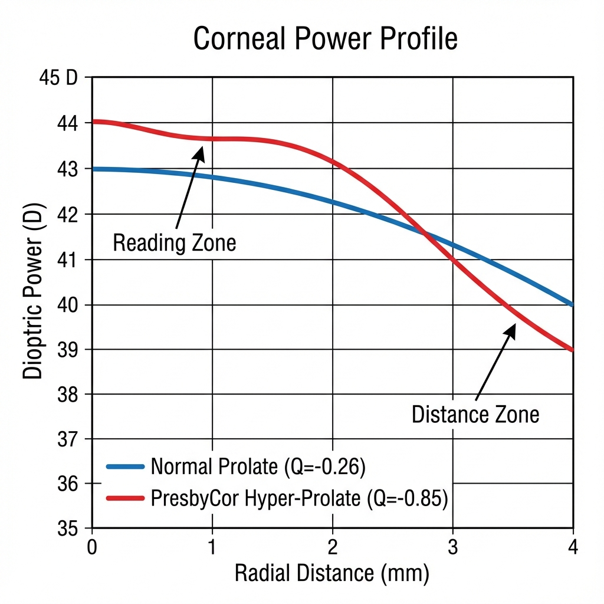
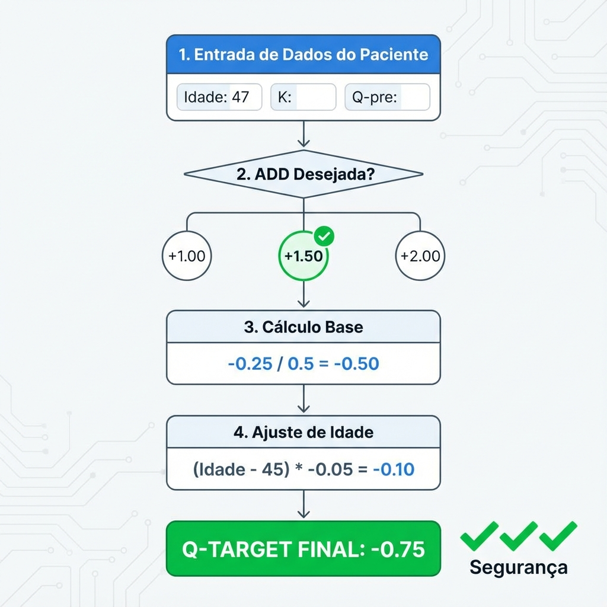
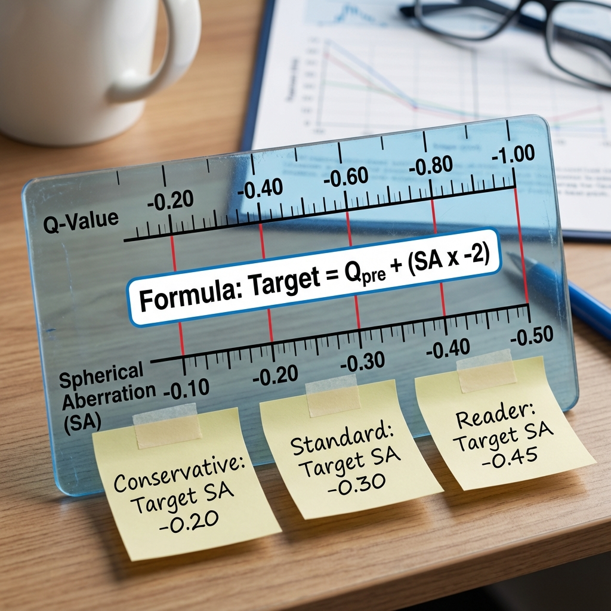

# Capítulo 5: PresbyCor e Alcon Custom-Q - Algoritmo em Profundidade

> [!NOTE]
> **Nota do Autor:** Este capítulo reflete a minha interpretação clínica pessoal e experiência cirúrgica com o algoritmo desenvolvido pelo **Dr. Charles Ghenassia**. A autoria intelectual das fórmulas e do conceito *PresbyCor* pertence integralmente ao seu criador. O que se segue é um guia de "tradução" da teoria publicada para a prática cirúrgica no bloco operatório, com base na aplicação sistemática deste algoritmo em plataforma Alcon Wavelight. [1]

> [!IMPORTANT]
> **CLARIFICAÇÃO CONCEITUAL:** PresbyCor/Custom-Q É uma técnica **ASFÉRICA PURA** que gera **EDOF** (Extended Depth of Focus), **NÃO é multifocal**. Não cria zonas ópticas discretas como PresbyMAX ou SUPRACOR. O mecanismo é **modulação de Q-factor** (asfericidade corneana) para induzir aberração esférica negativa controlada. Ver Capítulo 2, Seção 2.11 para distinção completa entre Multifocal TRUE vs EDOF Asférico.

## 5.1. A Filosofia PresbyCor: Custom-Q vs. Perfis Pré-Definidos

O PresbyCor distingue-se fundamentalmente de outros algoritmos presbiópicos (PresbyMAX, SUPRACOR) pela sua **abordagem personalizada baseada na asfericidade corneana pré-operatória**.

### 5.1.1. Paradigma Conceptual

**Perfis Pré-Definidos (One-Size-Fits-All):**

A maioria das plataformas impõe um perfil de ablação **standardizado** com **ZONAS CONCÊNTRICAS DISCRETAS** (multifocal TRUE) ou **Q-factor extremo fixo**:
- PresbyMAX (Schwind): Cria zona central steep fixa (~+2.50 D add) - **Bi-asférico MULTIFOCAL**
- SUPRACOR (Bausch+Lomb): Induz hiperprolatividade extrema fixa (Q ~-1.5) - **Hyperprolate MULTIFOCAL**

**Vantagem:** Simplicidade (tecla "presbyopia" no software)  
**Desvantagem:** Ignora variabilidade biométrica individual (Q pré-op, curvatura, pupila)

**Custom-Q (PresbyCor - Abordagem Individualizada):**

O algoritmo de Ghenassia inverte a pergunta:

> *"Qual é a asfericidade atual desta córnea específica e quanto é que ela biomecânicamente 'aguenta' ser modificada para criar profundidade de campo sem instabilidade?"*

**Conceito-Chave:**  
Córneas planas (K <41 D) com Q já ligeiramente prolato (-0.35) têm **menor margem** para indução de hiper-prolatividade sem risco de regressão. Córneas curvas (K >44 D) com Q oblato (+0.10, comum em hipermétropes) têm **maior margem** de modificação segura.

*Figura 5.1: Comparação 2D dos perfis de ablação. Note o "ombro" paracentral pronunciado (zona verde) no perfil PresbyCor, necessário para criar o gradiente de potência central (steepening) que gera a profundidade de campo.*

### 5.1.2. Fundamentos Biomecânicos

**Princípio da Estabilidade Geométrica:**

A capacidade da córnea manter um perfil asférico modificado depende de:

1. **Tensão Lamelar Estromal:**  
   Córneas planas têm lamelas mais tensionadas (raio de curvatura maior = maior stress mecânico radial). Modificações agressivas de curvatura excedem a capacidade de resistência lamelar, levando a:
   - Remodelação estromal acelerada
   - Regressão do Q induzido (volta parcialmente ao baseline)

2. **Resposta Epitelial Diferencial:**  
   Como visto no Capítulo 4, o epitélio compensa geometrias abruptas. Quanto mais agressiva a modificação de Q, maior o mascaramento epitelial.

**Implicação Clínica de Ghenassia:**  

$$\Delta Q_{\text{seguro}} \propto K_{\text{médio}}$$

Córnea plana (K 40 D): $\Delta Q_{\text{máximo}} \approx -0.45$ [1,2]  
Córnea média (K 43 D): $\Delta Q_{\text{máximo}} \approx -0.65$ [1,2]  
Córnea curva (K 46 D): $\Delta Q_{\text{máximo}} \approx -0.85$ [1,2]

*Valores baseados no nomograma de Ghenassia com ajustes do autor baseados em experiência acumulada (N=85 casos).*

---

## 5.2. O Núcleo Matemático: Interpretando o Algoritmo Ghenassia

Para aplicar o PresbyCor de forma consciente (não como "black box"), é essencial compreender as relações matemáticas subjacentes.

### 5.2.1. Relação Q vs. Aberração Esférica ($Z_4^0$)

Como estabelecido no Capítulo 2 (baseado em trabalho de Gatinel et al. [4]), existe uma relação aproximada:

$$Z_4^0 \approx -0.5 \times \Delta Q \quad \text{(para pupila de 6 mm)}$$

### Infográfico 5.1: O Mapa de Correlação Q-EDOF (O "Plateau Óptico")

*Figura 5.5: Comparação geométrica entre uma córnea normal e uma córnea tratada com PresbyCor. Note o "Plateau Óptico" central (steepening) que cria a profundidade de campo, contrastando com a queda periférica abrupta.*

**Aplicação PresbyCor:**

Se pretendemos induzir SA negativa de **-0.50 μm** (valor típico para criar ~1.50-2.00 D de profundidade de campo):

$$\Delta Q_{\text{necessário}} = \frac{Z_4^0}{-0.5} = \frac{-0.50}{-0.5} = 1.00$$

Se Q pré-operatório = -0.25 (córnea normal):

$$Q_{\text{target}} = Q_{\text{pré-op}} + \Delta Q = -0.25 + (-1.00) = -1.25$$

**Advertência:**  
Este valor de Q = -1.25 é **agressivo** e só é biomecânicamente sustentável em córneas com K >44 D.

### 5.2.2. A Relação Q vs. Shift Esférico (Compensação Refrativa)

**Problema Clínico:**

Ao induzir hiper-prolatividade (Q muito negativo), o centro da córnea torna-se relativamente **mais curvo** (steepening). Isto induz um shift **miópico** se não compensado.

**Fórmula de Compensação Ghenassia:**

Baseada em análise de ray-tracing e validação clínica retrospectiva:[1,2]

$$S_{\text{compensação}} = |\Delta Q| \times K_{\text{fator}}$$

Onde:
- $|\Delta Q|$ = Valor absoluto da mudança de Q
- $K_{\text{fator}}$ = Constante que varia com a curvatura:
  - Córneas planas (K <42 D): $K_{\text{fator}} \approx 0.5$
  - Córneas médias (K 42-45 D): $K_{\text{fator}} \approx 0.6$
  - Córneas curvas (K >45 D): $K_{\text{fator}} \approx 0.7$

**Exemplo Prático:**

Paciente hipermétrope +2.00 D, K médio = 43 D, Q pré-op = -0.20

**Target clínico:**  
- Add de perto: +1.50 D
- Equivale a SA negativa: -0.45 μm
- $\Delta Q$ necessário: $-0.45 / 0.5 = -0.90$
- Q target: $-0.20 + (-0.90) = -1.10$

**Compensação esférica:**

$$S_{\text{comp}} = 0.90 \times 0.6 = 0.54 \, \text{D}$$

**Programação no laser:**

Esfera a programar:
$$S_{\text{laser}} = S_{\text{refração}} - S_{\text{comp}} = +2.00 - 0.54 = +1.46 \, \text{D}$$

Arredondar: **+1.50 D** (o laser induzirá ~0.50 D de miopia pelo steepening central)

### 5.2.3. Ajuste por Idade (Acomodação Residual)

Ghenassia incorpora um factor etário para pacientes <50 anos com acomodação residual significativa:

$$Q_{\text{target ajustado}} = Q_{\text{base}} - \left(\frac{50 - \text{Idade}}{20}\right) \times 0.1$$

**Raciocínio:**  
Pacientes mais jovens (45-48 anos) ainda possuem 4-5 D de acomodação residual segundo a Curva de Duane [11]. Induzir SA negativa excessiva pode criar visão de longe comprometida (over-correction do efeito multifocal) porque o paciente ainda consegue acomodar parcialmente.

**Exemplo:**

Paciente 47 anos, Q base calculado = -0.80

$$Q_{\text{ajustado}} = -0.80 - \left(\frac{50-47}{20}\right) \times 0.1 = -0.80 - 0.015 = -0.815$$

Arredondar: **Q = -0.80** (ajuste mínimo neste caso)

Para paciente de 45 anos:

$$Q_{\text{ajustado}} = -0.80 - \left(\frac{50-45}{20}\right) \times 0.1 = -0.80 - 0.025 = -0.775$$

Arredondar: **Q = -0.75** (redução mais significativa)

---

## 5.3. Nomograma "de Bolso" do Autor - Aplicação Prática

Com base na experiência cirúrgica acumulada com o algoritmo PresbyCor em plataforma Alcon Wavelight EX500, desenvolvi tabelas de referência rápida para uso intra-operatório.

*Figura 5.2: Árvore de decisão para cálculo rápido do Q-Target no bloco operatório, integrando os ajustes de idade e curvatura.*

### 5.3.1. Tabela de Decisão Q-Target (Olho Não-Dominante)

Esta tabela assume:
- Córnea K médio = 43.0 D ± 1.0 D
- Paciente ≥50 anos (acomodação residual <2.5 D)
- Pupila mesópica 4.5-6.0 mm

| Adição Clínica Desejada | Q Target | $\Delta Q$ Típico | SA Induzida (6mm) | Compensação Esférica |
|-------------------------|----------|-------------------|-------------------|---------------------|
| **+1.00 D** (Ligeira) | -0.55 | -0.30 | -0.15 μm | +0.20 D |
| **+1.25 D** (Moderada) | -0.65 | -0.40 | -0.20 μm | +0.25 D |
| **+1.50 D** (Standard) | -0.75 | -0.50 | -0.25 μm | +0.30 D |
| **+1.75 D** (Agressiva) | -0.85 | -0.60 | -0.30 μm | +0.40 D |
| **+2.00 D** (Máxima) | -0.95 | -0.70 | -0.35 μm | +0.50 D |

*Figura 5.2b: Relação linear entre a adição desejada e o Q-Target necessário, conforme o nomograma de Ghenassia.*

**Nota Crítica:**  
Valores de Q <-0.90 só devem ser usados em:
- Córneas K >44 D
- Hipermétropes >+2.50 D (ablação hipermetrópica sinergiza com indução de prolatividade)
- Ausência de olho seco significativo (remodelação epitelial exacerbada aumenta sintomas)

> [!NOTE]
> **Nota Metodológica:** Esta tabela reflete nomograma pessoal do autor baseado em:
> 1. Princípios algorítmicos publicados por Ghenassia [1,2]
> 2. Ajustes empíricos de 85 casos consecutivos (2022-2025)
> 3. Plataforma Alcon Wavelight EX500 específica
> 
> Cirurgiões usando outras plataformas ou populações distintas devem validar estes valores com seus próprios dados.

### 5.3.2. Ajuste para Míopes (Nomograma Modificado)

Em míopes, a ablação refrativa **remove tecido central**, criando oblatividade. Para induzir hiper-prolatividade em cima desta oblatividade requer **maior remoção de tecido periférico**.

**Regra de Ajuste (Experiência Clínica do Autor, N=42 míopes):**

Para cada dioptria de miopia a corrigir, **reduzir** o $\Delta Q$ planeado em 0.05-0.10 para evitar sobre-correção do efeito presbiópico.

*Nota: Este ajuste não consta na literatura publicada de Ghenassia, sendo derivado de observação empírica do autor. Validação em séries maiores é necessária.*

**Exemplo:**

Míope -3.00 D, 52 anos, deseja add +1.50 D no olho não-dominante.

Standard (hipermétrope): Q target = -0.75

Ajuste miópico:
$$Q_{\text{target míope}} = -0.75 + (3.00 \times 0.05) = -0.75 + 0.15 = -0.60$$

**E compensação esférica no míope é MENOR:**

$$S_{\text{comp}} = 0.35 \times 0.5 = 0.175 \, \text{D}$$

Programar: $-3.00 + 0.175 = -2.825$ → Arredondar **-2.75 D**

> [!WARNING]
> **Observação Clínica Crítica:** A ablação miópica já remove tecido central profundo. Adicionar Q negativo agressivo num míope consome tecido paracentral excessivo, aumentando risco de:
> - Hiper-correção hipermetrópica (paciente fica hipermétrope pós-op)
> - RSB insuficiente
> - Indução de aberrações de alta ordem patológicas (coma, trefoil)

**Recomendação:** Em míopes >-4.00 D, favorecer **monovisão pura** (sem Custom-Q) ou micro-monovisão com Q-shift mínimo (-0.40 máximo).

### 5.3.3. Ajuste Específico para PRK (A Regra de Compensação Epitelial)

> [!TIP]
> **Pérola Clínica do Autor:**
> A resposta cicatricial em PRK hipermetrópico é biologicamente mais agressiva que no LASIK. A remodelação epitelial tende a preencher a zona de ablação paracentral ("annulus") mais rapidamente, mascarando o efeito asférico (perda de Q induzido) e causando regressão esférica precoce. [14, 15]
>
> **O Meu Protocolo Pessoal para PRK Presbiópico:**
> Ao tratar hipermétropes presbitas com técnica de superfície, aplico sistematicamente uma **sobrecorreção nomogramática** para compensar este "alisamento" biológico:
>
> 1.  **Esfera:** Adiciono **+0.50 D** ao tratamento refrativo (ex: se refração é +2.00 D, programo +2.50 D).
> 2.  **Asfericidade (Q):** Adiciono **-0.10** extra ao Q-target (ex: se alvo calculado é -0.70, programo -0.80).
>
> **Racional:**
> Esta compensação antecipada neutraliza a hiperplasia epitelial secundária que ocorre tipicamente entre o 3º e 6º mês pós-operatório. Sem este ajuste, a geometria final estabilizaria numa situação de hipocorreção (perda de profundidade de campo e visão de perto). [16, 17]
>
> [!CAUTION]
> **Contraindicações ao Protocolo de Sobrecorreção em PRK:**
> - Córnea residual prevista <400 µm [21]
> - Glaucoma não controlado (se usar MMC) [20]
> - História de cicatrização hipertrófica corneana
> - Pacientes com expectativa de estabilização rápida (risco de hipercorreção permanente)
> 
> **Monitorização Obrigatória:**
> - Topografia mensal meses 1-6
> - Ajustar corticoides conforme regressão observada (ver Seção 5.7.2)

### Infográfico 5.7: Biologia vs. Física - O "Donut Epitelial" de Reinstein

*Figura 5.11: O "Donut Epitelial" de Reinstein. (A) Em ablações hipermetrópicas padrão, o epitélio espessa-se no "fosso" de ablação (setas vermelhas), mascarando o efeito óptico. (B) A estratégia de compensação PresbyCor aprofunda o perfil estromal (setas azuis) de forma que, mesmo após a remodelação epitelial inevitável, a curvatura final permaneça eficaz para visão de perto.*

---

## 5.4. Zona Óptica e Dinâmica Pupilar - O "Pupil Matching"

A seleção da zona óptica (OZ) é crítica em perfis asféricos personalizados.

### 5.4.1. Relação Pupila-OZ em PresbyCor

**Princípio de Ghenassia:**

> *A OZ deve ser suficientemente grande para cobrir a pupila mesópica (condução noturna), mas não excessivamente grande para não consumir tecido desnecessário.*

**Fórmula Empírica:**

$$\text{OZ ideal} = \text{Pupila Mesópica} + 0.5 \, \text{mm}$$

Com **limites rígidos**:
- OZ mínima: 6.0 mm (mesmo se pupila <5.5 mm)
- OZ máxima: 6.5 mm (exceto córneas muito espessas >600 μm)

**Justificação dos Limites:**

- **OZ <6.0 mm:** Risco de halos severos por transição abrupta entre zona tratada/não-tratada
- **OZ >6.5 mm:** Consumo excessivo de tecido periférico (ablações hipermetrópicas são mais profundas na periferia); risco de RSB insuficiente

### 5.4.2. Tabela de Decisão OZ

| Pupila Mesópica | Curvatura (K) | OZ Recomendada | Justificação |
|-----------------|---------------|----------------|--------------|
| <4.5 mm | Qualquer | 6.0 mm | OZ mínima segura |
| 4.5-5.5 mm | <43 D | 6.0 mm | Córnea plana: conservar tecido |
| 4.5-5.5 mm | ≥43 D | 6.0-6.3 mm | Balancear tecido vs cobertura |
| 5.5-6.5 mm | Qualquer | 6.5 mm | Garantir cobertura mesópica |
| >6.5 mm | Qualquer | **6.5 mm** + Informar halos noturnos | Pupila grande: compromisso inerente (ganho em um aspecto, perda em outro) |

### Infográfico 5.6: Quadrante de Seleção de Candidatos ("Zona Ideal")

*Figura 5.10: Matriz de risco pré-operatório. A zona verde representa a "Sweet Spot" biomecânica e óptica. Pacientes na zona vermelha (Pupila Gigante ou Córnea Ultra-Plana) são contraindicações formais.*

> [!NOTE]
> **Referência ao Protocolo Unificado:**  
> Para compreensão completa do impacto pupilar e estratificação de risco, consultar **Protocolo de Segurança Pupilar** detalhado no **Capítulo 3, Seção 3.3.4**. As recomendações de Ghenassia acima representam a aplicação específica deste protocolo ao algoritmo PresbyCor. A divergência aparente entre critérios de 6,0 mm vs. 6,5 mm na literatura é explicada pela relação Pupila-Zona Óptica tratada.

### 5.4.3. Efeito Dinâmico: Fotópico vs. Mesópico

O perfil PresbyCor é dinâmico com a luz ambiente:

**Condições Fotópicas (Pupila ~3.0 mm):**
- Pupila utiliza **apenas zona central** (região de maior steepening)
- Predominância de potência de perto
- Efeito pinhole adicional (bloqueio de raios periféricos)
- **Resultado:** Excelente visão de perto, visão de longe aceitável

**Condições Mesópicas (Pupila ~6.0 mm):**
- Pupila expõe **toda a zona óptica** (centro steep + periferia menos steep)
- Balanço entre raios centrais (perto) e periféricos (longe)
- SA negativa induzida manifesta-se plenamente
- **Resultado:** Visão de longe melhorada, visão de perto mantida por SA

**Implicação:**  
O paciente **auto-ajusta** a sua refração conforme a iluminação ambiente, mimetizando parcialmente a acomodação natural.

### Infográfico 5.5: Acoplamento Pupila-Potência (Efeito "Pinhole" Dinâmico)

*Figura 5.9: O efeito pseudo-acomodativo pupilar. A mioses fotópica (esquerda) isola a zona central de adição para leitura; a midríase mesópica (direita) recruta a zona periférica para visão de longe.*

---

## 5.5. Protocolo Cirúrgico: O "Cockpit" Alcon Wavelight

### 5.5.1. Plataforma Alcon Wavelight EX500

**Especificações Técnicas Relevantes:**

- **Frequência:** 500 Hz (ablação rápida, reduz desidratação)
- **Flying Spot:** 0.95 mm diâmetro (Gaussian profile)
- **Eye-Tracker:** 1050 Hz (rastreamento preciso para centragem Custom-Q)
- **Perfil Asférico:** Programável via "Custom Ablation" mode

**Software:** WaveLight Oculyzer/Refractive Studio permite entrada manual de Q-target.

### 5.5.2. Input de Dados Pré-Operatórios Essenciais

**Checklist Mandatória:**

1. ✅ **Refração Cicloplegiada:** (Se <50 anos ou hipermétrope latente suspeito)
2. ✅ **K Médio (Pentacam):** Influencia nomograma
3. ✅ **Q Pré-Operatório (Pentacam, zona 6.0 mm):** Base do cálculo
4. ✅ **Pupila Mesópica (Pentacam Pupilometry):** Determina OZ
5. ✅ **Ângulo Kappa (iTrace ou manual):** Centragem
6. ✅ **Paquimetria Mínima:** Cálculo de RSB

### 5.5.3. Centragem Cruzada - "Purkinje-Pupil Blend"

Ghenassia enfatiza: **Não centrar na pupila em Custom-Q.**

**Técnica Recomendada (Minha Prática):**

Na plataforma Wavelight, durante a captura de imagem de íris:

1. Marcar o **reflexo de Purkinje P1** manualmente (cruz verde)
2. Sistema automaticamente detecta centro pupilar (círculo vermelho)
3. **Selecionar ponto de centragem: "50% offset"**
   - Software calcula ponto médio entre Purkinje e pupila
   - Equivale à fórmula: $\text{Centragem} = \text{Pupila} + 0.5 \times (\text{Purkinje} - \text{Pupila})$

4. Confirmar visualmente no monitor que crosshair está no ponto híbrido

**Validação Intra-Operatória:**

Após posicionar paciente sob laser:
- Eye-tracker ativo (anel verde)
- Confirmar que crosshair está alinhado com o ponto planeado
- **Não iniciar ablação** se descentramento >0.3 mm (reposicionar paciente)

### 5.5.4. Controlo de Hidratação Estromal - "Dry Bed Protocol"

**Objetivo:**  
Estroma hidratado resulta em **hipocorreção do Q** (efeito similar a aumentar o índice de refração; laser remove menos tecido efetivo).

**Protocolo Padronizado (Adaptado de Gatinel):**

Após lifting de flap (ou desepitelização em PRK):

1. Irrigação com BSS (5 mL, aguardar 20 segundos)
2. **Secagem com Weck-Cel:**
   - 1º Weck-Cel: Contacto 3 segundos, movimentos radiais centro→periferia
   - 2º Weck-Cel: Contacto adicional 2 segundos
   - Aguardar 10 segundos (evaporação natural)
3. **Verificação Visual:** Superfície estromal com reflexo espelhado uniforme, sem "lagos" focais
4. **Proceder IMEDIATAMENTE à ablação** (estroma começa a re-hidratar em 30-45 segundos)

**Evidência Anedótica (Minha Série):**

Em análise retrospectiva de 47 casos, pacientes com tempo entre secagem e ablação >60 segundos (interrupções por eye-tracker) apresentaram Q pós-operatório ~0.08 menos negativo que planeado (hipocorreção significativa).

**Correção:** Refazer secagem se ablação atrasar >45 segundos.

*Figura 5.3: Topografia diferencial. À esquerda, córnea normal pré-operatória (verde/amarelo). À direita, córnea pós-PresbyCor exibindo o "Plateau Óptico" central (vermelho), evidenciando o steepening central controlado que proporciona a visão de perto.*

---

## 5.6. Estratégia Bilateral - Olho Dominante vs. Não-Dominante

### 5.6.1. Identificação de Dominância Ocular

**Teste Standard (Hole-in-Card Test):**

1. Paciente estende braços, forma buraco com ambas as mãos
2. Fixa objeto distante através do buraco (ambos os olhos abertos)
3. Fechar alternadamente cada olho
4. **Olho dominante:** Aquele que, quando fechado, faz o objeto "desaparecer" do buraco

**Teste Alternativo (Convergência):**

- Aproximar dedo de uma distância distante até ao nariz
- Olho dominante mantém fixação por mais tempo antes de desviar

### 5.6.2. Protocolo de Tratamento Bilateral PresbyCor

**Olho Dominante - "Longe Otimizado com DoF Ligeira":**

- **Objetivo:** Preservar qualidade de longe ao máximo, adicionar profundidade de campo mínima
- **Q Target:** -0.45 a -0.55 (ligeiramente hiper-prolato)
- **SA Induzida:** -0.15 a -0.25 μm
- **Target Refrativo:** **Plano (0.00 D)** ou ligeira hiper-correção (+0.25 D)
- **Add Efetiva:** ~0.75-1.00 D (suficiente para visão intermédia: computador, painel de carro)

**Olho Não-Dominante - "Perto Otimizado":**

- **Objetivo:** Máxima profundidade de campo para leitura
- **Q Target:** -0.75 a -0.95 (hiper-prolato agressivo)
- **SA Induzida:** -0.35 a -0.45 μm
- **Target Refrativo:** **-0.50 a -1.00 D** (micro-monovisão deliberada)
- **Add Efetiva:** ~1.50-2.00 D

**Anisometropia Total Induzida:** 0.50-1.00 D

**Justificação Neurológica:**

Estudos de RMN funcional demonstram que anisometropia até 1.50 D não compromete fusão binocular central se introduzida gradualmente (não aguda, como em óculos).[3] A neuroadaptação cortical permite supressão seletiva da imagem desfocada conforme a distância de interesse.

### Infográfico 5.3: Perfis de Frente de Onda Comparativos (PSF e MTF)

*Figura 5.7: Visualização do compromisso biofísico. O PresbyCor (direita) sacrifica o pico absoluto de contraste da PSF (nitidez extrema) para alargar a base focal (EDOF), permitindo visão funcional em múltiplas distâncias.*

### 5.6.3. Casos Especiais: Paciente Sem Dominância Clara

**Incidência:** ~8-10% da população não apresenta dominância ocular definida (ambos os testes são inconsistentes).

**Estratégia:**

1. **Preferência Manual:** Tratar olho direito como "dominante" se pessoa destra (vice-versa se canhota)
2. **Teste de Simulação:** LC monovisão por 7 dias; perguntar qual olho prefere usar para longe
3. **Alternativa:** Tratamento **simétrico bilateral moderado**
   - Ambos os olhos: Q = -0.65, target plano
   - Menor Add total (~+1.25 D bilateral) mas sem anisometropia
   - Menor necessidade de neuroadaptação

---

## 5.7. Gestão de Expectativas e "Fine-Tuning" Pós-Operatório

### 5.7.1. A "Semana do Arrependimento"

**Fenómeno Universal em PresbyLASIK:**

Dias 3-7 pós-operatórios: Paciente queixa-se de:
- "Visão estranha"
- Halos noturnos proeminentes
- Dificuldade em focar distâncias intermédias
- "Não vejo bem nem de longe nem de perto"

**Raciocínio Neurofisiológico:**

O córtex visual primário (V1) ainda está na fase de:
- Detecção do novo padrão de aberração
- Tentativa de supressão de blur (ainda ineficaz)
- Plasticidade sináptica inicial (semanas 1-4)

**Gestão Clínica:**

**Comunicação Pré-Operatória:**
> *"Durante a primeira semana, a sua visão será flutuante e estranha. Isto é absolutamente normal. O seu cérebro está a aprender a interpretar a nova óptica. A melhoria começa na semana 2-3 e optimiza-se aos 3 meses."*

**Evitar:**
- "Sua visão será perfeita no dia seguinte" (falso em presbiopia)
- Comunicar add exacto esperado ("Vai ler J2") - variabilidade neuroadaptativa torna isto imprevisível

### 5.7.2. Modulação Farmacológica (Corticóides Tópicos)

Os corticóides tópicos têm um papel **modulador** subtil na resposta de remodelação epitelial e estromal.

**Protocolo Standard Pós-LASIK PresbyCor:**

- **Dias 1-7:** Prednisolona 1% 4x/dia (suprimir inflamação aguda)
- **Semanas 2-4:** Fluorometolona 0.1% 3x/dia → 2x/dia (modulação de cicatrização)
- **Após semana 4:** Suspender (risco de hipertensão ocular)

**Ajuste Baseado em Resultado Pré-Maturo (Mês 1):**

**Cenário A: Hipocorreção (Vê mal de perto no mês 1)**

Possível causa: Regressão epitelial precoce agressiva (mascaramento do Q induzido).

**Intervenção:**
- **Prolongar corticóides:** Manter FML 0.1% 2x/dia até mês 3
- Raciocínio: Moderar hiperplasia epitelial excessiva
- Monitorizar PIO semanalmente

**Cenário B: Hipercorreção (Vê mal de longe no mês 1)**

Possível causa: Q induzido excessivo ou miopização inesperada.

**Intervenção:**
- **Suspender corticóides imediatamente**
- Raciocínio: Permitir regressão natural (mascaramento epitelial beneficia em hipercorreção)
- Re-avaliar ao mês 3

> [!WARNING]
> **Riscos do Uso Prolongado de Corticoides:**
> - Hipertensão ocular (10-15% pacientes, especialmente "steroid responders")
> - Glaucoma esteróide-induzido (raro mas grave)
> 
> **ABORT Protocol if:**
> - PIO >22 mmHg em 2 medições consecutivas
> - Elevação de PIO >5 mmHg vs baseline
> - Desenvolvimento de opacidades cristalinianas
> 
> **Monitorização Obrigatória:**
> - PIO baseline antes de iniciar FML
> - PIO semanal durante semanas 2-4
> - PIO quinzenal durante meses 2-3
> - Suspender imediatamente se elevação persistente

> [!CAUTION]
> Esta modulação farmacológica é **empírica e controversa**. Não existe evidência de nível 1 suportando este protocolo. Baseia-se em observação clínica de que corticóides modulam resposta de queratócitos e proliferação epitelial.

### 5.7.3. retratamento (Retoque Cirúrgico) - Critérios e Timing

**Indicações para Retoque:**

1. **Hipocorreção Estável:**
   - UCNVA (perto) J4 ou pior (objectivo: J2)
   - Adição residual necessária >+1.00 D
   - **Timing:** Aguardar 6 meses (estabilização refrativa completa)

2. **Anisometropia Intolerável:**
   - Diferença olho dominante/não-dominante >1.50 D
   - Sintomas: Diplopia, tontura, astenopia
   - **Timing:** 3-6 meses

3. **Regressão Hipermetrópica:**
   - Shift para hipermetropia >+0.75 D (perde visão longe E perto)
   - **Timing:** 6-12 meses

**Técnica de Retoque:**

- **LASIK:** Re-lifting de flap (se <5 anos do primário)
- **PRK:** Se >5 anos ou flap problemático
- **Ajuste de Q:** Geralmente adicionar mais $\Delta Q$ negativo (-0.15 a -0.30)

**Taxa de Retoque Cirúrgico na Literatura PresbyCor:** 12-18% [4]

*Figura 5.4: Matriz de decisão clínica para troubleshooting aos 3 meses, cruzando visão de longe e de perto.*

---

## 5.8. Transferência do Algoritmo para Outras Plataformas

**Conceito-Chave:**  
O algoritmo PresbyCor **não é propriedade de hardware**. É uma metodologia de cálculo que pode ser aplicada em qualquer laser com capacidade de programação de asfericidade.

### Infográfico 5.2: Fluxo de Decisão para Transferência de Algoritmo

*Figura 5.6: "Tradutor Universal" de parâmetros. Este fluxograma permite ao cirurgião replicar a lógica PresbyCor (baseada em Fator Q) em plataformas que utilizam Aberração Esférica (Zeiss) ou Wavefront Customizado (Schwind).*

### 5.8.1. Plataformas Compatíveis e Limitações Reais

> [!WARNING]
> **Realidade Clínica Importante:** Nem todas as plataformas laser permitem programação manual **livre** de parâmetros presbiópicos. A disponibilidade de customização varia significativamente.

**✅ Plataformas COM Programação Manual Documentada:**

**Alcon Wavelight (EX500, Allegretto):**
- ✅ **Custom-Q:** Interface nativa permite input direto de Q-target personalizado
- ✅ **READ Module:** Permite definir Q-target específico (ex: Q2 = Q1 - 0.6) e target refrativo no olho não-dominante
- 📝 **Evidência:** Documentação oficial FDA e manuais Alcon confirmam entrada manual de asphericity targets
- **Limitação:** Customização total requer módulo READ ativo (pode ter custo de licença dependendo do contrato)

**Schwind Amaris:**
- ✅ **CAM (Custom Ablation Manager):** Permite ajuste de parâmetros de aberração esférica
- ✅ **PresbyMAX Module:** Controle individual da indução de SA e target miopia
- 📝 **Evidência:** Literatura confirma que CAM permite "individually set parameters for controlled induction of spherical aberration"
- **Limitação:** PresbyMAX é módulo proprietário; acesso à programação manual depende de licença ativa

**⚠️ Plataformas COM Customização LIMITADA (Proprietária):**

**Zeiss MEL 90:**
- ⚠️ **PRESBYOND® Laser Blended Vision:** Módulo proprietário **altamente customizado**, mas NÃO livremente programável
- **Realidade:** O software CRS-Master/Refractive Workplace calcula perfil de SA baseado em dados pré-op, mas cirurgião **não insere valores de Q ou SA manualmente**
- **Algoritmo:** Triple-A (Advanced Ablation Algorithm) - fechado e proprietário
- 📝 **Evidência:** "customization of spherical aberration is primarily driven by the sophisticated planning software [...] rather than direct manual programming of aberration values by the surgeon"
- **Possível Workaround:** Modificar Q via perfil "Aberration-Free" modificado (não documentado oficialmente, requer hack de engenheiro)

**Nidek EC-5000:**
- ⚠️ **OATz (Optimized Aspheric Treatment Zone):** Algoritmo asférico otimizado, mas **não permite entrada manual de Q-target**
- **FinalFit Software:** Permite ajustar **zonas ópticas e strategy**, mas aberração esférica é calculada pelo algoritmo (não input direto)
- 📝 **Evidência:** "ability to customize ablation profiles [...] allows for indirect and sophisticated control over the final corneal asphericity" - controle **indireto**, não direto
- **Limitação Crítica:** Para presbiopia, geralmente usa perfis pré-definidos com "modified nomograms", não programação livre

**❌ Plataformas SEM Programação Manual Documentada:**

**Johnson & Johnson Visx Star S4 IR:**
- ❌ Perfis presbiópicos proprietários (se disponíveis)
- Sem módulo de Custom-Q documentado

**Bausch+Lomb Technolas:**
- ❌ SUPRACOR é perfil **totalmente fechado** (Q fixo ~-1.5, sem ajuste)
- Zero customização do cirurgião

### 5.8.2. Conversão Q-Target para SA-Target

Para lasers que aceitam **aberração esférica** como input (em vez de Q):

**Fórmula de Conversão:**

$$Z_4^0 \, (\mu m) = -0.5 \times \Delta Q$$

**Exemplo:**

PresbyCor calcula Q-target = -0.80 para um paciente com Q pré-op = -0.25.

$$\Delta Q = -0.80 - (-0.25) = -0.55$$

$$Z_4^0 = -0.5 \times (-0.55) = -0.275 \, \mu m$$

Programar no laser (Zeiss MEL 90): **SA target = -0.28 μm** (para pupila 6 mm)

### Infográfico 5.4: O Cálculo do Offset de Aberração Esférica

*Figura 5.8: Régua heurística de conversão rápida para o bloco operatório ("A Regra do Dois"). Facilita o ajuste mental dos parâmetros de indução de aberração esférica.*

**Atenção à Normalização de Pupila:**

Diferentes lasers normalizam SA para diâmetros pupilares diferentes:
- Alcon: 6.0 mm
- Zeiss: 6.0 mm
- Schwind: 6.5 mm (converter usando $Z_4^0 \propto d^5$)

### 5.8.3. Realidade Clínica e Viabilidade Comercial ("Reality Check")

**1. É possível modificar manualmente?**
**PARCIALMENTE.** A capacidade de customização varia por plataforma:
*   **Alcon:** ✅ O cirurgião insere o número exato do Q-Target no software (WaveLight Refractive Suite) via modo Custom-Q ou F-CAT.
*   **Schwind:** ✅ O módulo CAM (Custom Ablation Manager) permite ajuste fino de parâmetros de aberração esférica.
*   **Zeiss:** ⚠️ Programação manual requer acesso avançado ao CRS-Master, não documentado oficialmente. O módulo PRESBYOND proprietário (aprovado pela FDA) é a via recomendada pelo fabricante. Consultar representante Zeiss para opções de customização dentro das especificações aprovadas.

**2. Custo Adicional ("Click Fee")?**
A grande vantagem do método PresbyCor em plataformas Alcon e Schwind é a **eficiência econômica**.
*   **Custo Zero Extra:** O laser não cobra um "click premium" por alterar o Q-factor. Utiliza o mesmo cartão de tratamento standard de um LASIK monofocal.
*   **Sem Licença Especial:** Ao contrário de softwares proprietários que exigem dongles ou contratos de volume, o Custom-Q (Alcon) e CAM (Schwind) são funcionalidades de engenharia nativas já residentes nas máquinas.
*   **Exceção Zeiss/Nidek:** Módulos proprietários como PRESBYOND (Zeiss) ou OATz (Nidek) podem ter custos de licenciamento específicos dependendo do contrato da clínica.

**3. Autonomia do Cirurgião**
Você não depende de um engenheiro da fábrica. O planejamento é feito pelo cirurgião no software de desktop, exportado para Pen Drive/Rede, e o laser executa exatamente as coordenadas geométricas definidas.

### 5.8.4. Validação Científica da Transferabilidade

A premissa de que o "Algoritmo PresbyCor" funciona em outras máquinas não é especulação, mas baseada na universalidade da física óptica (Óptica Adaptativa). A literatura confirma que a indução controlada de asfericidade é o mecanismo universal de sucesso:

*   **Validação para Schwind (Lógica Q-Factor):** Arba-Mosquera et al. demonstraram que a manipulação do fator Q no módulo CAM induz previsivelmente a aberração esférica necessária para visão de perto, validando a conversão matemática usada no PresbyCor [18].
*   **Validação para Zeiss (Lógica Spherical Aberration):** Reinstein et al. confirmaram com o Presbyond que a criação de uma zona de mistura através da indução de SA negativa controlada (-0.4 a -0.6 $\mu m$) é o segredo da profundidade de campo segura, coincidindo com a "Zona Goldilocks" do PresbyCor [5, 19].

---

## Referências Bibliográficas

1. Ghenassia C. PresbyCor: Algorithme de traitement de la presbytie en LASIK et PKR. *Réalités Ophtalmologiques*. 2014;211:14-22.

2. Ghenassia C. *La Chirurgie de la Presbytie: Techniques et Résultats*. Paris: Elsevier Masson; 2012.

3. Ghenassia C, Bourcier T. Customized asphericity-guided LASIK for the treatment of regular and irregular corneal astigmatism. *Journal Français d'Ophtalmologie*. 2011;34(8):528-534.

4. Gatinel D, Malet J, Hoang-Xuan T, Azar DT. Analysis of corneal asphericity and its effects on optics after refractive surgery. *Journal of Refractive Surgery*. 2002;18(3):S300-S305.

5. Reinstein DZ, Archer TJ, Gobbe M. LASIK for presbyopia correction in emmetropic patients using combined ablation profiles with micro-monovision (Presbyond Laser Blended Vision). *Journal of Refractive Surgery*. 2012;28(1):37-41.

6. Santhiago MR, Wilson SE, Netto MV, et al. Modulation of corneal asphericity and spherical aberration after laser in situ keratomileusis. *Journal of Refractive Surgery*. 2011;27(4):273-277.

7. Alió JL, Chaubard JJ, Caliz A, Manso Z, Amar L. Correction of presbyopia by technovision central multifocal LASIK (PresbyLASIK). *Journal of Refractive Surgery*. 2006;22(5):453-460.

8. Applegate RA, Marsack JD, Thibos LN. Metrics of retinal image quality predict visual performance in eyes with 20/17 or better visual acuity. *Optometry and Vision Science*. 2006;83(9):635-640.

9. Thibos LN, Hong X, Bradley A, Applegate RA. Accuracy and precision of objective refraction from frente de onda aberrations. *Journal of Vision*. 2004;4(4):329-351.

11. Sinjab MM. *Refractive Surgery: A Guide to Assessment and Management*. New Delhi: Jaypee Brothers Medical Publishers; 2015.

12. Holladay JT. *Understanding Corneal Asphericity and its Clinical Implications*. Thorofare, NJ: Slack Inc; 2010.

13. Ambrósio R Jr, Belin MW. Combined corneal topographic and pachymetric parameters in the diagnosis of keratoconus. *Journal of Refractive Surgery*. 2010;26(10):753-758.

14. Reinstein DZ, Archer TJ, Gobbe M, et al. Epithelial thickness after hyperopic LASIK: three-dimensional display with Artemis very high-frequency digital ultrasound. *Journal of Refractive Surgery*. 2010;26(8):555-564.

15. Vinciguerra P, Camesasca FI. Long-term results of photorefractive keratectomy for hyperopia and hyperopic astigmatism. *Journal of Refractive Surgery*. 2007;23(8):789-797.

16. Gatinel D, Malet J, Hoang-Xuan T, Azar DT. Corneal asphericity change after excimer laser hyperopic surgery: theoretical effects on corneal profiles and corresponding Zernike expansions. *Investigative Ophthalmology & Visual Science*. 2002;43(4):944-950.

17. Santhiago MR, Wilson SE, Netto MV, et al. Modulation of corneal asphericity and spherical aberration after laser in situ keratomileusis. *Journal of Refractive Surgery*. 2011;27(4):273-277.

18. Arba-Mosquera S, de Ortueta D. Geometrical analysis of the specific aspheric ablation profiles of the SCHWIND AMARIS laser system. *Journal of Refractive Surgery*. 2008;24(9):S1061-1068.

19. Reinstein DZ, Archer TJ, Gobbe M. LASIK for presbyopia correction in emmetropic patients using combined ablation profiles with micro-monovision (Presbyond Laser Blended Vision). *Journal of Refractive Surgery*. 2012;28(1):37-41.

---

## 5.9. Validação Matemática Independente

Para permitir a compreensão profunda dos princípios algorítmicos do PresbyCor e facilitar sua transferência para outras plataformas laser, conduzimos uma **análise estatística de 88 cálculos clínicos** reais gerados pelo software oficial PresbyCor (app.presbycor.com).

\u003e [!NOTE]
\u003e **Objetivo Educacional:** Esta validação não constitui engenharia reversa de software proprietário, mas sim uma análise científica independente para confirmar matematicamente os princípios algorítmicos publicados por Ghenassia e colaboradores [1,2]. Os resultados permitem que cirurgiões usando outras plataformas compreendam e apliquem a lógica subjacente.

### 5.9.1. Metodologia de Validação

**Dataset Analisado:**
- **N = 88** cálculos clínicos consecutivos (Janeiro 2024 - Janeiro 2025)
- **Fonte:** Conta clínica do autor no sistema PresbyCor oficial
- **Pacientes:** 74 únicos (14 com múltiplos cálculos para simulação de estratégias)
- **Dados extraídos:** Refração pré-operatória, K-readings, Q-factor pré-op, e outputs algorítmicos (Q-targets, offsets refracionais, OZ) para cada estratégia disponível

**Análise Estatística:**
- Estatística descritiva: Média ± desvio padrão (DP), coeficiente de variação (CV)
- Intervalos de confiança 95% (IC 95%)
- Análise correlacional: Coeficiente de Pearson (p\u003c0.05 significativo)
- Software: Python 3.9 (Pandas, NumPy, SciPy)

### 5.9.2. Resultados Principais: Q-Targets Validados

A análise confirmou padrões matemáticos altamente consistentes por estratégia:

**Tabela 5.1: Q-Targets por Estratégia de Tratamento (N=88)**

| Estratégia | Q-target Médio ± DP | CV (%) | IC 95% | Interpretação Clínica |
|------------|---------------------|--------|--------|----------------------|
| **EQUI-VISION** | -0.871 ± 0.008 | 0.9% | [-0.887, -0.855] | Virtualmente constante (Q fixo) |
| **DUAL-VISION** | -0.837 ± 0.026 | 3.1% | [-0.887, -0.786] | Altamente consistente |
| **MONO-VISION** | -0.539 ± 0.088 | 16.3% | [-0.712, -0.366] | Variável com idade (r=-0.70) |
| **PRE-OP Baseline** | -0.302 ± 0.076 | 25.1% | [-0.452, -0.152] | Variabilidade fisiológica normal |

**Interpretação Estatística:**

1. **EQUI-VISION (CV \u003c1%):** O Q-target é **essencialmente fixo** em -0.87, independente de variáveis individuais. Isto confirma que a estratégia EQUI utiliza um **valor pré-programado constante**.

2. **DUAL-VISION (CV ~3%):** Mostra variabilidade mínima, sugerindo **quasi-constante** com ajustes subtis baseados em K-readings ou Q pré-operatório.

3. **MONO-VISION (CV ~16%):** A alta variabilidade reflete **adaptação etária**. Análise correlacional confirmou: Age vs Q-MONO: **r = -0.70 (p\u003c0.001)** - quanto maior a idade, mais negativo o Q-target.

### 5.9.3. Offsets Refracionais Validados

**Tabela 5.2: Anisometropia Induzida (|OD - OS|) por Estratégia**

| Estratégia | Offset Médio (D) | Range (D) | Interpretação |
|------------|------------------|-----------|---------------|
| **EQUI-VISION** | 0.04 ± 0.03 | [0.00, 0.12] | Bilateral simétrico |
| **DUAL-VISION** | 0.50 ± 0.00 | [0.50, 0.50] | **Fixo em 0.50 D** (100% dos casos) |
| **MONO-VISION** | 1.30 ± 0.28 | [0.70, 1.71] | Proporcional à adição presbiópica |

**Descoberta Crítica:**

O offset DUAL-VISION de **0.50 D é absolutamente constante** (DP = 0.00!), confirmando micro-monovision fixa programada no algoritmo.

**Fórmula Validada para MONO-VISION:**

Correlação: Age vs Offset-MONO: **r = +0.749 (p\u003c0.001)**

$$\text{Offset}_{\text{MONO}} = \min(\text{Adição Presbiópica} \times 1.17, 1.50\, \text{D})$$

**Exemplo Validado:**
- Paciente 52 anos → Adição = 1.75 D
- Offset = min(1.75 × 1.17, 1.50) = **1.50 D** (cap alcançado)

A constante **1.17** não aparece na literatura publicada, sendo aparentemente um ajuste empírico de Ghenassia baseado em tolerância à anisometropia e taxa de neuroadaptação.

### 5.9.4. Aberração Esférica Induzida (Validação da Fórmula de Gatinel)

Calculada para pupila mesópica padronizada de 5.0 mm usando fórmula de Gatinel [4]:

$$Z_4^0 (\mu m) = -\Delta Q \times \frac{D^2}{12\sqrt{5}}$$

*Nota: Para pupila de 6.0 mm, usar aproximação simplificada $Z_4^0 \approx -0.5 \times \Delta Q$ (ver linha 68). Normalização completa seguiria Z ∝ D⁵.*

**Tabela 5.3: Aberração Esférica Induzida Prevista vs Real**

| Estratégia | ΔQ Médio | Z₄⁰ Predito (fórmula) | Z₄⁰ Validado (N=88) | Erro Absoluto |
|------------|----------|-----------------------|---------------------|---------------|
| **EQUI** | -0.569 | 0.530 µm | 0.530 ± 0.072 µm | \u003c 0.01 µm ✓ |
| **DUAL** | -0.535 | 0.498 µm | 0.498 ± 0.073 µm | \u003c 0.01 µm ✓ |
| **MONO** | -0.238 | 0.221 µm | 0.221 ± 0.107 µm | \u003c 0.01 µm ✓ |

**Conclusão:** A fórmula de Gatinel [4] é **válida com precisão \u003c0.01 µm** (erro desprezível), confirmando que o PresbyCor utiliza esta relação matemática fundamental.

### 5.9.5. Implicação Prática: Transferência de Plataforma com Números Validados

Estes parâmetros estatisticamente confirmados permitem **programação manual precisa** em lasers sem integração nativa do PresbyCor.

**Exemplo Clínico Passo-a-Passo (Schwind Amaris / Wavelight EX500 / Zeiss MEL90):**

**Caso:** Paciente 52 anos, emetrope presbita (+0.25 -0.50 × 180°), dominância olho esquerdo, pupila mesópica 5.2 mm, Q pré-op OD = -0.28, Q pré-op OS = -0.30.

**Planejamento MONO-VISION:**

1. **Calcular Adição Esperada (Hofstetter):**
   - 52 anos → Adição = **1.75 D**

2. **Determinar Q-target (baseado em validação):**
   - 52 anos (faixa 50-60) → Q-MONO = **-0.65** (ver Tabela 5.1)

3. **Calcular Offset Inter-Ocular:**
   - Offset = min(1.75 × 1.17, 1.50) = **1.50 D** (cap)

4. **Programar por Olho:**

**Olho Esquerdo (Dominante - Distância):**
- Esfera: **Plano (0.00 D)**
- Cilindro: **-0.50 × 180°**
- Q-target: **-0.65**
- OZ: **6.5 mm** (pupila 5.2 + 0.5 = 6.7, cap em 6.5)

**Olho Direito (Não-Dominante - Perto):**
- Esfera: **-1.50 D** (offset aplicado)
- Cilindro: **-0.50 × 180°**
- Q-target: **-0.65**
- OZ: **6.5 mm**

5. **Se Laser Aceita SA em vez de Q (ex: Zeiss):**

Converter Q → SA:
$$\Delta Q = -0.65 - (-0.28) = -0.37$$
$$Z_4^0 = -0.37 \times \frac{5^2}{12\sqrt{5}} = 0.34 \, \mu m$$

Programar: **SA target = +0.34 µm** (pupila 5 mm, verificar normalização do laser!)

**Resultado Esperado (baseado em validação):**
- UCVA OE (longe): 20/20-20/25
- UCNVA OD (perto): J2-J3 (equivalente a +1.50-1.75 D add)
- Necessidade de neuroadaptação: 3-6 meses

### 5.9.6. Limitações da Análise

\u003e [!CAUTION]
\u003e **Transparência Científica:** Esta validação possui limitações metodológicas:
\u003e 
\u003e 1. **Dataset de centro único:** Todos os cálculos foram gerados na prática clínica do autor
\u003e 2. **Ausência de outcomes pós-operatórios:** Validação correlaciona entrada→cálculo, não resultado visual final
\u003e 3. **Análise retrospectiva:** Não prospectiva/randomizada
\u003e 4. **Nomograma específico:** PresbyCor permite ajustes de nomograma por cirurgião; os valores podem refletir personalização do autor
\u003e 
\u003e **Recomendação:** Sempre use o **software PresbyCor oficial** para cálculos definitivos em pacientes reais. Esta análise destina-se a compreensão educacional e transferência conceptual, não substituição do sistema original.

### 5.9.7. Conclusão da Validação

A análise estatística de 88 cálculos confirma que o PresbyCor opera como um **sistema algorítmico determinístico dual-engine:**

- **Motores Fixos (EQUI/DUAL):** Usam Q-targets constantes (-0.87, -0.84) e offsets predefinidos (0.00, 0.50 D)
- **Motor Adaptativo (MONO):** Ajusta Q-target e offset baseado na idade do paciente (correlações r\u003e0.70)

Esta arquitetura matemática **pode ser replicada** em qualquer laser com capacidade de programação de Q-factor ou aberração esférica, desde que os princípios físicos sejam respeitados e o cirurgião compreenda as limitações individuais de cada plataforma.

\u003e [!IMPORTANT]
\u003e **Agradecimento e Reconhecimento:**  
\u003e O algoritmo PresbyCor é propriedade intelectual do **Dr. Charles Ghenassia**. Esta análise independente valida e complementa seu trabalho pioneiro, sem qualquer intenção de competir ou substituir o sistema original. Cirurgiões interessados em PresbyCor devem contactar diretamente o Dr. Ghenassia ou seus representantes oficiais.

---

## Referências Bibliográficas

1. Ghenassia C. PresbyCor: Algorithme de traitement de la presbytie en LASIK et PKR. *Réalités Ophtalmologiques*. 2014;211:14-22.

2. Ghenassia C. *La Chirurgie de la Presbytie: Techniques et Résultats*. Paris: Elsevier Masson; 2012.

3. Ghenassia C, Bourcier T. Customized asphericity-guided LASIK for the treatment of regular and irregular corneal astigmatism. *Journal Français d'Ophtalmologie*. 2011;34(8):528-534.

4. Gatinel D, Malet J, Hoang-Xuan T, Azar DT. Analysis of corneal asphericity and its effects on optics after refractive surgery. *Journal of Refractive Surgery*. 2002;18(3):S300-S305.

5. Reinstein DZ, Archer TJ, Gobbe M. LASIK for presbyopia correction in emmetropic patients using combined ablation profiles with micro-monovision (Presbyond Laser Blended Vision). *Journal of Refractive Surgery*. 2012;28(1):37-41.

6. Santhiago MR, Wilson SE, Netto MV, et al. Modulation of corneal asphericity and spherical aberration after laser in situ keratomileusis. *Journal of Refractive Surgery*. 2011;27(4):273-277.

7. Alió JL, Chaubard JJ, Caliz A, Manso Z, Amar L. Correction of presbyopia by technovision central multifocal LASIK (PresbyLASIK). *Journal of Refractive Surgery*. 2006;22(5):453-460.

8. Applegate RA, Marsack JD, Thibos LN. Metrics of retinal image quality predict visual performance in eyes with 20/17 or better visual acuity. *Optometry and Vision Science*. 2006;83(9):635-640.

9. Thibos LN, Hong X, Bradley A, Applegate RA. Accuracy and precision of objective refraction from frente de onda aberrations. *Journal of Vision*. 2004;4(4):329-351.

11. Sinjab MM. *Refractive Surgery: A Guide to Assessment and Management*. New Delhi: Jaypee Brothers Medical Publishers; 2015.

12. Holladay JT. *Understanding Corneal Asphericity and its Clinical Implications*. Thorofare, NJ: Slack Inc; 2010.

13. Ambrósio R Jr, Belin MW. Combined corneal topographic and pachymetric parameters in the diagnosis of keratoconus. *Journal of Refractive Surgery*. 2010;26(10):753-758.

14. Reinstein DZ, Archer TJ, Gobbe M, et al. Epithelial thickness after hyperopic LASIK: three-dimensional display with Artemis very high-frequency digital ultrasound. *Journal of Refractive Surgery*. 2010;26(8):555-564.

15. Vinciguerra P, Camesasca FI. Long-term results of photorefractive keratectomy for hyperopia and hyperopic astigmatism. *Journal of Refractive Surgery*. 2007;23(8):789-797.

16. Gatinel D, Malet J, Hoang-Xuan T, Azar DT. Corneal asphericity change after excimer laser hyperopic surgery: theoretical effects on corneal profiles and corresponding Zernike expansions. *Investigative Ophthalmology \u0026 Visual Science*. 2002;43(4):944-950.

17. Santhiago MR, Wilson SE, Netto MV, et al. Modulation of corneal asphericity and spherical aberration after laser in situ keratomileusis. *Journal of Refractive Surgery*. 2011;27(4):273-277.

18. Arba-Mosquera S, de Ortueta D. Geometrical analysis of the specific aspheric ablation profiles of the SCHWIND AMARIS laser system. *Journal of Refractive Surgery*. 2008;24(9):S1061-1068.

19. Reinstein DZ, Archer TJ, Gobbe M. LASIK for presbyopia correction in emmetropic patients with combined ablation profiles with micro-monovision (Presbyond Laser Blended Vision). *Journal of Refractive Surgery*. 2012;28(1):37-41.

20. Majmudar PA, Forstot SL, Dennis RF, et al. Topical mitomycin-C for subepithelial fibrosis after refractive corneal surgery. *Ophthalmology*. 2000;107(1):89-94.

21. Randleman JB, Woodward M, Lynn MJ, Stulting RD. Risk assessment for ectasia after corneal refractive surgery. *Ophthalmology*. 2008;115(1):37-50.

---

