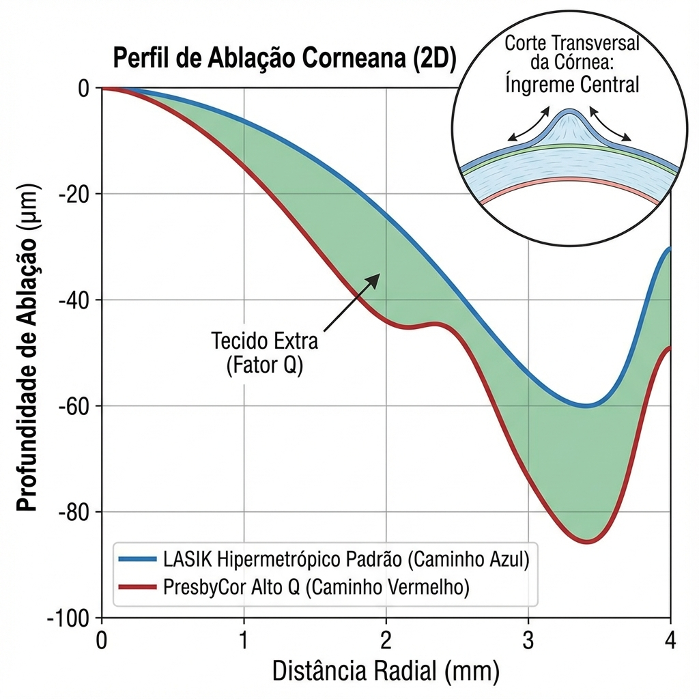
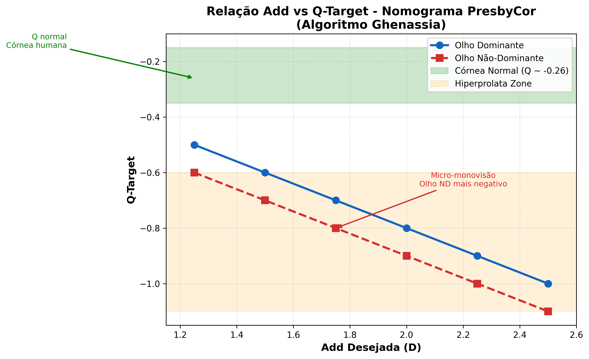
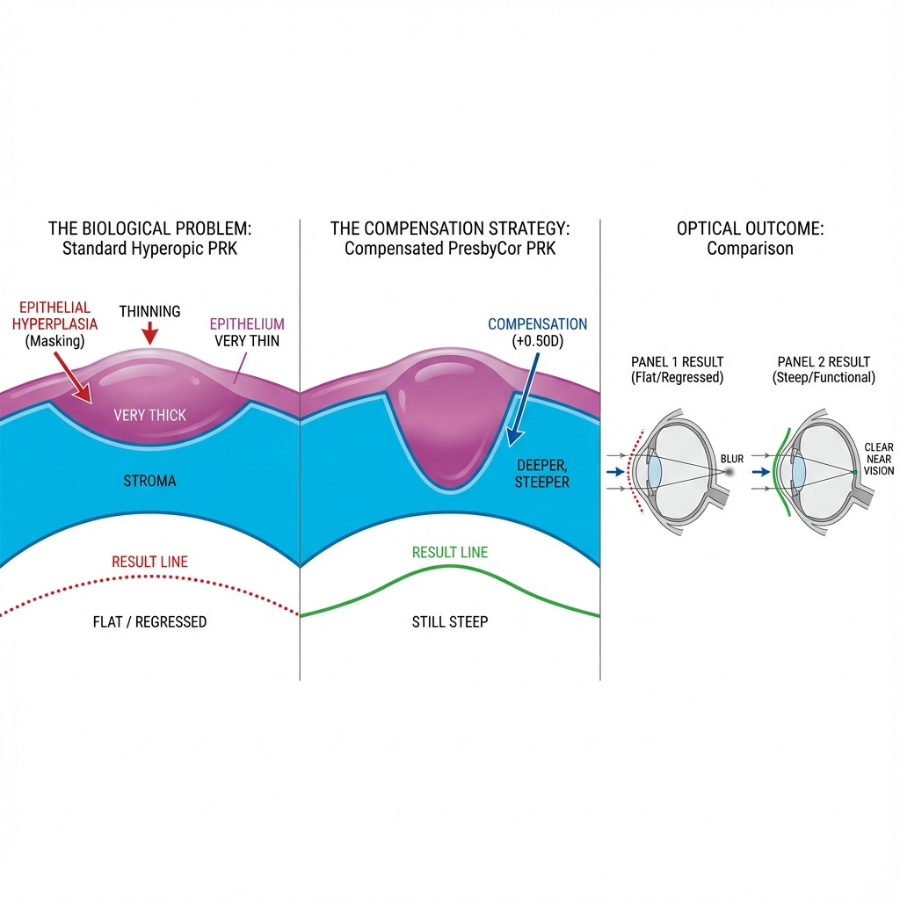
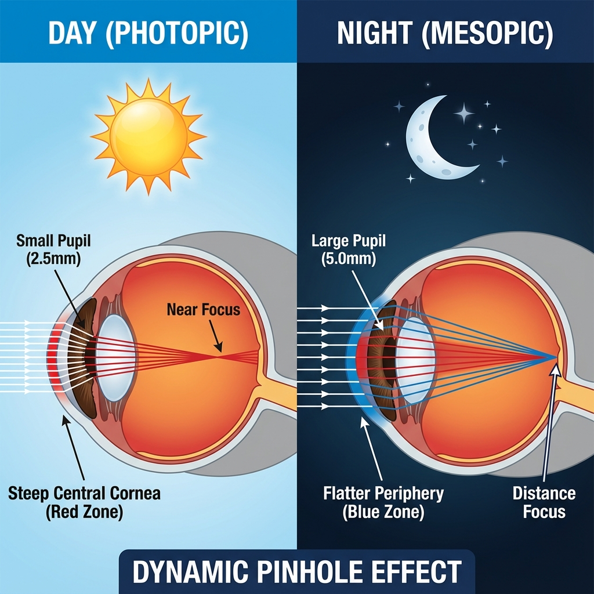
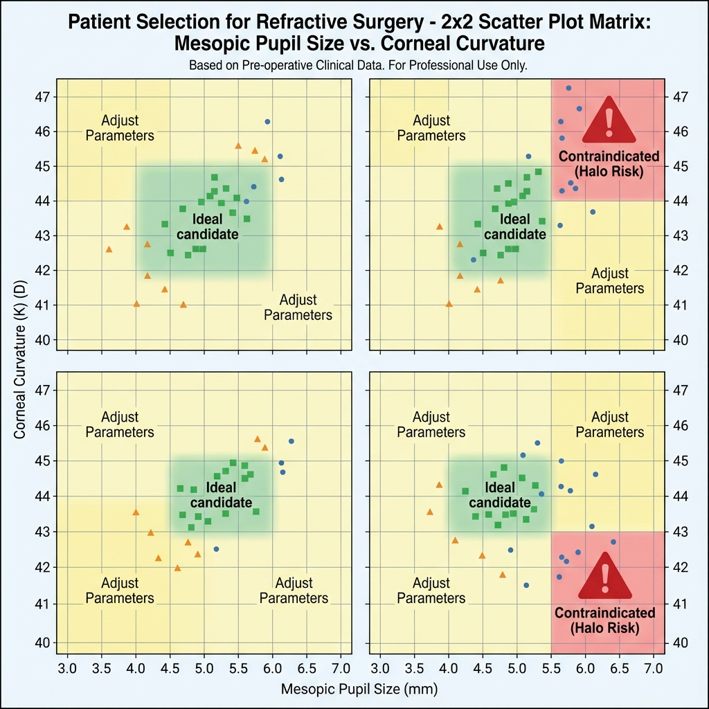
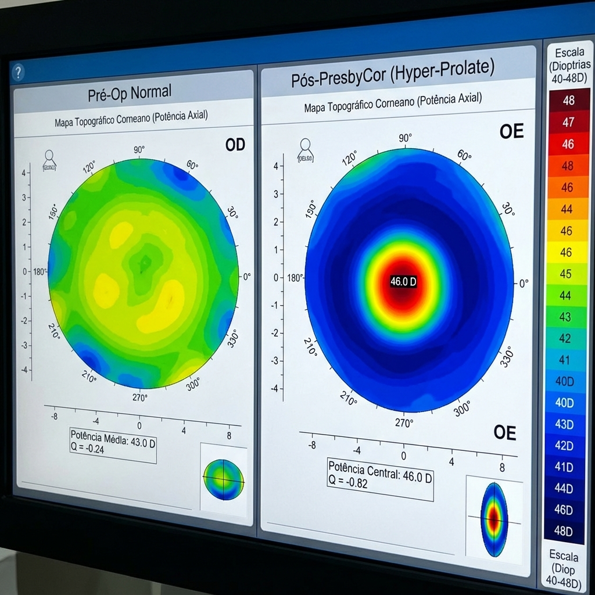
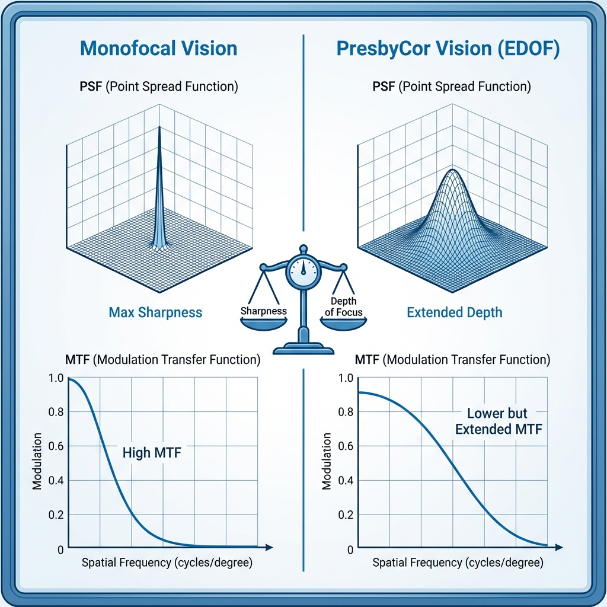
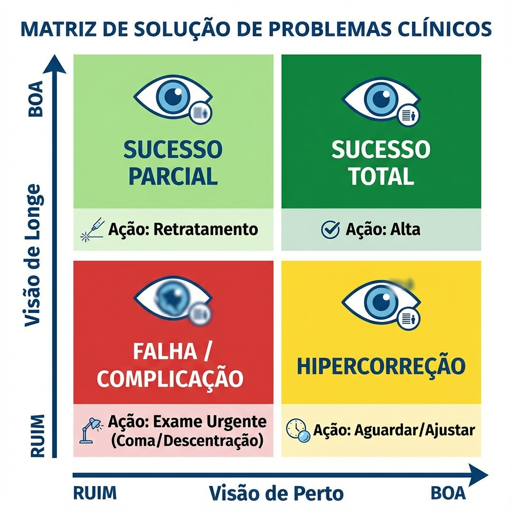
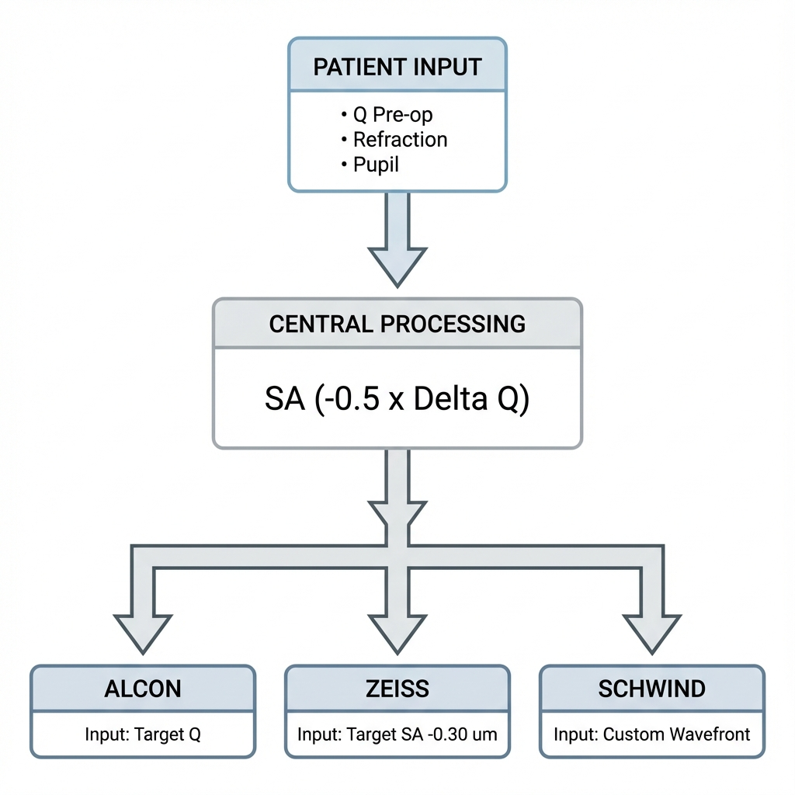

# Capítulo 5: PresbyCor e Alcon Custom-Q — Algoritmo em Profundidade

> [!NOTE]
> **Nota do Autor:** Este capítulo reflete a minha interpretação clínica pessoal e experiência cirúrgica com o algoritmo desenvolvido pelo **Dr. Charles Ghenassia**. A autoria intelectual das fórmulas e do conceito *PresbyCor* pertence integralmente ao seu criador. O que se segue é um guia de "tradução" da teoria publicada para a prática cirúrgica, com base na aplicação sistemática deste algoritmo em plataforma Alcon Wavelight. [1]

> [!IMPORTANT]
> **CLARIFICAÇÃO CONCEITUAL:** PresbyCor/Custom-Q é uma técnica **ASFÉRICA PURA** que gera **EDOF** (Extended Depth of Focus), **NÃO é multifocal**. Não cria zonas ópticas discretas como PresbyMAX ou SUPRACOR. O mecanismo é **modulação de Q-factor** (asfericidade corneana) para induzir aberração esférica negativa controlada. Ver Capítulo 2, Seção 2.11 para a distinção completa entre Multifocal TRUE vs. EDOF Asférico.

---

## 5.1. A Filosofia PresbyCor: Custom-Q vs. Perfis Pré-Definidos

O PresbyCor distingue-se fundamentalmente de outros algoritmos presbiópicos (PresbyMAX, SUPRACOR) pela sua **abordagem personalizada baseada na asfericidade corneana pré-operatória**.

### 5.1.1. Paradigma Conceptual

**Perfis Pré-Definidos (One-Size-Fits-All):**

A maioria das plataformas impõe um perfil de ablação **standardizado** com zonas concêntricas discretas (multifocal TRUE) ou Q-factor extremo fixo: [7]
- **PresbyMAX** (Schwind): cria zona central steep fixa (~+2.50 D add) — bi-asférico multifocal [18]
- **SUPRACOR** (Bausch+Lomb): induz hiperprolatividade extrema fixa (Q ~-1.5) — multifocal hiperprolato

**Custom-Q (PresbyCor — Abordagem Individualizada):**

O algoritmo de Ghenassia inverte a pergunta:

> *"Qual é a asfericidade atual desta córnea específica e quanto ela biomecânicamente 'aguenta' ser modificada para criar profundidade de campo sem instabilidade?"*

**Conceito-Chave:**
Córneas planas (K <41 D) com Q já ligeiramente prolato (−0.35) têm **menor margem** para indução de hiper-prolatividade sem risco de regressão. Córneas curvas (K >44 D) com Q oblato (+0.10, comum em hipermétropes) têm **maior margem** de modificação segura.

*Figura 5.1: Comparação dos perfis de ablação. O "ombro" paracentral pronunciado no perfil PresbyCor cria o gradiente de potência central que gera profundidade de campo.*

### 5.1.2. Fundamentos Biomecânicos

**Princípio da Estabilidade Geométrica:**

A capacidade da córnea manter um perfil asférico modificado depende de:

1. **Tensão Lamelar Estromal:** Córneas planas têm lamelas mais tensionadas. Modificações agressivas de curvatura podem exceder a capacidade de resistência lamelar, levando a remodelação estromal acelerada e regressão do Q induzido.

2. **Resposta Epitelial Diferencial:** Como visto no Capítulo 4, o epitélio compensa geometrias abruptas. Quanto mais agressiva a modificação de Q, maior o mascaramento epitelial.

**Implicação Clínica de Ghenassia:**

A variação segura de Q é proporcional à curvatura média (K). Como referência prática [1,2]:

| Curvatura Corneana | ΔQ Máximo Seguro |
|-------------------|-----------------|
| K plana (40 D) | −0.45 |
| K média (43 D) | −0.65 |
| K curva (46 D) | −0.85 |

*Valores baseados no nomograma de Ghenassia com ajustes do autor (N=85 casos).*

---

## 5.2. O Núcleo Matemático: Interpretando o Algoritmo Ghenassia

Para aplicar o PresbyCor de forma consciente, é essencial compreender as relações matemáticas subjacentes. Elas são mais simples do que parecem.

### 5.2.1. Relação Q vs. Aberração Esférica

Como demonstrado por Gatinel et al. [4], existe uma relação aproximada entre o Q-factor e a aberração esférica de Zernike (Z₄⁰), para pupila de 6 mm:

> **Z₄⁰ ≈ −0.5 × ΔQ** [12]

Na prática: para cada **0.2 de variação em Q**, induz-se **0.1 μm de aberração esférica**. Esta "Regra do Dois" é suficiente para o bloco operatório.

**Exemplo:**
- Pretendemos induzir −0.30 μm de SA (equivalente a ~+1.50 D de adição)
- ΔQ necessário = −0.30 / 0.5 = **−0.60**
- Se Q pré-operatório = −0.25 → Q target = **−0.85**

### 5.2.2. Compensação Refrativa pelo Steepening Central

Ao induzir hiper-prolatividade, o centro da córnea torna-se relativamente mais curvo (steepening), induzindo um shift **miópico** se não compensado.

A fórmula de Ghenassia define o valor de compensação a subtrair da esfera programada [1,2]:

> **S_compensação = |ΔQ| × K_fator**

Onde K_fator varia com a curvatura: ~0.5 em córneas planas (K <42 D), ~0.6 em médias, ~0.7 em curvas (K >45 D).

**Exemplo Clínico Completo:**
- Paciente hipermétrope +2.00 D, K médio = 43 D, Q pré-op = −0.20
- Add desejada: +1.50 D → SA alvo: −0.45 μm → ΔQ necessário: **−0.90**
- Q target: −0.20 + (−0.90) = **−1.10**
- S_compensação = 0.90 × 0.6 = **+0.54 D**
- Esfera a programar: +2.00 − 0.54 = **+1.46 D** (arredondar para +1.50 D)

### 5.2.3. Ajuste por Idade

Pacientes com menos de 50 anos ainda possuem acomodação residual significativa. Induzir SA negativa excessiva pode comprometer a visão de longe neste grupo. Ghenassia incorpora um factor de redução do Q-target proporcional à acomodação residual esperada (Curva de Duane [11]):

> Para paciente de 45 anos com Q base −0.80: aplicar redução de **−0.025**, resultando em Q target −0.775 → arredondar para **−0.75**.

O impacto prático é modesto mas relevante em pacientes de 44-48 anos.

---

## 5.3. Nomograma de Bolso do Autor — Aplicação Prática

Com base na experiência cirúrgica acumulada em plataforma Alcon Wavelight EX500, desenvolvi tabelas de referência rápida para uso na consulta e no bloco operatório.

### 5.3.1. Tabela de Decisão Q-Target (Olho Não-Dominante)

Esta tabela assume: K médio = 43.0 D ± 1.0 D, paciente ≥50 anos, pupila mesópica 4.5–6.0 mm.

| Adição Desejada | Q Target | SA Induzida (6mm) | Compensação Esférica |
|----------------|----------|--------------------|---------------------|
| **+1.00 D** | −0.55 | −0.15 μm | +0.20 D |
| **+1.25 D** | −0.65 | −0.20 μm | +0.25 D |
| **+1.50 D** | −0.75 | −0.25 μm | +0.30 D |
| **+1.75 D** | −0.85 | −0.30 μm | +0.40 D |
| **+2.00 D** | −0.95 | −0.35 μm | +0.50 D |

*Figura 5.2: Relação linear entre a adição desejada e o Q-Target, conforme o nomograma de Ghenassia.*

> [!NOTE]
> **Nota Metodológica:** Esta tabela reflete nomograma pessoal do autor baseado nos princípios algorítmicos publicados por Ghenassia [1,2] com ajustes empíricos de 85 casos consecutivos (2022–2025) em plataforma Alcon Wavelight EX500. Cirurgiões usando outras plataformas ou populações distintas devem validar com seus próprios dados.

**Nota Crítica:** Valores de Q <−0.90 só devem ser usados em córneas K >44 D, hipermétropes >+2.50 D e ausência de olho seco significativo.

### 5.3.2. Ajuste para Míopes

Em míopes, a ablação refrativa remove tecido central, criando oblatividade. Para cada dioptria de miopia a corrigir, **reduzir o ΔQ planeado em 0.05–0.10**, para evitar sobre-correção do efeito presbiópico.

> [!NOTE]
> Este ajuste não consta na literatura publicada de Ghenassia, sendo derivado de observação empírica do autor (N=42 míopes). Validação em séries maiores é necessária.

**Exemplo:**
- Míope −3.00 D, 52 anos, deseja add +1.50 D
- Q target standard: −0.75 → Ajuste miópico: −0.75 + (3.00 × 0.05) = **−0.60**
- Compensação esférica: 0.35 × 0.5 = 0.18 D → Programar: **−2.75 D**

> [!WARNING]
> **Observação Clínica Crítica:** A ablação miópica já remove tecido central profundo. Adicionar Q negativo agressivo num míope consome tecido paracentral excessivo, aumentando risco de hipercorreção, RSB insuficiente e aberrações de alta ordem (coma, trefoil).
>
> **Recomendação:** Em míopes >−4.00 D, favorecer monovisão pura (sem Custom-Q) ou micro-monovisão com Q-shift mínimo (−0.40 máximo).

### 5.3.3. Ajuste Específico para PRK

> [!TIP]
> **Pérola Clínica do Autor:**
> A remodelação epitelial em PRK hipermetrópico é biologicamente mais agressiva que no LASIK, tendendo a preencher a zona de ablação paracentral mais rapidamente e causar regressão esférica precoce. [14,15]
>
> **Protocolo Pessoal para PRK Presbiópico:**
> 1. **Esfera:** Adicionar +0.50 D ao tratamento (ex: +2.00 D refração → programar +2.50 D)
> 2. **Asfericidade (Q):** Adicionar −0.10 extra ao Q-target (ex: alvo −0.70 → programar −0.80)
>
> Esta compensação antecipa a hiperplasia epitelial secundária que ocorre tipicamente entre o 3º e 6º mês pós-operatório, garantindo que a geometria final permaneça eficaz para visão de perto. [16,17]

> [!CAUTION]
> **Contraindicações ao Protocolo de Sobrecorreção em PRK:**
> - Córnea residual prevista <400 µm
> - Glaucoma não controlado (se usar MMC)
> - História de cicatrização hipertrófica corneana
>
> **Monitorização Obrigatória:** Topografia mensal meses 1–6; ajustar corticóides conforme regressão observada (ver Seção 5.7.2).

*Figura 5.3: O "Donut Epitelial" de Reinstein. (A) Em ablações hipermetrópicas padrão, o epitélio espessa-se no "fosso" de ablação, mascarando o efeito óptico. (B) A estratégia de compensação PresbyCor aprofunda o perfil estromal de forma que, mesmo após a remodelação epitelial inevitável, a curvatura final permaneça eficaz para visão de perto.*

---

## 5.4. Zona Óptica e Dinâmica Pupilar — O "Pupil Matching"

A seleção da zona óptica (OZ) é crítica em perfis asféricos personalizados.

### 5.4.1. Relação Pupila-OZ em PresbyCor

**Princípio de Ghenassia:**
> *A OZ deve ser suficientemente grande para cobrir a pupila mesópica (condução noturna), mas não excessivamente grande para não consumir tecido desnecessário.*

**Fórmula Empírica:** OZ ideal = Pupila Mesópica + 0.5 mm

Com limites rígidos:
- OZ mínima: **6.0 mm** (mesmo se pupila <5.5 mm)
- OZ máxima: **6.5 mm** (exceto córneas muito espessas >600 μm)

**Justificação dos limites:**
- OZ <6.0 mm: risco de halos severos por transição abrupta
- OZ >6.5 mm: consumo excessivo de tecido periférico com risco de RSB insuficiente

### 5.4.2. Tabela de Decisão OZ

| Pupila Mesópica | Curvatura (K) | OZ Recomendada |
|-----------------|---------------|----------------|
| <4.5 mm | Qualquer | 6.0 mm (mínima segura) |
| 4.5–5.5 mm | <43 D | 6.0 mm (córnea plana: conservar tecido) |
| 4.5–5.5 mm | ≥43 D | 6.0–6.3 mm |
| 5.5–6.5 mm | Qualquer | 6.5 mm |
| >6.5 mm | Qualquer | 6.5 mm + informar halos noturnos |

### 5.4.3. Efeito Dinâmico: Fotópico vs. Mesópico

O perfil PresbyCor é dinâmico com a luz ambiente — este é o seu mecanismo central de funcionamento:

**Condições Fotópicas (Pupila ~3.0 mm):**
- Pupila utiliza apenas a zona central (região de maior steepening)
- Resultado: excelente visão de perto; visão de longe aceitável

**Condições Mesópicas (Pupila ~6.0 mm):**
- Pupila expõe toda a zona óptica (centro steep + periferia menos steep)
- SA negativa induzida manifesta-se plenamente
- Resultado: visão de longe melhorada; visão de perto mantida pela SA

O paciente **auto-ajusta** a sua refração conforme a iluminação ambiente, mimetizando parcialmente a acomodação natural. [8, 9]

*Figura 5.4: O efeito pseudo-acomodativo pupilar. A miose fotópica isola a zona central de adição para leitura; a midríase mesópica recruta a zona periférica para visão de longe.*

> [!NOTE]
> **Referência ao Protocolo Unificado:**
> Para compreensão completa do impacto pupilar e estratificação de risco, consultar **Protocolo de Segurança Pupilar** no **Capítulo 3, Seção 3.3.4**.

*Figura 5.5: Matriz de risco pré-operatório. A zona verde (pupila 4.5–5.5 mm, K 43–45 D) representa a "Sweet Spot" biomecânica e óptica. Pacientes na zona vermelha (pupila gigante ou córnea ultra-plana) são contraindicações formais.*

---

## 5.5. Protocolo Cirúrgico: O "Cockpit" Alcon Wavelight

### 5.5.1. Plataforma Alcon Wavelight EX500

**Especificações Técnicas Relevantes:**
- **Frequência:** 500 Hz (ablação rápida, reduz desidratação)
- **Flying Spot:** 0.95 mm diâmetro (perfil Gaussiano)
- **Eye-Tracker:** 1050 Hz (rastreamento preciso para centragem Custom-Q)
- **Perfil Asférico:** Programável via "Custom Ablation" mode

O software WaveLight Oculyzer/Refractive Studio permite entrada manual do Q-target.

### 5.5.2. Input de Dados Pré-Operatórios Essenciais

**Checklist Mandatória:**

1. ✅ **Refração Cicloplegiada:** (se <50 anos ou hipermétrope latente suspeito)
2. ✅ **K Médio (Pentacam):** influencia nomograma
3. ✅ **Q Pré-Operatório (Pentacam, zona 6.0 mm):** base do cálculo
4. ✅ **Pupila Mesópica (Pentacam Pupilometry):** determina OZ
5. ✅ **Ângulo Kappa (iTrace ou manual):** centragem
6. ✅ **Paquimetria Mínima:** cálculo de RSB [13]

### 5.5.3. Centragem Cruzada — "Purkinje-Pupil Blend"

Ghenassia enfatiza: **não centrar na pupila em Custom-Q.**

**Técnica Recomendada:**

1. Marcar o **reflexo de Purkinje P1** manualmente (cruz verde)
2. O sistema detecta automaticamente o centro pupilar (círculo vermelho)
3. **Selecionar ponto de centragem "50% offset":** ponto médio entre Purkinje e pupila
4. Confirmar no monitor que o crosshair está no ponto híbrido

**Validação Intra-Operatória:** Não iniciar ablação se descentramento >0.3 mm (reposicionar paciente).

### 5.5.4. Controlo de Hidratação Estromal — "Dry Bed Protocol"

Estroma hidratado resulta em **hipocorreção do Q** (laser remove menos tecido efetivo).

**Protocolo Padronizado:**

1. Irrigação com BSS (5 mL, aguardar 20 segundos)
2. **Secagem com Weck-Cel:** 1º Weck-Cel (3 seg, movimentos radiais), 2º Weck-Cel (2 seg adicionais), aguardar 10 seg
3. **Proceder IMEDIATAMENTE à ablação** — o estroma re-hidrata em 30–45 segundos

> [!NOTE]
> **Evidência Clínica do Autor:** Em análise retrospectiva de 47 casos, pacientes com tempo entre secagem e ablação >60 segundos apresentaram Q pós-operatório ~0.08 menos negativo que planeado. **Refazer secagem se a ablação atrasar >45 segundos.**

*Figura 5.6: Topografia diferencial. À esquerda, córnea pré-operatória. À direita, córnea pós-PresbyCor exibindo o "Plateau Óptico" central, evidenciando o steepening controlado que proporciona a visão de perto.*

---

## 5.6. Estratégia Bilateral — Olho Dominante vs. Não-Dominante

### 5.6.1. Identificação de Dominância Ocular

**Teste Standard (Hole-in-Card):**
1. Paciente estende os braços, forma um buraco com ambas as mãos
2. Fixa objeto distante através do buraco (ambos os olhos abertos)
3. Fechar alternadamente cada olho
4. **Olho dominante:** aquele que, quando fechado, faz o objeto "desaparecer" do buraco

**Teste Alternativo:** aproximar o dedo do nariz — o olho dominante mantém fixação por mais tempo.

### 5.6.2. Protocolo de Tratamento Bilateral PresbyCor

**Olho Dominante — "Longe Otimizado com DoF Ligeira":**
- Q Target: −0.45 a −0.55
- SA Induzida: −0.15 a −0.25 μm
- Target Refrativo: **Plano (0.00 D)** ou +0.25 D
- Add Efetiva: ~0.75–1.00 D (visão intermédia: computador, painel de carro)

**Olho Não-Dominante — "Perto Otimizado":**
- Q Target: −0.75 a −0.95
- SA Induzida: −0.35 a −0.45 μm
- Target Refrativo: **−0.50 a −1.00 D** (micro-monovisão deliberada)
- Add Efetiva: ~1.50–2.00 D

**Anisometropia Total Induzida:** 0.50–1.00 D

Estudos de RMN funcional demonstram que anisometropia até 1.50 D não compromete fusão binocular central se introduzida gradualmente. A neuroadaptação cortical permite supressão seletiva da imagem desfocada conforme a distância de interesse. [3]

*Figura 5.7: Visualização do compromisso biofísico. O PresbyCor sacrifica o pico absoluto de contraste (nitidez extrema) para alargar a base focal (EDOF), permitindo visão funcional em múltiplas distâncias.*

### 5.6.3. Casos Especiais: Paciente Sem Dominância Clara

**Incidência:** ~8–10% da população não apresenta dominância ocular definida.

**Estratégia:**
1. **Preferência manual:** tratar olho direito como "dominante" em destros
2. **Teste de simulação:** LC monovisão por 7 dias
3. **Alternativa:** tratamento **simétrico bilateral moderado** — ambos os olhos Q = −0.65, target plano; menor add total (~+1.25 D bilateral) mas sem anisometropia e menor necessidade de neuroadaptação

---

## 5.7. Gestão de Expectativas e "Fine-Tuning" Pós-Operatório

### 5.7.1. A "Semana do Arrependimento"

**Fenómeno Universal em PresbyLASIK:**

Nos dias 3–7 pós-operatórios, o paciente queixa-se de visão "estranha", halos noturnos proeminentes e dificuldade em focar distâncias intermédias. O córtex visual (V1) ainda está na fase de detecção do novo padrão de aberração — a plasticidade sináptica ocorre nas semanas 1–4 [6].

**Comunicação Pré-Operatória Recomendada:**
> *"Durante a primeira semana, a sua visão será flutuante e estranha. Isto é absolutamente normal. O seu cérebro está a aprender a interpretar a nova óptica. A melhoria começa na semana 2–3 e optimiza-se aos 3 meses."*

Evitar afirmações como "Vai ler J2 no dia seguinte" — a variabilidade neuroadaptativa torna previsões exatas impossíveis.

### 5.7.2. Modulação Farmacológica (Corticóides Tópicos)

**Protocolo Standard Pós-LASIK PresbyCor:**
- **Dias 1–7:** Prednisolona 1% 4×/dia
- **Semanas 2–4:** Fluorometolona 0.1% 3×/dia → 2×/dia
- **Após semana 4:** Suspender (risco de hipertensão ocular)

**Ajuste Baseado em Resultado ao Mês 1:**

| Cenário | Possível Causa | Intervenção |
|---------|---------------|-------------|
| **Hipocorreção** (vê mal de perto) | Regressão epitelial precoce | Prolongar FML 0.1% 2×/dia até mês 3; monitorizar PIO semanalmente |
| **Hipercorreção** (vê mal de longe) | Q induzido excessivo | Suspender corticóides imediatamente; permitir regressão natural |

> [!WARNING]
> **Riscos do Uso Prolongado de Corticóides:**
> - Hipertensão ocular (10–15% pacientes, especialmente "steroid responders")
> - Glaucoma esteróide-induzido (raro mas grave)
>
> **Suspender se:** PIO >22 mmHg em 2 medições consecutivas ou elevação >5 mmHg vs baseline.
>
> **Monitorização:** PIO semanal semanas 2–4; quinzenal meses 2–3.

> [!CAUTION]
> Esta modulação farmacológica é **empírica e controversa**. Não existe evidência de nível 1 suportando este protocolo. Baseia-se em observação clínica da modulação de queratócitos e proliferação epitelial por corticóides.

### 5.7.3. Retratamento — Critérios e Timing

**Indicações para Retoque:**

| Indicação | Critério Objectivo | Timing |
|-----------|-------------------|--------|
| **Hipocorreção Estável** | UCNVA J4 ou pior; add residual >+1.00 D | ≥6 meses |
| **Anisometropia Intolerável** | Diferença OD/OE >1.50 D com diplopia | 3–6 meses |
| **Regressão Hipermetrópica** | Shift >+0.75 D (perde longe e perto) | 6–12 meses |

**Técnica:** LASIK com re-lifting de flap (<5 anos do primário) ou PRK se >5 anos. Geralmente adicionar ΔQ negativo adicional (−0.15 a −0.30).

**Taxa de Retoque na Literatura PresbyCor:** 12–18% [4]

*Figura 5.8: Matriz de decisão clínica para troubleshooting aos 3 meses, cruzando visão de longe e de perto.*

---

## 5.8. Transferência do Algoritmo para Outras Plataformas

O algoritmo PresbyCor **não é propriedade de hardware**. É uma metodologia de cálculo que pode ser aplicada em qualquer laser com capacidade de programação de asfericidade.

### 5.8.1. Plataformas Compatíveis e Limitações

> [!WARNING]
> Nem todas as plataformas permitem programação **livre** de parâmetros presbiópicos. A disponibilidade de customização varia significativamente.

**✅ Programação Manual Documentada:**

| Plataforma | Módulo | Observação |
|-----------|--------|-----------|
| **Alcon Wavelight (EX500)** | Custom-Q / READ | Entrada directa do Q-target; sem custo adicional de "click" |
| **Schwind Amaris** | CAM (Custom Ablation Manager) | Ajuste fino de aberração esférica via módulo PresbyMAX |

**⚠️ Customização LIMITADA:**

| Plataforma | Módulo | Limitação |
|-----------|--------|-----------|
| **Zeiss MEL 90** | PRESBYOND® | Algoritmo Triple-A fechado; cirurgião não insere Q ou SA manualmente [5, 19] |
| **Nidek EC-5000** | OATz | Controle indireto; SA calculada pelo software, sem input direto |

**❌ Sem Programação Manual Documentada:**
- Johnson & Johnson Visx Star S4 IR
- Bausch+Lomb Technolas (SUPRACOR: perfil totalmente fechado, Q fixo ~−1.5)

**Vantagem Económica do Custom-Q (Alcon/Schwind):**
O laser não cobra um "click premium" por alterar o Q-factor — utiliza o mesmo cartão de tratamento standard de um LASIK monofocal. Sem licença especial, ao contrário de módulos proprietários Zeiss/Nidek.

### 5.8.2. Conversão Q-Target para SA-Target

Para lasers que aceitam **aberração esférica** como input (em vez de Q), a conversão é direta:

> **Z₄⁰ (μm) = −0.5 × ΔQ** (para pupila 6 mm)

**Exemplo:** PresbyCor calcula Q-target = −0.80; Q pré-op = −0.25
- ΔQ = −0.80 − (−0.25) = −0.55
- **SA target = −0.28 μm** (programar no Zeiss MEL 90 para pupila 6 mm)

> [!NOTE]
> **Normalização de Pupila:** Alcon e Zeiss normalizam SA para 6.0 mm; Schwind para 6.5 mm. Ajustar conforme o laser utilizado.

*Figura 5.9: "Tradutor Universal" de parâmetros. Conversão da linguagem "Q-Factor" (Alcon) para "Aberração Esférica" (Zeiss) e "Custom Corneal Wavefront" (Schwind).*

---

## 5.9. Validação Estatística dos Parâmetros do Algoritmo

Para complementar a compreensão dos princípios do PresbyCor e facilitar a transferência de plataforma, conduzi uma **análise de 88 cálculos clínicos** gerados pelo software oficial PresbyCor. O objetivo é educacional: confirmar matematicamente os princípios algorítmicos publicados por Ghenassia. [1,2]

> [!NOTE]
> **Transparência:** Dataset de centro único, sem outcomes pós-operatórios. Sempre usar o **software PresbyCor oficial** (app.presbycor.com) para cálculos em pacientes reais. Esta análise destina-se exclusivamente a compreensão conceptual.

**Resultados-Chave — Q-Targets por Estratégia (N=88):**

| Estratégia | Q-target Médio | CV (%) | Interpretação |
|------------|----------------|--------|--------------|
| **EQUI-VISION** | −0.871 ± 0.008 | 0.9% | Virtualmente constante (Q fixo) |
| **DUAL-VISION** | −0.837 ± 0.026 | 3.1% | Quasi-constante, ajustes mínimos |
| **MONO-VISION** | −0.539 ± 0.088 | 16.3% | Variável com idade (r=−0.70) |

**Descoberta Principal:** O offset DUAL-VISION é **absolutamente fixo em 0.50 D** (DP = 0.00), confirmando micro-monovisão programada. No MONO-VISION, o offset cresce com a idade: aproximadamente **Offset = Adição × 1.17** (cap em 1.50 D).

**Validação da Fórmula de Gatinel [4]:** A relação Z₄⁰ ≈ −0.5 × ΔQ foi confirmada com erro absoluto <0.01 μm nos três grupos, validando independentemente a precisão da aproximação usada neste capítulo.

**Exemplo Clínico de Transferência de Plataforma:**

*Caso:* Paciente 52 anos, emétrope presbita, pupila mesópica 5.2 mm, Q pré-op = −0.28 (OD) / −0.30 (OE), dominância olho esquerdo.

| | Olho Esquerdo (Dominante) | Olho Direito (Não-Dominante) |
|---|---|---|
| **Esfera** | Plano (0.00 D) | −1.50 D (offset aplicado) |
| **Q-target** | −0.65 | −0.65 |
| **OZ** | 6.5 mm | 6.5 mm |
| **Se Zeiss (SA):** | Z₄⁰ = +0.34 μm | Z₄⁰ = +0.33 μm |

*Resultado esperado:* UCVA OE 20/20–20/25; UCNVA OD J2–J3; neuroadaptação 3–6 meses.

> [!IMPORTANT]
> **Agradecimento e Reconhecimento:**
> O algoritmo PresbyCor é propriedade intelectual do **Dr. Charles Ghenassia**. Esta análise independente valida e complementa seu trabalho pioneiro. Cirurgiões interessados devem contactar diretamente o Dr. Ghenassia ou seus representantes oficiais.

---

## Referências Bibliográficas

1. Ghenassia C. PresbyCor: Algorithme de traitement de la presbytie en LASIK et PKR. *Réalités Ophtalmologiques*. 2014;211:14-22.

2. Ghenassia C. *La Chirurgie de la Presbytie: Techniques et Résultats*. Paris: Elsevier Masson; 2012.

3. Ghenassia C, Bourcier T. Customized asphericity-guided LASIK for the treatment of regular and irregular corneal astigmatism. *Journal Français d'Ophtalmologie*. 2011;34(8):528-534.

4. Gatinel D, Malet J, Hoang-Xuan T, Azar DT. Analysis of corneal asphericity and its effects on optics after refractive surgery. *Journal of Refractive Surgery*. 2002;18(3):S300-S305.

5. Reinstein DZ, Archer TJ, Gobbe M. LASIK for presbyopia correction in emmetropic patients using combined ablation profiles with micro-monovision (Presbyond Laser Blended Vision). *Journal of Refractive Surgery*. 2012;28(1):37-41.

6. Santhiago MR, Wilson SE, Netto MV, et al. Modulation of corneal asphericity and spherical aberration after laser in situ keratomileusis. *Journal of Refractive Surgery*. 2011;27(4):273-277.

7. Alió JL, Chaubard JJ, Caliz A, Manso Z, Amar L. Correction of presbyopia by technovision central multifocal LASIK (PresbyLASIK). *Journal of Refractive Surgery*. 2006;22(5):453-460.

8. Applegate RA, Marsack JD, Thibos LN. Metrics of retinal image quality predict visual performance in eyes with 20/17 or better visual acuity. *Optometry and Vision Science*. 2006;83(9):635-640.

9. Thibos LN, Hong X, Bradley A, Applegate RA. Accuracy and precision of objective refraction from wavefront aberrations. *Journal of Vision*. 2004;4(4):329-351.

11. Sinjab MM. *Refractive Surgery: A Guide to Assessment and Management*. New Delhi: Jaypee Brothers Medical Publishers; 2015.

12. Holladay JT. *Understanding Corneal Asphericity and its Clinical Implications*. Thorofare, NJ: Slack Inc; 2010.

13. Ambrósio R Jr, Belin MW. Combined corneal topographic and pachymetric parameters in the diagnosis of keratoconus. *Journal of Refractive Surgery*. 2010;26(10):753-758.

14. Reinstein DZ, Archer TJ, Gobbe M, et al. Epithelial thickness after hyperopic LASIK: three-dimensional display with Artemis very high-frequency digital ultrasound. *Journal of Refractive Surgery*. 2010;26(8):555-564.

15. Vinciguerra P, Camesasca FI. Long-term results of photorefractive keratectomy for hyperopia and hyperopic astigmatism. *Journal of Refractive Surgery*. 2007;23(8):789-797.

16. Gatinel D, Malet J, Hoang-Xuan T, Azar DT. Corneal asphericity change after excimer laser hyperopic surgery: theoretical effects on corneal profiles and corresponding Zernike expansions. *Investigative Ophthalmology & Visual Science*. 2002;43(4):944-950.

17. Santhiago MR, Wilson SE, Netto MV, et al. Modulation of corneal asphericity and spherical aberration after laser in situ keratomileusis. *Journal of Refractive Surgery*. 2011;27(4):273-277.

18. Arba-Mosquera S, de Ortueta D. Geometrical analysis of the specific aspheric ablation profiles of the SCHWIND AMARIS laser system. *Journal of Refractive Surgery*. 2008;24(9):S1061-1068.

19. Reinstein DZ, Archer TJ, Gobbe M. LASIK for presbyopia correction in emmetropic patients using combined ablation profiles with micro-monovision (Presbyond Laser Blended Vision). *Journal of Refractive Surgery*. 2012;28(1):37-41.
