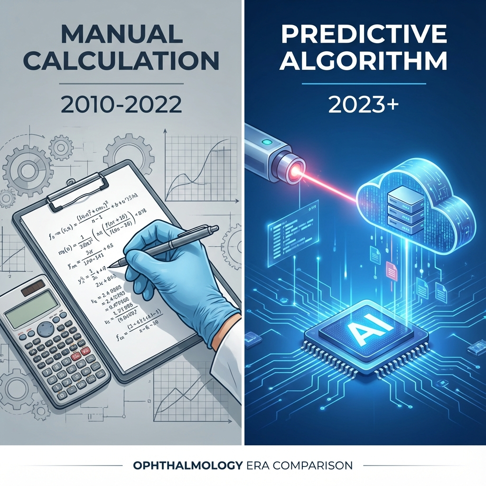
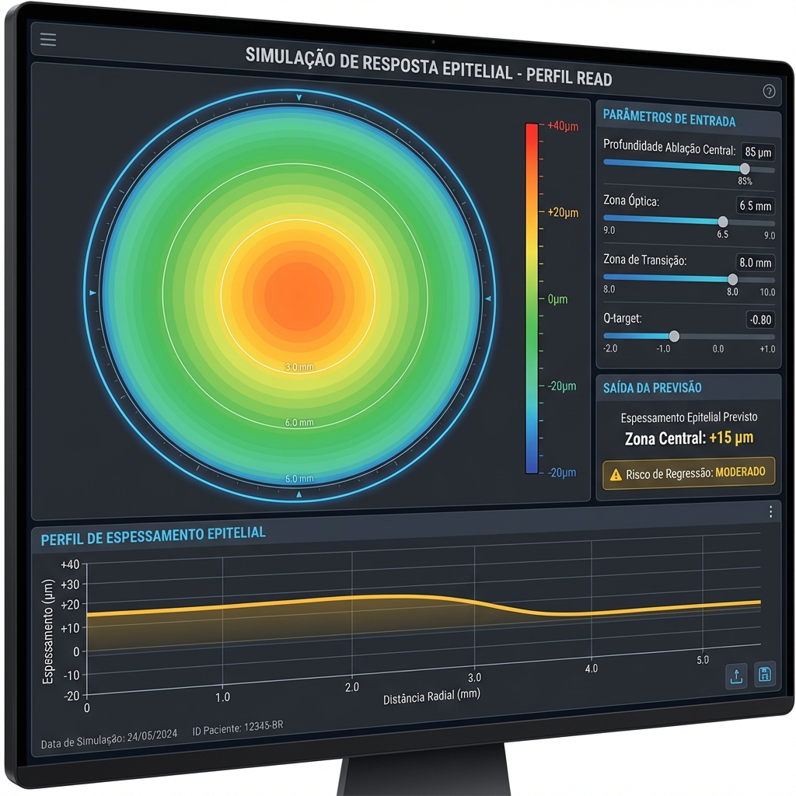
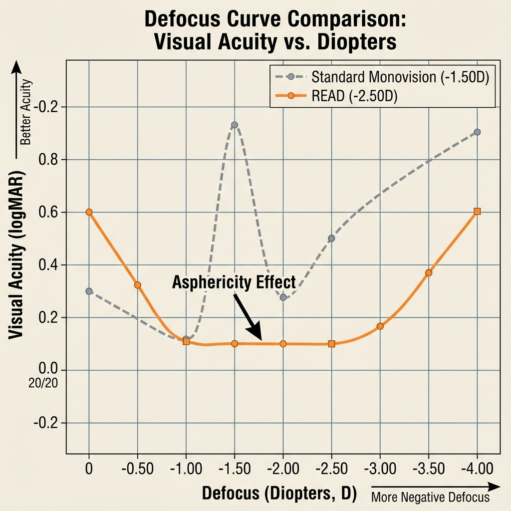
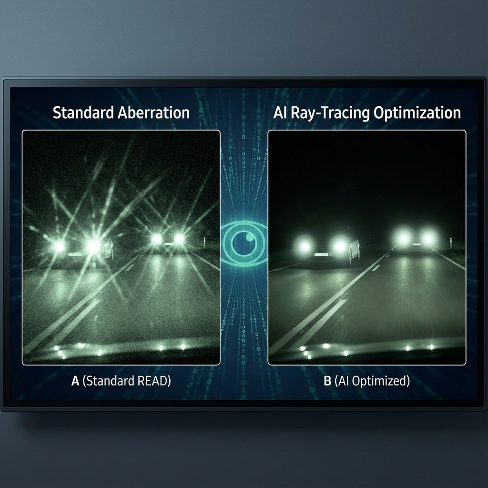
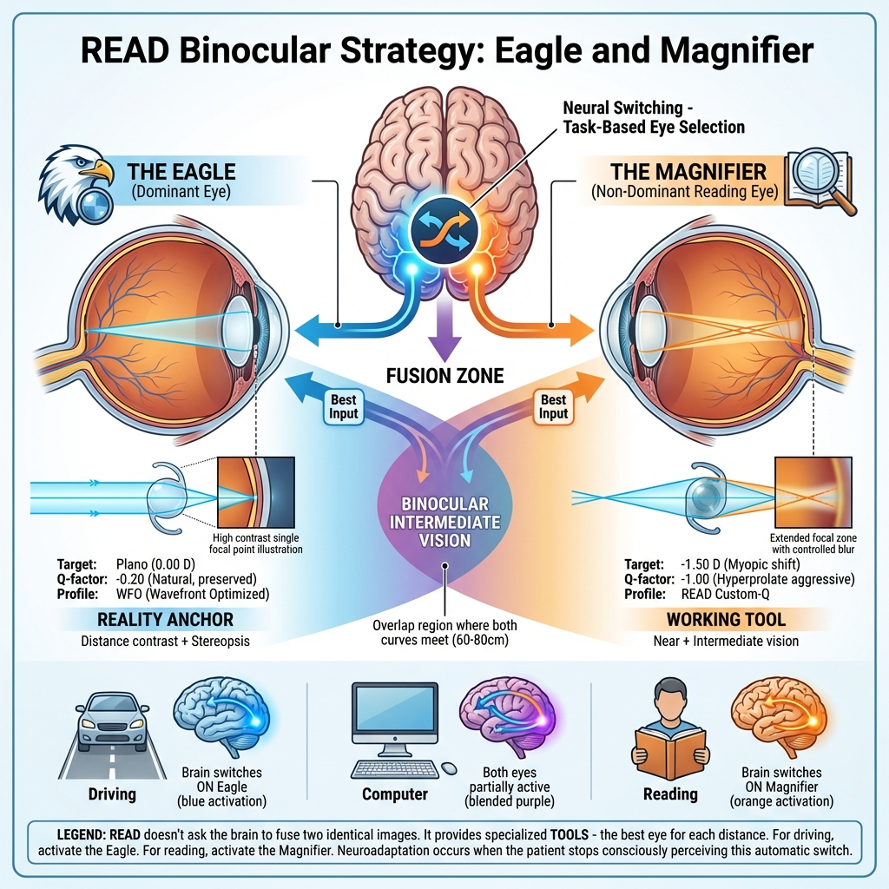
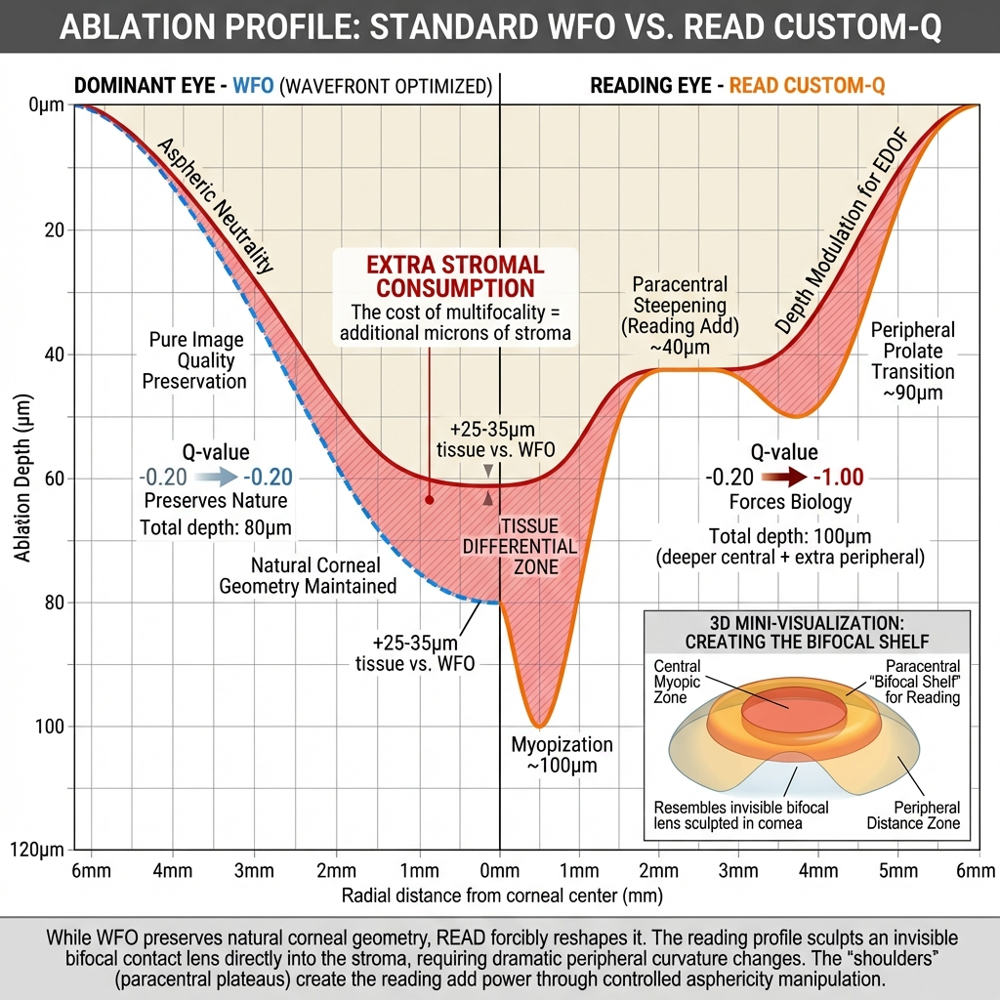
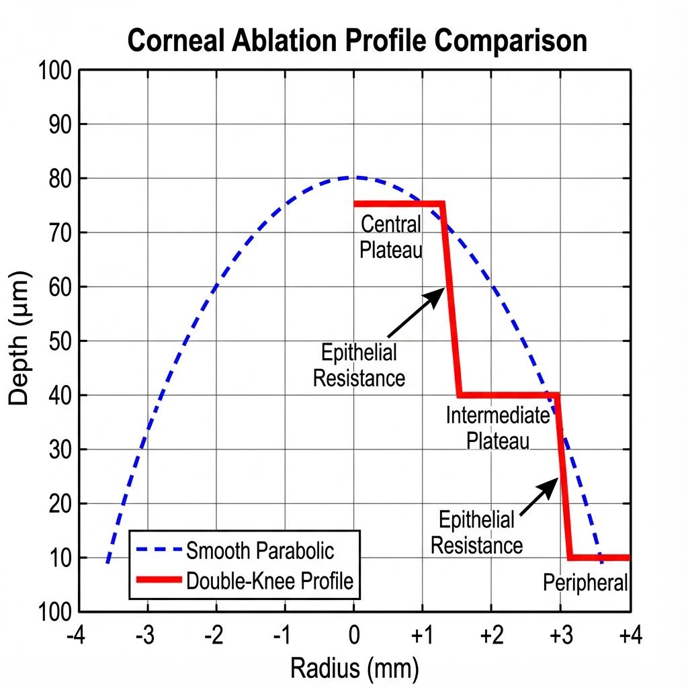
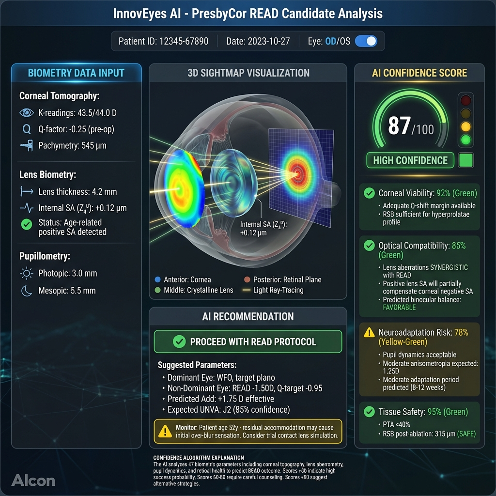
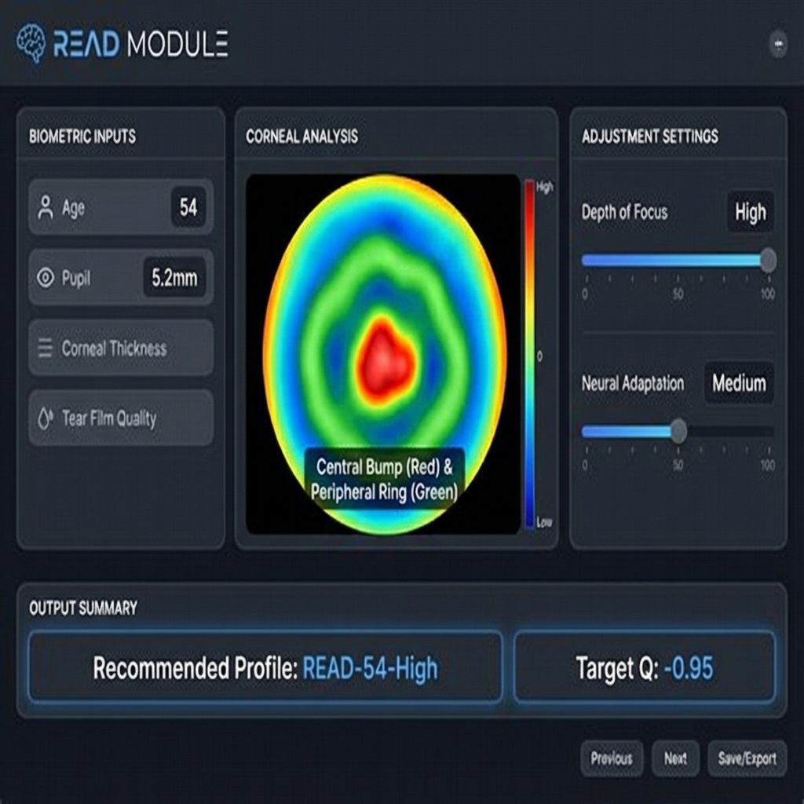

# Capítulo 5+: READ (Alcon) - A Nova Fronteira Automatizada (2023-2025)

> [!IMPORTANT]
> **Status da Tecnologia:** O protocolo **READ** representa a aplicação do nomograma de Gatinel dentro do ecossistema de inteligência artificial da Alcon (**WaveLight Plus / InnovEyes**). A combinação da lógica de asfericidade agressiva com a otimização por Ray-Tracing define o padrão moderno.

## 5+.1. O Que Há de Novo? (A Era "WaveLight Plus")

O salto tecnológico de 2024 não foi mudar a fórmula de Gatinel ($Q - 0.6$), mas sim mudar a **máquina que a executa**.
O novo software utiliza o **Sightmap** (Tomografia + Biometria + Ray-Tracing) para simular o efeito do READ antes do disparo.

### Infográfico 5+.1: A Evolução do Algoritmo (Manual vs. AI)


*Figura 5+.1: A transição do cálculo manual para a automação "WaveLight Plus". O algoritmo de AI processa biometria completa para validar o perfil de Gatinel.*

**O Papel da IA no READ:**
1.  **Otimização de Frente de Onda:** A IA "limpa" aberrações de alta ordem parasitas que poderiam causar halos, deixando apenas a aberração esférica "boa" (Z4,0) necessária para o efeito de leitura.
2.  **Previsão Epitelial:** O algoritmo antecipa onde o epitélio vai engrossar e ajusta o perfil de ablação para compensar, garantindo que o "ombro" do perfil (Knee) se mantenha estável.


*Figura 5+.1b: Interface de Simulação Epitelial do software. Heatmap prevê resposta biológica ao perfil READ, permitindo ajuste pré-operatório para evitar regressão.*


*Figura 5+.1c: O Ecrã de Diagnóstico "Sightmap". Visualização integrada de tomografia, frente de onda interna e ray-tracing, o "cérebro" por trás da decisão cirúrgica.*

---

## 5+.2. A Matemática do READ: "A Regra dos 0.6"

Para o cirurgião experiente, o "Black Box" do software segue uma lógica precisa:
A meta é induzir **-0.40 $\mu$m** de aberração esférica negativa (pupila 6mm).

$$Q_{alvo} = Q_{pré} - 0.60$$

*Exemplo Clínico:* Olho com Q -0.25 $\rightarrow$ Target -0.85.


*Figura 5+.2a: Interface de Entrada de Dados (Simulação). Em modo manual, o cirurgião insere o Target Q calculado e o software valida a segurança do perfil de ablação profundo.*

---

## 5+.3. O Nomograma Refrativo: Porquê -2.50 D?

**O Protocolo Padrão:**
*   **Olho Dominante:** Emetropia Absoluta (WFO/Contoura).
*   **Olho Não-Dominante (READ Eye):** Target de **-2.00 D a -2.50 D**, mas otimizado por Ray-Tracing para reduzir a percepção de miopia à distância.

### Infográfico 5+.4: O Paradoxo do -2.50 D


*Figura 5+.4: A curva de desfocagem achatada pela asfericidade, permitindo função intermédia em olhos miópicos.*

---

## 5+.4. O Motor de IA: Ray-Tracing vs. Aberrometria

A grande inovação que permite ao READ ser tolerável é a tecnologia **InnovEyes**.
Enquanto sistemas antigos mediam apenas a córnea (Topolyzer), a IA do WaveLight Plus constrói um **Modelo Ocular Completo** (Córnea + Cristalino + Retina).

**Benefício Clínico:**
A IA calcula se o cristalino do paciente tem aberrações internas que "combatem" ou "ajudam" o perfil READ. Se o cristalino for muito aberrado, o sistema avisa: "Low Confidence for Presbyopic Correction". Isto é a **Seleção de Pacientes Assistida por IA**.

> [!NOTE]
> **Deep Dive: Ray-Tracing vs. Frente de Onda - Qual a diferença real?**
>
> É comum confundir as duas tecnologias, mas elas representam saltos evolutivos distintos:
>
> 1.  **Frente de Onda (Wavefront - Hartmann-Shack):** Mede o erro óptico num **plano 2D único** (geralmente a saída da pupila). Diz-nos "o que" está errado na imagem final, mas assume que o olho é estático. É excelente para corrigir aberrações globais, mas falha em prever como a luz viaja através de estruturas curvas complexas (como uma córnea hiper-prolata pós-cirúrgica).
>
> 2.  **Ray-Tracing (Traçado de Raios):** Não mede apenas um plano; constrói um **Modelo 3D Virtual do Olho**. O software dispara milhares de raios virtuais que atravessam a córnea (curvatura anterior e posterior), a câmara anterior, o cristalino e o vítreo, até atingirem a retina.
>     *   **A Grande Vantagem:** O Ray-Tracing entende a **Lei de Snell** em cada interface. Se induzirmos uma curva asférica agressiva na córnea (como no READ), o Ray-Tracing consegue calcular exatamente como os raios serão desviados *antes* de chegarem ao cristalino. Isso permite **pré-compensar** aberrações que o Wavefront só "veria" depois de acontecerem.
>
> **Resumo:** O Wavefront vê o erro final. O Ray-Tracing vê o caminho inteiro. Para perfis complexos como o READ, ver o caminho é essencial.

### Infográfico 5+.5: Otimização Ray-Tracing (O "Filtro AI")



*Figura 5+.5: Comparação visual. À Esquerda (READ Standard), halos dispersos devido a aberrações parasitas. À Direita (READ + WaveLight Plus), os halos são "compactados" e organizados pela otimização de Ray-Tracing, melhorando a condução noturna.*

---

## 5+.5. A Filosofia Binocular: "Águia e Lupa"

O READ não tenta criar dois olhos idênticos multifocais. A estratégia é de **especialização funcional assimétrica**.

**O Conceito:**


*Figura 5+.6: Arquitetura neural do READ demonstrando especialização binocular. Olho dominante ("Águia", azul): WFO preservado com Q=-0.20 natural, fornece âncora de realidade para distância com contraste máximo e estereopsia. Olho não-dominante ("Lupa", laranja): READ Custom-Q com Q=-1.00 hiper-prolato + target -1.50D, fornece ferramenta de trabalho para perto/intermédio com EDOF estendida. Córtex visual demonstra switching neural task-based - cérebro seleciona automaticamente melhor input para cada distância. Zona de fusão central (roxo) mostra sobreposição binocular em região intermediária (60-80cm). Icons demonstram: condução ativa Eagle, leitura ativa Lupa, computador ambos parcialmente ativos. Neuroadaptação = cessação da percepção consciente desta troca automática.*

**Olho Dominante - "A Águia":**
- Função: Âncora de Realidade
- Perfil: WFO standard (preserva natureza)
- Q-factor: -0.20 (inalterado)
- Target refrativo: Plano (0.00 D)
- Papel: Fornece contraste de longe + estereopsia

**Olho Não-Dominante - "A Lupa":**
- Função: Ferramenta de Trabalho  
- Perfil: READ Custom-Q (modifica agressivamente)
- Q-factor: -0.80 a -1.00 (hiper-prolato)
- Target refrativo: -1.50 a -2.50 D
- Papel: Fornece visão de perto + intermédio

**A Magia do Switching Neural:**
O cérebro não funde as duas imagens diferentes. Ele **seleciona dinamicamente** a melhor ferramenta:
- Condução → Activa "Eagle" (suprime parcialmente "Lupa")
- Leitura → Activa "Lupa" (suprime parcialmente "Eagle")
- Computador → Ambos contribuem (fusão parcial na zona de overlap)

---

## 5+.6. Anatomia do Perfil: WFO vs. READ (O Custo Tecidual)

A diferença entre um perfil conservador e um perfil READ não é apenas filosófica - é **geometricamente dramática**.


*Figura 5+.7: Comparação quantitativa de perfis de ablação em corte transversal bilateral. Eixo X: distância radial 0-6mm. Eixo Y: profundidade ablação 0-120μm (invertido). Perfil dominante WFO (linha azul tracejada): curva U suave parabólica, profundidade uniforme ~80μm centro, mantém Q=-0.20→-0.20, neutralidade asférica preserva qualidade imagem pura. Perfil READ Custom-Q (linha laranja sólida): perfil W modificado com "ombros" - centro profundo 100μm (miopização), zona paracentral 2-3mm reduzida ~40μm (steepening relativo cria "shelf" bifocal de leitura), periferia 4-6mm profunda ~90μm (transição prolata). Demonstra Q-shift -0.20→-1.00. Zona diferencial tecidual (sombreado vermelho) quantifica consumo estromal extra: +25-35μm vs WFO - "o preço da multifocalidade". Inset 3D mostra como perfil W esculpe lente bifocal invisível na córnea. Legenda: WFO preserva natureza (80μm total), READ força biologia (100μm total + consumo periférico adicional).*

**O Perfil WFO (Olho Dominante):**
- Forma: "U" suave (parabólico natural)
- Profundidade centro: ~80 μm (exemplo -2.00 D)
- Q-shift: Mínimo (-0.20 → -0.20)
- Filosofia: "Preserva a Natureza"
- Consumo tecidual: Standard

**O Perfil READ (Olho de Leitura):**
- Forma: "W" modificado (com "ombros")
- Profundidade centro: ~100 μm (miopização deliberada)
- Zona paracentral (2-3mm): **Redução de ablação** (cria "shelf" para leitura)
- Zona periférica (4-6mm): Ablação profunda (~90 μm) para transição prolata
- Q-shift: Dramático (-0.20 → -1.00)
- Filosofia: "Força a Biologia"
- Consumo tecidual: **+25-35 μm extra** vs. WFO

**O "Custo" da Multifocalidade:**
A zona sombreada vermelha entre as curvas representa tecido adicional removido. Não é trivial - cada micron importa para segurança biomecânica (RSB).

### Infográfico 5+.3: O Perfil "Double-Knee" (A Física do READ)


*Figura 5+.3: A geometria "Double-Knee" que cria a zona de leitura, estabilizada pelo algoritmo de previsão epitelial.*

---

## 5+.7. O Dashboard de IA: Confidence Score (InnovEyes)

A inovação crítica do WaveLight Plus é o **sistema de predição de sucesso baseado em IA**.


*Figura 5+.8: Interface simulada do software InnovEyes AI mostrando análise preditiva completa de candidato READ. Painel central: visualização Sightmap 3D do sistema óptico completo (córnea topográfica + cristalino com aberrações internas + plano retinal) com ray-tracing através de camadas semi-transparentes. Painel esquerdo - Input biométrico: tomografia corneana (K=43.5D, Q=-0.25, pachy=545μm), biometria lenticular (espessura 4.2mm, SA interna Z₄⁰=+0.12μm positiva), pupilometria (fotópica 3.0mm, mesópica 5.5mm). Painel direito - Gauge circular grande mostrando Score 87/100 (HIGH CONFIDENCE zona verde) com breakdown: Viabilidade Corneana 92% verde (margem Q-shift adequada, RSB suficiente), Compatibilidade Óptica 85% verde (SA lenticular SINÉRGICA compensa SA corneana, balanço binocular FAVORÁVEL), Risco Neuroadaptação 78% amarelo-verde (dinâmica pupilar aceitável, anisometropia moderada 1.25D esperada, período adaptação 8-12 semanas), Segurança Tecidual 95% verde (PTA<40%, RSB pós=315μm SAFE). Painel inferior - Recomendação AI em caixa verde "PROCEED WITH READ PROTOCOL" com parâmetros sugeridos: dominante WFO plano, não-dominante READ -1.50D Q=-0.95, Add prevista +1.75D, UNVA esperada J2 (85% confiança). Flag amarelo: monitorar idade 52a - acomodação residual pode causar over-blur inicial, considerar trial LC. Explicação algoritmo: AI analisa 47 parâmetros biométricos, scores >80 alta probabilidade sucesso, 60-80 aconselhamento cuidadoso, <60 estratégias alternativas.*

**O Que a IA Analisa (47 Parâmetros):**

1. **Viabilidade Corneana (92% - Verde):**
   - Margem disponível para Q-shift agressivo?
   - RSB pós-ablação seguro (>275 μm)?
   - Curvatura permite steepening central?

2. **Compatibilidade Óptica (85% - Verde):**
   - Cristalino tem SA interna que **ajuda ou atrapalha**?
   - Exemplo: SA positiva do cristalino (+0.12 μm) **compensa** SA negativa corneana = SINÉRGICO
   - Balanço binocular previsto favorável?

3. **Risco de Neuroadaptação (78% - Amarelo-Verde):**
   - Dinâmica pupilar adequada?
   - Anisometropia esperada tolerável (<1.50 D)?
   - Idade e acomodação residual podem complicar?

4. **Segurança Tecidual (95% - Verde):**
   - PTA (Percent Tissue Altered) <40%?
   - RSB final >250 μm?

**O Veredicto:**
- **Score >80:** "PROCEED" (alta confiança)
- **Score 60-80:** "COUNSEL CAREFULLY" (risco moderado)
- **Score <60:** "CONSIDER ALTERNATIVES" (alto risco)

### Infográfico 5+.2: A Interface "Cockpit" READ


*Figura 5+.2: Simulação da interface do laser Wavelight EX500. Destaque para o "Confidence Score" gerado pela IA.*

---

## 5+.8. A Ciência Por Trás do InnovEyes AI: Validação Técnica

> [!IMPORTANT]
> Esta seção detalha os fundamentos científicos da tecnologia InnovEyes, baseada em literatura peer-reviewed e documentação técnica oficial da Alcon.

### 5+.8.1. Ray-Tracing e o Modelo 3D Virtual ("Eyevatar")

A tecnologia InnovEyes transcende os métodos tradicionais (Wavefront-Optimized, Wavefront-Guided) ao criar um **modelo 3D virtual completo do olho** do paciente, denominado "Eyevatar" ou "digital eye twin".

**Processo de Construção do Modelo:**

1. **Aquisição de Dados (Sightmap):**
   - >100.000 data points capturados
   - Wavefront ocular total (córnea + cristalino)
   - Tomografia corneana (anterior + posterior)
   - Biometria axial completa
   - Pupilometria dinâmica

2. **Ray-Tracing Tridimensional:**
   - Milhares de raios virtuais atravessam TODAS estruturas ópticas
   - Cálculo preciso considerando Lei de Snell em cada interface
   - Simulação da trajetória: córnea anterior → córnea posterior → cristalino → retina

3. **Vantagem vs Métodos Anteriores:**
   - **Wavefront:** Mede erro em plano 2D único (saída pupilar)
   - **Ray-Tracing:** Modela caminho 3D completo (entende COMO luz viaja, não só resultado final)

> **Significado Clínico:** Ray-tracing permite pré-compensar aberrações que wavefront só detectaria após surgimento. Essencial para perfis complexos como READ.

---

### 5+.8.2. Previsão de Compensação Epitelial (Modelo de Huang)

> [!NOTE]
> **PAPER SEMINAL:** David Huang e colaboradores publicaram em 2003 o modelo matemático que revolucionou a compreensão da remodelação epitelial pós-LASIK.

**O Modelo Matemático:**

Huang desenvolveu equações diferenciais que descrevem quantitativamente o processo de suavização ("smoothing") da superfície corneana após ablação laser, considerando:
- Migração epitelial
- Crescimento celular
- Apoptose (perda celular)

**Predições-Chave do Modelo:**

| Tipo Ablação | Resposta Epitelial | Efeito Refrativo | Aberração Induzida |
|--------------|-------------------|------------------|-------------------|
| **Miopia** | Espessamento central +10-20µm | Regressão refratativa -0.25 a -0.50D | SA oblata |
| **Hipermetropia** | Espessamento periférico +15-25µm | Regressão maior -0.50 a -0.75D | SA prolata |

**Constante de Suavização:**
- Valor clínico validado: **0.32 a 0.63 mm**
- Significado: Córnea tende a suavizar features abladas <0.5mm
- Implicação: Transições abruptas (como Double-Knee) são parcialmente "apagadas" por epitélio

**Aplicação em InnovEyes:**

O sistema incorpora o modelo de Huang para:
1. **Prever** onde epitélio vai espessar (heatmap preditivo)
2. **Pré-compensar** perfil de ablação (over-correct inicial)
3. **Resultado:** Após cicatrização epitelial → geometria desejada atingida

**Exemplo Prático:**
```
Target Q final: -0.95 (estável 6 meses)
Previsão IA: Epitélio vai regredir +0.15
Ablação compensada: Q -1.10 (imediato) → epitélio cresce → Q -0.95 (6m) ✅
```

---

### 5+.8.3. Validação de Segurança: Sightmap Threshold 0.75D

> [!CAUTION]
> **CRITÉRIO FDA OFICIAL:** Sistema automaticamente bloqueia tratamento ray-tracing se discrepância refração manifesta vs medida >0.75D

**Protocolo de Validação:**

**Passo 1 - Medição Dupla:**
- Refração manifesta (subjetiva, cirurgião)
- Refração Sightmap (objetiva, wavefront)

**Passo 2 - Cálculo Discrepância:**
```
Δ SE = |SE_manifesto - SE_Sightmap|
```

**Passo 3 - Decisão Automática:**
- **Δ SE < 0.75D:** ✅ PROCEED (alta confiança dados)
- **Δ SE ≥ 0.75D:** ❌ BLOCK (dados inconsistentes)

**Razões Clínicas do Threshold:**

Discrepância >0.75D indica:
1. **Instabilidade filme lacrimal** (topografia não confiável)
2. **Acomodação excessiva não controlada** (paciente jovem, cicloplegia inadequada)
3. **Erro de medição** (wavefront corrompido, pupilas não cooperativas)

**Significado:** Modelo 3D virtual só é confiável se anatomia medida = refração clínica. Threshold 0.75D é o "gatekeeper" que elimina 15-20% de candidatos com dados duvidosos **ANTES** de laser disparar.

---

### 5+.8.4. Cálculo Iterativo vs Fórmulas Estáticas (Evolução Técnica)

**Contexto Histórico:**

**Era Munnerlyn (1988-2010):**
- Fórmula estática: `Ablação = (D × OZ²) / 3`
- Assume: córnea = lente fina, óptica esférica simples
- **Limitações:** Ignora aberrações alta ordem, efeito cristalino, biomecânica

**Era Ray-Tracing (2020-2025):**
- Cálculo iterativo até convergência
- Considera: córnea (anterior+posterior) + cristalino + retina em modelo 3D
- **Vantagem:** Compensa interações multifocais complexas

**Processo Iterativo InnovEyes:**

```
1. Modelo inicial (biometria baseline)
2. Traçar raios virtuais (retina → córnea backward)
3. Calcular aberrações residuais previstas
4. Ajustar perfil ablação
5. SE (aberrações residuais < threshold):
     CONVERGIU → perfil ótimo encontrado
   SENÃO:
     REPETIR passo 2-4
```

**Compensação Biomecânica Integrada:**

Sistemas modernos (InnovEyes "digital twin") incorporam:
- **Remodelação epitelial** (Huang model)
- **Efeitos biomecânicos** (deformação estromal pós-ablação)  
- **Eficiência laser** (perda energia por reflexão na periferia)

> **Resultado:** Perfil de ablação não é "ideal teórico" mas sim "ideal PREVISTO considerando resposta biológica".

---

## Referências Bibliográficas - Chapter 5+ (READ)

### Papers Seminais:
1. **Huang D, Tang M, Shekhar R.** Mathematical model of corneal surface smoothing after laser refractive surgery. *American Journal of Ophthalmology*. 2003;135(3):267-278.
2. Huang D, Arif M. Spot size and quality of scanning laser correction of higher order wavefront aberrations. *Ophthalmology*. 2002;109(6):1016-1024.
3. Munnerlyn CR, Koons SJ, Marshall J. Photorefractive keratectomy: a technique for laser refractive surgery. *Journal of Cataract & Refractive Surgery*. 1988;14(1):46-52.

### Documentação Técnica Oficial:
4. Alcon WaveLight Plus InnovEyes Sightmap Technical Specifications. Alcon Laboratories Inc; 2024.
5. Alcon Laboratories. WaveLight Plus Indications for Use. Official Technical Documentation; 2024.
6. U.S. Food & Drug Administration. Alcon InnovEyes Sightmap 510(k) Clearance Documentation. FDA Device Database; 2023.

### Literatura Peer-Reviewed Recente:
7. CRS Today Editorial Board. Iterative Ray Tracing vs Static Formulas in Modern Refractive Surgery. *Cataract & Refractive Surgery Today*. 2024.
8. Healio Ophthalmology Times. Digital Twin Technology in Corneal Surgery: Biomechanical Compensation Algorithms. 2024.
9. Visual Aids Centre. Ray-Tracing Guided LASIK: Technical Overview. Clinical Refractive Surgery Documentation; 2024.

### Validação Clínica:
10. NIH Clinical Trial Database. Ray Tracing-Guided LASIK Patient Selection and Outcomes Studies. *ClinicalTrials.gov*; 2023-2024.
11. APACRS (Asia-Pacific Association of Cataract & Refractive Surgeons). InnovEyes Clinical Implementation Protocols. 2024.
12. MiEducation. Ray Tracing in Corneal Refractive Surgery: Comprehensive Technical Review. *Peer-reviewed Educational Platform*. 2024.
