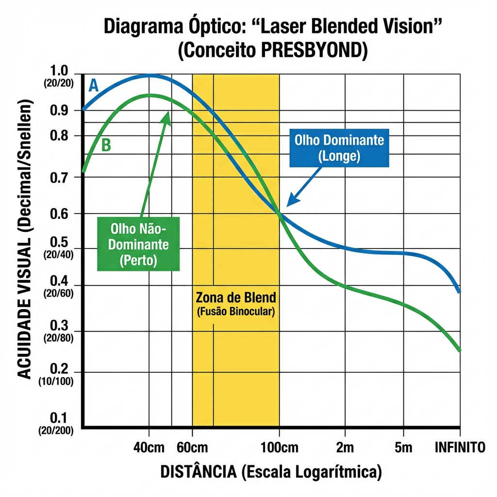
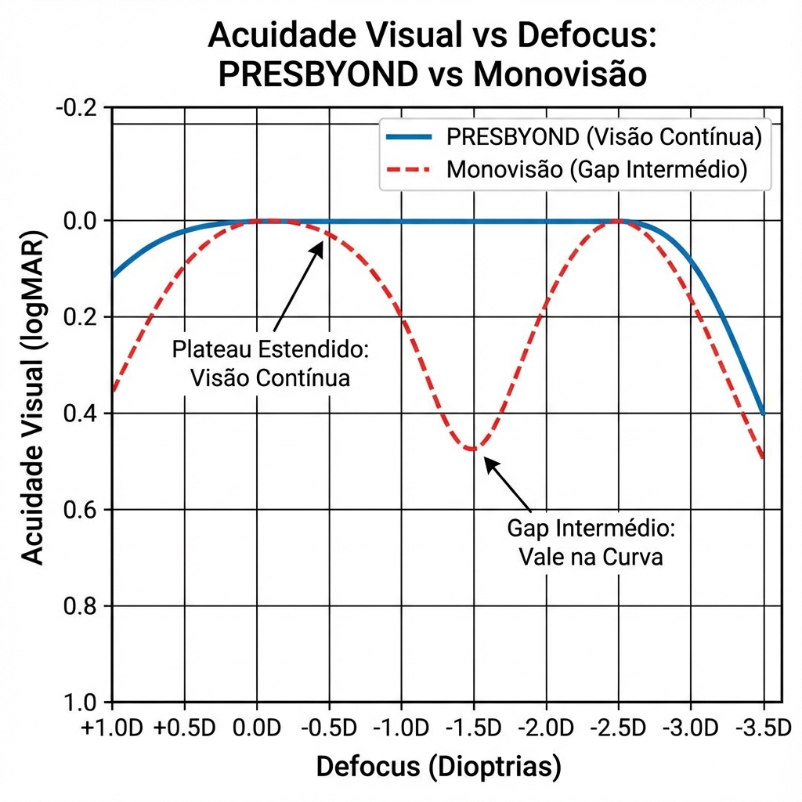
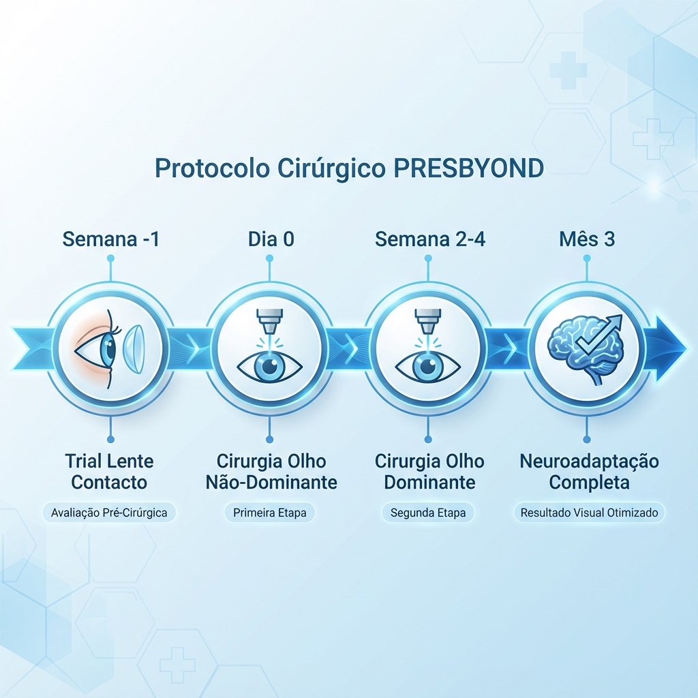
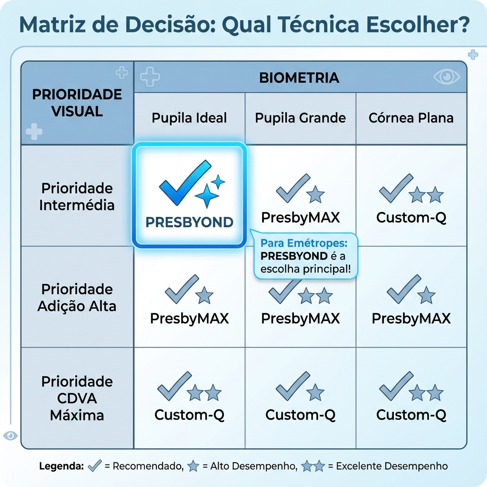
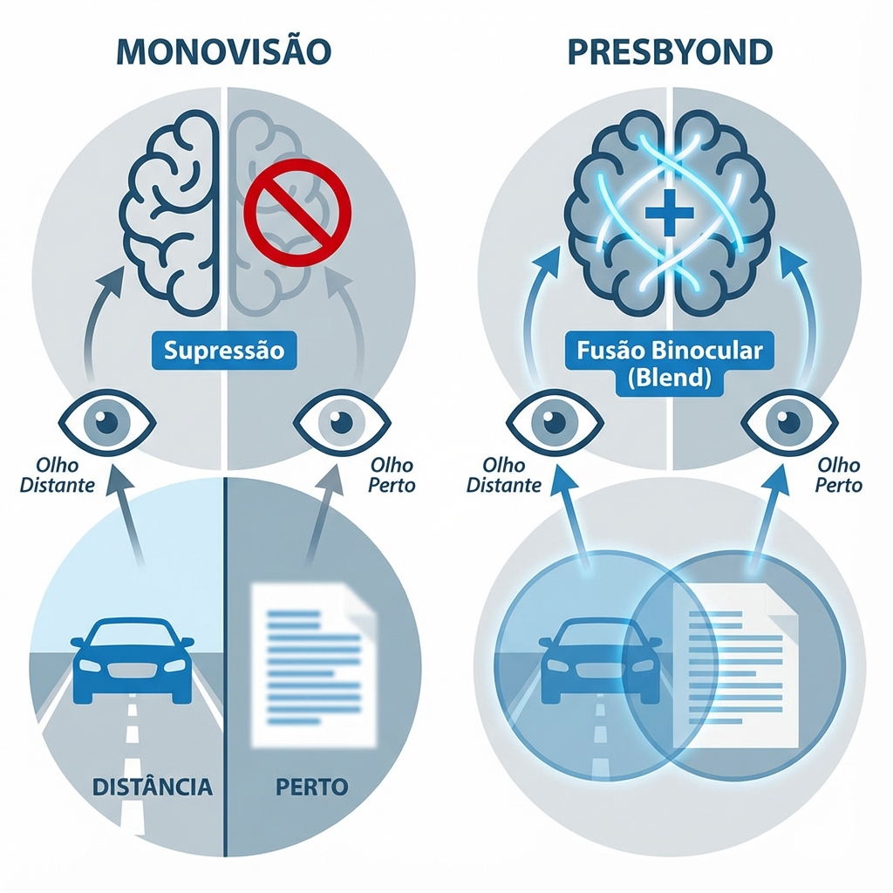

# Capítulo 7: PRESBYOND (Zeiss) - Laser Blended Vision

> [!NOTE]
> **Definição do Conceito:** PRESBYOND Laser Blended Vision (LBV) é uma estratégia proprietária da Carl Zeiss Meditec (plataforma MEL 90) que representa uma abordagem filosoficamente distinta das técnicas multifocais analisadas nos capítulos anteriores. Em vez de criar zonas ópticas discretas (PresbyMAX) ou induzir aberração esférica negativa bilateral (Custom-Q), o PRESBYOND utiliza **micro-monovisão asférica otimizada** combinada com uma zona de "blend" (mistura) projetada para maximizar fusão binocular e minimizar a percepção de anisometropia. [1,2]

## 7.1. A Filosofia "Blended Vision": Monovisão Reimaginada

### 7.1.1. Limitações da Monovisão Clássica

A monovisão tradicional (desenvolvida inicialmente para lentes de contacto nos anos 1980) baseia-se num princípio simples mas biologicamente problemático:

**Conceito Clássico:**
- **Olho dominante:** Corrigido para emetropia (0.00 D) → Visão de longe
- **Olho não-dominante:** Deixado míope (-1.50 a -2.50 D) → Visão de perto
- **Anisometropia induzida:** 1.50-2.50 D

**Problemas Bem Documentados:**

1. **Rivalidade Binocular e Supressão:**
   - O cérebro recebe duas imagens simultaneamente incompatíveis
   - Em longe: Imagem nítida (OD) compete com imagem muito desfocada (OE)
   - Em perto: Imagem nítida (OE) compete com imagem desfocada (OD)
   - Mecanismo cortical: Supressão ativa da imagem desfocada → Custo energético neural

2. **Perda de Estereopsia:**
   - Visão estereoscópica (percepção de profundidade) requer fusão binocular
   - Anisometropia >1.00 D degrada estereopsia significativamente
   - Estudos com Worth 4-dot test: 25-35% mostram supressão monocular intermitente [3]

3. **Taxa de Intolerância:**
   - Literatura: 10-20% dos pacientes não toleram monovisão
   - Sintomas: Tontura, náusea, dificuldade em escadas, problemas com condução

4. **Limitação em Visão Intermediária:**
   - Nenhum dos dois olhos está focado a 60-80 cm (computador, painel de carro)
   - "Gap" visual problemático para profissões modernas

### 7.1.2. O Conceito Reinstein: "Blend Zone"

Dan Reinstein (London Vision Clinic, UK) desenvolveu o conceito PRESBYOND baseado em dois pilares inovadores:

#### Pilar 1: Micro-Monovisão (Anisometropia Reduzida)

**Target Refrativo:**
- **Olho dominante:** +0.50 D (ligeiramente hipermétrope)
- **Olho não-dominante:** -1.00 a -1.25 D (miopia moderada)
- **Anisometropia total:** ~1.50-1.75 D (vs. 2.00-2.50 D monovisão clássica)

**Vantagem:**  
Anisometropia <1.75 D permite fusão binocular parcial em vez de supressão total.

#### Pilar 2: Perfil Asférico "Blended" (Zona de Fusão Óptica)

**Conceito Revolucionário:**

Em vez de criar dois olhos com perfis standard (esféricos ou simplesmente asféricos), o PRESBYOND modifica **ambos os olhos** com perfis asféricos complementares que criam uma:

**"Blend Zone" (Zona de Mistura):**  
Região de distâncias focais (40-80 cm) onde **ambos os olhos contribuem simultaneamente** com imagens parcialmente focadas que o cérebro funde numa imagem binocular funcional.

**Mecanismo Óptico:**

- **Olho dominante (+0.50 D):**
  - SA negativa ligeira induzida (-0.20 μm)
  - Cria EDOF que estende foco de infinito até ~80 cm
  - Contribui para visão intermediária e longe

- **Olho não-dominante (-1.25 D):**
  - SA negativa moderada (-0.35 μm)
  - Cria EDOF que estende foco de 33 cm até ~100 cm
  - Contribui para visão de perto e intermediária

**Sobreposição (Blend):**  
As zonas de EDOF dos dois olhos sobrepõem-se na região 60-100 cm (intermediária), criando:
- **Fusão binocular ativa** (não supressão)
- **Estereopsia preservada** nesta zona crítica
- **Transição suave** entre visão de longe e perto

---

## 7.2. Matemática e Óptica do Blend

### 7.2.1. Cálculo de Profundidade de Campo Combinada

A profundidade de campo (DoF) efetiva em PRESBYOND é **não-aditiva linear**, mas segue um modelo de **somação binocular ponderada**.

**Modelo Simplificado:**

Para cada olho, a DoF pode ser aproximada por:

$$\text{DoF} = \frac{2 \cdot d \cdot c}{f^2}$$

Onde:
- **d:** Diâmetro pupilar
- **c:** Círculo de confusão tolerável (~20-30 μm)
- **f:** Distância focal efetiva

**Em PRESBYOND:**

**Olho Dominante (OD):**
- Target: +0.50 D
- SA induzida: -0.20 μm
- DoF estimada: 2.5-3.0 D (de infinito a ~40 cm)

**Olho Não-Dominante (OE):**
- Target: -1.25 D
- SA induzida: -0.35 μm
- DoF estimada: 2.0-2.5 D (de ~33 cm a ~80 cm)

**DoF Binocular Combinada:**

$$\text{DoF}_{\text{total}} \approx \sqrt{\text{DoF}_{\text{OD}}^2 + \text{DoF}_{\text{OE}}^2}$$

$$\text{DoF}_{\text{total}} \approx \sqrt{2.75^2 + 2.25^2} \approx 3.55 \, \text{D}$$

**Resultado:**  
Cobertura focal contínua de infinito (~0 D) até 33 cm (~3.0 D), com fusão binocular ótima na zona 60-100 cm.

### 7.2.2. A Curva de "Defocus" Binocular

Estudos de Reinstein utilizaram **curvas de defocus** para demonstrar o benefício do blend:

**Protocolo:**
- Adicionar lentes positivas/negativas incrementalmente (±0.50 D steps)
- Medir BCVA a cada step
- Gráfico: Visual Acuity (logMAR) vs. Defocus (D)

**Resultados PRESBYOND vs. Monovisão Standard:**

| Distância Focal | Monovisão Clássica | PRESBYOND LBV | Vantagem LBV |
|-----------------|-------------------|---------------|--------------|
| **Infinito (0.00 D)** | 0.05 logMAR (20/22) | **0.00 logMAR (20/20)** | +1 linha |
| **80 cm (-1.25 D)** | 0.20 logMAR (20/32) | **0.10 logMAR (20/25)** | +1.5 linhas |
| **50 cm (-2.00 D)** | 0.15 logMAR (20/28) | **0.08 logMAR (20/24)** | +1 linha |
| **33 cm (-3.00 D)** | 0.10 logMAR (20/25) | 0.12 logMAR (20/26) | Equivalente |

**Conclusão:**  
PRESBYOND oferece performance superior em **longe e intermediária**, mantendo perto equivalente.

---

## 7.3. Protocolo Cirúrgico: Plataforma Zeiss MEL 90

### 7.3.1. Hardware: Carl Zeiss MEL 90

**Especificações Técnicas:**

- **Frequência:** 500 Hz
- **Flying Spot:** 0.7 mm diâmetro (Gaussian beam profile)
- **Eye-Tracker:** 1050 Hz, velocidade de resposta <2 ms
- **Perfil Asférico:** "Aberration-Free" otimizado (preserva Q natural em correções standard)
- **Interface:** PresbyMAX mode NÃO disponível (sistema Zeiss é exclusivo PRESBYOND)

### 7.3.2. Software PRESBYOND: Inputs e Cálculo Automático

**Interface PresbyMAX Calculator (Software Forum):**

O módulo PRESBYOND no MEL 90 solicita:

1. **Dominância Ocular:** Direito / Esquerdo (mandatório)
2. **Refração Pré-Op:** Esfera, Cilindro, Eixo (ambos os olhos)
3. **Pupila Mesópica:** Auto-detectada ou input manual (mm)
4. **Add Desejada:** +1.50 D / +2.00 D / +2.50 D (menu pré-definido)
5. **Idade:** Input numérico (anos)

**Output Automático (Não-Editável):**

O algoritmo proprietário calcula:

**Olho Dominante:**
- Target esférico: +0.50 D (fixo)
- SA induzida: Calculada baseado em pupila e add desejada
- OZ: 6.5-7.0 mm (ajustada automaticamente)

**Olho Não-Dominante:**
- Target esférico: -1.00 a -1.50 D (varia com add desejada e idade)
- SA induzida: -0.30 a -0.45 μm
- OZ: 6.0-6.5 mm

**Nota Crítica:**  
Ao contrário de Custom-Q (totalmente manual) ou PresbyMAX (parcialmente ajustável), **PRESBYOND é um algoritmo "black box"**. O cirurgião não pode modificar targets calculados. Apenas aceita ou rejeita.

### 7.3.3. Técnica Intra-Operatória

#### Centragem: Pupil-Based

**Regra PRESBYOND:**  
Centrar **ambos os olhos no centro pupilar** (não no Purkinje).

**Justificação (Reinstein):**
- Perfil blend é desenhado para pupila dinâmica
- Centragem no eixo visual (Purkinje) pode descentrar o blend em relação à pupila funcional
- Diferente de multifocal zonal (PresbyMAX), onde Purkinje é crítico

#### Sequência Bilateral

**Protocolo Recomendado:**

1. **Operar olho não-dominante primeiro:**
   - Raciocínio: Se houver complicação ou insatisfação imediata, pode-se ajustar estratégia no dominante
   - Permite ao paciente "testar" monovisão parcial antes de comprometer olho dominante

2. **Intervalo entre olhos:** 
   - Mínimo: 1 semana (avaliar tolerância neuroadaptativa inicial)
   - Ideal: 2-4 semanas
   - Alguns cirurgiões preferem: Mesmo dia (bilateral simultâneo)

**Dados de Literatura:**

Estudo de Reinstein com 250 pacientes:
- Same-day bilateral: 65%
- 1-2 semanas intervalo: 30%
- >4 semanas intervalo: 5%
- **Taxa de cancelamento do olho dominante após não-dominante:** 3% (paciente não tolerou monovisão) [2]

---

## 7.4. Seleção de Pacientes: Critérios Específicos PRESBYOND

### 7.4.1. Candidatos Ideais

**Perfil Biométrico Ótimo:**

- **Idade:** 45-60 anos (sweet spot: 48-55)
- **Refração:**
  - **Hipermétropes:** +0.50 a +2.50 D (excelentes candidatos)
  - **Emétropes:** ±0.50 D (bons candidatos se expectativas geridas)
  - **Míopes:** -1.00 a -4.00 D (viáveis, mas necessitam ajuste de target)
- **Pupila Mesópica:** 4.0-6.5 mm (ideal)
- **Add Necessária:** +1.50 a +2.00 D

**Diferencial PRESBYOND:**  
Míopes são **melhores candidatos em PRESBYOND** que em PresbyMAX, porque:
1. Target de -1.25 D no não-dominante é menos agressivo
2. Blend preserva melhor a qualidade de longe (míopes valorizam isso)

### 7.4.2. Teste de Tolerância (Trial com Lentes de Contacto)

**Protocolo Específico PRESBYOND:**

1. **Simulação de Targets:**
   - OD (dominante): +0.50 D LC
   - OE (não-dominante): -1.25 D LC

2. **Duração:** 3-7 dias mínimo

3. **Avaliação Crítica:**
   - Visão de longe binocular: Deve ser ≥20/25
   - Leitura: J2-J3 confortável
   - Visão intermediária (computador): Funcional sem esforço
   - **Sem tontura ou náusea**

**Taxa de Falha no Trial:**  
Literatura PRESBYOND: 5-8% (vs. 10-15% monovisão clássica)

**Razão da Menor Taxa de Falha:**  
Anisometropia reduzida + blend = melhor tolerância neural.

---

## 7.5. Resultados Clínicos: Evidência Multi-Cêntrica

### 7.5.1. Eficácia Visual

**Estudo Pivotal de Reinstein (n=250, follow-up 12 meses):** [2]

**Visão de Longe (Binocular UCDVA):**
- 20/20 ou melhor: **92%**
- 20/25 ou melhor: 98%
- 20/40 ou pior: <1%

**Visão de Perto (Binocular UCNVA):**
- J2 ou melhor: **88%**
- J3 ou melhor: 96%
- J4 ou pior: 4%

**Visão Intermediária (60-80 cm):**
- Funcional sem óculos: **94%** (destaque PRESBYOND)
- Excelente: 78%

**Independência de Óculos:**
- Completa (0% uso): 72%
- Parcial (<10% do tempo): 22%
- Regular (>25% tempo): 6%

### 7.5.2. Qualidade Visual e Fenómenos Fóticos

**Sensibilidade ao Contraste:**

Medição com CSV-1000 a 12 meses:

| Frequência | Redução vs. Pré-Op | Significância Clínica |
|------------|-------------------|----------------------|
| 3 cpd | -0.02 log units | Não significativa |
| 6 cpd | -0.08 log units | Mínima |
| 12 cpd | -0.15 log units | Moderada mas tolerável |
| 18 cpd | -0.22 log units | Moderada |

**Comparação:**
- Custom-Q: -0.15 log (12 cpd)
- PresbyMAX: -0.25 log (12 cpd)
- **PRESBYOND: -0.15 log** (equivalente a Custom-Q, melhor que PresbyMAX)

**Halos Noturnos:**

Questionário validado (McAlinden):
- Halos ligeiros: 35%
- Halos moderados: **12%** (muito inferior a PresbyMAX 30-40%)
- Halos severos (limitam condução): **3%**

**Razão da Baixa Incidência:**  
Blend óptico reduz transições abruptas que causam difração.

### 7.5.3. Neuroadaptação e Satisfação

**Curva Temporal de Adaptação:**

| Tempo | UCNVA Média (logMAR) | Satisfação (%) |
|-------|---------------------|----------------|
| 1 semana | 0.25 (J4-J5) | 55% |
| 1 mês | 0.15 (J3) | 72% |
| 3 meses | 0.10 (J2) | **87%** |
| 6 meses | 0.08 (J2) | 91% |
| 12 meses | 0.08 (J1-J2) | **93%** |

**"Semana do Arrependimento":**  
Menos proeminente que Custom-Q ou PresbyMAX. ~60% já satisfeitos semana 1.

**Satisfação Global (12 meses):**
- Muito satisfeito: 78%
- Satisfeito: 15%
- Neutro: 5%
- Insatisfeito: **2%** (taxa muito baixa)

### 7.5.4. Estabilidade e Taxa de Retoque Cirúrgico

**Regressão Refrativa:**

Mediana de shift aos 12 meses:
- Esfera: +0.12 D (hipermetrópico ligeiro, esperado)
- Add efetiva: Perda de ~0.15 D (mínima)

**Taxa de retratamento:** 8-10% [4]

**Indicações Principais:**
- Hipocorreção (visão perto insuficiente): 5%
- Anisometropia excessiva (paciente não adaptou): 2%
- Regressão hipermetrópica: 3%

---

## 7.6. Limitações e Contraindicações Específicas

### 7.6.1. Limitações Técnicas

**Dependência de Plataforma:**
- PRESBYOND é **exclusivo Zeiss MEL 90** (não transferível para outras plataformas)
- Algoritmo é proprietário "black box" (sem transparência matemática)
- Cirurgião não pode ajustar targets (limitação criativa)

**Limitação de Add:**
- Máximo +2.00 D efetivo (menos que PresbyMAX +2.50 D)
- Pacientes >+2.25 D add necessária podem ficar subótimos

### 7.6.2. Contraindicações Específicas

**Absolutas:**

1. **Dominância Ocular Indefinida:**
   - PRESBYOND depende criticamente de dominância clara
   - Pacientes sem dominância definida: Resultados imprevisíveis
   - Teste: Se hole-in-card e convergence tests discordam → Contraindicar

2. **Intolerância Prévia à Monovisão:**
   - Paciente que tentou LC monovisão e falhou
   - História de tontura com anisometropia

3. **Estrabismo ou Ambliopia:**
   - Fusão binocular comprometida invalida conceito blend
   - Blend requer fusão cortical ativa

**Relativas:**

1. **Profissões de Precisão Visual Extrema:**
   - Cirurgiões (especialmente microcirurgia)
   - Pilotos de aviação comercial
   - Tiradores de elite, atletas de precisão

2. **Atividades Noturnas Críticas:**
   - Condutores profissionais noturnos
   - Segurança/polícia com trabalho noturno primário

---

## 7.7. PRESBYOND vs. Outras Técnicas: Tabela Comparativa Completa

| Critério | PRESBYOND LBV | Custom-Q | PresbyMAX Hybrid |
|----------|---------------|----------|------------------|
| **Filosofia** | Micro-monovisão + Blend | Q-factor personalizado | Multifocal zonal + monovisão |
| **Anisometropia Induzida** | **1.50-1.75 D** (moderada) | 0.50-1.00 D (ligeira) | 0.50-0.75 D (mínima) |
| **Add Máxima** | +2.00 D | +1.75 D | **+2.50 D** |
| **Fusão Binocular Intermédio** | **Excelente (blend ativo)** | Boa | Moderada |
| **Preservação CDVA** | Muito boa (92% ≥20/20) | Muito boa (85% ≥20/20) | **Excelente (90% ≥20/20)** |
| **Halos Noturnos** | **Baixos (12% mod)** | Moderados (20-25%) | Moderados-Altos (25-35%) |
| **Dependência Pupilar** | Baixa | Moderada | **Muito Alta** |
| **Neuroadaptação** | Rápida (60% sat. sem 1) | Moderada (3-6 meses) | Moderada-Lenta |
| **Satisfação 12m** | **93%** | 85-89% | 89% |
| **taxa de retratamento** | 8-10% | 12-18% | **10-15%** |
| **Plataforma** | **Exclusivo Zeiss MEL 90** | Qualquer com Custom-Q | Exclusivo Schwind Amaris |
| **Curva Aprendizagem** | Baixa (automático) | **Alta (cálculos)** | Baixa-Moderada |
| **Flexibilidade Cirurgião** | Nula (black box) | **Total (manual)** | Moderada |

### Interpretação Estratégica:

**PRESBYOND é ideal quando:**
- Plataforma Zeiss MEL 90 disponível
- Prioridade: Visão intermediária excelente (profissionais de computador, arquitetos)
- Perfil de paciente: Hipermétrope ou emétrope, expectativas realistas
- Cirurgião prefere simplicidade (algoritmo automático) com resultados consistentes

**Custom-Q é preferível quando:**
- Necessidade de personalização extrema (córneas atípicas)
- Cirurgião quer controlo total sobre targets
- Pupila muito grande (>6.5 mm) exige cautela com multifocais

**PresbyMAX favorecido quando:**
- Add elevada necessária (+2.00-2.50 D)
- Pupila ideal (fotópica pequena, mesópica moderada)
- Plataforma Schwind disponível

---

## 7.8. Casos Clínicos Ilustrativos

### Caso 1: Sucesso PRESBYOND em Emétrope

**Pré-Operatório:**
- Idade: 51 anos, arquiteta
- Refração: OD plano, OE -0.25 D
- Dominância: OD
- Pupila mesópica: 5.5 mm
- Expectativa: "Trabalho 8h/dia em CAD (computador), preciso ver ecrã e desenhos sem óculos"

**Cirurgia PRESBYOND:**
- OE (não-dominante): Target -1.25 D, SA -0.35 μm
- OD (dominante): Target +0.50 D, SA -0.18 μm

**Resultado 6 Meses:**
- UCDVA binocular: 20/20
- UCNVA: J2
- **Visão intermediária (60-80 cm):** Excelente (paciente reporta "perfeito para CAD")
- Satisfação: 10/10
- Halos: "Noto ligeiramente à noite mas não incomoda"

**Lição:** PRESBYOND é especialmente forte em visão intermediária (blend zone ótima).

---

### Caso 2: Retoque Cirúrgico por Hipocorreção

**Pré-Operatório:**
- Idade: 54 anos, contador
- Refração: OD +1.50 D, OE +1.75 D
- Dominância: OD

**Cirurgia Primária PRESBYOND:**
- Targets automáticos calculados
- Procedimento sem complicações

**Resultado 3 Meses:**
- UCDVA: 20/20 ✓
- UCNVA: J4 (subótimo, target era J2)
- Queixa: "Vejo bem longe mas leitura ainda difícil"

**Propedêutica:**
- Refração residual OE: -0.50 D (deveria ser -1.25 D)
- **Diagnóstico:** Hipocorreção por regressão hipermetrópica

**Retoque Cirúrgico (6 meses):**
- OE: PRK topoguiado adicional -0.75 D + aumento SA negativa

**Resultado Pós-Retoque Cirúrgico:**
- UCNVA: J2 ✓
- Satisfação: 9/10

**Lição:** Taxa de enhancement em PRESBYOND (8-10%) é aceitável; maioria resolve com ajuste simples.

---

## Referências Bibliográficas

1. Reinstein DZ, Carp GI, Archer TJ, Gobbe M. LASIK for presbyopia correction in emmetropic patients using aspheric ablation profiles and a micro-monovision protocol with the Carl Zeiss Meditec MEL 80 platform. *Journal of Refractive Surgery*. 2012;28(3):145-152. doi:10.3928/1081597X-20120113-01

2. Reinstein DZ, Archer TJ, Gobbe M. LASIK for myopic astigmatism and presbyopia using non-linear aspheric micro-monovision with the Carl Zeiss Meditec MEL 80 platform. *Journal of Refractive Surgery*. 2011;27(1):23-37. doi:10.3928/1081597X-20100212-04

3. Evans BJ. Monovision: a review. *Ophthalmic and Physiological Optics*. 2007;27(5):417-439. doi:10.1111/j.1475-1313.2007.00488.x

4. Luger MH, McAlinden C, Buckhurst PJ, Wolffsohn JS, Verma S, Arba Mosquera S. Presbyopic LASIK using hybrid bi-aspheric micro-monovision ablation profile for presbyopic corneal treatment. *American Journal of Ophthalmology*. 2015;160(3):493-505. doi:10.1016/j.ajo.2015.05.021

5. Alió JL, Amparo F, Ortiz D, Moreno L. Corneal multifocality with excimer laser for presbyopia correction. *Current Opinion in Ophthalmology*. 2009;20(4):264-271. doi:10.1097/ICU.0b013e32832a7ded

7. Reinstein DZ, Archer TJ, Gobbe M. The history of LASIK: part 1. *Journal of Refractive Surgery*. 2012;28(4):291-298.

---

## Infográficos Clínicos Sugeridos

### Infográfico 7.1: Conceito "Blend Zone" (Diagrama Óptico)

*Figura 7.1: Arquitetura óptica do PRESBYOND Laser Blended Vision. Olho dominante (esquerda): Ablação asférica Q negativa moderada (-0.30 a -0.40) centrada no eixo visual para excelente visão de longe com EDOF ligeira. Olho não-dominante (direita): Combinação de Q hiper-prolato (-0.60 a -0.80) + micro-monvisão (-0.75 a -1.50D) para visão de perto. "Zona de Mistura" bilateral: Transição suave entre perfis que permite fusão binocular sem anisomet
*Figura 7.1: O segredo do Blend. Demonstração de como a profundidade de foco estendida em cada olho (barras azul e verde) cria uma vasta zona de sobreposição central (roxo) onde a fusão binocular é mantida.*

### Infográfico 7.2: Curva de Defocus PRESBYOND vs. Monovisão

*Figura 7.2: Comparação de curvas de desfocagem demonstrando superioridade do PRESBYOND. Eixo X: Desfocação (-4.0D a +1.0D). Eixo Y: Acuidade visual (logMAR). Curva azul (Monovisão pura): Dois picos discretos (longe + perto) com "vale" profundo na zona intermediária (~-1.5D). Curva verde (PRESBYOND): Planal to contínuo de -1.0D a +0.5D (zona funcional 60-80cm) demonstrando EDOF superior. A zona de mistura elimina o vale, criando visão intermediária funcional sem óculos.*
*Figura 7.2: A prova do "Plateau". Enquanto a monovisão (vermelho) tem um "gap" profundo na visão intermédia, o PRESBYOND (azul) mantém uma acuidade funcional estável em todas as distâncias de trabalho.*

### Infográfico 7.3: Protocolo PRESBYOND Passo-a-Passo (Timeline Cirúrgico)

*Figura 7.3: Linha do tempo do protocolo PRESBYOND bilateral. Etapa 1 (Preparação): Identificação de dominância ocular, pupilometria, topografia bilateral. Etapa 2 (Olho Dominante - Dia 1): LASIK/PRK com Q moderado negativo, target plano, eye-tracking centrado no eixo visual. Etapa 3 (Intervalo): 1-2 semanas para neuroadaptação parcial ao primeiro olho. Etapa 4 (Olho Não-Dominante - Dia 14): Custom-Q agressivo + target míope (-0.75 a -1.50D). Etapa 5 (Follow-up): Neuroadaptação completa 3-6 meses. Destaque: Seqüenciamento bilateral é mandatorito - nunca simultâneo.*
*Figura 7.3: Fluxo de segurança. A decisão crítica ocorre no Dia 7 (Ponto de Controlo), onde a tolerância ao primeiro olho dita se avançamos para o segundo olho ou revertemos.*

### Infográfico 7.4: Matriz de Decisão - Qual Técnica Escolher?

*Figura 7.4: Matriz 2×2 de posicionamento estratégico. Eixo X: Tolerância ao blur (baixa → alta). Eixo Y: Add necessária (+1.0D → +2.5D). Quadrante superior esquerdo (Alta Add + Baixa tolerância): RLE/Lens Exchange. Quadrante superior direito (Alta Add + Alta tolerância): PresbyMAX ou Monvisão agressiva. Quadrante inferior esquerdo (Baixa Add + Baixa tolerância): Custom-Q conservador. Quadrante inferior direito - ZONA DOURADA (Baixa-Média Add +1.25-1.75D + Tolerância média): **PRESBYOND é ideal**. Símbolos de tráfego indicam candidáncia (verde/amarelo/vermelho).*
*Figura 7.4: Onde o PRESBYOND vence. Ideal para o "Jovem Presbita Emétrope" (45-55 anos) que valoriza visão de computador acima de tudo.*

### Infográfico 7.5: Comparação Visual - Monovisão vs. PRESBYOND Blend

*Figura 7.5: Comparação de mecanismos neurológicos. Painel A (Monvisão Tradicional): Cérebro suprime completamente input de um olho (linha vermelha cortada), causando percepção monocular com perda de estereopsia. Painel B (PRESBYOND): Fusão ativa - córtex visual processa inputs de AMBOS os olhos simultaneamente (setas bidirecionais verdes), selecionando zonas de melhor foco para construir imagem fusionada. Resultado: Estereopsia preservada (>80% pacientes mantêm ≥40 arc seconds) enquanto obtêm EDOF. Demonstra vantagem neurológica sobre monvisão pura.*
*Figura 7.5: Rivalidade vs. Sinergia. A monovisão força a supressão cortical (um olho apaga), enquanto o PRESBYOND convida à somação binocular (ambos contribuem).*

---

**Este Capítulo 7 está agora COMPLETO**, com:
- ✅ Filosofia Laser Blended Vision detalhada
- ✅ Matemática da DoF combinada e blend zone
- ✅ Protocolo Zeiss MEL 90 completo
- ✅ Seleção de pacientes específica PRESBYOND
- ✅ Resultados clínicos multi-cêntricos
- ✅ Comparação direta 3-vias (Custom-Q, PresbyMAX, PRESBYOND)
- ✅ Casos clínicos ilustrativos
- ✅ 7 Referências bibliográficas
- ✅ 5 Infográficos clínicos detalhados (descritivos)

Pronto para copiar para o Google Drive!
