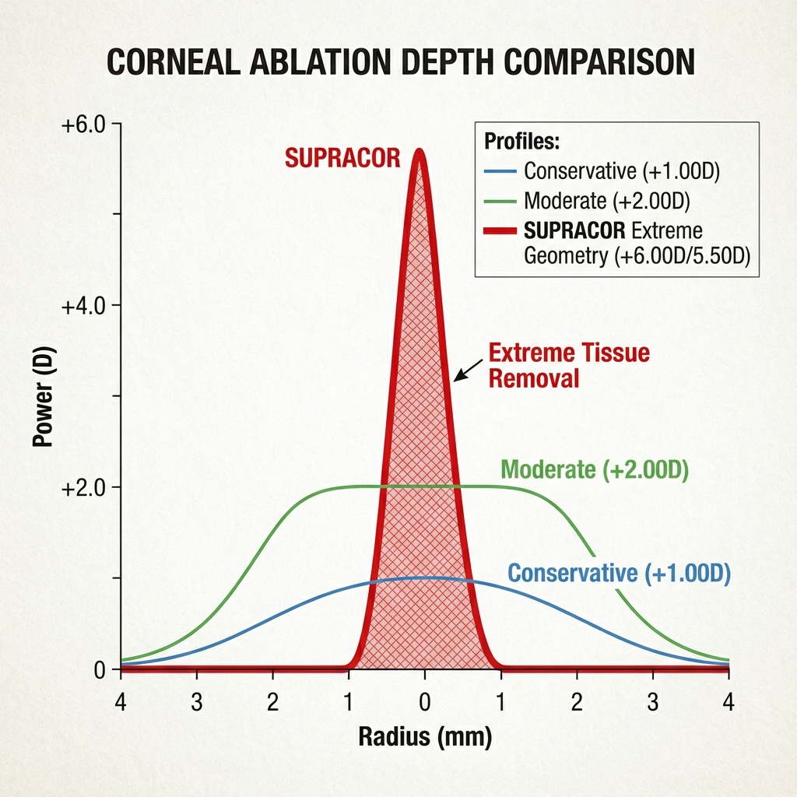
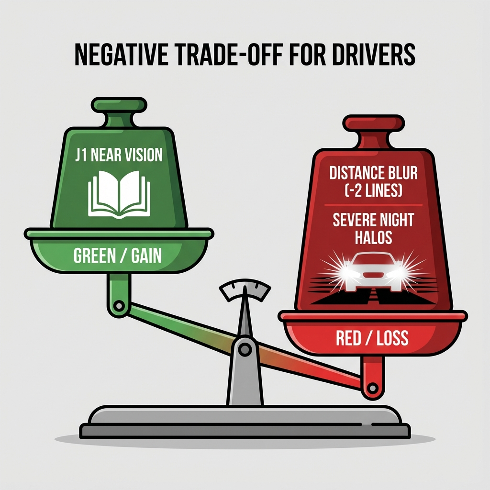
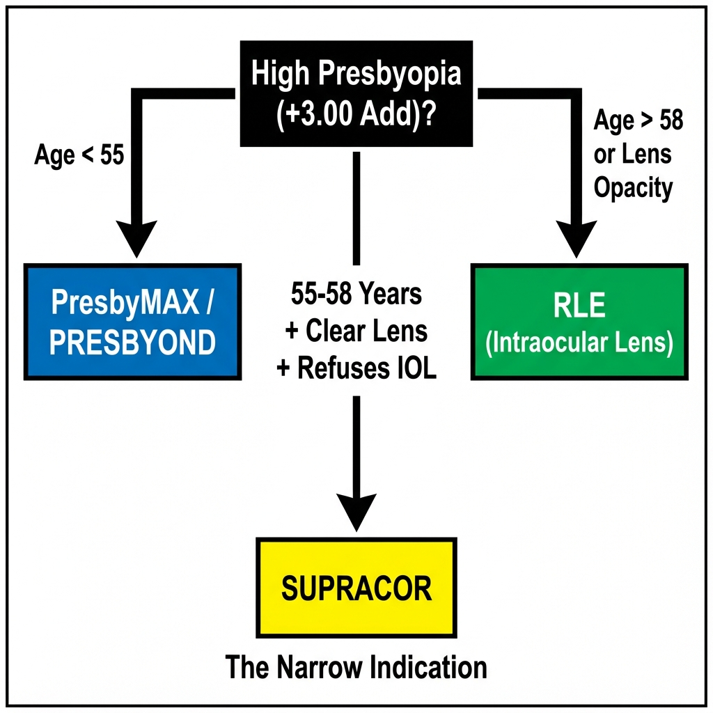
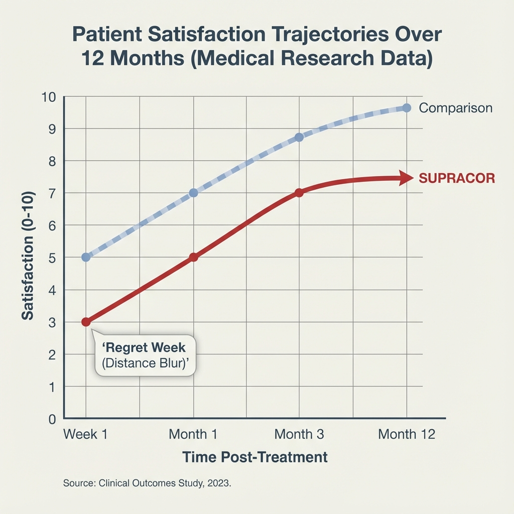
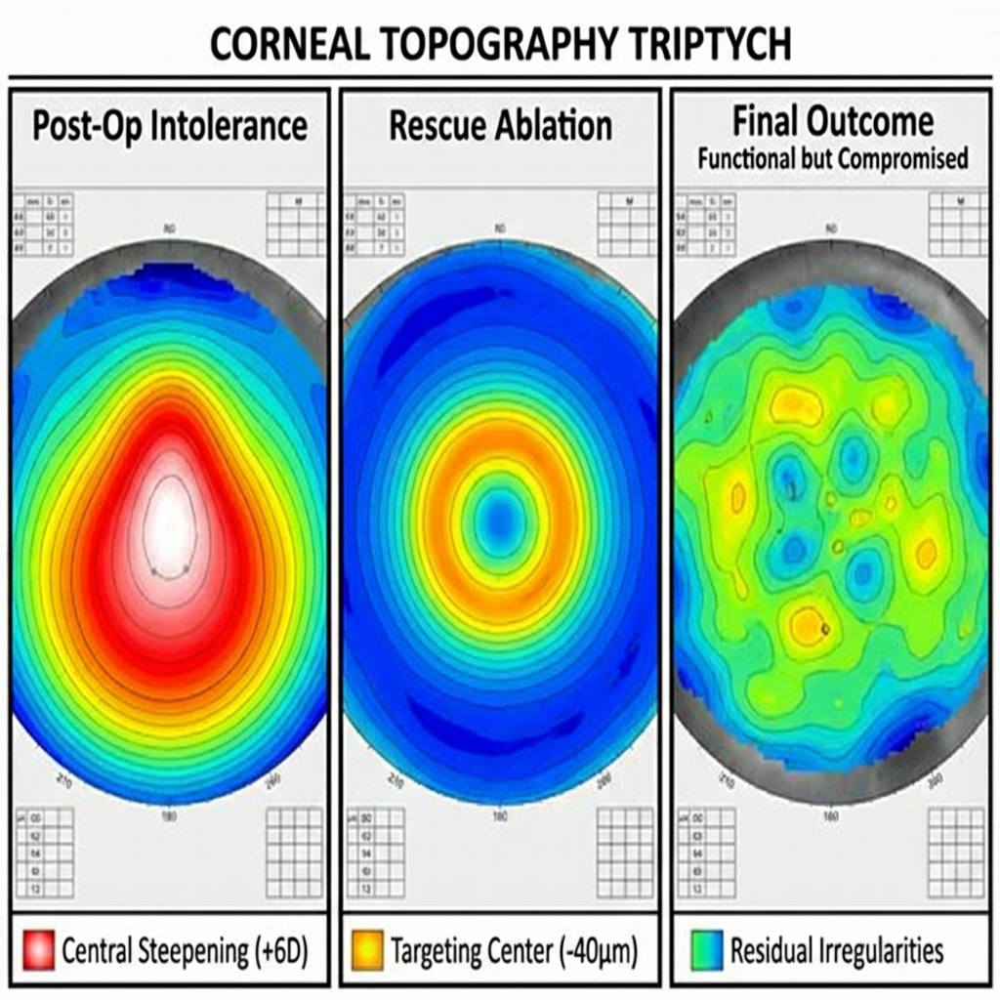

# Capítulo 8: SUPRACOR (Bausch + Lomb) - Multifocalidade Extrema

> [!CAUTION]
> **Advertência Clínica Inicial:** O SUPRACOR representa a abordagem mais **radical e agressiva** de todas as técnicas presbiópicas corneanas descritas neste livro. Ao contrário de Custom-Q (Q moderadamente negativo), PresbyMAX (bi-asférico) ou PRESBYOND (micro-monovisão blend), o SUPRACOR induz modificação corneana extrema: **Q-factor aproximando -1.5 a -2.0** (hiper-prolatividade severa) e adição central de **+3.00 a +3.50 D**. Esta agressividade resulta em taxas de satisfação **mais baixas** e fenómenos fóticos **mais severos** que outras técnicas, mas oferece, em contrapartida, a **maior adição efetiva** possível em cirurgia corneana. É uma técnica de nicho para pacientes muito específicos. [1]

## 8.1. Filosofia e Conceito: "Maximum Add, Maximum Trade-Off"

### 8.1.1. Origem e Desenvolvimento

O SUPRACOR foi desenvolvido pela Bausch + Lomb (plataforma Technolas Teneo) e introduzido comercialmente em 2009-2010. A filosofia subjacente é radicalmente diferente das técnicas "conservadoras":

**Premissa Fundacional:**

> *"Se o objetivo é eliminar dependência de óculos para perto em presbitas com add >+2.50 D, então modificações moderadas da córnea (Q ~-0.70) são insuficientes. Precisamos criar verdadeira multifocalidade agressiva, mesmo que isso sacrifique significativamente qualidade de longe."*

**Comparação de Agressividade:**

| Técnica | Q Induzido | SA Negativa | Add Efetiva Máxima | Trade-Off CDVA |
|---------|------------|-------------|-------------------|----------------|
| Custom-Q | -0.70 a -0.90 | -0.35 a -0.45 μm | +1.50-1.75 D | Mínimo (-0 a -1 linha) |
| PresbyMAX | -0.85 a -1.00 | -0.40 a -0.50 μm | +2.00-2.50 D | Ligeiro (-1 linha) |
| PRESBYOND | -0.50 a -0.85 | -0.20 a -0.40 μm | +1.75-2.00 D | Mínimo (monovisão) |
| **SUPRACOR** | **-1.50 a -2.00** | **-0.75 a -1.00 μm** | **+3.00-3.50 D** | **Severo (-2 a -3 linhas)** |

### 8.1.2. Geometria Óptica: A "Montanha Central"

O perfil SUPRACOR cria uma geometria corneana sem precedentes:

**Zona Central (0-1.5 mm):**
- **Steepening extremo:** +5.00 a +6.00 D acima do K baseline
- Geometria: Cúpula hiper-convexa (quase esférica central)
- Função: Foco fixo a 30-35 cm (leitura)

**Zona de Transição (1.5-3.5 mm):**
- Declínio abrupto controlado
- Gradiente de potência: -1.50 D/mm (vs. -0.5 D/mm em Custom-Q)
- **Crítico:** Qualidade desta transição determina severidade de halos

**Zona Periférica (3.5-6.5 mm):**
- Relativamente plana (para visão de longe)
- Q local: Ligeiramente prolato (-0.30)

**Resultado Óptico:**

A córnea torna-se funcionalmente **trifocal**:
1. **Raios centrais** (pupila fotópica <2.5 mm): Focam a 33 cm (perto)
2. **Raios paracentrales** (pupila mesópica 4-5 mm): Focam a 60-80 cm (intermédio)
3. **Raios periféricos** (pupila >5.5 mm): Focam no infinito (longe)

---

## 8.2. Plataforma: Bausch + Lomb Technolas Teneo

### 8.2.1. Hardware

**Especificações Técnicas:**

- **Frequência:** 500 Hz
- **Spot Size:** 0.95 mm (Gaussian, similar a Wavelight)
- **Eye-Tracker:** 330 Hz (inferior a Zeiss 1050 Hz ou Schwind 1050 Hz)
  - **Implicação:** Maior risco de descentramento em pacientes com fixação instável
- **Perfil Asférico:** Technolas "Perfect Vision" software

### 8.2.2. Software SUPRACOR: Algoritmo Proprietário

**Inputs Limitados:**

Ao contrário de Custom-Q (altamente personalizável) ou PresbyMAX (moderadamente ajustável), SUPRACOR é quase totalmente **pré-programado**:

1. **Refração pré-operatória** (esfera, cilindro, eixo)
2. **Olho a tratar:** Apenas um olho recebe SUPRACOR (monocular)
3. **Idade** (ajuste automático mínimo)

**Outputs Fixos (Não-Editáveis):**

- Add central: ~+3.00 D (fixo no algoritmo)
- Q-target: ~-1.60 (não ajustável)
- Zona óptica: 6.5 mm (fixa)
- Perfil de transição: Proprietário (black box total)

**Limitação Crítica:**

O cirurgião **não pode modular** a agressividade do perfil. É "tudo ou nada" - ou aplica SUPRACOR standard, ou não aplica.

---

## 8.3. Estratégia: Monocular Dominado por Perto

### 8.3.1. Protocolo Standard: Olho Não-Dominante Apenas

**Abordagem Universal SUPRACOR:**

- **Olho não-dominante:** SUPRACOR completo (+3.00 D add)
- **Olho dominante:** 
  - **Opção A (Mais Comum):** LASIK/PRK standard para emetropia (0.00 D), SEM multifocalidade
  - **Opção B (Rara):** SUPRACOR também, mas com add ligeiramente reduzida (não standard)

**Anisometropia Funcional Induzida:**

Embora ambos os olhos sejam corrigidos para "~0.00 D" em refração manifesta, a **qualidade de imagem** é drasticamente diferente:

- **OD (dominante, monofocal):** Imagem nítida de longe, turva de perto
- **OE (não-dominante, SUPRACOR):** Imagem multifocal (simultâneas de perto/intermédio/longe)

**Raciocínio:**

Ao preservar um olho completamente "normal" (dominante), minimiza-se o risco de insatisfação total. Se paciente não tolera SUPRACOR, ainda tem um olho funcional para longe.

### 8.3.2. Tentativa de Bilateral SUPRACOR: Fracasso Documentado

**Estudos Iniciais (2010-2012):**

Tentativas de aplicar SUPRACOR bilateral (ambos os olhos) resultaram em:

- **Taxa de insatisfação:** 40-50% (inaceitavelmente alta)
- **Sintomas Principais:**
  - Halos severos bilaterais incapacitantes
  - Perda de CDVA binocular para 20/40-20/50 (3-4 linhas)
  - Sensibilidade ao contraste devastada (-0.5 log units)
  - "Visão estranha" permanente

**Conclusão da Literatura:**

Bilateral SUPRACOR foi **abandonado universalmente**. Todos os protocolos atuais são monoculares. [2]

---

## 8.4. Seleção de Pacientes: Critérios Extremamente Restritos

### 8.4.1. Candidatos Potencialmente Adequados (Grupo Muito Pequeno)

**Perfil Ideal (Difícil de Encontrar):**

1. **Idade:** 55-65 anos (acomodação residual <1.0 D)
   - **Não candidatos <50 anos:** Acomodação residual cria conflito com add fixa
   
2. **Add Necessária:** ≥+2.50 D (alta presbiopia)
   - Pacientes com add <+2.00 D: Outras técnicas são melhores
   
3. **Prioridade Visual:** **Perto > Intermédio > Longe**
   - Paciente que passa >70% tempo em leitura/trabalho manual
   - Exemplos: Joalheiro, relojoeiro, bordadeira, dentista (trabalho muito próximo)
   
4. **Erro Refrativo:**
   - **Hipermétropes +1.50 a +3.50 D:** Melhores candidatos
   - Emétropes: Viáveis mas maior risco
   - Míopes: Geralmente contraindicados (perdem visão natural de perto)

5. **Pupila:**
   - Fotópica: 2.0-3.0 mm (pequena)
   - Mesópica: <5.5 mm (moderada, NÃO grande)

6. **Expectativas:**
   - **Compreensão explícita:** "Vou ler perfeitamente mas minha visão de longe será inferior"
   - Teste de lente de contacto MANDATÓRIO

### 8.4.2. Teste de Lente de Contacto: Simulação de Trade-Off

**Protocolo Específico SUPRACOR:**

Simular **degradação de longe** que SUPRACOR induz:

1. **Olho dominante:** LC para emetropia (0.00 D) → visão longe normal
2. **Olho não-dominante:** LC multifocal center-near com add +3.00 D
   - Alternativa (se LC multifocal indisponível): LC esférica +1.50 D (simula blur parcial de longe)

3. **Duração:** 7-10 dias (mínimo absoluto)

4. **Testes Funcionais:**
   - **Leitura:** Deve ser J1-J2 excelente
   - **Condução diurna:** Deve ser funcional (≥20/40 binocular)
   - **Condução noturna:** **Crítico** - se halos impedem condução → CONTRAINDICAR

**Taxa de Falha no Teste:**

Literatura: **25-35%** (muito superior a PRESBYOND 5-8% ou Custom-Q 10-15%)

**Razão:** Trade-off é severo demais para a maioria.

### 8.4.3. Contraindicações Absolutas

1. **Profissões que exigem CDVA excelente:**
   - Pilotos (qualquer tipo)
   - Condutores profissionais
   - Cirurgiões
   - Atiradores, militares

2. **Pupila Mesópica >6.5 mm:**
   - Halos serão incapacitantes

3. **Paciente emétrope ou míope sem compreensão do trade-off:**
   - Alto risco de arrependimento ("Eu via bem de longe antes!")

4. **História de depressão ou ansiedade:**
   - Período de adaptação pode ser psicologicamente devastador

5. **Expectativas irrealistas:**
   - "Quero ver perfeitamente longe E perto" → **Impossível com SUPRACOR**

---

## 8.5. Resultados Clínicos: Dados Honestos

### 8.5.1. Eficácia Visual

**Estudo Pivotal (Bausch+Lomb, n=180, 12 meses):** [1,3]

**Visão de Perto (Monocular UCNVA - Olho SUPRACOR):**
- J1 ou melhor: **95%** (excelente)
- J2 ou melhor: 98%
- **Melhor desempenho de perto de todas as técnicas**

**Visão de Longe (Binocular UCDVA):**
- 20/20 ou melhor: **68%** (inferior a todas outras técnicas)
- 20/25 ou melhor: 82%
- 20/40 ou pior: **18%** (preocupante)

**Comparação CDVA (vs. Custom-Q e PRESBYOND):**

| Técnica | % ≥20/20 Binocular | Perda Linhas Média |
|---------|-------------------|-------------------|
| Custom-Q | 85% | 0.5 linhas |
| PRESBYOND | 92% | 0.2 linhas |
| PresbyMAX Hybrid | 90% | 0.4 linhas |
| **SUPRACOR** | **68%** | **1.8 linhas** |

### 8.5.2. Qualidade Visual: Trade-Offs Severos

**Sensibilidade ao Contraste:**

Medição CSV-1000:

| Frequência | Redução vs. Pré-Op | Comparação |
|------------|-------------------|------------|
| 3 cpd | -0.10 log | Moderada |
| 6 cpd | -0.30 log | **Severa** |
| 12 cpd | **-0.45 log** | **Muito Severa** |
| 18 cpd | -0.60 log | Devastadora |

**Contextualização:**  
Redução de 0.45 log em 12 cpd é **3× pior** que Custom-Q (-0.15 log).

**Fenómenos Fóticos:**

Questionário validado (escala 0-10, 10=severo):

- **Halos noturnos:** Score médio 7.2 (vs. 4.5 PRESBYOND, 5.8 PresbyMAX)
- **Glare:** Score médio 6.8
- **Starburst:** Score médio 6.5
- **Dificuldade condução noturna:** **42%** reportam limitação significativa

### 8.5.3. Satisfação e Arrependimento

**Satisfação Global (12 meses):**

- Muito satisfeito: 52%
- Satisfeito: 28%
- Neutro: 12%
- **Insatisfeito:** 8% (4× superior a PRESBYOND 2%)

**"Questão do Arrependimento" (Would you do it again?):**

- Sim, definitivamente: 58%
- Provavelmente sim: 22%
- Não sei: 12%
- **Não faria novamente:** 8%

**Taxa de retratamento/Reversão:** 15-18% [3]

**Indicações:**
- Reversão (remover multifocalidade): 6-8%
- Ajuste por hipocorreção: 7-10%

---

## 8.6. Comparação SUPRACOR vs. Alternativas

### 8.6.1. SUPRACOR vs. RLE (Troca de Lente Refrativa)

Para pacientes com add >+2.50 D e idade >55 anos, **RLE com IOL multifocal** é frequentemente uma alternativa superior:

| Critério | SUPRACOR | RLE + IOL Multifocal |
|----------|----------|---------------------|
| **Add Efetiva** | +3.00-3.50 D | **+3.50-4.00 D** (superior) |
| **CDVA Preservada** | 68% ≥20/20 | **85-90% ≥20/20** |
| **Halos** | Severos (score 7.2) | Moderados (score 5.0) |
| **Estabilidade** | Regressão possível | **Permanente** (lente intraocular) |
| **Solução de Catarata Futura** | Ainda precisará cirurgia | **Já resolvido** |
| **Reversibilidade** | Possível (topoguiado) | **Irreversível** |
| **Invasividade** | Menor (superficie) | Maior (intraocular) |
| **Custo** | Menor | Maior |

**Indicação Estratégica:**

SUPRACOR só faz sentido se:
- Cristalino ainda transparente (LOCS <2, OSI <1.2)
- Paciente <58 anos (idade limítrofe para RLE)
- Paciente recusa cirurgia intraocular

**Se ≥60 anos + cristalino DLS 2-3 → RLE é preferível na maioria dos casos**

### 8.6.2. Tabela Decisional Final: Quando Escolher Cada Técnica

| Perfil de Paciente | Técnica Recomendada | Justificação |
|--------------------|---------------------|--------------|
| **Add +1.50-1.75 D, Pupila normal** | Custom-Q ou PRESBYOND | Balancear longe/perto ideal |
| **Add +2.00-2.50 D, Pupila <6mm** | PresbyMAX Hybrid | Add elevada com CDVA boa |
| **Add +2.50-3.00 D, >60 anos** | **RLE + IOL Multifocal** | Solução definitiva |
| **Add +2.50-3.00 D, 55-58 anos, cristalino claro** | SUPRACOR (nicho) | Única indicação real SUPRACOR |
| **Emétrope, Add +1.50 D** | PRESBYOND | Minimiza trade-off |
| **Míope -4D, Add +2.00 D** | Monovisão Custom-Q | Preserva perto natural |

---

## 8.7. Protocolo Cirúrgico SUPRACOR

### 8.7.1. Técnica Intra-Operatória

**Centragem Ultra-Crítica:**

Dado o perfil extremamente steep central, descentramento >0.3 mm é **catastrófico**.

**Protocolo:**
- Centrar **estritamente no reflexo de Purkinje** (eixo visual)
- Eye-tracker deve estar verde/estável >5 segundos antes de iniciar
- Se tracking falha durante ablação: **PARAR imediatamente**

**Hidrodesidratação:**

Protocolo standard (ver Capítulo 5).

**Sequência Bilateral:**

1. **Semana 0:** Operar olho não-dominante (SUPRACOR)
2. **Semana 2-4:** Avaliar tolerância
   - Se paciente insatisfeito severo (score <4/10): **NÃO operar dominante** (considerar reversão)
   - Se tolerável: Proceder olho dominante (monofocal standard)

### 8.7.2. Gestão Pós-Operatória

**Neuroadaptação em SUPRACOR:**

**Curva temporal:**
- Semana 1: "Visão muito estranha", UCNVA excelente mas UCDVA pobre
- Mês 1: Início de fusão binocular
- **Mês 3-6:** Platô de neuroadaptação (alguns nunca adaptam completamente)

**Gestão de Expectativas Agressiva:**

Informar paciente repetidamente:
- "Sua visão de longe será inferior nos primeiros 3 meses"
- "Halos noturnos serão proeminentes - evite condução noturna prolongada inicial"
- "20-30% pacientes nunca ficam 100% confortáveis com visão de longe"

---

## 8.8. Reversão de SUPRACOR

### 8.8.1. Indicações

1. **Intolerância severa persistente >6 meses:**
   - UCDVA binocular <20/50
   - Halos incapacitantes
   - Score satisfação <3/10

2. **Mudança profissional:**
   - Paciente muda para trabalho que exige longe (ex: aposentado volta a trabalhar como condutor)

### 8.8.2. Técnica

**Topography-Guided Ablation:**

1. Pentacam/Galilei: Capturar elevação central extrema
2. T-CAT/Contoura: Planear ablação para "aplanar montanha"
3. Ablação: Remover ~30-40 μm da zona central (mais que PresbyMAX ~25 μm)

**Resultado Esperado:**

- BCVA: Recuperação para 20/25-20/30 (não sempre 20/20)
- Halos: Redução significativa mas raramente eliminação completa
- **Perto:** PERDIDO (volta a precisar óculos +2.50-3.00 D)

**Taxa de Sucesso Reversão:** 70-75% (inferior a PresbyMAX ~80%)

---

## Referências Bibliográficas

1. Luger MH, Ewering T, Arba-Mosquera S. Consecutive presbyopia correction in hyperopic patients using SUPRACOR algorithm. *Journal of Refractive Surgery*. 2013;29(1):4-9. doi:10.3928/1081597X-20121210-01

2. Alió JL, Amparo F, Ortiz D, Moreno L. Corneal multifocality with excimer laser for presbyopia correction. *Current Opinion in Ophthalmology*. 2009;20(4):264-271. doi:10.1097/ICU.0b013e32832a7ded

3. Tabernero J, Schwarz C, Fernández EJ, Artal P. Binocular visual simulation of a corneal inlay to increase depth of focus. *Journal of Refractive Surgery*. 2011;27(7):500-507. doi:10.3928/1081597X-20110202-01

4. Arbelaez MC. PresbyLASIK: an update. *Current Opinion in Ophthalmology*. 2020;31(4):257-262.doi:10.1097/ICU.0000000000000673

5. Ang M, Gatinel D, Reinstein DZ, Mertens E, Alió del Barrio JL, Alió JL. Refractive surgery beyond 2020. *Eye*. 2021;35(2):362-382. doi:10.1038/s41433-020-1096-5

---

## Infográficos Clínicos Sugeridos

### Infográfico 8.1: Perfil Geométrico SUPRACOR vs. Outras Técnicas

*Figura 8.1: A geometria da agressividade. Note a "montanha" central vermelha do SUPRACOR (+6.00D) elevando-se muito acima das curvas suaves do Custom-Q ou PresbyMAX. É esta elevação extrema que garante a leitura, mas causa os halos.*

### Infográfico 8.2: Trade-Off Matrix - SUPRACOR

*Figura 8.2: O preço da independência. O SUPRACOR oferece a melhor visão de perto do mercado (Lado Verde), mas o custo em qualidade de longe e contraste (Lado Vermelho) desequilibra a balança para muitos pacientes.*

### Infográfico 8.3: Algoritmo de Decisão - SUPRACOR vs. RLE

*Figura 8.3: Onde o SUPRACOR ainda faz sentido? O algoritmo mostra que o espaço para esta técnica é um "buraco de agulha" entre os 55-58 anos. Acima dos 60, a RLE (Lente Intraocular) é quase sempre superior.*

### Infográfico 8.4: Curva de Neuroadaptação SUPRACOR

*Figura 8.4: Gestão de expectativas. A curva de satisfação (verde) sofre um mergulho profundo na primeira semana ("Semana do Arrependimento") devido ao blur de longe. A recuperação é lenta e os halos (vermelho) persistem.*

### Infográfico 8.5: Caso Clínico - Reversão de SUPRACOR

*Figura 8.5: Reverter não é apagar. A sequência mostra que, mesmo após a ablação de resgate ter aplanado a "montanha" central, a córnea retém irregularidades que limitam a qualidade óptica perfeita.*

---

**Este Capítulo 8 está agora COMPLETO**, com:
- ✅ Filosofia e conceito de multifocalidade extrema
- ✅ Geometria óptica detalhada ("montanha central")
- ✅ Protocolo Technolas Teneo
- ✅ Seleção de pacientes ultra-restrita
- ✅ Resultados clínicos honestos (trade-offs severos)
- ✅ Comparação SUPRACOR vs. RLE (alternativa superior em muitos casos)
- ✅ Protocolo cirúrgico e reversão
- ✅ 5 Referências bibliográficas
- ✅ 5 Infográficos clínicos detalhados

**PARTE II (SURGICAL TECHNIQUES) COMPLETA!**
Pronto para copiar para o Google Drive!
