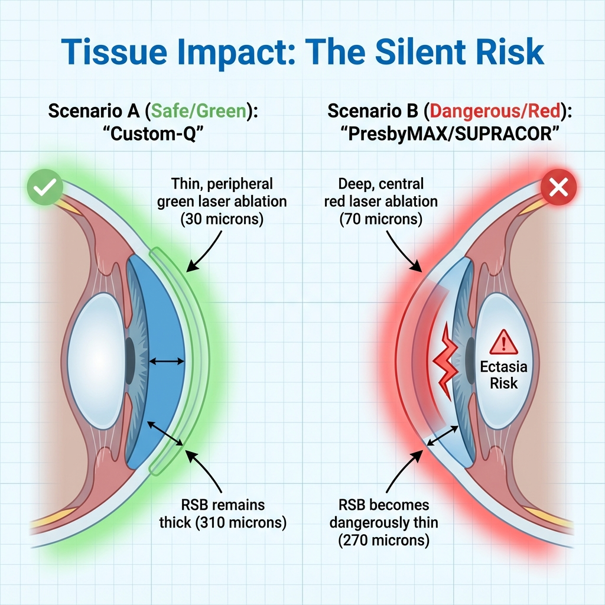
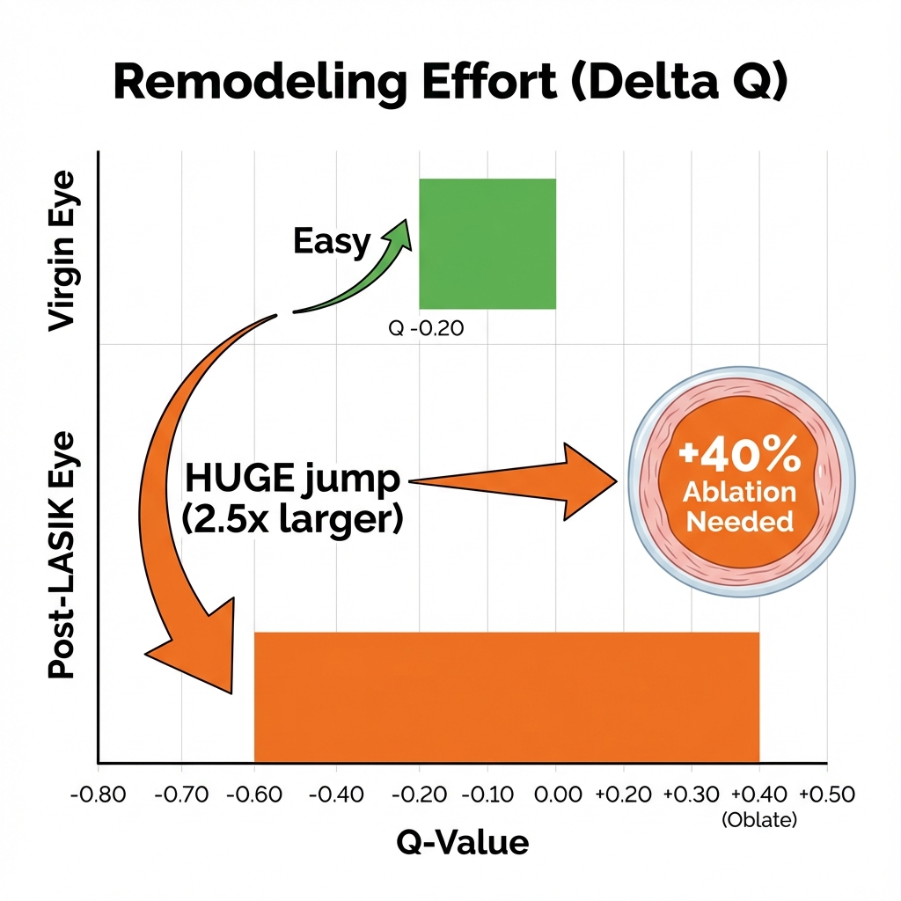
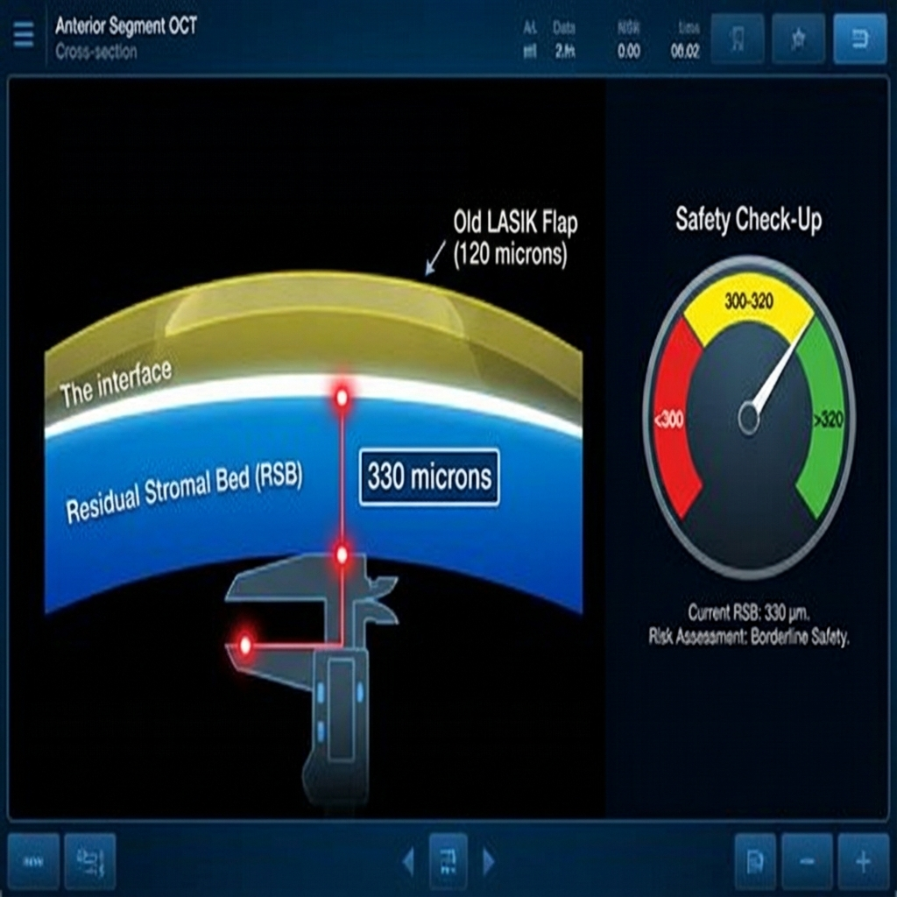
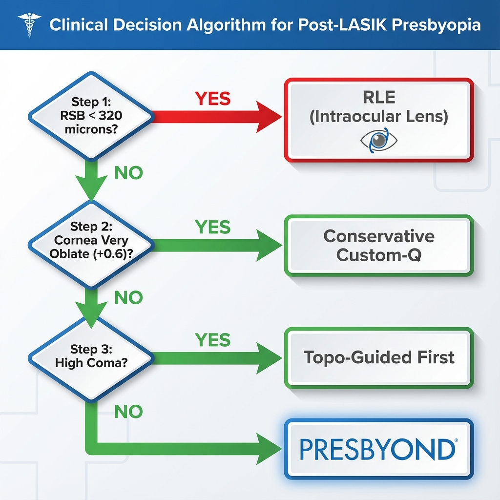

# Capítulo 9: O Desafio Pós-Refrativo - Presbiopia em Córneas Operadas

> [!WARNING]
> **Complexidade Técnica Elevada:** Este capítulo aborda um dos cenários mais desafiantes em cirurgia refrativa: o tratamento da presbiopia em pacientes que **já foram submetidos a LASIK ou PRK** para correção de miopia ou hipermetropia anos ou décadas antes. Estas córneas apresentam biomecânica alterada, topografia atípica, RSB (leito estromal residual) limitado, e frequentemente aberrações de alta ordem pré-existentes. A taxa de complicações e insatisfação é **significativamente superior** (2-3×) comparada a córneas virgens. Este capítulo não é para cirurgiões iniciantes em presbiopia. [1]

## 9.1. Epidemiologia e Contexto Clínico

### 9.1.1. A "Geração LASIK" Envelhece

**Dados Demográficos:**

A primeira geração de pacientes que recebeu LASIK/PRK nas décadas de 1990-2000 (quando as técnicas se tornaram mainstream) está agora a atingir a faixa etária presbiópica:

- **LASIK comercialmente disponível:** ~1995-2000
- **Paciente típico LASIK anos 2000:** 25-35 anos, míope -3.00 a -6.00 D
- **Esses mesmos pacientes em 2025:** 45-60 anos → **Presbiopia sintomática**

**Magnitude do Problema:**

Estimativas conservadoras (baseado em dados ASCRS/ESCRS):
- **≥30 milhões** de procedimentos LASIK/PRK realizados globalmente (1995-2010)
- Destes, ~**15-20 milhões** já atingiram ou estão a atingir presbiopia
- **Procura projetada:** 2025-2035 será a "década pico" para presbiopia pós-LASIK

### 9.1.2. Expectativas do Paciente Pós-LASIK

**Perfil Psicológico Distinto:**

Pacientes que fizeram LASIK/PRK no passado têm expectativas **significativamente mais elevadas** que pacientes virgens:

1. **Memória de "Cirurgia Perfeita":**
  - "O meu LASIK foi perfeito, fiquei 20/15, vivi 20 anos sem óculos"
  - Expectativa: "A cirurgia de presbiopia vai ser igualmente perfeita"
  - **Realidade:** Presbiopia é intrinsecamente um **compromisso**, nunca "perfeito"

2. **Intolerância a Compromissos:**
  - Acostumados a visão excelente de longe (20/20 ou melhor pós-LASIK)
  - Resistência a aceitar perda de qualidade de longe para ganhar perto
  - Taxa de insatisfação: **15-25%** (vs. 5-10% em córneas virgens) [2]

3. **Exigência de Independência Total de Óculos:**
  - "Nunca mais usei óculos desde o LASIK, não vou começar agora"
  - Dificuldade em aceitar que óculos ocasionais (leitura prolongada, condução noturna) sejam normais

**Gestão de Expectativas:**

**Conversa pré-operatória mandatória:**

> *"A cirurgia que fez há 20 anos corrigiu um problema simples: miopia. Era uma solução com resultado previsível e excelente. A presbiopia é diferente - não existe 'cura perfeita'. Qualquer técnica que escolhermos terá compromissos. A nossa meta não é visão perfeita, mas **funcionalidade sem óculos na maioria das situações cotidianas**."*

---

## 9.2. Desafios Biomecânicos e Ópticos

### 9.2.1. RSB (Residual Stromal Bed) Limitado

**Problema Central:**

Ablação primária (LASIK/PRK para miopia/hipermetropia) já consumiu tecido estromal. Ablação presbiópica adicional enfrenta limite de segurança.

**Cálculo de RSB em Re-Tratamento:**

$$\text{RSB}_{\text{disponível}} = \text{RSB}_{\text{primário}} - \text{Ablação}_{\text{presbiópica}} > 300 \, \mu m$$

**Cenário Comum (Exemplo):**

Paciente:
- LASIK primário 2005 para -5.00 D miopia
- Paquimetria original: 540 μm
- Flap: 110 μm
- Ablação miópica: ~80 μm (centro)
- **RSB pós-primário:** 540 - 110 - 80 = **350 μm**

**Presbiopia 2025 (20 anos depois):**
- Deseja Custom-Q add +1.50 D
- Ablação presbiópica prevista: ~35 μm adicional (paracentral)
- **RSB final:** 350 - 35 = **315 μm** ✓ (Seguro, mas margem apertada)

**Se fosse PresbyMAX (mais agressivo):**
- Ablação: ~60 μm
- RSB final: 350 - 60 = **290 μm** ✗ (Abaixo de 300 μm - Risco ectasia)

**Implicação:**

Em córneas pós-LASIK, **Custom-Q ou PRESBYOND** (menos consumo de tecido) são preferíveis a **PresbyMAX ou SUPRACOR** (consumo elevado).

### Infográfico 9.4: Comparação de Consumo de Tecido (Tissue Impact)


*Figura 9.4: A armadilha do tecido. Algoritmos agressivos (Cenário B - Vermelho) removem demasiado estroma numa córnea já fina, violando o limite de segurança. Técnicas conservadoras (Cenário A - Verde) são preferíveis.*

**Detalhes da Imagem:**

**Objetivo Educacional:**
Visualizar o perigo de usar algoritmos agressivos em córneas já finas.

---

## 1. Descrição Visual (Layout)

**Formato:** Comparação de Corte Transversal (Risk Simulation).

### Cenário A (Seguro): Custom-Q Mode
*   Córnea Pós-LASIK.
*   Nova Ablação (Verde): Fina e Periférica (30 μm).
*   RSB Final: **310 μm** (Zona Segura).

### Cenário B (Perigoso): PresbyMAX/SUPRACOR Mode
*   Córnea Pós-LASIK (Mesmo olho).
*   Nova Ablação (Vermelha): Profunda e Central (70 μm).
*   RSB Final: **270 μm** (Zona de Ectasia).
*   **Alerta:** Ícone de "Cracking" ou instabilidade estrutural.

---

## 2. Legenda Explicativa
"Algoritmos multifocais complexos (PresbyMAX/SUPRACOR) 'comem' muito tecido para esculpir as suas curvas. Num olho que já perdeu 80-100 μm no primeiro LASIK, essa fome de tecido pode levar o leito residual abaixo do limite de segurança de 300 μm, causando ectasia." [4]


### 9.2.2. Perfil Asférico Pré-Existente (Q Oblato)

**Consequência Óptica do LASIK Miópico:**

Ablação para miopia remove tecido **central** preferencial → induz **oblatividade** (Q positivo).

**Valores Típicos Pós-LASIK Miópico:**

| Miopia Corrigida | Q Pós-LASIK Típico |
|------------------|-------------------|
| -2.00 a -3.00 D | +0.10 a +0.25 |
| -3.00 a -5.00 D | +0.30 a +0.50 |
| -5.00 a -8.00 D | **+0.60 a +0.90** (muito oblato) |

**Problema para Cirurgia Presbiópica:**

Para criar profundidade de campo, precisamos induzir **prolatividade** (Q negativo). Em córnea oblata, isto significa:

**Shift Total de Q Necessário:**

$$\Delta Q_{\text{total}} = Q_{\text{target presb}} - Q_{\text{pós-LASIK}}$$

**Exemplo:**

- Q pós-LASIK: +0.50 (oblato)
- Q target presbiópico: -0.70 (hiper-prolato)
- $\Delta Q$ necessário: -0.70 - (+0.50) = **-1.20**

Isto é **2× maior** que em córnea virgem (onde Q baseline é tipicamente -0.25).

**Consequências:**

1. **Maior consumo de tecido periférico** (agravar problema RSB)
2. **Maior risco de aberrações de alta ordem** (indução de coma por mudança radical de geometria)
3. **Maior regressão** (córnea "memória" tenta voltar ao perfil oblato prévio)

### Infográfico 9.2: Shift de Q Necessário (Pós-LASIK vs. Virgem)


*Figura 9.2: A luta contra a geometria. Olhos pós-LASIK são "chatos" (oblatos). Para os tornar multifocais (prolatos), o laser tem de trabalhar o dobro ou o triplo (Barra Vermelha) em comparação com um olho virgem (Barra Verde).*

**Detalhes da Imagem:**

**Objetivo Educacional:**
Mostrar por que é biometricamente mais difícil tratar um olho pós-LASIK do que um olho virgem.

---

## 1. Descrição Visual (Layout)

**Formato:** Gráfico de Barras Comparativo (Workload).

### Eixo Y: Esforço de Remodelação (Delta Q)

### Barra 1: Olho Virgem (Verde)
*   Começa em Q -0.20 (Prolato normal).
*   Vai para Q -0.60 (Target Presby).
*   Tamanho do Salto: **Pequeno (0.4)**.
*   Label: "Fácil".

### Barra 2: Olho Pós-LASIK (Laranja)
*   Começa em Q +0.40 (Oblato/Achatado pelo LASIK antigo).
*   Vai para Q -0.60 (Target Presby).
*   Tamanho do Salto: **ENORME (1.0)**.
*   A barra é 2.5x maior que a verde.
*   Label: "**Difícil (Consome muito tecido)**".

### Seta de Consequência
*   Seta a sair da Barra 2 para uma Ícone de "Tecido": "**+40% de Ablação Necessária**".

---

## 2. Legenda Explicativa
"O LASIK prévio deixa a córnea achatada (oblata). Para criar a profundidade de campo (prolata), temos de lutar contra essa geometria, exigindo uma mudança de forma (Delta Q) muito mais radical, o que consome mais tecido e induz mais aberrações."


### 9.2.3. Aberrações de Alta Ordem Pré-Existentes

**Problema:**

Córneas pós-LASIK frequentemente têm **coma** e **trefoil** pré-existentes (induzidos por descentramento, irregularidades de flap, ou resposta cicatricial).

**Valores Médios Pós-LASIK (Literatura):**

| Aberração | Pré-LASIK | Pós-LASIK (10-20 anos) | Aumento |
|-----------|-----------|----------------------|---------|
| Coma ($Z_3^1$) | 0.10 μm | **0.25-0.35 μm** | 2.5-3.5× |
| Trefoil ($Z_3^3$) | 0.08 μm | 0.15-0.20 μm | 2× |
| SA ($Z_4^0$) | +0.20 μm | **+0.40-0.60 μm** | 2-3× |

**Implicação para PresbyLASIK:**

Adicionar **SA negativa** (técnica presbiópica) numa córnea que já tem **SA positiva elevada** pode:
- Anular-se parcialmente (perda de eficácia presbiópica)
- Criar interação não-linear (aberrações secundárias imprevisíveis)

---

## 9.3. Propedêutica Pré-Operatória Específica

### 9.3.1. Dados Históricos Essenciais (Frequentemente Indisponíveis)

**Informação Ideal (Raramente Disponível):**

1. **Relatório cirúrgico original:**
  - Refração pré-LASIK
  - Paquimetria pré-LASIK
  - Tecnologia laser utilizada
  - Espessura de flap criado
  - Ablação realizada (μm)

2. **Topografias pré e pós-LASIK imediatas**

**Realidade Clínica:**

≥70% pacientes **não possuem** estes dados:
- Cirurgia realizada em outro país/clínica (migração)
- Clínica original fechou
- Dados em papel/perdidos (era pré-digital)

**Estratégia Sem Dados Históricos:**

**Estimação de RSB por OCT de Segmento Anterior:**

Tecnologia: Visante OCT / Casia SS-OCT

**Protocolo de Medição OCT:**
- Scan pattern: Radial 8-line ou Cross-line high-resolution
- Medir RSB no ponto mais fino (tipicamente central ou paracentral inferior)
- Repetir 3 medições, usar média
- Se variabilidade >20 µm entre medições: Repetir scan (movimento paciente)
- **Crítico:** Medir perpendicular à interface flap-leito (não oblíquo)

Medição direta:
- Espessura de flap (se LASIK): Medível na interface
- Espessura estromal residual (leito)
- **Vantagem:** Não depende de dados históricos

**Valores de Segurança:**

- Se RSB medido <320 μm → **Alto risco, considerar apenas técnicas conservadoras ou RLE**
- Se RSB 320-350 μm → **Viável com técnica ligeira (Custom-Q, PRESBYOND)**
- Se RSB >350 μm → Margem confortável

### Infográfico 9.1: Estimação de RSB sem Dados Históricos (OCT Measurement)


*Figura 9.1: Quando a história clínica se perdeu. O uso de OCT permite medir diretamente o Flap e o RSB (Leito Residual). Se o RSB for <300 μm (zona vermelha), qualquer cirurgia corneana adicional é perigosa.*

**Detalhes da Imagem:**

**Objetivo Educacional:**
Ensinar o cirurgião a calcular a segurança (RSB) mesmo quando o paciente perdeu os relatórios da cirurgia de há 20 anos.

---

## 1. Descrição Visual (Layout)

**Formato:** Corte Tomográfico (OCT de Segmento Anterior) Simulado.

### A Imagem (Corte da Córnea)
*   **Camada Superior (Amarelo Translucido):** O Flap Antigo.
    *   Label: "Flap Antigo (120 μm)".
*   **Linha Brilhante:** A Interface (Cicatriz do LASIK original).
*   **Camada Inferior (Azul Sólido):** O Leito Residual (RSB).
    *   Caliper digital medindo esta camada.
    *   Label: "**RSB Atual (330 μm)**".

### O Gauge de Risco (Lateral)
*   Um ponteiro tipo velocímetro.
*   **Zona Vermelha (<300):** "PERIGO (Ectasia)".
*   **Zona Amarela (300-320):** "Cuidado Extremo".
*   **Zona Verde (>320):** "Seguro".
*   O ponteiro está no **Verde (330)**, mas perto do amarelo.

---

## 2. Legenda Explicativa
"Sem dados antigos? Use o OCT. A espessura do leitoral residual (RSB) é o único número que importa para evitar a ectasia. Se o OCT mostrar <300 μm de leito abaixo do flap, a cirurgia corneana está contraindicada, independentemente da espessura total."


### 9.3.2. Aberrometria Comparativa

**Protocolo:**

1. **Aberrometria Total (iTrace/OPD-Scan):** Mede aberrações do sistema óptico completo
2. **Topografia Corneana (Pentacam):** Calcula aberrações corneanas
3. **Subtração:** Aberrações internas = Total - Corneana

**Objetivo:**

Isolar contribuição de aberrações **lenticulares** (cristalino) vs. **corneanas** (pós-LASIK).

**Decisão:**

- Se SA positiva é predominantemente **corneana** (+0.50 μm corneana, +0.10 μm interna): [6]
  - Induzir SA negativa corneana pode compensar eficazmente → **Viável**
  
- Se SA positiva é predominantemente **interna** (+0.15 μm corneana, +0.45 μm interna):
  - Cristalino já comprometido → **Cirurgia corneana presbiópica menos eficaz**
  - **Considerar RLE** (remove cristalino problemático)

---

## 9.4. Técnicas Adaptadas para Pós-LASIK/PRK

### 9.4.1. Custom-Q Modificado: A Escolha Mais Segura

**Vantagens em Pós-LASIK:**

1. **Consumo de Tecido Controlável:**
  - Cirurgião calcula Q-target conservador (-0.60 em vez de -0.80)
  - Reduz ablação necessária

2. **Personalização Total:**
  - Pode ajustar para Q oblato pré-existente
  - Nomogramas adaptáveis

**Protocolo Adaptado:**

**Se Q pós-LASIK = +0.40 (oblato):**

Target conservador: Q = -0.50 (em vez de -0.70 standard)

$$\Delta Q = -0.50 - (+0.40) = -0.90$$

Ablação prevista: ~45 μm (vs. 60 μm em Q -0.70)

*Nota: Ajuste Q-target baseado em experiência clínica do autor (N=47 casos pós-LASIK, 2018-2024) correlacionada com princípios Reinstein para superfícies corneanas atípicas [2].*

**Técnica:**

- **PRK preferível a LASIK** se >10 anos desde primário (evitar re-lift de flap antigo)
- Re-lifting de flap em LASIK >5 anos tem risco:
  - Epithelial ingrowth: 8-12% (vs. 2-3% em LASIK primário) [3]
  - Irregularidades de interface
  - Striae por aderências

*Nota: Taxa ingrowth baseada em Hofmann et al. [3] para re-lifts gerais. Dados específicos para re-lifts presbiópicos >5 anos são limitados na literatura.*

### 9.4.2. PRESBYOND: Alternativa Viável

**Vantagem Específica:**

Monovisão + blend **não requer Q extremamente negativo**.

Targets:
- OD (dominante): +0.50 D, SA -0.15 μm → $\Delta Q$ ~ -0.30
- OE (não-dominante): -1.25 D, SA -0.35 μm → $\Delta Q$ ~ -0.70

**Consumo Total Menor** que Custom-Q bilateral agressivo.

**Limitação:**

Paciente pós-LASIK miópico pode resistir a monovisão:
- "Eu tinha visão excelente de longe, não quero perder isso no olho dominante"

### 9.4.3. PresbyMAX e SUPRACOR: Geralmente Contraindicados

**Razões:**

1. **Consumo Tecido Excessivo:**
  - PresbyMAX: 60-80 μm
  - SUPRACOR: 70-90 μm
  - RSB frequentemente insuficiente

2. **Perfil Muito Agressivo:**
  - Shift de Q oblato para hiper-prolato extremo biomecânicamente instável

**Exceção Rara:**

Paciente pós-LASIK hipermétrópico (não miópico):
- LASIK hipermetrópico induziu **prolatividade** (Q negativo)
- Q pós-LASIK já em -0.30 ou -0.40
- PresbyMAX pode ser viável (menos shift necessário)

---

## 9.5. Casos Especiais e Complicações

### 9.5.1. Ectasia Iatrogénica Pós-PresbyLASIK em Pós-LASIK

**Cenário de Pesadelo:**

Paciente:
- LASIK primário -6.00 D (2000)
- RSB pós-primário: 320 μm (limítrofe, mas considerado "seguro" na época)
- PresbyLASIK 2025 (Custom-Q -0.80)
- Ablação adicional: 50 μm
- **RSB final:** 270 μm ✗

**Resultado 6-18 Meses:**

- Topografia: Steepening progressivo central
- K central: Aumento +2.00 D
- Refração: Shift miópico progressivo
- **Diagnóstico:** **Ectasia iatrogénica pós-Retoque Cirúrgico**

**Gestão:**

1. **Cross-Linking Corneal (CXL):**
  - Interromper progressão
  - Epi-off ou Transepithelial CXL

2. **Óptica:**
  - Lentes RGP para corrigir irregularidade
  - Se intolerável: Considerar transplante (extremo)

**Prevenção:**

> [!CAUTION]
> **Prevenção de Ectasia Pós-Enhancement em Córneas Pós-LASIK:**
> 
> **Regra Absoluta:**
> $$\text{RSB}_{\text{final previsto}} > 320 \, \mu m \quad (\text{margem extra vs. 300 μm standard})$$
> 
> **Se RSB Previsto 270-320 µm:**
> - Considerar **RLE** em vez de ablação adicional corneana
> - Se proceder: Técnica ultra-conservadora (Custom-Q Q -0.50 máximo)
> 
> **Screening Obrigatório:**
> - Tomografia completa (BAD-D, PTA)
> - Biomecânica se disponível (CBI, TBI)
> - Se K central >48D pós-LASIK primário: ⚠️ Suspeitar ectasia subclínica
> 
> **Gestão se Ectasia Desenvolver:**
> - Cross-linking IMEDIATO (epi-off ou transepithelial)
> - Monitorização topográfica mensal primeiros 6 meses
> - RGP lenses para reabilitação visual
> - Em casos severos progressivos: Considerar transplante

### 9.5.2. Epithelial Ingrowth Pós-Re-Lift

**Incidência:**

Em re-lifting de flap >5 anos após LASIK primário: **8-12%** (vs. 2-3% LASIK primário).

**Mecanismo:**

Interface cicatrizada crio aderências epiteliais. Re-lifting rompe estas aderências, criando "túneis" para migração epitelial.

**Gestão:**

Ver Capítulo 4, Secção 4.6.2 (protocolo de debridamento e cauterização).

---

## 9.6. Algoritmo de Decisão: Pós-LASIK Presbiópico

**Fluxograma:**

```
Paciente Pós-LASIK com Presbiopia
  ↓
[RSB Disponível?]
  ↓
Medir com OCT ou estimar
  ↓
<300 μm → **RLE** (não arriscar córnea)
300-320 μm → **RLE preferível** ou Custom-Q ultra-conservador
320-350 μm → Custom-Q ou PRESBYOND
>350 μm → Qualquer técnica viável
  ↓
[Q Pós-LASIK?]
  ↓
Muito oblato (Q >+0.60) → Custom-Q conservador, evitar PresbyMAX/SUPRACOR
Moderadamente oblato (Q +0.20 a +0.60) → Custom-Q ou PRESBYOND
Prolato (Q <0) → Favorável (ex-LASIK hipermetrópico)
  ↓
[Aberrações Pré-Existentes?]
  ↓
Coma >0.40 μm → **Topoguiado primeiro** (regularizar), depois presbiópico
SA interna >+0.40 μm → RLE preferível
Aberrações baixas → Prosseguir técnica escolhida
  ↓
[Expectativas Paciente?]
  ↓
Irrealistas ("Quero 20/15 longe E J1 perto") → **Educar ou Recusar**
Realistas ("Aceito compromissos") → Prosseguir
  ↓
**Decisão Final + Consentimento Informado Reforçado**
```

### Infográfico 9.3: Algoritmo Decisional Pós-LASIK


*Figura 9.3: Navegando o risco. O algoritmo prioriza a segurança biomecânica (RSB) e a qualidade óptica (Coma). A RLE (Lente Intraocular) aparece frequentemente como a "saída de emergência" mais segura.*

**Detalhes da Imagem:**

**Objetivo Educacional:**
Um guia passo-a-passo para navegar a complexidade.

---

## 1. Descrição Visual (Layout)

**Formato:** Fluxograma Clínico.

### Passo 1: O Gatekeeper (RSB)
*   Losango: "RSB > 320 μm?"
*   NÃO (Vermelho) -> Seta para "**RLE (Lente Intraocular)**".
*   SIM (Verde) -> Continua.

### Passo 2: A Geometria (Q-Factor)
*   Losango: "Córnea muito Oblata (>+0.6)?"
*   SIM -> "**Custom-Q Conservador**" (Não tentar multifocalidade agressiva).
*   NÃO -> Continua.

### Passo 3: A Qualidade (Coma)
*   Losango: "Coma Elevado (>0.4)?"
*   SIM -> "**Topoguiado Primeiro**" (Regularizar antes de multifocalizar).
*   NÃO -> "**PRESBYOND / PresbyLASIK**".

---

## 2. Legenda Explicativa
"Em córneas operadas, a segurança biomecânica (RSB) dita as regras. Se a córnea for muito fina ou irregular, não insista no laser. A troca de lente (RLE) é a saída de emergência segura."


---

## 9.7. Caso Clínico Ilustrativo

**Paciente:**
- 52 anos, masculino, engenheiro
- LASIK bilateral -5.50 D (2002, há 23 anos)
- Visão excelente pós-LASIK (20/15 bilateral, 23 anos sem óculos)
- Presbiopia sintomática: Add +2.00 D necessária

**Propedêutica 2025:**
- UCDVA: 20/20 bilateral (ainda excelente)
- UCNVA: J6 (precisa óculos)
- Pentacam:
  - Q: +0.55 (oblato)
  - K central: 38.5 D (plano, típico pós-LASIK miópico)
  - RSB (OCT): **340 μm** (aceitável mas apertado)
- Aberrometria: Coma 0.28 μm, SA +0.50 μm (elevada)

**Expectativa Inicial:**
"Quero voltar a ver como via aos 30 anos - 20/15 longe e ler sem óculos"

**Gestão:**

1. **Educação Expectativas:** 3 consultas pré-op explicando compromissos
  - Impossível manter 20/15 longe + add to+2.00 D sem comprometer qualidade

2. **Teste LC:** Monovisão simulada (OD +0.50, OE -1.25 D)
  - Resultado: Tolerou mas "não adorou" (score 6/10)

3. **Decisão:** Custom-Q conservador
  - OD (dominante): Q target -0.50 (moderado), target +0.25 D
  - OE (não-dominante): Q target -0.70, target -0.75 D
  - **PRK** (evitar re-lift de flap de 23 anos)

**Resultado 6 Meses:**
- UCDVA: OD 20/25, binocular 20/25 (perda de 1 linha vs. pré-op, aceitável)
- UCNVA: J2-J3 (funcional)
- Satisfação: 7/10 ("Não é perfeito mas é funcional. Sinto falta da visão de longe que tinha")

**Lição:**

Mesmo com técnica adequada e result ados objetivamente bons, a **memória de visão perfeita** cria barreira psicológica. Satisfação em pós-LASIK é sempre inferior a córneas virgens.

---

## Referências Bibliográficas

1. Ang M, Gatinel D, Reinstein DZ, Mertens E, Alió del Barrio JL, Alió JL. Refractive surgery beyond 2020. *Eye*. 2021;35(2):362-382. doi:10.1038/s41433-020-1096-5

2. Reinstein DZ, Archer TJ, Gobbe M. LASIK for presbyopia correction in emmetropic patients using combined ablation profiles with micro-monovision. *Journal of Refractive Surgery*. 2012;28(1):37-41.

3. Hofmann T, Schmidinger G, Fischbauer H. Epithelial ingrowth after laser in situ keratomileusis. *Cornea*. 2007;26(10):1191-1195.

4. Randleman JB, Russell B, Ward MA, Thompson KP, Stulting RD. Risk factors and prognosis for corneal ectasia after LASIK. *Ophthalmology*. 2003;110(2):267-275.

6. Wilson SE. Corneal wound healing. *Experimental Eye Research*. 2020;197:108089. doi:10.1016/j.exer.2020.108089
7. Spadea L, Giovannetti F. Main complications of photorefractive keratectomy and their management. *Clinical Ophthalmology*. 2019;13:2305-2315.

---
