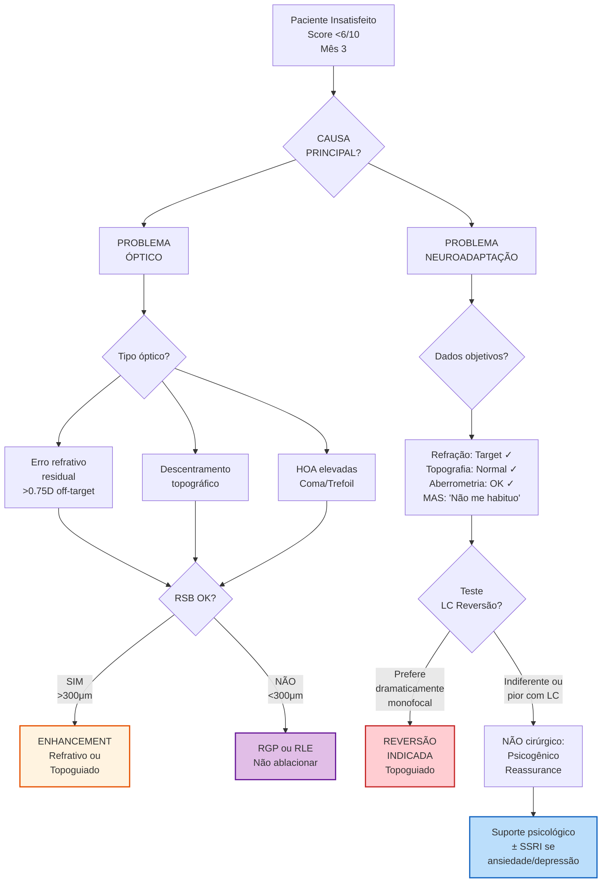

# Infográfico 10.2: Algoritmo Troubleshooting Insatisfação

```mermaid
flowchart TD
    A[Paciente Insatisfeito<br/>Score <6/10<br/>Mês 3] --> B{CAUSA<br/>PRINCIPAL?}
    
    B --> C[PROBLEMA<br/>ÓPTICO]
    B --> D[PROBLEMA<br/>NEUROADAPTAÇÃO]
    
    C --> E{Tipo óptico?}
    
    E --> F[Erro refrativo<br/>residual<br/>>0.75D off-target]
    E --> G[Descentramento<br/>topográfico]
    E --> H[HOA elevadas<br/>Coma/Trefoil]
    
    F --> I{RSB OK?}
    G --> I
    H --> I
    
    I -->|SIM<br/>>300μm| J[ENHANCEMENT<br/>Refrativo ou<br/>Topoguiado]
    I -->|NÃO<br/><300μm| K[RGP ou RLE<br/>Não ablacionar]
    
    D --> L{Dados objetivos?}
    
    L --> M[Refração: Target ✓<br/>Topografia: Normal ✓<br/>Aberrometria: OK ✓<br/>MAS: 'Não me habituo']
    
    M --> N{Teste<br/>LC Reversão?}
    
    N -->|Prefere<br/>dramaticamente<br/>monofocal| O[REVERSÃO<br/>INDICADA<br/>Topoguiado]
    N -->|Indiferente ou<br/>pior com LC| P[NÃO cirúrgico:<br/>Psicogênico<br/>Reassurance]
    
    P --> Q[Suporte psicológico<br/>± SSRI se<br/>ansiedade/depressão]
    
    style J fill:#fff3e0,stroke:#e65100,stroke-width:2px
    style K fill:#e1bee7,stroke:#6a1b9a,stroke-width:2px
    style O fill:#ffcdd2,stroke:#c62828,stroke-width:2px
    style Q fill:#bbdefb,stroke:#1565c0,stroke-width:2px
```

**Regra:** NÃO enhancement em paciente psicogênico (piora situação)
