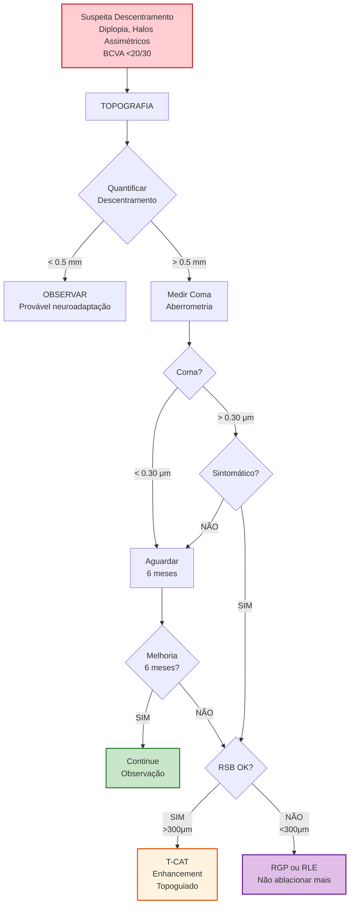

# Infográfico 11.1: Algoritmo Gestão Descentramento

**Critérios Decisão:**
- Descentramento <0.5mm → Observar (neuroadaptação pode compensar)
- Descentramento >0.5mm + Coma >0.30μm + Sintomático → **Enhancement indicado**
- RSB insuficiente (<300μm) → **Não tocar** (RGP ou RLE)
