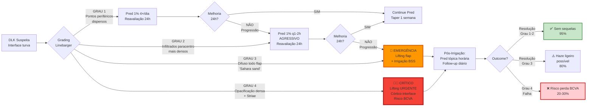

# Infográfico 11.2: DLK Grading & Management

```mermaid
flowchart LR
    A[DLK Suspeita<br/>Interface turva] --> B{Grading<br/>Linebarger}
    
    B -->|GRAU 1<br/>Pontos periféricos<br/>dispersos| C[Pred 1% 4×/dia<br/>Reavaliação 24h]
    
    B -->|GRAU 2<br/>Infiltrados paracentro<br/>mais densos| D[Pred 1% q1-2h<br/>AGRESSIVO<br/>Reavaliação 24h]
    
    B -->|GRAU 3<br/>Difuso todo flap<br/>'Sahara sand'| E[🚨 EMERGÊNCIA<br/>Lifting flap<br/>+ Irrigação BSS]
    
    B -->|GRAU 4<br/>Opacificação densa<br/>+ Striae| F[🚨🚨 CRÍTICO<br/>Lifting URGENTE<br/>Córtico interface<br/>Risco BCVA]
    
    C --> G{Melhoria<br/>24h?}
    G -->|SIM| H[Continue Pred<br/>Taper 1 semana]
    G -->|NÃO<br/>Progressão| D
    
    D --> I{Melhoria<br/>24h?}
    I -->|SIM| H
    I -->|NÃO<br/>Progressão| E
    
    E --> J[Pós-Irrigação:<br/>Pred tópica horária<br/>Follow-up diário]
    F --> J
    
    J --> K{Outcome?}
    K -->|Resolução<br/>Grau 1-2| L[✅ Sem sequelas<br/>95%]
    K -->|Resolução<br/>Grau 3| M[⚠️ Haze ligeiro<br/>possível<br/>80%]
    K -->|Grau 4<br/>Falha| N[❌ Risco perda BCVA<br/>20-30%]
    
    style E fill:#ff9800,stroke:#e65100,stroke-width:3px
    style F fill:#f44336,stroke:#b71c1c,stroke-width:4px
    style L fill:#c8e6c9,stroke:#2e7d32,stroke-width:2px
    style N fill:#ffcdd2,stroke:#c62828,stroke-width:3px
```

**Regra:** Grau 3-4 = **EMERGÊNCIA OFTALMOLÓGICA** (chamar paciente IMEDIATAMENTE)
