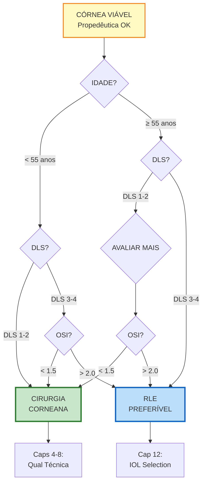

# Infográfico 13.2: Árvore Decisão - Corneana vs RLE

**Contexto:** Algoritmo Capítulo 12 (Corneal vs Lenticular)

**Decisão Simplificada:**
- Idade <52 + DLS 1-2 + OSI <1.5 = **CORNEANA**
- Idade >60 + DLS 3-4 ou OSI >2.0 = **RLE**
- Zona cinzenta (52-60) = Análise individual
