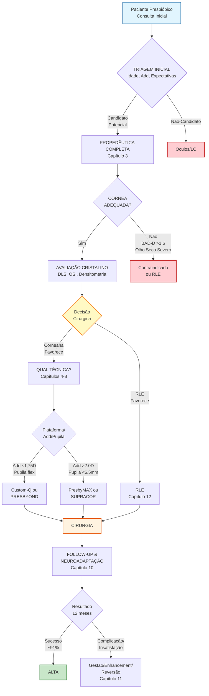

# Infográfico 13.1: Master Decision Pathway

**Descrição:** Fluxograma master consolidando todo o processo decisional desde consulta inicial até outcome final, integrando conhecimento dos 13 capítulos.

**Como Usar:**
- Este arquivo renderiza automaticamente no GitHub
- Para editar: https://mermaid.live (copie/cole o código acima)
- Exportar PNG: Use Mermaid Live Editor → Actions → PNG
