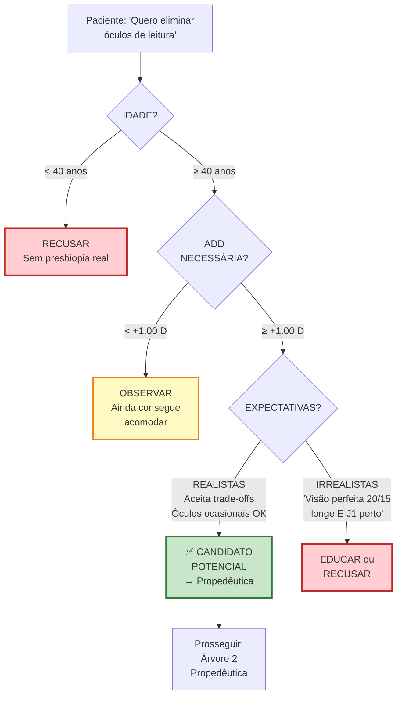

# Infográfico 13.3: Árvore Decisão - Triagem Inicial

**Exclusões Triagem:**
- ❌ Idade <40 (sem presbiopia verdadeira)
- ❌ Expectativas: "20/15 longe E J1 perto sem trade-offs"
- ❌ Profissões críticas (piloto comercial, neurocirurgião)
- ❌ Depressão severa não-tratada
