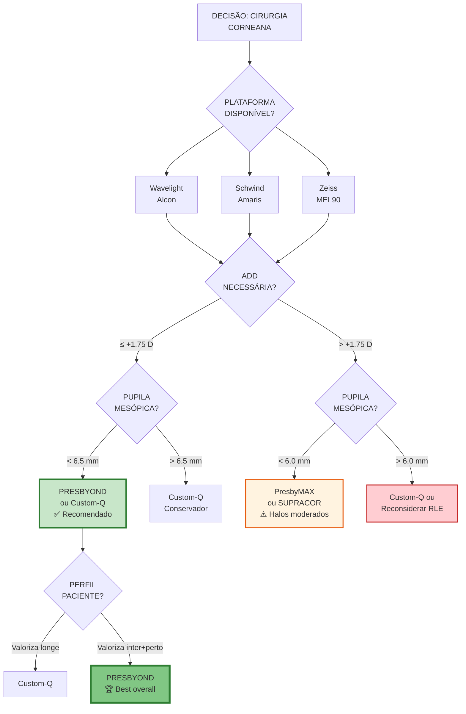

# Infográfico 13.4: Árvore Decisão - Qual Técnica Corneana?

**Recomendação Geral (múltiplas opções):**
1. **PRESBYOND** (se Zeiss + pupila OK) → Melhor balanço satisfação/halos
2. **Custom-Q** (personalização máxima)
3. **PresbyMAX** (add >+2.0 D)
4. **SUPRACOR** (nicho <5% população)
