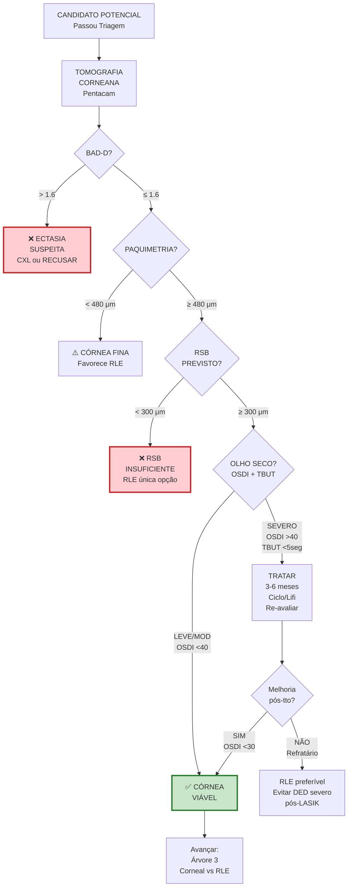

# Infográfico 13.5: Árvore Propedêutica e Viabilidade Corneana

```mermaid
flowchart TD
    A[CANDIDATO POTENCIAL<br/>Passou Triagem] --> B[TOMOGRAFIA<br/>CORNEANA<br/>Pentacam]
    
    B --> C{BAD-D?}
    
    C -->|> 1.6| D[❌ ECTASIA<br/>SUSPEITA<br/>CXL ou RECUSAR]
    C -->|≤ 1.6| E{PAQUIMETRIA?}
    
    E -->|< 480 μm| F[⚠️ CÓRNEA FINA<br/>Favorece RLE]
    E -->|≥ 480 μm| G{RSB<br/>PREVISTO?}
    
    G -->|< 300 μm| H[❌ RSB<br/>INSUFICIENTE<br/>RLE única opção]
    G -->|≥ 300 μm| I{OLHO SECO?<br/>OSDI + TBUT}
    
    I -->|SEVERO<br/>OSDI >40<br/>TBUT <5seg| J[TRATAR<br/>3-6 meses<br/>Ciclo/Lifi<br/>Re-avaliar]
    I -->|LEVE/MOD<br/>OSDI <40| K[✅ CÓRNEA<br/>VIÁVEL]
    
    J --> L{Melhoria<br/>pós-tto?}
    L -->|SIM<br/>OSDI <30| K
    L -->|NÃO<br/>Refratário| M[RLE preferível<br/>Evitar DED severo<br/>pós-LASIK]
    
    K --> N[Avançar:<br/>Árvore 3<br/>Corneal vs RLE]
    
    style D fill:#ffcdd2,stroke:#c62828,stroke-width:3px
    style H fill:#ffcdd2,stroke:#c62828,stroke-width:3px
    style K fill:#c8e6c9,stroke:#2e7d32,stroke-width:3px
```

**Parâmetros Críticos:**
- BAD-D >1.6 = STOP
- RSB <300 μm = STOP
- OSDI >40 = Tratar primeiro
