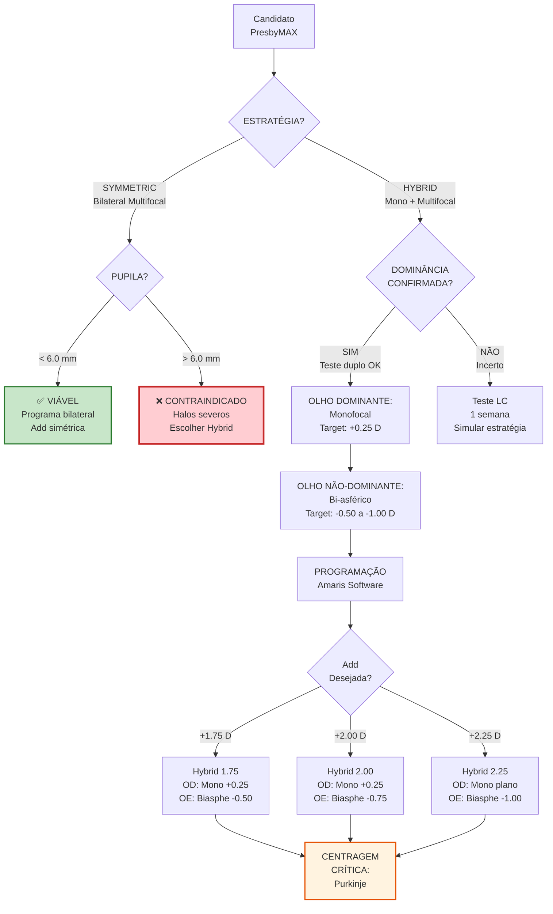

# Infográfico 6.1: PresbyMAX - Decisão Estratégia

```mermaid
flowchart TD
    A[Candidato<br/>PresbyMAX] --> B{ESTRATÉGIA?}
    
    B -->|SYMMETRIC<br/>Bilateral Multifocal| C{PUPILA?}
    B -->|HYBRID<br/>Mono + Multifocal| D{DOMINÂNCIA<br/>CONFIRMADA?}
    
    C -->|< 6.0 mm| E[✅ VIÁVEL<br/>Programa bilateral<br/>Add simétrica]
    C -->|> 6.0 mm| F[❌ CONTRAINDICADO<br/>Halos severos<br/>Escolher Hybrid]
    
    D -->|SIM<br/>Teste duplo OK| G[OLHO DOMINANTE:<br/>Monofocal<br/>Target: +0.25 D]
    D -->|NÃO<br/>Incerto| H[Teste LC<br/>1 semana<br/>Simular estratégia]
    
    G --> I[OLHO NÃO-DOMINANTE:<br/>Bi-asférico<br/>Target: -0.50 a -1.00 D]
    
    I --> J[PROGRAMAÇÃO<br/>Amaris Software]
    
    J --> K{Add<br/>Desejada?}
    
    K -->|+1.75 D| L[Hybrid 1.75<br/>OD: Mono +0.25<br/>OE: Biasphe -0.50]
    K -->|+2.00 D| M[Hybrid 2.00<br/>OD: Mono +0.25<br/>OE: Biasphe -0.75]
    K -->|+2.25 D| N[Hybrid 2.25<br/>OD: Mono plano<br/>OE: Biasphe -1.00]
    
    L --> O[CENTRAGEM<br/>CRÍTICA:<br/>Purkinje]
    M --> O
    N --> O
    
    style E fill:#c8e6c9,stroke:#2e7d32,stroke-width:2px
    style F fill:#ffcdd2,stroke:#c62828,stroke-width:3px
    style O fill:#fff3e0,stroke:#e65100,stroke-width:2px
```

**Recomendação:** **Hybrid >> Symmetric** (menor taxa halos, melhor satisfação)
