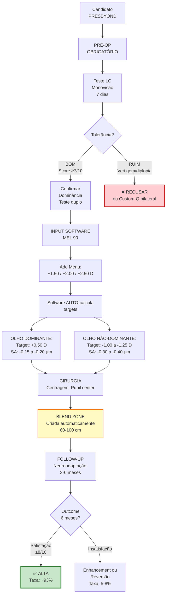

# Infográfico 7.1: PRESBYOND - Protocolo Completo

```mermaid
flowchart TD
    A[Candidato<br/>PRESBYOND] --> B[PRÉ-OP<br/>OBRIGATÓRIO]
    
    B --> C[Teste LC<br/>Monovisão<br/>7 dias]
    
    C --> D{Tolerância?}
    
    D -->|BOM<br/>Score ≥7/10| E[Confirmar<br/>Dominância<br/>Teste duplo]
    D -->|RUIM<br/>Vertigem/diplopia| F[❌ RECUSAR<br/>ou Custom-Q bilateral]
    
    E --> G[INPUT SOFTWARE<br/>MEL 90]
    
    G --> H[Add Menu:<br/>+1.50 / +2.00 / +2.50 D]
    
    H --> I[Software AUTO-calcula<br/>targets]
    
    I --> J[OLHO DOMINANTE:<br/>Target: +0.50 D<br/>SA: -0.15 a -0.20 μm]
    
    I --> K[OLHO NÃO-DOMINANTE:<br/>Target: -1.00 a -1.25 D<br/>SA: -0.30 a -0.40 μm]
    
    J --> L[CIRURGIA<br/>Centragem: Pupil center]
    K --> L
    
    L --> M[BLEND ZONE<br/>Criada automaticamente<br/>60-100 cm]
    
    M --> N[FOLLOW-UP<br/>Neuroadaptação:<br/>3-6 meses]
    
    N --> O{Outcome<br/>6 meses?}
    
    O -->|Satisfação<br/>≥8/10| P[✅ ALTA<br/>Taxa: ~93%]
    O -->|Insatisfação| Q[Enhancement ou<br/>Reversão<br/>Taxa: 5-8%]
    
    style P fill:#c8e6c9,stroke:#2e7d32,stroke-width:3px
    style F fill:#ffcdd2,stroke:#c62828,stroke-width:2px
    style M fill:#fff9c4,stroke:#f57f17,stroke-width:2px
```

**Diferenciais PRESBYOND:**
- ✅ Blend Zone (exclusivo)
- ✅ Menor taxa halos (3-5%)
- ✅ Maior satisfação (93% vs 85% Custom-Q)
