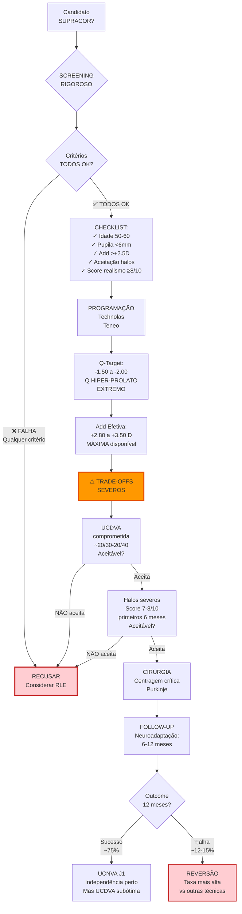

# Infográfico 8.1: SUPRACOR - Protocolo e Trade-offs

```mermaid
flowchart TD
    A[Candidato<br/>SUPRACOR?] --> B{SCREENING<br/>RIGOROSO}
    
    B --> C{Critérios<br/>TODOS OK?}
    
    C -->|❌ FALHA<br/>Qualquer critério| Z[RECUSAR<br/>Considerar RLE]
    
    C -->|✅ TODOS OK| D[CHECKLIST:<br/>✓ Idade 50-60<br/>✓ Pupila <6mm<br/>✓ Add >+2.5D<br/>✓ Aceitação halos<br/>✓ Score realismo ≥8/10]
    
    D --> E[PROGRAMAÇÃO<br/>Technolas<br/>Teneo]
    
    E --> F[Q-Target:<br/>-1.50 a -2.00<br/>Q HIPER-PROLATO<br/>EXTREMO]
    
    F --> G[Add Efetiva:<br/>+2.80 a +3.50 D<br/>MÁXIMA disponível]
    
    G --> H[⚠️ TRADE-OFFS<br/>SEVEROS]
    
    H --> I[UCDVA<br/>comprometida<br/>~20/30-20/40<br/>Aceitável?]
    
    I -->|NÃO aceita| Z
    I -->|Aceita| J[Halos severos<br/>Score 7-8/10<br/>primeiros 6 meses<br/>Aceitável?]
    
    J -->|NÃO aceita| Z
    J -->|Aceita| K[CIRURGIA<br/>Centragem crítica<br/>Purkinje]
    
    K --> L[FOLLOW-UP<br/>Neuroadaptação:<br/>6-12 meses]
    
    L --> M{Outcome<br/>12 meses?}
    
    M -->|Sucesso<br/>~75%| N[UCNVA J1<br/>Independência perto<br/>Mas UCDVA subótima]
    M -->|Falha<br/>~12-15%| O[REVERSÃO<br/>Taxa mais alta<br/>vs outras técnicas]
    
    style Z fill:#ffcdd2,stroke:#c62828,stroke-width:3px
    style H fill:#ff9800,stroke:#e65100,stroke-width:3px
    style O fill:#ffcdd2,stroke:#c62828,stroke-width:2px
```

**SUPRACOR é NICHO:** <5% candidatos presbiópicos. Maioria melhor served por RLE.
