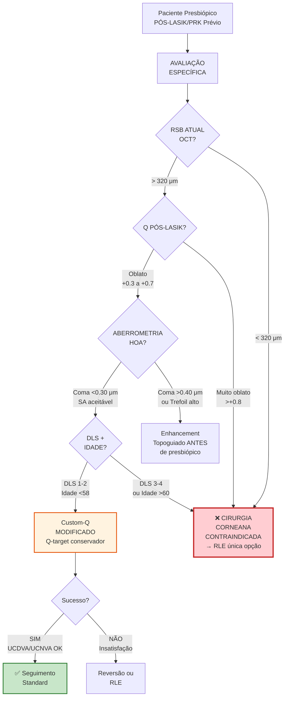

# Infográfico 9.1: Algoritmo Desafio Pós-Refrativo

**Critérios Absolutos Pós-LASIK:**
- RSB <320 μm = **Contraindicado** (risco ectasia crítico)
- Q >+0.8 (muito oblato) = Geralmente **RLE preferível**
- HOA severas baseline = Enhancement topoguiado PRIMEIRO
